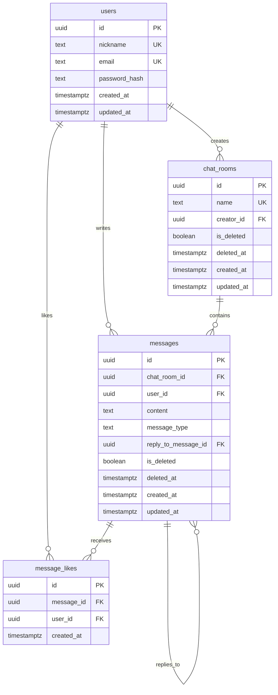

# 데이터베이스 설계 문서

**문서 버전:** 1.0
**작성일:** 2025-10-17
**데이터베이스:** PostgreSQL (Supabase)

---

## 1. 개요

본 문서는 실시간 채팅 서비스의 데이터베이스 스키마를 정의합니다.
유저플로우에 명시된 모든 기능을 지원하며, 최소 스펙으로 설계되었습니다.

## 2. 데이터플로우 (Data Flow)

### 2.1 회원가입 및 로그인 플로우

```
[클라이언트] 회원가입 요청 (닉네임, 이메일, 비밀번호)
    ↓
[백엔드] 중복 검증 (닉네임, 이메일)
    ↓
[DB] users 테이블에 INSERT
    ↓
[클라이언트] 로그인 페이지로 리디렉션
    ↓
[클라이언트] 로그인 요청 (이메일, 비밀번호)
    ↓
[백엔드] 인증 처리 및 세션/토큰 생성
    ↓
[클라이언트] 홈 페이지로 리디렉션
```

### 2.2 채팅방 생성 플로우

```
[클라이언트] 채팅방 생성 요청 (채팅방 이름)
    ↓
[백엔드] 중복 검증 (채팅방 이름)
    ↓
[DB] chat_rooms 테이블에 INSERT (개설자 ID 포함)
    ↓
[클라이언트] 생성된 채팅방으로 리디렉션
```

### 2.3 채팅방 목록 조회 플로우

```
[클라이언트] 홈 페이지 접근
    ↓
[백엔드] 인증 확인
    ↓
[DB] chat_rooms 테이블 SELECT (is_deleted = false)
    ↓
[DB] users 테이블 JOIN (개설자 닉네임)
    ↓
[클라이언트] 채팅방 목록 렌더링
```

### 2.4 실시간 메시지 전송 플로우

```
[클라이언트] 메시지 전송 (내용, 채팅방 ID)
    ↓
[백엔드] 유효성 검증
    ↓
[DB] messages 테이블에 INSERT (작성자 ID, 채팅방 ID)
    ↓
[실시간 채널] 모든 사용자에게 브로드캐스트
    ↓
[클라이언트] 타임라인에 메시지 추가
```

### 2.5 메시지 상호작용 플로우

#### 좋아요 추가/취소
```
[클라이언트] 좋아요 클릭 (메시지 ID)
    ↓
[백엔드] 기존 좋아요 확인 (message_likes 테이블)
    ↓
[DB] 좋아요 추가 (INSERT) 또는 취소 (DELETE)
    ↓
[실시간 채널] 좋아요 상태 브로드캐스트
    ↓
[클라이언트] UI 업데이트
```

#### 답장
```
[클라이언트] 답장 전송 (내용, 원본 메시지 ID)
    ↓
[백엔드] 유효성 검증
    ↓
[DB] messages 테이블에 INSERT (reply_to_message_id 포함)
    ↓
[실시간 채널] 답장 메시지 브로드캐스트
    ↓
[클라이언트] 원본 메시지 인용과 함께 렌더링
```

#### 메시지 삭제
```
[클라이언트] 삭제 클릭 (메시지 ID)
    ↓
[백엔드] 작성자 확인
    ↓
[DB] messages 테이블 UPDATE (is_deleted = true, deleted_at = now())
    ↓
[실시간 채널] 삭제 이벤트 브로드캐스트
    ↓
[클라이언트] 타임라인에서 제거, 답글에서는 "삭제된 메시지입니다." 표시
```

### 2.6 마이페이지 닉네임 수정 플로우

```
[클라이언트] 닉네임 수정 요청 (새 닉네임)
    ↓
[백엔드] 중복 검증 (닉네임)
    ↓
[DB] users 테이블 UPDATE (nickname)
    ↓
[클라이언트] 모든 화면에 새 닉네임 반영
```

---

## 3. ERD (Entity Relationship Diagram)



---

## 4. 테이블 상세 명세

### 4.1 users (사용자)

사용자 계정 정보를 저장하는 테이블입니다.

| 컬럼명         | 타입          | 제약조건                     | 설명                          |
|---------------|---------------|----------------------------|------------------------------|
| id            | uuid          | PK, DEFAULT gen_random_uuid() | 사용자 고유 ID                |
| nickname      | text          | NOT NULL, UNIQUE           | 닉네임 (중복 불허)             |
| email         | text          | NOT NULL, UNIQUE           | 이메일 (중복 불허)             |
| password_hash | text          | NOT NULL                   | 해싱된 비밀번호                |
| created_at    | timestamptz   | NOT NULL, DEFAULT now()    | 가입일시                       |
| updated_at    | timestamptz   | NOT NULL, DEFAULT now()    | 정보 수정일시                  |

**인덱스:**
- `idx_users_nickname` - nickname (중복 검증 성능)
- `idx_users_email` - email (로그인 성능)

**제약조건:**
- `users_nickname_key` - nickname UNIQUE
- `users_email_key` - email UNIQUE

### 4.2 chat_rooms (채팅방)

채팅방 정보를 저장하는 테이블입니다.

| 컬럼명       | 타입          | 제약조건                     | 설명                          |
|-------------|---------------|----------------------------|------------------------------|
| id          | uuid          | PK, DEFAULT gen_random_uuid() | 채팅방 고유 ID                |
| name        | text          | NOT NULL, UNIQUE           | 채팅방 이름 (최대 100자, 중복 불허) |
| creator_id  | uuid          | NOT NULL, FK → users.id    | 개설자 ID                     |
| is_deleted  | boolean       | NOT NULL, DEFAULT false    | 삭제 여부 (soft delete)       |
| deleted_at  | timestamptz   | NULL                       | 삭제 일시                     |
| created_at  | timestamptz   | NOT NULL, DEFAULT now()    | 생성일시                       |
| updated_at  | timestamptz   | NOT NULL, DEFAULT now()    | 수정일시                       |

**인덱스:**
- `idx_chat_rooms_name` - name (중복 검증 성능)
- `idx_chat_rooms_creator_id` - creator_id (개설자별 채팅방 조회)
- `idx_chat_rooms_is_deleted` - is_deleted (활성 채팅방 필터링)

**제약조건:**
- `chat_rooms_name_key` - name UNIQUE
- `fk_chat_rooms_creator` - creator_id REFERENCES users(id)

### 4.3 messages (메시지)

채팅 메시지를 저장하는 테이블입니다.

| 컬럼명                | 타입          | 제약조건                     | 설명                          |
|----------------------|---------------|----------------------------|------------------------------|
| id                   | uuid          | PK, DEFAULT gen_random_uuid() | 메시지 고유 ID                |
| chat_room_id         | uuid          | NOT NULL, FK → chat_rooms.id | 채팅방 ID                     |
| user_id              | uuid          | NOT NULL, FK → users.id    | 작성자 ID                     |
| content              | text          | NOT NULL                   | 메시지 내용                   |
| message_type         | text          | NOT NULL, DEFAULT 'text'   | 메시지 타입 (text, emoticon)  |
| reply_to_message_id  | uuid          | NULL, FK → messages.id     | 답장 대상 메시지 ID (NULL 가능) |
| is_deleted           | boolean       | NOT NULL, DEFAULT false    | 삭제 여부 (soft delete)       |
| deleted_at           | timestamptz   | NULL                       | 삭제 일시                     |
| created_at           | timestamptz   | NOT NULL, DEFAULT now()    | 작성일시                       |
| updated_at           | timestamptz   | NOT NULL, DEFAULT now()    | 수정일시                       |

**인덱스:**
- `idx_messages_chat_room_id` - chat_room_id (채팅방별 메시지 조회)
- `idx_messages_user_id` - user_id (사용자별 메시지 조회)
- `idx_messages_reply_to_message_id` - reply_to_message_id (답장 조회)
- `idx_messages_created_at` - created_at DESC (시간순 정렬)
- `idx_messages_is_deleted` - is_deleted (활성 메시지 필터링)

**제약조건:**
- `fk_messages_chat_room` - chat_room_id REFERENCES chat_rooms(id)
- `fk_messages_user` - user_id REFERENCES users(id)
- `fk_messages_reply_to` - reply_to_message_id REFERENCES messages(id)
- `chk_message_type` - message_type IN ('text', 'emoticon')

### 4.4 message_likes (메시지 좋아요)

메시지에 대한 좋아요를 저장하는 테이블입니다.

| 컬럼명       | 타입          | 제약조건                     | 설명                          |
|-------------|---------------|----------------------------|------------------------------|
| id          | uuid          | PK, DEFAULT gen_random_uuid() | 좋아요 고유 ID                |
| message_id  | uuid          | NOT NULL, FK → messages.id | 메시지 ID                     |
| user_id     | uuid          | NOT NULL, FK → users.id    | 좋아요 누른 사용자 ID         |
| created_at  | timestamptz   | NOT NULL, DEFAULT now()    | 좋아요 일시                   |

**인덱스:**
- `idx_message_likes_message_id` - message_id (메시지별 좋아요 조회)
- `idx_message_likes_user_id` - user_id (사용자별 좋아요 조회)
- `uniq_message_likes_message_user` - (message_id, user_id) UNIQUE (중복 좋아요 방지)

**제약조건:**
- `fk_message_likes_message` - message_id REFERENCES messages(id)
- `fk_message_likes_user` - user_id REFERENCES users(id)
- `message_likes_message_id_user_id_key` - (message_id, user_id) UNIQUE

---

## 5. 인덱스 전략

### 5.1 성능 최적화를 위한 인덱스

1. **중복 검증 인덱스**
   - `users.nickname`, `users.email` - 회원가입/닉네임 수정 시 중복 체크
   - `chat_rooms.name` - 채팅방 생성 시 중복 체크

2. **조회 성능 인덱스**
   - `messages.chat_room_id` - 채팅방별 메시지 목록 조회
   - `messages.created_at DESC` - 메시지 시간순 정렬
   - `message_likes (message_id, user_id)` - 좋아요 상태 확인 및 카운트

3. **필터링 인덱스**
   - `chat_rooms.is_deleted` - 삭제되지 않은 채팅방 필터링
   - `messages.is_deleted` - 삭제되지 않은 메시지 필터링

### 5.2 복합 인덱스

- `message_likes (message_id, user_id)` - 중복 좋아요 방지 및 조회 성능 개선

---

## 6. 제약조건

### 6.1 UNIQUE 제약조건

- `users.nickname` - 닉네임 중복 불허
- `users.email` - 이메일 중복 불허
- `chat_rooms.name` - 채팅방 이름 중복 불허
- `message_likes (message_id, user_id)` - 사용자별 메시지당 1개의 좋아요만 허용

### 6.2 Foreign Key 제약조건

- `chat_rooms.creator_id → users.id` - 존재하는 사용자만 채팅방 개설 가능
- `messages.chat_room_id → chat_rooms.id` - 존재하는 채팅방에만 메시지 작성 가능
- `messages.user_id → users.id` - 존재하는 사용자만 메시지 작성 가능
- `messages.reply_to_message_id → messages.id` - 존재하는 메시지에만 답장 가능
- `message_likes.message_id → messages.id` - 존재하는 메시지에만 좋아요 가능
- `message_likes.user_id → users.id` - 존재하는 사용자만 좋아요 가능

### 6.3 CHECK 제약조건

- `messages.message_type IN ('text', 'emoticon')` - 메시지 타입 검증

### 6.4 NOT NULL 제약조건

필수 데이터 무결성을 위해 다음 컬럼들은 NULL을 허용하지 않습니다:
- 모든 테이블의 `created_at`, `updated_at`
- 모든 비즈니스 로직상 필수 컬럼 (nickname, email, password_hash, name, content 등)

---

## 7. Soft Delete 패턴

### 7.1 적용 테이블

- `chat_rooms` - 채팅방 삭제
- `messages` - 메시지 삭제

### 7.2 구현 방식

```sql
-- 삭제 처리
UPDATE messages
SET is_deleted = true, deleted_at = now()
WHERE id = '...';

-- 조회 시 필터링
SELECT * FROM messages
WHERE chat_room_id = '...' AND is_deleted = false
ORDER BY created_at DESC;
```

### 7.3 삭제된 메시지 답장 처리

답장에서 원본 메시지가 삭제된 경우, 클라이언트 레벨에서 다음과 같이 처리합니다:
- `reply_to_message.is_deleted = true` 인 경우 → "삭제된 메시지입니다." 표시
- 타임라인에서는 삭제된 메시지를 표시하지 않음

---

## 8. 트리거 (Triggers)

### 8.1 updated_at 자동 업데이트 트리거

모든 테이블에 `updated_at` 컬럼을 자동으로 업데이트하는 트리거를 적용합니다.

```sql
-- 트리거 함수 생성
CREATE OR REPLACE FUNCTION update_updated_at_column()
RETURNS TRIGGER AS $$
BEGIN
    NEW.updated_at = now();
    RETURN NEW;
END;
$$ language 'plpgsql';

-- 각 테이블에 트리거 적용
CREATE TRIGGER update_users_updated_at
    BEFORE UPDATE ON users
    FOR EACH ROW EXECUTE FUNCTION update_updated_at_column();

CREATE TRIGGER update_chat_rooms_updated_at
    BEFORE UPDATE ON chat_rooms
    FOR EACH ROW EXECUTE FUNCTION update_updated_at_column();

CREATE TRIGGER update_messages_updated_at
    BEFORE UPDATE ON messages
    FOR EACH ROW EXECUTE FUNCTION update_updated_at_column();
```

---

## 9. RLS (Row Level Security)

프로젝트 규칙에 따라 **모든 테이블에서 RLS를 비활성화**합니다.

```sql
ALTER TABLE users DISABLE ROW LEVEL SECURITY;
ALTER TABLE chat_rooms DISABLE ROW LEVEL SECURITY;
ALTER TABLE messages DISABLE ROW LEVEL SECURITY;
ALTER TABLE message_likes DISABLE ROW LEVEL SECURITY;
```

인증 및 권한 관리는 애플리케이션 레벨(Hono 백엔드)에서 처리합니다.

---

## 10. 샘플 쿼리

### 10.1 채팅방 목록 조회 (개설자 닉네임 포함)

```sql
SELECT
    cr.id,
    cr.name,
    cr.created_at,
    u.nickname AS creator_nickname
FROM chat_rooms cr
INNER JOIN users u ON cr.creator_id = u.id
WHERE cr.is_deleted = false
ORDER BY cr.created_at DESC;
```

### 10.2 특정 채팅방의 메시지 목록 조회

```sql
SELECT
    m.id,
    m.content,
    m.message_type,
    m.created_at,
    u.nickname AS author_nickname,
    rm.id AS reply_to_id,
    rm.content AS reply_to_content,
    rm.is_deleted AS reply_to_is_deleted
FROM messages m
INNER JOIN users u ON m.user_id = u.id
LEFT JOIN messages rm ON m.reply_to_message_id = rm.id
WHERE m.chat_room_id = '...' AND m.is_deleted = false
ORDER BY m.created_at DESC
LIMIT 100;
```

### 10.3 메시지 좋아요 카운트 및 현재 사용자 좋아요 상태

```sql
SELECT
    m.id,
    COUNT(ml.id) AS like_count,
    BOOL_OR(ml.user_id = '현재_사용자_ID') AS is_liked_by_current_user
FROM messages m
LEFT JOIN message_likes ml ON m.id = ml.message_id
WHERE m.id = '...'
GROUP BY m.id;
```

### 10.4 닉네임 중복 확인

```sql
SELECT EXISTS(
    SELECT 1 FROM users
    WHERE nickname = '확인할_닉네임'
) AS is_duplicate;
```

---

## 11. 마이그레이션 적용 순서

1. `0002_create_core_tables.sql` - users, chat_rooms, messages, message_likes 테이블 생성
2. Supabase 대시보드에서 마이그레이션 적용 확인
3. 필요 시 샘플 데이터 삽입 (선택적)

---

## 12. 참고사항

### 12.1 확장성 고려사항

현재는 최소 스펙으로 설계되었으나, 향후 다음과 같은 확장이 가능합니다:
- 파일 첨부 기능 추가 (`messages` 테이블에 `attachment_url` 컬럼 추가)
- 채팅방 참여자 관리 (새 테이블 `chat_room_members` 추가)
- 메시지 읽음 표시 (새 테이블 `message_read_status` 추가)
- 사용자 프로필 이미지 (`users` 테이블에 `avatar_url` 컬럼 추가)

### 12.2 성능 모니터링 포인트

- 메시지 조회 쿼리 성능 (채팅방별)
- 좋아요 카운트 집계 성능
- 닉네임/이메일 중복 체크 성능

### 12.3 데이터 보관 정책

- 삭제된 메시지는 일정 기간 후 물리적 삭제 고려 (GDPR 준수)
- 삭제된 채팅방의 메시지 처리 정책 수립 필요
