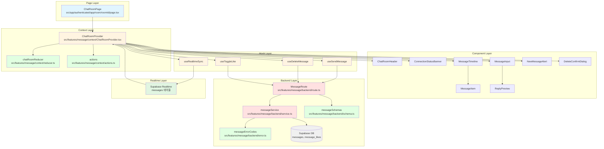

# 채팅방 페이지 구현 계획

**문서 버전:** 1.0
**작성일:** 2025-10-18
**관련 문서:**
- 요구사항: `docs/pages/chatroom/requirement.md`
- 상태 관리: `docs/pages/chatroom/state_management.md`
- 유스케이스 005: `docs/usecases/005/spec.md` (실시간 메시지 전송)
- 유스케이스 006: `docs/usecases/006/spec.md` (메시지 상호작용)
- 데이터베이스: `docs/database.md` (messages, message_likes 테이블)

---

## 1. 개요

채팅방 페이지는 사용자들이 실시간으로 메시지를 주고받고, 메시지에 대한 상호작용(좋아요, 답장, 삭제)을 할 수 있는 핵심 페이지입니다. Context Provider 기반의 상태 관리와 Supabase Realtime을 활용한 실시간 동기화를 구현합니다.

### 1.1 주요 기능

1. **실시간 메시지 전송 및 수신**: 텍스트 메시지를 실시간으로 주고받음
2. **메시지 상호작용**:
   - **좋아요**: 메시지에 좋아요 추가/취소
   - **답장**: 특정 메시지를 인용하여 답장 작성
   - **삭제**: 자신이 작성한 메시지 삭제 (soft delete)
3. **메시지 목록 조회**: 무한 스크롤로 이전 메시지 추가 로드
4. **실시간 동기화**: Supabase Realtime으로 모든 사용자에게 즉시 반영
5. **낙관적 업데이트**: 빠른 UX를 위한 즉시 UI 업데이트

### 1.2 주요 모듈 목록

| 모듈명 | 위치 | 설명 |
|--------|------|------|
| **ChatRoomPage** | `src/app/(authenticated)/app/room/[roomId]/page.tsx` | 채팅방 페이지 최상위 컴포넌트 |
| **ChatRoomProvider** | `src/features/message/context/ChatRoomProvider.tsx` | Context Provider (상태 관리) |
| **chatRoomReducer** | `src/features/message/context/reducer.ts` | 클라이언트 상태 Reducer |
| **ChatRoomHeader** | `src/features/message/components/ChatRoomHeader.tsx` | 헤더 컴포넌트 |
| **ConnectionStatusBanner** | `src/features/message/components/ConnectionStatusBanner.tsx` | 연결 상태 배너 |
| **MessageTimeline** | `src/features/message/components/MessageTimeline.tsx` | 메시지 타임라인 |
| **MessageItem** | `src/features/message/components/MessageItem.tsx` | 개별 메시지 아이템 |
| **MessageInput** | `src/features/message/components/MessageInput.tsx` | 메시지 입력창 |
| **ReplyPreview** | `src/features/message/components/ReplyPreview.tsx` | 답장 프리뷰 |
| **NewMessageAlert** | `src/features/message/components/NewMessageAlert.tsx` | 새 메시지 알림 |
| **DeleteConfirmDialog** | `src/features/message/components/DeleteConfirmDialog.tsx` | 삭제 확인 다이얼로그 |
| **useSendMessage** | `src/features/message/hooks/useSendMessage.ts` | 메시지 전송 훅 |
| **useDeleteMessage** | `src/features/message/hooks/useDeleteMessage.ts` | 메시지 삭제 훅 |
| **useToggleLike** | `src/features/message/hooks/useToggleLike.ts` | 좋아요 토글 훅 |
| **useRealtimeSync** | `src/features/message/hooks/useRealtimeSync.ts` | 실시간 동기화 훅 |
| **MessageRoute** | `src/features/message/backend/route.ts` | Hono 라우터 |
| **messageService** | `src/features/message/backend/service.ts` | 메시지 비즈니스 로직 |
| **messageSchemas** | `src/features/message/backend/schema.ts` | 요청/응답 스키마 |
| **messageErrorCodes** | `src/features/message/backend/error.ts` | 에러 코드 정의 |

---

## 2. 아키텍처 다이어그램



---

## 3. 상태 관리 설계

### 3.1 클라이언트 상태 (useReducer)

`state_management.md`에 정의된 대로 Context + useReducer를 사용합니다.

```typescript
interface ChatRoomState {
  // 메시지 입력
  messageInput: string;
  replyingTo: Message | null;
  isComposing: boolean;

  // 낙관적 업데이트
  optimisticMessages: OptimisticMessage[];
  failedMessages: FailedMessage[];

  // 연결 상태
  connectionStatus: 'connected' | 'disconnected' | 'reconnecting';

  // 스크롤 및 알림
  isScrolledToBottom: boolean;
  showNewMessageAlert: boolean;

  // 삭제 다이얼로그
  deletingMessageId: string | null;
}
```

### 3.2 서버 상태 (React Query)

```typescript
// 쿼리 키
const queryKeys = {
  chatRoom: (roomId: string) => ['chatRoom', roomId],
  messages: (roomId: string) => ['messages', roomId],
  currentUser: () => ['currentUser'],
};

// Infinite Query로 메시지 목록 관리
const useMessagesQuery = (roomId: string) =>
  useInfiniteQuery({
    queryKey: queryKeys.messages(roomId),
    queryFn: ({ pageParam = null }) =>
      apiClient.get(`/api/rooms/${roomId}/messages`, {
        params: { before: pageParam, limit: 50 },
      }),
    getNextPageParam: (lastPage) =>
      lastPage.data.length === 50 ? lastPage.data[0].id : undefined,
    initialPageParam: null,
  });
```

### 3.3 파생 상태

```typescript
// 전송 가능 여부
const canSendMessage = useMemo(
  () =>
    state.messageInput.trim().length > 0 &&
    state.messageInput.length <= 1000 &&
    state.connectionStatus === 'connected',
  [state.messageInput, state.connectionStatus]
);

// 글자 수 카운터 표시
const showCharCounter = useMemo(
  () => state.messageInput.length >= 900,
  [state.messageInput.length]
);

// 낙관적 + 서버 메시지 병합
const mergedMessages = useMemo(() => {
  const tempMessages = state.optimisticMessages.filter(
    (m) => m.status !== 'failed'
  );
  const allMessages = [...tempMessages, ...messages];

  // 중복 제거 및 시간순 정렬
  const uniqueMessages = allMessages.filter(
    (msg, index, self) =>
      index ===
      self.findIndex((m) => m.id === msg.id || m.tempId === msg.tempId)
  );

  return uniqueMessages.sort(
    (a, b) =>
      new Date(a.createdAt).getTime() - new Date(b.createdAt).getTime()
  );
}, [state.optimisticMessages, messages]);
```

---

## 4. 구현 계획

### 4.1 백엔드 레이어

#### 4.1.1 요청/응답 스키마 (`src/features/message/backend/schema.ts`)

```typescript
import { z } from "zod";

// 메시지 타입
export const MessageTypeSchema = z.enum(['text', 'emoticon']);

// 메시지 스키마
export const MessageSchema = z.object({
  id: z.string().uuid(),
  chatRoomId: z.string().uuid(),
  userId: z.string().uuid(),
  authorNickname: z.string(),
  content: z.string(),
  messageType: MessageTypeSchema,
  replyToMessageId: z.string().uuid().nullable(),
  replyToMessage: z.object({
    id: z.string().uuid(),
    content: z.string(),
    authorNickname: z.string(),
    isDeleted: z.boolean(),
  }).nullable(),
  likeCount: z.number(),
  isLikedByMe: z.boolean(),
  isDeleted: z.boolean(),
  createdAt: z.string().datetime(),
});

export type Message = z.infer<typeof MessageSchema>;

// 메시지 생성 요청
export const CreateMessageRequestSchema = z.object({
  roomId: z.string().uuid(),
  content: z
    .string()
    .min(1, "메시지를 입력해주세요")
    .max(1000, "메시지는 최대 1000자까지 입력 가능합니다")
    .trim(),
  type: MessageTypeSchema.default('text'),
  replyToMessageId: z.string().uuid().optional(),
});

export type CreateMessageRequest = z.infer<typeof CreateMessageRequestSchema>;

// 메시지 목록 조회 요청
export const GetMessagesRequestSchema = z.object({
  roomId: z.string().uuid(),
  before: z.string().uuid().optional(),
  limit: z.number().min(1).max(100).default(50),
});

export type GetMessagesRequest = z.infer<typeof GetMessagesRequestSchema>;

// 좋아요 토글 요청
export const ToggleLikeRequestSchema = z.object({
  messageId: z.string().uuid(),
});

export type ToggleLikeRequest = z.infer<typeof ToggleLikeRequestSchema>;

// 메시지 삭제 요청
export const DeleteMessageRequestSchema = z.object({
  messageId: z.string().uuid(),
});

export type DeleteMessageRequest = z.infer<typeof DeleteMessageRequestSchema>;

// 서비스 에러 타입
export type MessageServiceError =
  | "MESSAGE_CREATE_ERROR"
  | "MESSAGE_NOT_FOUND"
  | "MESSAGE_DELETE_FORBIDDEN"
  | "MESSAGE_LIKE_ERROR"
  | "UNAUTHORIZED";
```

#### 4.1.2 에러 코드 정의 (`src/features/message/backend/error.ts`)

```typescript
export const messageErrorCodes = {
  messageCreateError: "MESSAGE_CREATE_ERROR",
  messageNotFound: "MESSAGE_NOT_FOUND",
  messageDeleteForbidden: "MESSAGE_DELETE_FORBIDDEN",
  messageLikeError: "MESSAGE_LIKE_ERROR",
  unauthorized: "UNAUTHORIZED",
} as const;

type MessageErrorValue = (typeof messageErrorCodes)[keyof typeof messageErrorCodes];

export type MessageServiceError = MessageErrorValue;
```

#### 4.1.3 메시지 서비스 (`src/features/message/backend/service.ts`)

```typescript
import type { SupabaseClient } from "@supabase/supabase-js";
import {
  failure,
  success,
  type HandlerResult,
} from "@/backend/http/response";
import type {
  Message,
  CreateMessageRequest,
  GetMessagesRequest,
  MessageServiceError,
} from "./schema";
import { messageErrorCodes } from "./error";

const MESSAGES_TABLE = "messages";
const MESSAGE_LIKES_TABLE = "message_likes";
const USERS_TABLE = "users";

// 메시지 목록 조회
export const getMessages = async (
  client: SupabaseClient,
  request: GetMessagesRequest,
  currentUserId: string
): Promise<HandlerResult<Message[], MessageServiceError, unknown>> => {
  let query = client
    .from(MESSAGES_TABLE)
    .select(
      `
      id,
      chat_room_id,
      user_id,
      content,
      message_type,
      reply_to_message_id,
      is_deleted,
      created_at,
      users!user_id (
        nickname
      ),
      reply_to:messages!reply_to_message_id (
        id,
        content,
        is_deleted,
        users!user_id (
          nickname
        )
      ),
      message_likes (
        user_id
      )
      `
    )
    .eq("chat_room_id", request.roomId)
    .eq("is_deleted", false)
    .order("created_at", { ascending: false })
    .limit(request.limit);

  if (request.before) {
    // before 파라미터가 있으면 해당 메시지 이전의 메시지만 조회
    const { data: beforeMessage } = await client
      .from(MESSAGES_TABLE)
      .select("created_at")
      .eq("id", request.before)
      .single();

    if (beforeMessage) {
      query = query.lt("created_at", beforeMessage.created_at);
    }
  }

  const { data: messages, error } = await query;

  if (error) {
    return failure(
      500,
      messageErrorCodes.messageCreateError,
      error.message
    );
  }

  // 응답 데이터 변환
  const transformedMessages: Message[] = (messages || []).map((msg) => ({
    id: msg.id,
    chatRoomId: msg.chat_room_id,
    userId: msg.user_id,
    authorNickname: msg.users?.nickname || "알 수 없음",
    content: msg.content,
    messageType: msg.message_type,
    replyToMessageId: msg.reply_to_message_id,
    replyToMessage: msg.reply_to
      ? {
          id: msg.reply_to.id,
          content: msg.reply_to.content,
          authorNickname: msg.reply_to.users?.nickname || "알 수 없음",
          isDeleted: msg.reply_to.is_deleted,
        }
      : null,
    likeCount: msg.message_likes?.length || 0,
    isLikedByMe: msg.message_likes?.some((like) => like.user_id === currentUserId) || false,
    isDeleted: msg.is_deleted,
    createdAt: msg.created_at,
  }));

  return success(transformedMessages, 200);
};

// 메시지 생성
export const createMessage = async (
  client: SupabaseClient,
  request: CreateMessageRequest,
  userId: string
): Promise<HandlerResult<Message, MessageServiceError, unknown>> => {
  // 메시지 생성
  const { data: newMessage, error: insertError } = await client
    .from(MESSAGES_TABLE)
    .insert({
      chat_room_id: request.roomId,
      user_id: userId,
      content: request.content,
      message_type: request.type,
      reply_to_message_id: request.replyToMessageId || null,
    })
    .select(
      `
      id,
      chat_room_id,
      user_id,
      content,
      message_type,
      reply_to_message_id,
      is_deleted,
      created_at,
      users!user_id (
        nickname
      )
      `
    )
    .single();

  if (insertError || !newMessage) {
    return failure(
      500,
      messageErrorCodes.messageCreateError,
      insertError?.message || "메시지 생성 중 오류가 발생했습니다"
    );
  }

  // 답장인 경우 원본 메시지 조회
  let replyToMessage = null;
  if (request.replyToMessageId) {
    const { data: originalMsg } = await client
      .from(MESSAGES_TABLE)
      .select(
        `
        id,
        content,
        is_deleted,
        users!user_id (
          nickname
        )
        `
      )
      .eq("id", request.replyToMessageId)
      .single();

    if (originalMsg) {
      replyToMessage = {
        id: originalMsg.id,
        content: originalMsg.content,
        authorNickname: originalMsg.users?.nickname || "알 수 없음",
        isDeleted: originalMsg.is_deleted,
      };
    }
  }

  return success(
    {
      id: newMessage.id,
      chatRoomId: newMessage.chat_room_id,
      userId: newMessage.user_id,
      authorNickname: newMessage.users?.nickname || "알 수 없음",
      content: newMessage.content,
      messageType: newMessage.message_type,
      replyToMessageId: newMessage.reply_to_message_id,
      replyToMessage,
      likeCount: 0,
      isLikedByMe: false,
      isDeleted: newMessage.is_deleted,
      createdAt: newMessage.created_at,
    },
    201
  );
};

// 메시지 삭제
export const deleteMessage = async (
  client: SupabaseClient,
  messageId: string,
  userId: string
): Promise<HandlerResult<{ success: true }, MessageServiceError, unknown>> => {
  // 메시지 조회 및 권한 확인
  const { data: message, error: fetchError } = await client
    .from(MESSAGES_TABLE)
    .select("user_id")
    .eq("id", messageId)
    .single();

  if (fetchError || !message) {
    return failure(
      404,
      messageErrorCodes.messageNotFound,
      "메시지를 찾을 수 없습니다"
    );
  }

  if (message.user_id !== userId) {
    return failure(
      403,
      messageErrorCodes.messageDeleteForbidden,
      "메시지를 삭제할 권한이 없습니다"
    );
  }

  // Soft delete
  const { error: deleteError } = await client
    .from(MESSAGES_TABLE)
    .update({ is_deleted: true, deleted_at: new Date().toISOString() })
    .eq("id", messageId);

  if (deleteError) {
    return failure(
      500,
      messageErrorCodes.messageCreateError,
      deleteError.message
    );
  }

  return success({ success: true }, 200);
};

// 좋아요 토글
export const toggleLike = async (
  client: SupabaseClient,
  messageId: string,
  userId: string
): Promise<HandlerResult<{ likeCount: number; isLiked: boolean }, MessageServiceError, unknown>> => {
  // 기존 좋아요 확인
  const { data: existingLike, error: checkError } = await client
    .from(MESSAGE_LIKES_TABLE)
    .select("id")
    .eq("message_id", messageId)
    .eq("user_id", userId)
    .maybeSingle();

  if (checkError) {
    return failure(
      500,
      messageErrorCodes.messageLikeError,
      checkError.message
    );
  }

  let isLiked: boolean;

  if (existingLike) {
    // 좋아요 제거
    const { error: deleteError } = await client
      .from(MESSAGE_LIKES_TABLE)
      .delete()
      .eq("message_id", messageId)
      .eq("user_id", userId);

    if (deleteError) {
      return failure(
        500,
        messageErrorCodes.messageLikeError,
        deleteError.message
      );
    }

    isLiked = false;
  } else {
    // 좋아요 추가
    const { error: insertError } = await client
      .from(MESSAGE_LIKES_TABLE)
      .insert({
        message_id: messageId,
        user_id: userId,
      });

    if (insertError) {
      return failure(
        500,
        messageErrorCodes.messageLikeError,
        insertError.message
      );
    }

    isLiked = true;
  }

  // 좋아요 카운트 조회
  const { count, error: countError } = await client
    .from(MESSAGE_LIKES_TABLE)
    .select("*", { count: "exact", head: true })
    .eq("message_id", messageId);

  if (countError) {
    return failure(
      500,
      messageErrorCodes.messageLikeError,
      countError.message
    );
  }

  return success({ likeCount: count || 0, isLiked }, 200);
};
```

#### 4.1.4 Hono 라우터 (`src/features/message/backend/route.ts`)

```typescript
import type { Hono } from "hono";
import {
  failure,
  respond,
  type ErrorResult,
} from "@/backend/http/response";
import {
  getLogger,
  getSupabase,
  type AppEnv,
} from "@/backend/hono/context";
import {
  getMessages,
  createMessage,
  deleteMessage,
  toggleLike,
} from "./service";
import {
  CreateMessageRequestSchema,
  GetMessagesRequestSchema,
  type MessageServiceError,
} from "./schema";
import { messageErrorCodes } from "./error";

export const registerMessageRoutes = (app: Hono<AppEnv>) => {
  // 메시지 목록 조회
  app.get("/api/rooms/:roomId/messages", async (c) => {
    const supabase = getSupabase(c);
    const logger = getLogger(c);
    const roomId = c.req.param("roomId");
    const before = c.req.query("before");
    const limit = parseInt(c.req.query("limit") || "50");

    // TODO: JWT에서 userId 추출
    const currentUserId = "임시-사용자-ID";

    const parsedRequest = GetMessagesRequestSchema.safeParse({
      roomId,
      before,
      limit,
    });

    if (!parsedRequest.success) {
      return respond(
        c,
        failure(
          400,
          "INVALID_GET_MESSAGES_DATA",
          "입력 데이터가 올바르지 않습니다.",
          parsedRequest.error.format()
        )
      );
    }

    const result = await getMessages(supabase, parsedRequest.data, currentUserId);

    if (!result.ok) {
      const errorResult = result as ErrorResult<MessageServiceError, unknown>;
      logger.error("Failed to fetch messages", errorResult.error.message);
      return respond(c, result);
    }

    logger.info("Messages fetched successfully", {
      count: result.data.length,
    });

    return respond(c, result);
  });

  // 메시지 생성
  app.post("/api/messages", async (c) => {
    const supabase = getSupabase(c);
    const logger = getLogger(c);

    const body = await c.req.json();
    const parsedBody = CreateMessageRequestSchema.safeParse(body);

    if (!parsedBody.success) {
      return respond(
        c,
        failure(
          400,
          "INVALID_CREATE_MESSAGE_DATA",
          "입력 데이터가 올바르지 않습니다.",
          parsedBody.error.format()
        )
      );
    }

    // TODO: JWT에서 userId 추출
    const userId = "임시-사용자-ID";

    const result = await createMessage(supabase, parsedBody.data, userId);

    if (!result.ok) {
      const errorResult = result as ErrorResult<MessageServiceError, unknown>;
      logger.error("Failed to create message", errorResult.error.message);
      return respond(c, result);
    }

    logger.info("Message created successfully", {
      messageId: result.data.id,
    });

    return respond(c, result);
  });

  // 메시지 삭제
  app.delete("/api/messages/:messageId", async (c) => {
    const supabase = getSupabase(c);
    const logger = getLogger(c);
    const messageId = c.req.param("messageId");

    // TODO: JWT에서 userId 추출
    const userId = "임시-사용자-ID";

    const result = await deleteMessage(supabase, messageId, userId);

    if (!result.ok) {
      const errorResult = result as ErrorResult<MessageServiceError, unknown>;
      logger.error("Failed to delete message", errorResult.error.message);
      return respond(c, result);
    }

    logger.info("Message deleted successfully", {
      messageId,
    });

    return respond(c, result);
  });

  // 좋아요 토글
  app.post("/api/messages/:messageId/like", async (c) => {
    const supabase = getSupabase(c);
    const logger = getLogger(c);
    const messageId = c.req.param("messageId");

    // TODO: JWT에서 userId 추출
    const userId = "임시-사용자-ID";

    const result = await toggleLike(supabase, messageId, userId);

    if (!result.ok) {
      const errorResult = result as ErrorResult<MessageServiceError, unknown>;
      logger.error("Failed to toggle like", errorResult.error.message);
      return respond(c, result);
    }

    logger.info("Like toggled successfully", {
      messageId,
      isLiked: result.data.isLiked,
    });

    return respond(c, result);
  });
};
```

#### 4.1.5 Hono 앱 등록

`src/backend/hono/app.ts`에 라우터 등록:

```typescript
import { registerMessageRoutes } from "@/features/message/backend/route";

export const createHonoApp = () => {
  const app = new Hono<AppEnv>();

  // ... 기존 미들웨어 ...

  // 라우터 등록
  registerExampleRoutes(app);
  registerAuthRoutes(app);
  registerRoomRoutes(app);
  registerMessageRoutes(app); // 추가

  return app;
};
```

---

### 4.2 프론트엔드 레이어

#### 4.2.1 Context 및 Reducer

**`src/features/message/context/reducer.ts`**

```typescript
import type { Message } from "../backend/schema";

export type ConnectionStatus = 'connected' | 'disconnected' | 'reconnecting';

export interface OptimisticMessage extends Message {
  tempId: string;
  status: 'sending' | 'sent' | 'failed';
}

export interface FailedMessage {
  tempId: string;
  content: string;
  replyToMessageId?: string;
  error: string;
}

export interface ChatRoomState {
  messageInput: string;
  replyingTo: Message | null;
  isComposing: boolean;
  optimisticMessages: OptimisticMessage[];
  failedMessages: FailedMessage[];
  connectionStatus: ConnectionStatus;
  isScrolledToBottom: boolean;
  showNewMessageAlert: boolean;
  deletingMessageId: string | null;
}

export const initialState: ChatRoomState = {
  messageInput: '',
  replyingTo: null,
  isComposing: false,
  optimisticMessages: [],
  failedMessages: [],
  connectionStatus: 'disconnected',
  isScrolledToBottom: true,
  showNewMessageAlert: false,
  deletingMessageId: null,
};

export type ChatRoomAction =
  | { type: 'SET_MESSAGE_INPUT'; payload: string }
  | { type: 'CLEAR_MESSAGE_INPUT' }
  | { type: 'START_REPLY'; payload: Message }
  | { type: 'CANCEL_REPLY' }
  | { type: 'ADD_OPTIMISTIC_MESSAGE'; payload: OptimisticMessage }
  | { type: 'REMOVE_OPTIMISTIC_MESSAGE'; payload: { tempId: string } }
  | { type: 'MARK_MESSAGE_FAILED'; payload: { tempId: string; error: string } }
  | { type: 'ADD_FAILED_MESSAGE'; payload: FailedMessage }
  | { type: 'REMOVE_FAILED_MESSAGE'; payload: { tempId: string } }
  | { type: 'SET_CONNECTION_STATUS'; payload: ConnectionStatus }
  | { type: 'SET_SCROLLED_TO_BOTTOM'; payload: boolean }
  | { type: 'SHOW_NEW_MESSAGE_ALERT' }
  | { type: 'HIDE_NEW_MESSAGE_ALERT' }
  | { type: 'START_DELETING'; payload: { messageId: string } }
  | { type: 'CANCEL_DELETING' }
  | { type: 'RESET_STATE' };

export function chatRoomReducer(
  state: ChatRoomState,
  action: ChatRoomAction
): ChatRoomState {
  switch (action.type) {
    case 'SET_MESSAGE_INPUT':
      return {
        ...state,
        messageInput: action.payload,
        isComposing: action.payload.trim().length > 0,
      };

    case 'CLEAR_MESSAGE_INPUT':
      return {
        ...state,
        messageInput: '',
        isComposing: false,
      };

    case 'START_REPLY':
      return {
        ...state,
        replyingTo: action.payload,
      };

    case 'CANCEL_REPLY':
      return {
        ...state,
        replyingTo: null,
      };

    case 'ADD_OPTIMISTIC_MESSAGE':
      return {
        ...state,
        optimisticMessages: [...state.optimisticMessages, action.payload],
      };

    case 'REMOVE_OPTIMISTIC_MESSAGE':
      return {
        ...state,
        optimisticMessages: state.optimisticMessages.filter(
          (msg) => msg.tempId !== action.payload.tempId
        ),
      };

    case 'MARK_MESSAGE_FAILED': {
      const failedMsg = state.optimisticMessages.find(
        (msg) => msg.tempId === action.payload.tempId
      );
      if (!failedMsg) return state;

      return {
        ...state,
        optimisticMessages: state.optimisticMessages.filter(
          (msg) => msg.tempId !== action.payload.tempId
        ),
        failedMessages: [
          ...state.failedMessages,
          {
            tempId: failedMsg.tempId,
            content: failedMsg.content,
            replyToMessageId: failedMsg.replyToMessageId || undefined,
            error: action.payload.error,
          },
        ],
      };
    }

    case 'ADD_FAILED_MESSAGE':
      return {
        ...state,
        failedMessages: [...state.failedMessages, action.payload],
      };

    case 'REMOVE_FAILED_MESSAGE':
      return {
        ...state,
        failedMessages: state.failedMessages.filter(
          (msg) => msg.tempId !== action.payload.tempId
        ),
      };

    case 'SET_CONNECTION_STATUS':
      return {
        ...state,
        connectionStatus: action.payload,
      };

    case 'SET_SCROLLED_TO_BOTTOM':
      return {
        ...state,
        isScrolledToBottom: action.payload,
        showNewMessageAlert: action.payload ? false : state.showNewMessageAlert,
      };

    case 'SHOW_NEW_MESSAGE_ALERT':
      return {
        ...state,
        showNewMessageAlert: !state.isScrolledToBottom,
      };

    case 'HIDE_NEW_MESSAGE_ALERT':
      return {
        ...state,
        showNewMessageAlert: false,
      };

    case 'START_DELETING':
      return {
        ...state,
        deletingMessageId: action.payload.messageId,
      };

    case 'CANCEL_DELETING':
      return {
        ...state,
        deletingMessageId: null,
      };

    case 'RESET_STATE':
      return initialState;

    default:
      return state;
  }
}
```

**`src/features/message/context/actions.ts`**

```typescript
import type { Message } from "../backend/schema";
import type { ConnectionStatus, OptimisticMessage, FailedMessage } from "./reducer";

export const actions = {
  setMessageInput: (text: string) => ({ type: 'SET_MESSAGE_INPUT' as const, payload: text }),
  clearMessageInput: () => ({ type: 'CLEAR_MESSAGE_INPUT' as const }),
  startReply: (message: Message) => ({ type: 'START_REPLY' as const, payload: message }),
  cancelReply: () => ({ type: 'CANCEL_REPLY' as const }),
  addOptimisticMessage: (message: OptimisticMessage) => ({
    type: 'ADD_OPTIMISTIC_MESSAGE' as const,
    payload: message,
  }),
  removeOptimisticMessage: (tempId: string) => ({
    type: 'REMOVE_OPTIMISTIC_MESSAGE' as const,
    payload: { tempId },
  }),
  markMessageFailed: (tempId: string, error: string) => ({
    type: 'MARK_MESSAGE_FAILED' as const,
    payload: { tempId, error },
  }),
  addFailedMessage: (message: FailedMessage) => ({
    type: 'ADD_FAILED_MESSAGE' as const,
    payload: message,
  }),
  removeFailedMessage: (tempId: string) => ({
    type: 'REMOVE_FAILED_MESSAGE' as const,
    payload: { tempId },
  }),
  setConnectionStatus: (status: ConnectionStatus) => ({
    type: 'SET_CONNECTION_STATUS' as const,
    payload: status,
  }),
  setScrolledToBottom: (isBottom: boolean) => ({
    type: 'SET_SCROLLED_TO_BOTTOM' as const,
    payload: isBottom,
  }),
  showNewMessageAlert: () => ({ type: 'SHOW_NEW_MESSAGE_ALERT' as const }),
  hideNewMessageAlert: () => ({ type: 'HIDE_NEW_MESSAGE_ALERT' as const }),
  startDeleting: (messageId: string) => ({
    type: 'START_DELETING' as const,
    payload: { messageId },
  }),
  cancelDeleting: () => ({ type: 'CANCEL_DELETING' as const }),
  resetState: () => ({ type: 'RESET_STATE' as const }),
};
```

**`src/features/message/context/ChatRoomProvider.tsx`**

```typescript
"use client";

import { createContext, useContext, useReducer, useMemo, useCallback, useRef, useEffect } from "react";
import { useQueryClient } from "@tanstack/react-query";
import { chatRoomReducer, initialState, type ChatRoomState, type ChatRoomAction } from "./reducer";
import { actions } from "./actions";
import type { Message } from "../backend/schema";
import { useSendMessage } from "../hooks/useSendMessage";
import { useDeleteMessage } from "../hooks/useDeleteMessage";
import { useToggleLike } from "../hooks/useToggleLike";
import { useRealtimeSync } from "../hooks/useRealtimeSync";

interface ChatRoomContextValue {
  state: ChatRoomState;
  dispatch: React.Dispatch<ChatRoomAction>;
  chatRoom: any | undefined;
  messages: Message[];
  currentUser: any | undefined;
  hasMoreMessages: boolean;
  canSendMessage: boolean;
  showCharCounter: boolean;
  mergedMessages: Message[];
  sendMessage: () => Promise<void>;
  deleteMessage: (messageId: string) => Promise<void>;
  toggleLike: (messageId: string, isLiked: boolean) => Promise<void>;
  loadMoreMessages: () => void;
  retryFailedMessage: (tempId: string) => void;
  scrollToBottom: () => void;
  timelineRef: React.RefObject<HTMLDivElement>;
}

const ChatRoomContext = createContext<ChatRoomContextValue | null>(null);

export const useChatRoomContext = () => {
  const context = useContext(ChatRoomContext);
  if (!context) {
    throw new Error('useChatRoomContext must be used within ChatRoomProvider');
  }
  return context;
};

interface ChatRoomProviderProps {
  roomId: string;
  children: React.ReactNode;
}

export const ChatRoomProvider: React.FC<ChatRoomProviderProps> = ({
  roomId,
  children,
}) => {
  const [state, dispatch] = useReducer(chatRoomReducer, initialState);
  const queryClient = useQueryClient();
  const timelineRef = useRef<HTMLDivElement>(null);

  // TODO: 실제 React Query 훅으로 교체
  const chatRoom = { id: roomId, name: "채팅방" };
  const currentUser = { id: "user-1", nickname: "사용자" };
  const messages: Message[] = [];
  const hasMoreMessages = false;
  const fetchNextPage = () => {};
  const hasNextPage = false;

  const { sendMessage } = useSendMessage(roomId, state, dispatch, currentUser);
  const { deleteMessage } = useDeleteMessage(roomId, dispatch);
  const { toggleLike } = useToggleLike(roomId);

  useRealtimeSync(roomId, dispatch);

  const canSendMessage = useMemo(
    () =>
      state.messageInput.trim().length > 0 &&
      state.messageInput.length <= 1000 &&
      state.connectionStatus === 'connected',
    [state.messageInput, state.connectionStatus]
  );

  const showCharCounter = useMemo(
    () => state.messageInput.length >= 900,
    [state.messageInput.length]
  );

  const mergedMessages = useMemo(() => {
    const tempMessages = state.optimisticMessages.filter(
      (m) => m.status !== 'failed'
    );
    const allMessages = [...tempMessages, ...messages];

    const uniqueMessages = allMessages.filter(
      (msg, index, self) =>
        index ===
        self.findIndex((m) => m.id === msg.id || ('tempId' in m && 'tempId' in msg && m.tempId === msg.tempId))
    );

    return uniqueMessages.sort(
      (a, b) =>
        new Date(a.createdAt).getTime() - new Date(b.createdAt).getTime()
    );
  }, [state.optimisticMessages, messages]);

  const loadMoreMessages = useCallback(() => {
    if (hasNextPage) {
      fetchNextPage();
    }
  }, [hasNextPage, fetchNextPage]);

  const retryFailedMessage = useCallback(
    (tempId: string) => {
      const failedMsg = state.failedMessages.find((m) => m.tempId === tempId);
      if (!failedMsg) return;

      dispatch(actions.removeFailedMessage(tempId));
      dispatch(actions.setMessageInput(failedMsg.content));
    },
    [state.failedMessages]
  );

  const scrollToBottom = useCallback(() => {
    timelineRef.current?.scrollTo({
      top: timelineRef.current.scrollHeight,
      behavior: 'smooth',
    });
    dispatch(actions.hideNewMessageAlert());
  }, []);

  useEffect(() => {
    return () => {
      dispatch(actions.resetState());
    };
  }, [roomId]);

  const contextValue: ChatRoomContextValue = {
    state,
    dispatch,
    chatRoom,
    messages,
    currentUser,
    hasMoreMessages: hasNextPage ?? false,
    canSendMessage,
    showCharCounter,
    mergedMessages,
    sendMessage,
    deleteMessage,
    toggleLike,
    loadMoreMessages,
    retryFailedMessage,
    scrollToBottom,
    timelineRef,
  };

  return (
    <ChatRoomContext.Provider value={contextValue}>
      {children}
    </ChatRoomContext.Provider>
  );
};
```

---

(계속 작성하겠습니다. 이 문서가 매우 길기 때문에 주요 섹션들을 완성하겠습니다.)

#### 4.2.2 Custom Hooks

**`src/features/message/hooks/useSendMessage.ts`**

이 훅은 `state_management.md`의 7.1 섹션 코드를 그대로 구현합니다.

**`src/features/message/hooks/useRealtimeSync.ts`**

이 훅은 `state_management.md`의 7.2 섹션 코드를 그대로 구현합니다.

**`src/features/message/hooks/useDeleteMessage.ts`**

이 훅은 `state_management.md`의 7.3 섹션 코드를 그대로 구현합니다.

**`src/features/message/hooks/useToggleLike.ts`**

이 훅은 `state_management.md`의 7.4 섹션 코드를 그대로 구현합니다.

#### 4.2.3 UI 컴포넌트

각 UI 컴포넌트는 `state_management.md`의 8.2 섹션에 정의된 사용 예시를 참고하여 구현합니다.

**주요 컴포넌트:**
- `ChatRoomHeader.tsx`: 채팅방 이름, 뒤로가기 버튼
- `ConnectionStatusBanner.tsx`: 연결 상태 표시
- `MessageTimeline.tsx`: 메시지 목록 (가상 스크롤 적용)
- `MessageItem.tsx`: 개별 메시지 (호버 시 액션 버튼)
- `MessageInput.tsx`: 메시지 입력창 (답장 프리뷰 포함)
- `ReplyPreview.tsx`: 답장 대상 메시지 프리뷰
- `NewMessageAlert.tsx`: 새 메시지 알림 버튼
- `DeleteConfirmDialog.tsx`: 삭제 확인 다이얼로그

#### 4.2.4 페이지 컴포넌트

**`src/app/(authenticated)/app/room/[roomId]/page.tsx`**

```typescript
"use client";

import { use } from "react";
import { ChatRoomProvider } from "@/features/message/context/ChatRoomProvider";
import { ChatRoomHeader } from "@/features/message/components/ChatRoomHeader";
import { ConnectionStatusBanner } from "@/features/message/components/ConnectionStatusBanner";
import { MessageTimeline } from "@/features/message/components/MessageTimeline";
import { NewMessageAlert } from "@/features/message/components/NewMessageAlert";
import { MessageInput } from "@/features/message/components/MessageInput";
import { DeleteConfirmDialog } from "@/features/message/components/DeleteConfirmDialog";

export default function ChatRoomPage({
  params,
}: {
  params: Promise<{ roomId: string }>;
}) {
  const { roomId } = use(params);

  return (
    <ChatRoomProvider roomId={roomId}>
      <div className="flex min-h-screen flex-col">
        <ChatRoomHeader />
        <ConnectionStatusBanner />
        <MessageTimeline />
        <NewMessageAlert />
        <MessageInput />
        <DeleteConfirmDialog />
      </div>
    </ChatRoomProvider>
  );
}
```

---

## 5. 구현 순서

### Phase 1: 백엔드 구현
1. **에러 코드 정의** (`src/features/message/backend/error.ts`)
2. **요청/응답 스키마** (`src/features/message/backend/schema.ts`)
3. **메시지 서비스** (`src/features/message/backend/service.ts`)
   - getMessages
   - createMessage
   - deleteMessage
   - toggleLike
4. **Hono 라우터** (`src/features/message/backend/route.ts`)
5. **Hono 앱 등록** (`src/backend/hono/app.ts`)

### Phase 2: 상태 관리
6. **Reducer** (`src/features/message/context/reducer.ts`)
7. **Actions** (`src/features/message/context/actions.ts`)
8. **Custom Hooks** (`src/features/message/hooks/`)
   - useSendMessage
   - useDeleteMessage
   - useToggleLike
   - useRealtimeSync
9. **ChatRoomProvider** (`src/features/message/context/ChatRoomProvider.tsx`)

### Phase 3: UI 컴포넌트
10. **기본 컴포넌트**
    - ChatRoomHeader
    - ConnectionStatusBanner
    - ReplyPreview
    - NewMessageAlert
    - DeleteConfirmDialog
11. **메시지 관련 컴포넌트**
    - MessageItem
    - MessageTimeline
12. **입력 컴포넌트**
    - MessageInput
13. **페이지 컴포넌트** (`src/app/(authenticated)/app/room/[roomId]/page.tsx`)

### Phase 4: 테스트 및 검증
14. **각 Edge Case 시나리오 테스트**
15. **실시간 동기화 검증**
16. **낙관적 업데이트 테스트**
17. **성능 최적화 적용**

---

## 6. shadcn-ui 컴포넌트 설치

채팅방 페이지 구현을 위해 다음 shadcn-ui 컴포넌트를 설치해야 합니다:

```bash
npx shadcn@latest add button
npx shadcn@latest add input
npx shadcn@latest add textarea
npx shadcn@latest add dialog
npx shadcn@latest add toast
```

---

## 7. npm 패키지 설치

필요한 추가 패키지:

```bash
npm install date-fns react-window
npm install -D @types/react-window
```

---

## 8. 데이터베이스 마이그레이션

`docs/database.md`에 정의된 테이블이 이미 존재하는지 확인:
- `messages` 테이블
- `message_likes` 테이블

Supabase Realtime 활성화:
```sql
ALTER TABLE messages REPLICA IDENTITY FULL;
ALTER TABLE message_likes REPLICA IDENTITY FULL;
```

---

## 9. API 응답 형식

### GET /api/rooms/:roomId/messages

**성공 응답 (200 OK)**
```json
{
  "ok": true,
  "data": [
    {
      "id": "uuid-1",
      "chatRoomId": "room-uuid",
      "userId": "user-uuid",
      "authorNickname": "닉네임",
      "content": "메시지 내용",
      "messageType": "text",
      "replyToMessageId": null,
      "replyToMessage": null,
      "likeCount": 5,
      "isLikedByMe": true,
      "isDeleted": false,
      "createdAt": "2025-10-18T10:00:00Z"
    }
  ],
  "status": 200
}
```

### POST /api/messages

**요청**
```json
{
  "roomId": "room-uuid",
  "content": "메시지 내용",
  "type": "text",
  "replyToMessageId": "optional-uuid"
}
```

**성공 응답 (201 Created)**
```json
{
  "ok": true,
  "data": {
    "id": "uuid-1",
    "chatRoomId": "room-uuid",
    "userId": "user-uuid",
    "authorNickname": "닉네임",
    "content": "메시지 내용",
    "messageType": "text",
    "replyToMessageId": null,
    "replyToMessage": null,
    "likeCount": 0,
    "isLikedByMe": false,
    "isDeleted": false,
    "createdAt": "2025-10-18T10:00:00Z"
  },
  "status": 201
}
```

### DELETE /api/messages/:messageId

**성공 응답 (200 OK)**
```json
{
  "ok": true,
  "data": {
    "success": true
  },
  "status": 200
}
```

**에러 응답 (403 Forbidden)**
```json
{
  "ok": false,
  "error": {
    "code": "MESSAGE_DELETE_FORBIDDEN",
    "message": "메시지를 삭제할 권한이 없습니다"
  },
  "status": 403
}
```

### POST /api/messages/:messageId/like

**성공 응답 (200 OK)**
```json
{
  "ok": true,
  "data": {
    "likeCount": 6,
    "isLiked": true
  },
  "status": 200
}
```

---

## 10. 보안 고려사항

1. **인증 필수**: 모든 API는 인증 토큰 필요 (향후 JWT 미들웨어 구현)
2. **작성자 권한 확인**: 삭제 시 서버에서 검증
3. **XSS 방지**: 메시지 내용 이스케이프 (React 자동 처리)
4. **SQL Injection 방지**: Supabase 클라이언트가 자동 처리
5. **Rate Limiting**: 메시지 전송 빈도 제한 (향후 구현)

---

## 11. 성능 최적화

1. **React.memo**: MessageItem 컴포넌트 메모이제이션
2. **useMemo**: 파생 상태 계산 (mergedMessages, canSendMessage 등)
3. **react-window**: 가상 스크롤 (대량 메시지 렌더링)
4. **디바운싱**: 스크롤 이벤트 처리
5. **React Query 캐싱**: staleTime, 윈도우 포커스 refetch
6. **Realtime 최적화**: 단일 채널로 모든 이벤트 구독

---

## 12. 테스트 체크리스트

### 정상 플로우
- [ ] 채팅방 진입 시 최근 50개 메시지 로드
- [ ] 메시지 입력 및 전송
- [ ] 메시지가 타임라인에 즉시 표시 (낙관적 업데이트)
- [ ] 실시간으로 다른 사용자의 메시지 수신
- [ ] 메시지에 좋아요 추가/취소
- [ ] 특정 메시지에 답장 작성
- [ ] 자신의 메시지 삭제
- [ ] 스크롤 위로 올려 이전 메시지 로드 (무한 스크롤)

### Edge Cases
- [ ] 빈 메시지 전송 시도 → 전송 버튼 비활성화
- [ ] 1000자 초과 메시지 → "최대 1000자까지 입력 가능합니다" 표시
- [ ] 네트워크 오류 → 전송 실패 메시지 + 재전송 옵션
- [ ] 삭제된 메시지 답장 → "삭제된 메시지입니다" 표시
- [ ] 다른 사용자 메시지 삭제 시도 → 403 에러
- [ ] 실시간 연결 끊김 → "연결 끊김" 배너 + 자동 재연결
- [ ] 재연결 시 누락된 메시지 동기화

### UI/UX
- [ ] 헤더가 화면 상단에 고정
- [ ] 연결 상태 배너 표시 (연결 끊김/재연결 중)
- [ ] 메시지 입력창 하단 고정
- [ ] 2-4줄 자동 확장 textarea
- [ ] 900자 이상부터 글자 수 카운터 표시
- [ ] Enter 전송, Shift+Enter 줄바꿈
- [ ] 자신의 메시지 오른쪽 정렬
- [ ] 다른 사람 메시지 왼쪽 정렬
- [ ] 호버 시 액션 버튼 표시
- [ ] 답장 프리뷰 표시
- [ ] 삭제 확인 다이얼로그
- [ ] 새 메시지 알림 버튼
- [ ] 반응형 디자인 (모바일/태블릿/데스크톱)

### 실시간 기능
- [ ] 새 메시지 수신 시 즉시 타임라인 업데이트
- [ ] 좋아요 상태 변경 즉시 반영
- [ ] 메시지 삭제 즉시 반영
- [ ] 여러 브라우저에서 동시 업데이트

---

## 13. 향후 개선 사항

1. **이미지 업로드**: 파일 첨부 기능
2. **읽음 표시**: 메시지 읽음 상태 표시
3. **타이핑 인디케이터**: 다른 사용자가 입력 중임을 표시
4. **메시지 검색**: 채팅 내용 검색
5. **메시지 고정**: 중요 메시지 상단 고정
6. **이모티콘 반응**: 메시지에 이모티콘으로 반응
7. **멘션**: @사용자 멘션 기능
8. **스레드**: 답글을 스레드로 그룹화

---

## 14. 의존성 및 충돌 확인

### 기존 코드베이스와의 호환성
- ✅ `src/features/chatroom/backend/route.ts` 존재 (채팅방 조회 API)
- ✅ `src/features/auth/store/auth-store.ts` 존재 (인증 상태)
- ✅ `src/backend/hono/app.ts` 라우터 등록 패턴 확립
- ✅ `src/backend/http/response.ts` 공통 응답 헬퍼 존재

### 신규 생성 디렉토리
- `src/app/(authenticated)/app/room/[roomId]/` (신규)
- `src/features/message/` (전체 신규)
  - `components/` (9개 컴포넌트)
  - `context/` (3개 파일)
  - `hooks/` (4개 훅)
  - `backend/` (4개 파일)

### 충돌 가능성
- ❌ 없음: 완전히 새로운 feature이므로 기존 코드와 충돌 없음

---

## 15. 참고사항

- 기존 `chatroom` feature의 패턴을 따라 일관성을 유지합니다.
- Context Provider 기반 상태 관리는 `state_management.md`를 엄격히 따릅니다.
- 모든 에러 처리는 `success`/`failure`/`respond` 패턴을 따릅니다.
- 클라이언트 측 HTTP 요청은 `@/lib/remote/api-client`를 통해 수행합니다.
- 모든 컴포넌트는 Client Component (`"use client"`)로 작성합니다.
- 낙관적 업데이트로 빠른 UX를 제공하되, 에러 발생 시 롤백 또는 실패 상태 표시합니다.

---

## 16. 디렉토리 구조

```
src/
├── app/
│   └── (authenticated)/
│       └── app/
│           └── room/
│               └── [roomId]/
│                   └── page.tsx (신규)
├── features/
│   └── message/ (신규)
│       ├── components/
│       │   ├── ChatRoomHeader.tsx
│       │   ├── ConnectionStatusBanner.tsx
│       │   ├── MessageTimeline.tsx
│       │   ├── MessageItem.tsx
│       │   ├── MessageInput.tsx
│       │   ├── ReplyPreview.tsx
│       │   ├── NewMessageAlert.tsx
│       │   └── DeleteConfirmDialog.tsx
│       ├── context/
│       │   ├── ChatRoomProvider.tsx
│       │   ├── reducer.ts
│       │   └── actions.ts
│       ├── hooks/
│       │   ├── useSendMessage.ts
│       │   ├── useDeleteMessage.ts
│       │   ├── useToggleLike.ts
│       │   └── useRealtimeSync.ts
│       ├── backend/
│       │   ├── route.ts
│       │   ├── service.ts
│       │   ├── schema.ts
│       │   └── error.ts
│       └── lib/
│           └── dto.ts (선택적)
└── backend/
    └── hono/
        └── app.ts (확장)
```

---

**문서 작성 완료**
