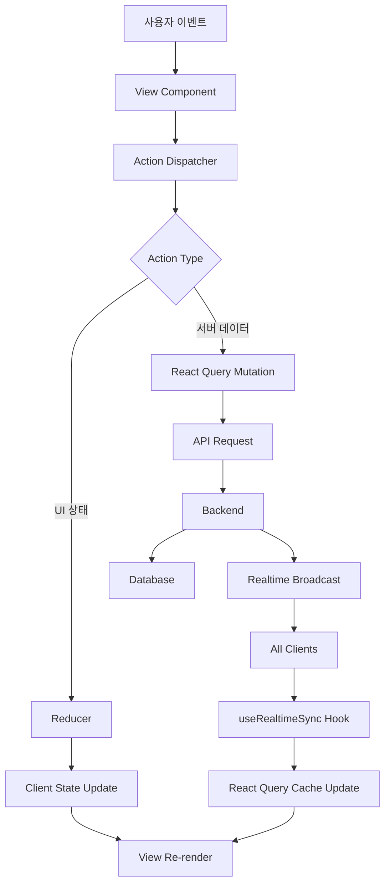

# 채팅방 페이지 상태 관리 설계 (최종)

**페이지:** `/room/[roomId]`
**작성일:** 2025-10-17
**버전:** 1.0

---

## 1. 개요

채팅방 페이지의 상태 관리는 다음과 같은 구조로 설계됩니다:

- **클라이언트 상태**: Context + `useReducer`로 관리 (Flux 패턴)
- **서버 상태**: React Query로 관리
- **실시간 동기화**: Supabase Realtime

### 설계 원칙

1. **단방향 데이터 흐름**: View → Action → Reducer → State → View
2. **상태 분리**: 클라이언트 상태와 서버 상태 명확히 구분
3. **낙관적 업데이트**: 빠른 UX를 위한 즉시 UI 업데이트
4. **에러 처리**: 실패 시 롤백 및 재시도 옵션 제공
5. **성능 최적화**: 메모이제이션, 가상 스크롤, 배치 업데이트

---

## 2. Context 아키텍처

### 2.1 Context 구조

```
ChatRoomProvider (Context Provider)
  ├── State (useReducer)
  │   ├── messageInput
  │   ├── replyingTo
  │   ├── isComposing
  │   ├── optimisticMessages
  │   ├── failedMessages
  │   ├── connectionStatus
  │   ├── isScrolledToBottom
  │   ├── showNewMessageAlert
  │   └── deletingMessageId
  ├── Dispatch (액션 디스패처)
  ├── Server State (React Query)
  │   ├── messages (쿼리)
  │   ├── chatRoom (쿼리)
  │   ├── currentUser (쿼리)
  │   ├── sendMessage (mutation)
  │   ├── deleteMessage (mutation)
  │   └── toggleLike (mutation)
  └── Custom Logic (Hooks)
      ├── useRealtimeSync (실시간 동기화)
      ├── useSendMessage (메시지 전송)
      ├── useDeleteMessage (메시지 삭제)
      └── useToggleLike (좋아요 토글)
```

### 2.2 데이터 흐름 시각화



---

## 3. State 정의

### 3.1 클라이언트 상태 (useReducer)

```typescript
interface ChatRoomState {
  // 메시지 입력
  messageInput: string;
  replyingTo: Message | null;
  isComposing: boolean;

  // 낙관적 업데이트
  optimisticMessages: OptimisticMessage[];
  failedMessages: FailedMessage[];

  // 연결 상태
  connectionStatus: 'connected' | 'disconnected' | 'reconnecting';

  // 스크롤 및 알림
  isScrolledToBottom: boolean;
  showNewMessageAlert: boolean;

  // 삭제 다이얼로그
  deletingMessageId: string | null;
}

const initialState: ChatRoomState = {
  messageInput: '',
  replyingTo: null,
  isComposing: false,
  optimisticMessages: [],
  failedMessages: [],
  connectionStatus: 'disconnected',
  isScrolledToBottom: true,
  showNewMessageAlert: false,
  deletingMessageId: null,
};
```

### 3.2 서버 상태 (React Query)

```typescript
// 쿼리 키
const queryKeys = {
  chatRoom: (roomId: string) => ['chatRoom', roomId],
  messages: (roomId: string) => ['messages', roomId],
  currentUser: () => ['currentUser'],
};

// 쿼리 훅
const useChatRoomQuery = (roomId: string) =>
  useQuery({
    queryKey: queryKeys.chatRoom(roomId),
    queryFn: () => apiClient.get(`/api/rooms/${roomId}`),
  });

const useMessagesQuery = (roomId: string) =>
  useInfiniteQuery({
    queryKey: queryKeys.messages(roomId),
    queryFn: ({ pageParam = null }) =>
      apiClient.get(`/api/rooms/${roomId}/messages`, {
        params: { before: pageParam, limit: 50 },
      }),
    getNextPageParam: (lastPage) =>
      lastPage.data.length === 50 ? lastPage.data[0].id : undefined,
    initialPageParam: null,
  });

const useCurrentUserQuery = () =>
  useQuery({
    queryKey: queryKeys.currentUser(),
    queryFn: () => apiClient.get('/api/auth/me'),
  });
```

---

## 4. Action 정의

### 4.1 Action Types

```typescript
type ChatRoomAction =
  // 메시지 입력 관련
  | { type: 'SET_MESSAGE_INPUT'; payload: string }
  | { type: 'CLEAR_MESSAGE_INPUT' }

  // 답장 관련
  | { type: 'START_REPLY'; payload: Message }
  | { type: 'CANCEL_REPLY' }

  // 낙관적 업데이트
  | { type: 'ADD_OPTIMISTIC_MESSAGE'; payload: OptimisticMessage }
  | { type: 'REMOVE_OPTIMISTIC_MESSAGE'; payload: { tempId: string } }
  | { type: 'MARK_MESSAGE_FAILED'; payload: { tempId: string; error: string } }

  // 전송 실패 메시지 관리
  | { type: 'ADD_FAILED_MESSAGE'; payload: FailedMessage }
  | { type: 'REMOVE_FAILED_MESSAGE'; payload: { tempId: string } }

  // 연결 상태 관리
  | { type: 'SET_CONNECTION_STATUS'; payload: ConnectionStatus }

  // 스크롤 및 알림 관리
  | { type: 'SET_SCROLLED_TO_BOTTOM'; payload: boolean }
  | { type: 'SHOW_NEW_MESSAGE_ALERT' }
  | { type: 'HIDE_NEW_MESSAGE_ALERT' }

  // 삭제 다이얼로그 관리
  | { type: 'START_DELETING'; payload: { messageId: string } }
  | { type: 'CANCEL_DELETING' }

  // 초기화
  | { type: 'RESET_STATE' };
```

### 4.2 Action Creators

```typescript
const actions = {
  setMessageInput: (text: string) => ({ type: 'SET_MESSAGE_INPUT', payload: text }),
  clearMessageInput: () => ({ type: 'CLEAR_MESSAGE_INPUT' }),
  startReply: (message: Message) => ({ type: 'START_REPLY', payload: message }),
  cancelReply: () => ({ type: 'CANCEL_REPLY' }),
  addOptimisticMessage: (message: OptimisticMessage) => ({
    type: 'ADD_OPTIMISTIC_MESSAGE',
    payload: message,
  }),
  removeOptimisticMessage: (tempId: string) => ({
    type: 'REMOVE_OPTIMISTIC_MESSAGE',
    payload: { tempId },
  }),
  markMessageFailed: (tempId: string, error: string) => ({
    type: 'MARK_MESSAGE_FAILED',
    payload: { tempId, error },
  }),
  addFailedMessage: (message: FailedMessage) => ({
    type: 'ADD_FAILED_MESSAGE',
    payload: message,
  }),
  removeFailedMessage: (tempId: string) => ({
    type: 'REMOVE_FAILED_MESSAGE',
    payload: { tempId },
  }),
  setConnectionStatus: (status: ConnectionStatus) => ({
    type: 'SET_CONNECTION_STATUS',
    payload: status,
  }),
  setScrolledToBottom: (isBottom: boolean) => ({
    type: 'SET_SCROLLED_TO_BOTTOM',
    payload: isBottom,
  }),
  showNewMessageAlert: () => ({ type: 'SHOW_NEW_MESSAGE_ALERT' }),
  hideNewMessageAlert: () => ({ type: 'HIDE_NEW_MESSAGE_ALERT' }),
  startDeleting: (messageId: string) => ({
    type: 'START_DELETING',
    payload: { messageId },
  }),
  cancelDeleting: () => ({ type: 'CANCEL_DELETING' }),
  resetState: () => ({ type: 'RESET_STATE' }),
};
```

---

## 5. Reducer 구현

```typescript
function chatRoomReducer(
  state: ChatRoomState,
  action: ChatRoomAction
): ChatRoomState {
  switch (action.type) {
    case 'SET_MESSAGE_INPUT':
      return {
        ...state,
        messageInput: action.payload,
        isComposing: action.payload.trim().length > 0,
      };

    case 'CLEAR_MESSAGE_INPUT':
      return {
        ...state,
        messageInput: '',
        isComposing: false,
      };

    case 'START_REPLY':
      return {
        ...state,
        replyingTo: action.payload,
      };

    case 'CANCEL_REPLY':
      return {
        ...state,
        replyingTo: null,
      };

    case 'ADD_OPTIMISTIC_MESSAGE':
      return {
        ...state,
        optimisticMessages: [...state.optimisticMessages, action.payload],
      };

    case 'REMOVE_OPTIMISTIC_MESSAGE':
      return {
        ...state,
        optimisticMessages: state.optimisticMessages.filter(
          (msg) => msg.tempId !== action.payload.tempId
        ),
      };

    case 'MARK_MESSAGE_FAILED': {
      const failedMsg = state.optimisticMessages.find(
        (msg) => msg.tempId === action.payload.tempId
      );
      if (!failedMsg) return state;

      return {
        ...state,
        optimisticMessages: state.optimisticMessages.filter(
          (msg) => msg.tempId !== action.payload.tempId
        ),
        failedMessages: [
          ...state.failedMessages,
          {
            tempId: failedMsg.tempId,
            content: failedMsg.content,
            replyToMessageId: failedMsg.replyToMessageId,
            error: action.payload.error,
          },
        ],
      };
    }

    case 'ADD_FAILED_MESSAGE':
      return {
        ...state,
        failedMessages: [...state.failedMessages, action.payload],
      };

    case 'REMOVE_FAILED_MESSAGE':
      return {
        ...state,
        failedMessages: state.failedMessages.filter(
          (msg) => msg.tempId !== action.payload.tempId
        ),
      };

    case 'SET_CONNECTION_STATUS':
      return {
        ...state,
        connectionStatus: action.payload,
      };

    case 'SET_SCROLLED_TO_BOTTOM':
      return {
        ...state,
        isScrolledToBottom: action.payload,
        showNewMessageAlert: action.payload ? false : state.showNewMessageAlert,
      };

    case 'SHOW_NEW_MESSAGE_ALERT':
      return {
        ...state,
        showNewMessageAlert: !state.isScrolledToBottom,
      };

    case 'HIDE_NEW_MESSAGE_ALERT':
      return {
        ...state,
        showNewMessageAlert: false,
      };

    case 'START_DELETING':
      return {
        ...state,
        deletingMessageId: action.payload.messageId,
      };

    case 'CANCEL_DELETING':
      return {
        ...state,
        deletingMessageId: null,
      };

    case 'RESET_STATE':
      return initialState;

    default:
      return state;
  }
}
```

---

## 6. Context Provider 구현

### 6.1 ChatRoomContext 생성

```typescript
interface ChatRoomContextValue {
  // 클라이언트 상태
  state: ChatRoomState;
  dispatch: React.Dispatch<ChatRoomAction>;

  // 서버 상태 (React Query)
  chatRoom: ChatRoom | undefined;
  messages: Message[];
  currentUser: User | undefined;
  hasMoreMessages: boolean;

  // 파생 상태
  canSendMessage: boolean;
  showCharCounter: boolean;
  mergedMessages: Message[];

  // 액션 함수
  sendMessage: () => Promise<void>;
  deleteMessage: (messageId: string) => Promise<void>;
  toggleLike: (messageId: string, isLiked: boolean) => Promise<void>;
  loadMoreMessages: () => void;
  retryFailedMessage: (tempId: string) => void;
  scrollToBottom: () => void;
}

const ChatRoomContext = createContext<ChatRoomContextValue | null>(null);

export const useChatRoomContext = () => {
  const context = useContext(ChatRoomContext);
  if (!context) {
    throw new Error('useChatRoomContext must be used within ChatRoomProvider');
  }
  return context;
};
```

### 6.2 ChatRoomProvider 구현

```typescript
interface ChatRoomProviderProps {
  roomId: string;
  children: React.ReactNode;
}

export const ChatRoomProvider: React.FC<ChatRoomProviderProps> = ({
  roomId,
  children,
}) => {
  // 1. 클라이언트 상태 (useReducer)
  const [state, dispatch] = useReducer(chatRoomReducer, initialState);

  // 2. 서버 상태 (React Query)
  const { data: chatRoom } = useChatRoomQuery(roomId);
  const { data: currentUser } = useCurrentUserQuery();
  const {
    data: messagesData,
    fetchNextPage,
    hasNextPage,
  } = useMessagesQuery(roomId);

  const messages = useMemo(
    () => messagesData?.pages.flatMap((page) => page.data) ?? [],
    [messagesData]
  );

  // 3. Custom Hooks
  const { sendMessage } = useSendMessage(roomId, state, dispatch, currentUser);
  const { deleteMessage } = useDeleteMessage(roomId, dispatch);
  const { toggleLike } = useToggleLike(roomId);

  // 4. 실시간 동기화
  useRealtimeSync(roomId, dispatch);

  // 5. 파생 상태
  const canSendMessage = useMemo(
    () =>
      state.messageInput.trim().length > 0 &&
      state.messageInput.length <= 1000 &&
      state.connectionStatus === 'connected',
    [state.messageInput, state.connectionStatus]
  );

  const showCharCounter = useMemo(
    () => state.messageInput.length >= 900,
    [state.messageInput.length]
  );

  const mergedMessages = useMemo(() => {
    const tempMessages = state.optimisticMessages.filter(
      (m) => m.status !== 'failed'
    );
    const allMessages = [...tempMessages, ...messages];

    // 중복 제거
    const uniqueMessages = allMessages.filter(
      (msg, index, self) =>
        index ===
        self.findIndex((m) => m.id === msg.id || m.tempId === msg.tempId)
    );

    // 시간순 정렬
    return uniqueMessages.sort(
      (a, b) =>
        new Date(a.createdAt).getTime() - new Date(b.createdAt).getTime()
    );
  }, [state.optimisticMessages, messages]);

  // 6. 액션 함수
  const loadMoreMessages = useCallback(() => {
    if (hasNextPage) {
      fetchNextPage();
    }
  }, [hasNextPage, fetchNextPage]);

  const retryFailedMessage = useCallback(
    (tempId: string) => {
      const failedMsg = state.failedMessages.find((m) => m.tempId === tempId);
      if (!failedMsg) return;

      dispatch(actions.removeFailedMessage(tempId));
      dispatch(actions.setMessageInput(failedMsg.content));
      // 답장 정보 복원은 필요 시 구현
    },
    [state.failedMessages]
  );

  const timelineRef = useRef<HTMLDivElement>(null);
  const scrollToBottom = useCallback(() => {
    timelineRef.current?.scrollTo({
      top: timelineRef.current.scrollHeight,
      behavior: 'smooth',
    });
    dispatch(actions.hideNewMessageAlert());
  }, []);

  // 7. 초기화 및 정리
  useEffect(() => {
    return () => {
      dispatch(actions.resetState());
    };
  }, [roomId]);

  const contextValue: ChatRoomContextValue = {
    state,
    dispatch,
    chatRoom: chatRoom?.data,
    messages,
    currentUser: currentUser?.data,
    hasMoreMessages: hasNextPage ?? false,
    canSendMessage,
    showCharCounter,
    mergedMessages,
    sendMessage,
    deleteMessage,
    toggleLike,
    loadMoreMessages,
    retryFailedMessage,
    scrollToBottom,
  };

  return (
    <ChatRoomContext.Provider value={contextValue}>
      {children}
    </ChatRoomContext.Provider>
  );
};
```

---

## 7. Custom Hooks (비즈니스 로직)

### 7.1 useSendMessage

```typescript
function useSendMessage(
  roomId: string,
  state: ChatRoomState,
  dispatch: React.Dispatch<ChatRoomAction>,
  currentUser: User | undefined
) {
  const queryClient = useQueryClient();

  const sendMessageMutation = useMutation({
    mutationFn: async (data: {
      content: string;
      replyToMessageId?: string;
    }) => {
      const response = await apiClient.post('/api/messages', {
        roomId,
        content: data.content,
        type: 'text',
        replyToMessageId: data.replyToMessageId,
      });
      return response.data;
    },
  });

  const sendMessage = async () => {
    if (
      !state.messageInput.trim() ||
      state.messageInput.length > 1000 ||
      !currentUser
    ) {
      return;
    }

    // 1. 낙관적 업데이트
    const tempId = `temp-${Date.now()}`;
    const optimisticMsg: OptimisticMessage = {
      tempId,
      id: '',
      content: state.messageInput,
      messageType: 'text',
      userId: currentUser.id,
      authorNickname: currentUser.nickname,
      chatRoomId: roomId,
      replyToMessageId: state.replyingTo?.id || null,
      replyToMessage: state.replyingTo || null,
      likeCount: 0,
      isLikedByMe: false,
      isDeleted: false,
      createdAt: new Date().toISOString(),
      status: 'sending',
    };

    dispatch(actions.addOptimisticMessage(optimisticMsg));

    const content = state.messageInput;
    const replyToMessageId = state.replyingTo?.id;

    dispatch(actions.clearMessageInput());
    dispatch(actions.cancelReply());

    // 2. API 요청
    try {
      await sendMessageMutation.mutateAsync({ content, replyToMessageId });
      // 성공 시 낙관적 메시지 제거 (서버 메시지는 Realtime으로 수신)
      dispatch(actions.removeOptimisticMessage(tempId));
    } catch (error: any) {
      // 실패 시 실패 목록으로 이동
      dispatch(
        actions.markMessageFailed(
          tempId,
          error.message || '전송에 실패했습니다'
        )
      );
    }
  };

  return { sendMessage, isSending: sendMessageMutation.isPending };
}
```

### 7.2 useRealtimeSync

```typescript
function useRealtimeSync(
  roomId: string,
  dispatch: React.Dispatch<ChatRoomAction>
) {
  const queryClient = useQueryClient();

  useEffect(() => {
    dispatch(actions.setConnectionStatus('disconnected'));

    const channel = supabase
      .channel(`room:${roomId}`)
      .on(
        'postgres_changes',
        {
          event: 'INSERT',
          schema: 'public',
          table: 'messages',
          filter: `chat_room_id=eq.${roomId}`,
        },
        (payload) => {
          // 새 메시지 수신
          queryClient.setQueryData<InfiniteData<any>>(
            ['messages', roomId],
            (old) => {
              if (!old) return old;

              const newMessage = payload.new as Message;
              const firstPage = old.pages[0];

              return {
                ...old,
                pages: [
                  {
                    ...firstPage,
                    data: [...firstPage.data, newMessage],
                  },
                  ...old.pages.slice(1),
                ],
              };
            }
          );

          // 새 메시지 알림
          dispatch(actions.showNewMessageAlert());
        }
      )
      .on(
        'postgres_changes',
        {
          event: 'UPDATE',
          schema: 'public',
          table: 'messages',
          filter: `chat_room_id=eq.${roomId}`,
        },
        (payload) => {
          // 메시지 업데이트 (삭제 등)
          queryClient.setQueryData<InfiniteData<any>>(
            ['messages', roomId],
            (old) => {
              if (!old) return old;

              const updatedMessage = payload.new as Message;

              return {
                ...old,
                pages: old.pages.map((page) => ({
                  ...page,
                  data: page.data.map((msg: Message) =>
                    msg.id === updatedMessage.id ? updatedMessage : msg
                  ),
                })),
              };
            }
          );
        }
      )
      .subscribe((status) => {
        if (status === 'SUBSCRIBED') {
          dispatch(actions.setConnectionStatus('connected'));
        } else if (status === 'CHANNEL_ERROR') {
          dispatch(actions.setConnectionStatus('disconnected'));
          // 재연결 시도
          setTimeout(() => {
            dispatch(actions.setConnectionStatus('reconnecting'));
            channel.subscribe();
          }, 1000);
        }
      });

    return () => {
      channel.unsubscribe();
      dispatch(actions.setConnectionStatus('disconnected'));
    };
  }, [roomId, dispatch, queryClient]);
}
```

### 7.3 useDeleteMessage

```typescript
function useDeleteMessage(
  roomId: string,
  dispatch: React.Dispatch<ChatRoomAction>
) {
  const deleteMessageMutation = useMutation({
    mutationFn: async (messageId: string) => {
      await apiClient.delete(`/api/messages/${messageId}`);
    },
    onSuccess: () => {
      dispatch(actions.cancelDeleting());
    },
  });

  const deleteMessage = async (messageId: string) => {
    try {
      await deleteMessageMutation.mutateAsync(messageId);
    } catch (error) {
      console.error('삭제 실패:', error);
      // 에러 토스트 표시
    }
  };

  return { deleteMessage, isDeleting: deleteMessageMutation.isPending };
}
```

### 7.4 useToggleLike

```typescript
function useToggleLike(roomId: string) {
  const queryClient = useQueryClient();

  const toggleLikeMutation = useMutation({
    mutationFn: async ({
      messageId,
      isLiked,
    }: {
      messageId: string;
      isLiked: boolean;
    }) => {
      if (isLiked) {
        await apiClient.delete(`/api/messages/${messageId}/like`);
      } else {
        await apiClient.post(`/api/messages/${messageId}/like`);
      }
    },
    onMutate: async ({ messageId, isLiked }) => {
      // 낙관적 업데이트
      await queryClient.cancelQueries({ queryKey: ['messages', roomId] });

      const previousData = queryClient.getQueryData<InfiniteData<any>>([
        'messages',
        roomId,
      ]);

      queryClient.setQueryData<InfiniteData<any>>(['messages', roomId], (old) => {
        if (!old) return old;

        return {
          ...old,
          pages: old.pages.map((page) => ({
            ...page,
            data: page.data.map((msg: Message) =>
              msg.id === messageId
                ? {
                    ...msg,
                    isLikedByMe: !isLiked,
                    likeCount: msg.likeCount + (isLiked ? -1 : 1),
                  }
                : msg
            ),
          })),
        };
      });

      return { previousData };
    },
    onError: (err, variables, context) => {
      // 롤백
      if (context?.previousData) {
        queryClient.setQueryData(['messages', roomId], context.previousData);
      }
    },
    onSettled: () => {
      queryClient.invalidateQueries({ queryKey: ['messages', roomId] });
    },
  });

  const toggleLike = async (messageId: string, isLiked: boolean) => {
    await toggleLikeMutation.mutateAsync({ messageId, isLiked });
  };

  return { toggleLike, isToggling: toggleLikeMutation.isPending };
}
```

---

## 8. 하위 컴포넌트에 노출되는 인터페이스

### 8.1 Context에서 제공하는 값

```typescript
interface ChatRoomContextValue {
  // === 상태 ===
  state: ChatRoomState; // 클라이언트 상태
  dispatch: React.Dispatch<ChatRoomAction>; // 액션 디스패처

  // === 서버 데이터 ===
  chatRoom: ChatRoom | undefined; // 채팅방 정보
  messages: Message[]; // 메시지 목록
  currentUser: User | undefined; // 현재 사용자
  hasMoreMessages: boolean; // 추가 로드 가능 여부

  // === 파생 상태 ===
  canSendMessage: boolean; // 전송 버튼 활성화 여부
  showCharCounter: boolean; // 글자 수 카운터 표시 여부
  mergedMessages: Message[]; // 낙관적 + 서버 메시지 병합

  // === 액션 함수 ===
  sendMessage: () => Promise<void>; // 메시지 전송
  deleteMessage: (messageId: string) => Promise<void>; // 메시지 삭제
  toggleLike: (messageId: string, isLiked: boolean) => Promise<void>; // 좋아요 토글
  loadMoreMessages: () => void; // 이전 메시지 로드
  retryFailedMessage: (tempId: string) => void; // 실패 메시지 재전송
  scrollToBottom: () => void; // 타임라인 하단으로 스크롤
}
```

### 8.2 사용 예시

#### 8.2.1 MessageInput 컴포넌트

```typescript
const MessageInput: React.FC = () => {
  const {
    state,
    dispatch,
    canSendMessage,
    showCharCounter,
    sendMessage,
  } = useChatRoomContext();

  const handleInputChange = (e: React.ChangeEvent<HTMLTextAreaElement>) => {
    dispatch(actions.setMessageInput(e.target.value));
  };

  const handleKeyDown = (e: React.KeyboardEvent) => {
    if (e.key === 'Enter' && !e.shiftKey) {
      e.preventDefault();
      if (canSendMessage) {
        sendMessage();
      }
    }
  };

  const handleCancelReply = () => {
    dispatch(actions.cancelReply());
  };

  return (
    <div className="message-input">
      {state.replyingTo && (
        <ReplyPreview message={state.replyingTo} onCancel={handleCancelReply} />
      )}

      <textarea
        value={state.messageInput}
        onChange={handleInputChange}
        onKeyDown={handleKeyDown}
        placeholder="메시지를 입력하세요"
        maxLength={1000}
      />

      {showCharCounter && (
        <span className="char-counter">
          {state.messageInput.length} / 1000
        </span>
      )}

      <button onClick={sendMessage} disabled={!canSendMessage}>
        전송
      </button>
    </div>
  );
};
```

#### 8.2.2 MessageTimeline 컴포넌트

```typescript
const MessageTimeline: React.FC = () => {
  const {
    mergedMessages,
    state,
    dispatch,
    loadMoreMessages,
    hasMoreMessages,
  } = useChatRoomContext();

  const handleScroll = (e: React.UIEvent<HTMLDivElement>) => {
    const target = e.currentTarget;
    const isBottom =
      target.scrollHeight - target.scrollTop - target.clientHeight < 100;
    dispatch(actions.setScrolledToBottom(isBottom));

    // 스크롤 상단 도달 시 추가 로드
    if (target.scrollTop < 100 && hasMoreMessages) {
      loadMoreMessages();
    }
  };

  return (
    <div className="message-timeline" onScroll={handleScroll}>
      {mergedMessages.map((message) => (
        <MessageItem key={message.id || message.tempId} message={message} />
      ))}
    </div>
  );
};
```

#### 8.2.3 MessageItem 컴포넌트

```typescript
const MessageItem: React.FC<{ message: Message }> = ({ message }) => {
  const { dispatch, toggleLike, currentUser } = useChatRoomContext();

  const isOwnMessage = message.userId === currentUser?.id;
  const canDelete = isOwnMessage && !message.isDeleted;

  const handleReplyClick = () => {
    dispatch(actions.startReply(message));
  };

  const handleDeleteClick = () => {
    dispatch(actions.startDeleting(message.id));
  };

  const handleLikeClick = () => {
    toggleLike(message.id, message.isLikedByMe);
  };

  return (
    <div className={`message-item ${isOwnMessage ? 'own' : 'other'}`}>
      <div className="message-header">
        <span className="author">{message.authorNickname}</span>
        <span className="time">
          {formatDistanceToNow(new Date(message.createdAt))}
        </span>
      </div>

      {message.replyToMessage && (
        <ReplyPreview message={message.replyToMessage} />
      )}

      <div className="message-content">{message.content}</div>

      <div className="message-actions">
        <button onClick={handleLikeClick}>
          {message.isLikedByMe ? '❤️' : '🤍'} {message.likeCount}
        </button>
        <button onClick={handleReplyClick}>답장</button>
        {canDelete && <button onClick={handleDeleteClick}>삭제</button>}
      </div>

      {message.status === 'sending' && <span>전송 중...</span>}
      {message.status === 'failed' && <span>전송 실패</span>}
    </div>
  );
};
```

#### 8.2.4 ConnectionStatusBanner 컴포넌트

```typescript
const ConnectionStatusBanner: React.FC = () => {
  const { state } = useChatRoomContext();

  if (state.connectionStatus === 'connected') {
    return null;
  }

  return (
    <div className="connection-status-banner">
      {state.connectionStatus === 'disconnected' && (
        <span>⚠️ 연결이 끊어졌습니다</span>
      )}
      {state.connectionStatus === 'reconnecting' && (
        <span>🔄 재연결 중...</span>
      )}
    </div>
  );
};
```

#### 8.2.5 DeleteConfirmDialog 컴포넌트

```typescript
const DeleteConfirmDialog: React.FC = () => {
  const { state, dispatch, deleteMessage } = useChatRoomContext();

  if (!state.deletingMessageId) {
    return null;
  }

  const handleConfirm = async () => {
    await deleteMessage(state.deletingMessageId!);
  };

  const handleCancel = () => {
    dispatch(actions.cancelDeleting());
  };

  return (
    <Dialog open={!!state.deletingMessageId} onOpenChange={handleCancel}>
      <DialogContent>
        <DialogHeader>
          <DialogTitle>메시지 삭제</DialogTitle>
          <DialogDescription>
            메시지를 삭제하시겠습니까? 이 작업은 되돌릴 수 없습니다.
          </DialogDescription>
        </DialogHeader>
        <DialogFooter>
          <Button variant="outline" onClick={handleCancel}>
            취소
          </Button>
          <Button variant="destructive" onClick={handleConfirm}>
            삭제
          </Button>
        </DialogFooter>
      </DialogContent>
    </Dialog>
  );
};
```

---

## 9. 페이지 구조

```typescript
// app/room/[roomId]/page.tsx
export default async function ChatRoomPage({
  params,
}: {
  params: Promise<{ roomId: string }>;
}) {
  const { roomId } = await params;

  return (
    <ChatRoomProvider roomId={roomId}>
      <div className="chat-room-page">
        <ChatRoomHeader />
        <ConnectionStatusBanner />
        <MessageTimeline />
        <NewMessageAlert />
        <MessageInput />
        <DeleteConfirmDialog />
      </div>
    </ChatRoomProvider>
  );
}
```

---

## 10. 실시간 동기화 전략

### 10.1 메시지 수신 흐름

```
1. 다른 사용자가 메시지 전송
   ↓
2. Backend가 DB에 저장
   ↓
3. Supabase Realtime이 INSERT 이벤트 브로드캐스트
   ↓
4. useRealtimeSync가 이벤트 수신
   ↓
5. React Query 캐시 업데이트
   ↓
6. View 자동 리렌더링 (새 메시지 표시)
```

### 10.2 낙관적 업데이트 전략

```
1. 사용자가 메시지 전송
   ↓
2. 즉시 optimisticMessages에 추가 (status: 'sending')
   ↓
3. View에서 mergedMessages 계산 (낙관적 메시지 포함)
   ↓
4. 타임라인에 즉시 표시 (로딩 인디케이터)
   ↓
5. API 요청
   ↓
6. 성공: optimisticMessages에서 제거 → 서버 메시지로 교체
   실패: failedMessages로 이동 → 재전송 옵션 제공
```

### 10.3 에러 처리 및 롤백

```typescript
// 메시지 전송 실패 시
try {
  await sendMessageMutation.mutateAsync({ content, replyToMessageId });
  dispatch(actions.removeOptimisticMessage(tempId));
} catch (error: any) {
  // 실패 목록으로 이동
  dispatch(actions.markMessageFailed(tempId, error.message));
}

// 좋아요 실패 시 (onError 콜백에서 롤백)
onError: (err, variables, context) => {
  if (context?.previousData) {
    queryClient.setQueryData(['messages', roomId], context.previousData);
  }
  toast.error('좋아요 처리에 실패했습니다.');
}

// 연결 끊김 시 재연결
if (status === 'CHANNEL_ERROR') {
  dispatch(actions.setConnectionStatus('disconnected'));
  setTimeout(() => {
    dispatch(actions.setConnectionStatus('reconnecting'));
    channel.subscribe();
  }, 1000);
}
```

---

## 11. 성능 최적화

### 11.1 메모이제이션

```typescript
// 병합된 메시지 목록
const mergedMessages = useMemo(() => {
  // 병합 및 정렬 로직
}, [state.optimisticMessages, messages]);

// 개별 메시지 컴포넌트
const MessageItem = React.memo(({ message }) => {
  // 렌더링 로직
});

// 파생 상태
const canSendMessage = useMemo(
  () =>
    state.messageInput.trim().length > 0 &&
    state.messageInput.length <= 1000 &&
    state.connectionStatus === 'connected',
  [state.messageInput, state.connectionStatus]
);
```

### 11.2 가상 스크롤 (react-window)

```typescript
import { VariableSizeList } from 'react-window';

const MessageTimeline = () => {
  const { mergedMessages } = useChatRoomContext();

  return (
    <VariableSizeList
      height={600}
      itemCount={mergedMessages.length}
      itemSize={(index) => 80} // 동적 높이 계산
      width="100%"
    >
      {({ index, style }) => (
        <div style={style}>
          <MessageItem message={mergedMessages[index]} />
        </div>
      )}
    </VariableSizeList>
  );
};
```

### 11.3 배치 업데이트 (Debounce)

```typescript
// 스크롤 이벤트 디바운스
import { debounce } from 'es-toolkit';

const handleScroll = useMemo(
  () =>
    debounce((e: React.UIEvent<HTMLDivElement>) => {
      const target = e.currentTarget;
      const isBottom =
        target.scrollHeight - target.scrollTop - target.clientHeight < 100;
      dispatch(actions.setScrolledToBottom(isBottom));
    }, 100),
  [dispatch]
);
```

---

## 12. 요약

### 핵심 구성

1. **Context Provider**: `ChatRoomProvider`로 전체 상태 관리
2. **클라이언트 상태**: `useReducer` + Flux 패턴
3. **서버 상태**: React Query (Infinite Query)
4. **실시간 동기화**: Supabase Realtime + useRealtimeSync
5. **낙관적 업데이트**: 즉시 UI 업데이트 후 서버 동기화
6. **에러 처리**: 실패 시 롤백 및 재시도 옵션

### 노출 인터페이스

하위 컴포넌트는 `useChatRoomContext()`를 통해 다음을 사용:

- **상태**: `state`, `chatRoom`, `messages`, `currentUser`
- **파생 상태**: `canSendMessage`, `mergedMessages`, `showCharCounter`
- **액션 함수**: `sendMessage`, `deleteMessage`, `toggleLike`, `loadMoreMessages`
- **Dispatch**: `dispatch(actions.xxx())`

### 데이터 흐름

```
사용자 이벤트 → Action → Reducer/Mutation → State/Cache 업데이트 → View 리렌더링
```

이 설계를 통해 복잡한 실시간 채팅 기능을 체계적이고 유지보수 가능한 방식으로 구현할 수 있습니다.
