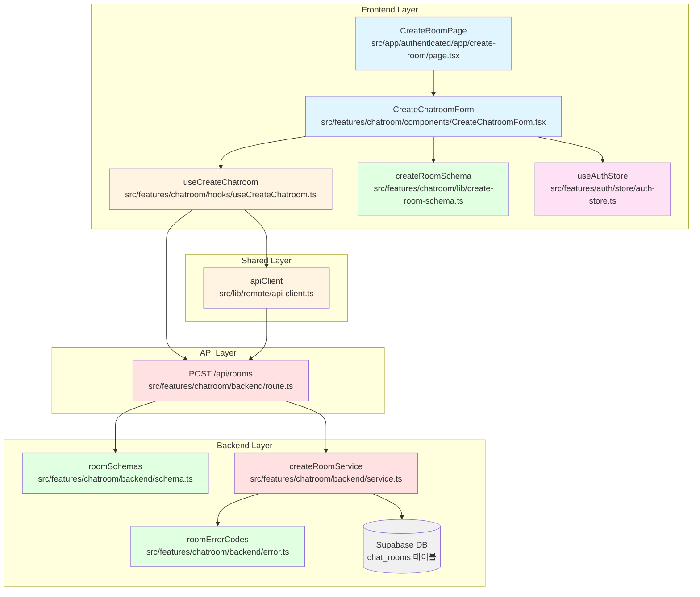

# 유스케이스 003: 새 채팅방 만들기 - 구현 계획

**문서 버전:** 1.0
**작성일:** 2025-10-18
**관련 문서:**
- 유스케이스: `docs/usecases/003/spec.md`
- 유저플로우: `docs/userflow.md` (유저플로우 3)
- 데이터베이스: `docs/database.md` (chat_rooms 테이블)
- 관련 기능: `docs/usecases/004/spec.md` (채팅방 목록 조회 및 입장)

---

## 1. 개요

새로운 채팅방 생성 기능을 구현합니다. 인증된 사용자가 고유한 채팅방 이름을 입력하여 채팅방을 생성할 수 있으며, 생성된 채팅방은 즉시 전체 사용자에게 공개됩니다. 기존 `chatroom` feature의 목록 조회 구현과 동일한 패턴을 따라 일관성을 유지합니다.

### 1.1 주요 모듈 목록

| 모듈명 | 위치 | 설명 |
|--------|------|------|
| **CreateRoomPage** | `src/app/(authenticated)/app/create-room/page.tsx` | 채팅방 생성 페이지 컴포넌트 |
| **CreateChatroomForm** | `src/features/chatroom/components/CreateChatroomForm.tsx` | 채팅방 생성 폼 컴포넌트 |
| **createRoomSchema** | `src/features/chatroom/lib/create-room-schema.ts` | 클라이언트 측 폼 스키마 |
| **useCreateChatroom** | `src/features/chatroom/hooks/useCreateChatroom.ts` | 채팅방 생성 API 호출 훅 |
| **CreateRoomRoute** | `src/features/chatroom/backend/route.ts` | Hono 라우터 (POST /api/rooms) - 확장 |
| **createRoomService** | `src/features/chatroom/backend/service.ts` | 채팅방 생성 비즈니스 로직 - 확장 |
| **roomSchemas** | `src/features/chatroom/backend/schema.ts` | 서버 측 요청/응답 스키마 - 확장 |
| **roomErrorCodes** | `src/features/chatroom/backend/error.ts` | 채팅방 관련 에러 코드 - 확장 |

---

## 2. 아키텍처 다이어그램



---

## 3. 구현 계획

### 3.1 프론트엔드 레이어

#### 3.1.1 페이지 컴포넌트 (`src/app/(authenticated)/app/create-room/page.tsx`)

**목적:** 채팅방 생성 페이지의 최상위 컴포넌트, 인증 체크 및 리디렉션

**구현 내용:**
```typescript
"use client";

import { useEffect } from "react";
import { useRouter } from "next/navigation";
import { useAuthStore } from "@/features/auth/store/auth-store";
import { CreateChatroomForm } from "@/features/chatroom/components/CreateChatroomForm";

export default function CreateRoomPage() {
  const router = useRouter();
  const { isAuthenticated } = useAuthStore();

  // 인증 체크 - 미인증 시 로그인 페이지로 리디렉션
  useEffect(() => {
    if (!isAuthenticated) {
      router.replace("/login");
    }
  }, [isAuthenticated, router]);

  // 인증되지 않은 경우 로딩 표시 (깜빡임 방지)
  if (!isAuthenticated) {
    return null;
  }

  return (
    <div className="mx-auto flex min-h-screen w-full max-w-2xl flex-col items-center justify-center gap-8 px-6 py-16">
      <header className="flex flex-col items-center gap-3 text-center">
        <h1 className="text-3xl font-semibold">새 채팅방 만들기</h1>
        <p className="text-slate-500">
          채팅방 이름을 입력하여 새로운 대화 공간을 만들어보세요.
        </p>
      </header>
      <div className="w-full">
        <CreateChatroomForm />
      </div>
    </div>
  );
}
```

**QA 시트:**
- [ ] 미인증 사용자가 접근 시 `/login`으로 리디렉션되는가?
- [ ] 인증된 사용자는 CreateChatroomForm이 정상 렌더링되는가?
- [ ] 리디렉션 중 깜빡임이 없는가?
- [ ] 페이지가 화면 중앙에 정렬되는가?
- [ ] 반응형 디자인이 모바일/태블릿/데스크톱에서 정상 동작하는가?

---

#### 3.1.2 채팅방 생성 폼 컴포넌트 (`src/features/chatroom/components/CreateChatroomForm.tsx`)

**목적:** 채팅방 생성 폼 UI 및 유효성 검증 처리

**구현 내용:**
- react-hook-form + zod 사용
- 입력 필드:
  - 채팅방 이름 (필수, 1~100자)
  - 문자 수 카운터 표시 (0/100)
- 버튼:
  - "만들기" (Primary)
  - "취소" (Outline) - 홈으로 돌아가기
- shadcn-ui 컴포넌트 사용 (Input, Label, Button, Form, Card, toast)
- 에러 메시지는 필드 하단에 빨간색으로 표시
- 로딩 상태: 버튼 비활성화 + 스피너 표시
- 성공 시: 즉시 새 채팅방 페이지로 리디렉션

**주요 기능:**
1. **실시간 문자 수 카운터**: 입력 중 현재 문자 수 / 최대 100자 표시
2. **자동 리디렉션**: 생성 성공 시 `/app/room/[newRoomId]`로 자동 이동
3. **에러 처리**:
   - 400: "채팅방 이름을 입력해주세요"
   - 409: "이미 존재하는 채팅방 이름입니다. 다른 이름을 입력해주세요"
   - 401: 로그인 페이지로 리디렉션
   - 500: "채팅방 생성 중 오류가 발생했습니다. 잠시 후 다시 시도해주세요"

**QA 시트:**
- [ ] 채팅방 이름 필드가 필수로 표시되고 검증되는가?
- [ ] 빈 값 입력 시 "채팅방 이름을 입력해주세요" 표시되는가?
- [ ] 100자 초과 시 "채팅방 이름은 최대 100자까지 입력할 수 있습니다" 표시되는가?
- [ ] 문자 수 카운터가 실시간으로 업데이트되는가? (예: "25/100")
- [ ] 제출 중에는 버튼이 비활성화되고 "생성 중..." 텍스트가 표시되는가?
- [ ] 입력 필드도 제출 중에는 비활성화되는가?
- [ ] 중복된 채팅방 이름 입력 시 409 에러 + "이미 존재하는 채팅방 이름입니다" 표시되는가?
- [ ] 서버 오류 시 "채팅방 생성 중 오류가 발생했습니다" 표시되는가?
- [ ] 생성 성공 시 새 채팅방 페이지로 즉시 리디렉션되는가?
- [ ] "취소" 버튼 클릭 시 홈 페이지(`/app`)로 이동하는가?
- [ ] 키보드로 모든 필드에 접근 가능한가? (Tab 순서)
- [ ] Enter 키로 폼 제출이 가능한가?
- [ ] 포커스 시 입력 필드의 테두리 색상이 변경되는가?
- [ ] 오류가 있는 필드는 빨간색 테두리로 강조되는가?

---

#### 3.1.3 폼 스키마 (`src/features/chatroom/lib/create-room-schema.ts`)

**목적:** 클라이언트 측 폼 유효성 검증 스키마

**구현 내용:**
```typescript
import { z } from "zod";

export const createRoomFormSchema = z.object({
  name: z
    .string()
    .min(1, { message: "채팅방 이름을 입력해주세요" })
    .max(100, { message: "채팅방 이름은 최대 100자까지 입력할 수 있습니다" })
    .trim(),
});

export type CreateRoomFormData = z.infer<typeof createRoomFormSchema>;
```

**테스트 케이스:**
- [ ] 채팅방 이름이 빈 문자열이면 검증 실패
- [ ] 공백만으로 이루어진 문자열이면 검증 실패 (trim 후 빈 문자열)
- [ ] 채팅방 이름이 101자 이상이면 검증 실패
- [ ] 1~100자의 유효한 이름이면 검증 성공
- [ ] 한글, 영문, 숫자, 특수문자, 이모지 모두 허용되는가?

---

#### 3.1.4 채팅방 생성 훅 (`src/features/chatroom/hooks/useCreateChatroom.ts`)

**목적:** 채팅방 생성 API 호출 및 React Query 통합

**구현 내용:**
```typescript
import { useMutation, useQueryClient } from "@tanstack/react-query";
import { useRouter } from "next/navigation";
import { apiClient } from "@/lib/remote/api-client";
import type { CreateRoomFormData } from "@/features/chatroom/lib/create-room-schema";

type CreateRoomRequest = {
  name: string;
};

type CreateRoomResponse = {
  id: string;
  name: string;
  createdBy: string;
  createdAt: string;
};

type CreateRoomError = {
  error: {
    code: string;
    message: string;
    details?: unknown;
  };
};

export const useCreateChatroom = () => {
  const router = useRouter();
  const queryClient = useQueryClient();

  return useMutation<CreateRoomResponse, CreateRoomError, CreateRoomRequest>({
    mutationFn: async (data) => {
      const response = await apiClient.post<{ data: CreateRoomResponse }>(
        "/api/rooms",
        data
      );
      return response.data.data;
    },
    onSuccess: (data) => {
      // 1. 채팅방 목록 쿼리 무효화 (홈 페이지 자동 업데이트)
      queryClient.invalidateQueries({ queryKey: ["rooms"] });

      // 2. 새로 생성된 채팅방 페이지로 리디렉션
      router.push(`/app/room/${data.id}`);
    },
  });
};
```

**테스트 케이스:**
- [ ] API 호출이 올바른 엔드포인트로 전송되는가?
- [ ] 성공 시 응답 데이터가 반환되는가?
- [ ] 성공 시 채팅방 목록 쿼리가 무효화되는가?
- [ ] 성공 시 새 채팅방 페이지로 리디렉션되는가?
- [ ] 실패 시 에러가 올바르게 처리되는가?
- [ ] isLoading, isError, isSuccess 상태가 정확한가?

---

### 3.2 백엔드 레이어

#### 3.2.1 요청/응답 스키마 확장 (`src/features/chatroom/backend/schema.ts`)

**목적:** 채팅방 생성 요청/응답 스키마 추가

**추가 내용:**
```typescript
import { z } from "zod";

// 기존 RoomSchema, RoomsResponseSchema 유지

// 채팅방 생성 요청 스키마 (추가)
export const CreateRoomRequestSchema = z.object({
  name: z
    .string()
    .min(1, { message: "채팅방 이름은 필수입니다" })
    .max(100, { message: "채팅방 이름은 최대 100자까지 입력할 수 있습니다" })
    .trim(),
});

export type CreateRoomRequest = z.infer<typeof CreateRoomRequestSchema>;

// 채팅방 생성 응답 스키마 (추가)
export const CreateRoomResponseSchema = z.object({
  id: z.string().uuid(),
  name: z.string(),
  createdBy: z.string().uuid(),
  createdAt: z.string().datetime(),
});

export type CreateRoomResponse = z.infer<typeof CreateRoomResponseSchema>;

// 서비스 에러 타입 확장
export type RoomServiceError =
  | "ROOMS_FETCH_ERROR"
  | "ROOM_NOT_FOUND"
  | "ROOM_DELETED"
  | "ROOM_NAME_DUPLICATE"        // 추가
  | "ROOM_CREATE_ERROR"          // 추가
  | "UNAUTHORIZED";               // 추가
```

**테스트 케이스:**
- [ ] 모든 필수 필드 검증
- [ ] 채팅방 이름 길이 검증 (1~100자)
- [ ] trim이 적용되는가?

---

#### 3.2.2 에러 코드 확장 (`src/features/chatroom/backend/error.ts`)

**목적:** 채팅방 생성 관련 에러 코드 추가

**수정 내용:**
```typescript
export const roomErrorCodes = {
  // 조회 관련 (기존)
  roomsFetchError: "ROOMS_FETCH_ERROR",
  roomNotFound: "ROOM_NOT_FOUND",
  roomDeleted: "ROOM_DELETED",

  // 생성 관련 (추가)
  roomNameDuplicate: "ROOM_NAME_DUPLICATE",
  roomCreateError: "ROOM_CREATE_ERROR",
  unauthorized: "UNAUTHORIZED",
} as const;

type RoomErrorValue = (typeof roomErrorCodes)[keyof typeof roomErrorCodes];

export type RoomServiceError = RoomErrorValue;
```

---

#### 3.2.3 채팅방 생성 서비스 (`src/features/chatroom/backend/service.ts`)

**목적:** 채팅방 생성 비즈니스 로직 추가

**추가 내용:**
```typescript
import type { SupabaseClient } from "@supabase/supabase-js";
import {
  failure,
  success,
  type HandlerResult,
} from "@/backend/http/response";
import type {
  RoomsResponse,
  RoomServiceError,
  CreateRoomRequest,
  CreateRoomResponse,
} from "./schema";
import { roomErrorCodes } from "./error";

const CHAT_ROOMS_TABLE = "chat_rooms";

// 기존 getRooms 함수 유지

// 채팅방 생성 함수 (추가)
export const createRoom = async (
  client: SupabaseClient,
  data: CreateRoomRequest,
  creatorId: string
): Promise<HandlerResult<CreateRoomResponse, RoomServiceError, unknown>> => {
  // 1. 채팅방 이름 중복 확인
  const { data: existingRoom, error: checkError } = await client
    .from(CHAT_ROOMS_TABLE)
    .select("id")
    .eq("name", data.name)
    .eq("is_deleted", false)
    .maybeSingle();

  if (checkError) {
    return failure(
      500,
      roomErrorCodes.roomCreateError,
      checkError.message
    );
  }

  if (existingRoom) {
    return failure(
      409,
      roomErrorCodes.roomNameDuplicate,
      "이미 존재하는 채팅방 이름입니다. 다른 이름을 입력해주세요"
    );
  }

  // 2. 채팅방 생성
  const { data: newRoom, error: insertError } = await client
    .from(CHAT_ROOMS_TABLE)
    .insert({
      name: data.name,
      creator_id: creatorId,
    })
    .select("id, name, creator_id, created_at")
    .single();

  if (insertError || !newRoom) {
    return failure(
      500,
      roomErrorCodes.roomCreateError,
      insertError?.message || "채팅방 생성 중 오류가 발생했습니다"
    );
  }

  // 3. 성공 응답
  return success(
    {
      id: newRoom.id,
      name: newRoom.name,
      createdBy: newRoom.creator_id,
      createdAt: newRoom.created_at,
    },
    201
  );
};
```

**테스트 케이스:**
- [ ] 채팅방 이름이 중복이면 409 에러 반환
- [ ] 채팅방이 정상적으로 데이터베이스에 저장되는가?
- [ ] 개설자 ID가 올바르게 저장되는가?
- [ ] 성공 시 201 상태 코드와 채팅방 정보 반환
- [ ] 데이터베이스 조회 오류 시 500 에러 반환
- [ ] 데이터베이스 삽입 오류 시 500 에러 반환
- [ ] is_deleted = false인 채팅방만 중복 체크하는가?

---

#### 3.2.4 Hono 라우터 확장 (`src/features/chatroom/backend/route.ts`)

**목적:** 채팅방 생성 API 엔드포인트 추가

**수정 내용:**
```typescript
import type { Hono } from "hono";
import {
  failure,
  respond,
  type ErrorResult,
} from "@/backend/http/response";
import {
  getLogger,
  getSupabase,
  type AppEnv,
} from "@/backend/hono/context";
import { getRooms, createRoom } from "./service";
import type { RoomServiceError, CreateRoomRequest } from "./schema";
import { CreateRoomRequestSchema } from "./schema";
import { roomErrorCodes } from "./error";

export const registerRoomRoutes = (app: Hono<AppEnv>) => {
  // 채팅방 목록 조회 (기존 유지)
  app.get("/api/rooms", async (c) => {
    const supabase = getSupabase(c);
    const logger = getLogger(c);

    const result = await getRooms(supabase);

    if (!result.ok) {
      const errorResult = result as ErrorResult<RoomServiceError, unknown>;

      logger.error("Failed to fetch rooms", {
        code: errorResult.error.code,
        message: errorResult.error.message,
      });

      return respond(c, result);
    }

    logger.info("Rooms fetched successfully", {
      count: result.data.length,
    });

    return respond(c, result);
  });

  // 채팅방 생성 엔드포인트 (추가)
  app.post("/api/rooms", async (c) => {
    const supabase = getSupabase(c);
    const logger = getLogger(c);

    // 요청 본문 파싱 및 검증
    const body = await c.req.json();
    const parsedBody = CreateRoomRequestSchema.safeParse(body);

    if (!parsedBody.success) {
      return respond(
        c,
        failure(
          400,
          "INVALID_CREATE_ROOM_DATA",
          "입력 데이터가 올바르지 않습니다.",
          parsedBody.error.format()
        )
      );
    }

    // 인증 확인 - 추후 미들웨어로 분리 가능
    // 현재는 임시로 헤더에서 사용자 ID를 추출한다고 가정
    const authHeader = c.req.header("Authorization");
    if (!authHeader) {
      return respond(
        c,
        failure(
          401,
          roomErrorCodes.unauthorized,
          "로그인이 필요합니다"
        )
      );
    }

    // 임시: 토큰에서 사용자 ID 추출 (실제로는 JWT 검증 필요)
    // TODO: JWT 미들웨어 구현 후 c.get('userId')로 변경
    const creatorId = "임시-사용자-ID"; // 실제 구현 시 JWT에서 추출

    // 채팅방 생성
    const result = await createRoom(supabase, parsedBody.data, creatorId);

    if (!result.ok) {
      const errorResult = result as ErrorResult<RoomServiceError, unknown>;

      // 에러 로깅
      if (
        errorResult.error.code === roomErrorCodes.roomCreateError
      ) {
        logger.error("Failed to create room", errorResult.error.message);
      } else if (
        errorResult.error.code === roomErrorCodes.roomNameDuplicate
      ) {
        logger.info("Room name duplicate", {
          name: parsedBody.data.name,
        });
      }

      return respond(c, result);
    }

    logger.info("Room created successfully", {
      roomId: result.data.id,
      name: result.data.name,
      creatorId: result.data.createdBy,
    });

    return respond(c, result);
  });
};
```

**중요 참고사항:**
- **인증 처리**: 현재는 임시로 `Authorization` 헤더만 확인하고 있습니다. 실제 구현 시 JWT 검증 미들웨어를 추가하거나, 기존 `auth` feature의 JWT 유틸리티를 활용해야 합니다.
- **creatorId 추출**: 프로덕션 환경에서는 JWT 토큰을 검증하여 사용자 ID를 추출해야 합니다.

**테스트 케이스:**
- [ ] 유효하지 않은 요청 본문이면 400 에러 반환
- [ ] Authorization 헤더가 없으면 401 에러 반환
- [ ] 서비스 성공 시 201 상태 코드 반환
- [ ] 서비스 실패 시 적절한 에러 코드 반환 (409, 500)
- [ ] 모든 에러가 로깅되는가?
- [ ] 중복 이름은 정보 로그, 서버 오류는 에러 로그로 기록되는가?

---

### 3.3 인증 미들웨어 통합 (선택적, 향후 구현)

**목적:** JWT 토큰 검증 및 사용자 ID 추출

현재는 임시로 `Authorization` 헤더만 확인하지만, 향후 다음과 같이 개선할 수 있습니다:

```typescript
// src/features/auth/backend/middleware.ts (미래 구현)
import { verifyToken } from "./jwt";

export const withAuth = async (c, next) => {
  const authHeader = c.req.header("Authorization");

  if (!authHeader || !authHeader.startsWith("Bearer ")) {
    return c.json({ error: "Unauthorized" }, 401);
  }

  const token = authHeader.substring(7);
  const payload = await verifyToken(token);

  if (!payload) {
    return c.json({ error: "Invalid token" }, 401);
  }

  c.set("userId", payload.userId);
  c.set("userEmail", payload.email);

  await next();
};
```

---

### 3.4 shadcn-ui 컴포넌트 설치

채팅방 생성 폼 구현을 위해 다음 shadcn-ui 컴포넌트를 설치해야 합니다 (일부는 이미 설치됨):

```bash
npx shadcn@latest add card
npx shadcn@latest add input
npx shadcn@latest add button
npx shadcn@latest add label
npx shadcn@latest add form
npx shadcn@latest add toast
```

---

### 3.5 디렉토리 구조

생성될 신규 파일 및 확장될 파일:

```
src/
├── app/
│   └── (authenticated)/
│       └── app/
│           └── create-room/
│               └── page.tsx (신규)
├── features/
│   └── chatroom/
│       ├── components/
│       │   └── CreateChatroomForm.tsx (신규)
│       ├── hooks/
│       │   └── useCreateChatroom.ts (신규)
│       ├── lib/
│       │   └── create-room-schema.ts (신규)
│       └── backend/
│           ├── route.ts (확장 - POST /api/rooms 추가)
│           ├── service.ts (확장 - createRoom 함수 추가)
│           ├── schema.ts (확장 - CreateRoomRequest/Response 추가)
│           └── error.ts (확장 - 생성 관련 에러 코드 추가)
```

---

## 4. 구현 순서

### Phase 1: 백엔드 구현
1. **에러 코드 확장** (`src/features/chatroom/backend/error.ts`)
2. **요청/응답 스키마 확장** (`src/features/chatroom/backend/schema.ts`)
3. **채팅방 생성 서비스 추가** (`src/features/chatroom/backend/service.ts`)
4. **Hono 라우터 확장** (`src/features/chatroom/backend/route.ts`)

### Phase 2: 프론트엔드 구현
5. **폼 스키마** (`src/features/chatroom/lib/create-room-schema.ts`)
6. **채팅방 생성 훅** (`src/features/chatroom/hooks/useCreateChatroom.ts`)
7. **채팅방 생성 폼 컴포넌트** (`src/features/chatroom/components/CreateChatroomForm.tsx`)
8. **페이지 컴포넌트** (`src/app/(authenticated)/app/create-room/page.tsx`)

### Phase 3: 테스트 및 검증
9. **각 Edge Case 시나리오 테스트**
10. **UI/UX 요구사항 검증**
11. **데이터 무결성 검증** (중복 방지, 트랜잭션)

---

## 5. Edge Cases 처리 매핑

| Edge Case | 처리 위치 | 구현 방법 |
|-----------|-----------|-----------|
| EC-1: 채팅방 이름 비어있음 | 클라이언트 (zod) | react-hook-form 에러 표시 |
| EC-2: 채팅방 이름 100자 초과 | 클라이언트 (zod) | react-hook-form 에러 표시 |
| EC-3: 중복된 채팅방 이름 | 서버 (service) | 409 응답, "이미 존재하는 채팅방 이름입니다" |
| EC-4: 미인증 사용자 접근 | 클라이언트 (page) / 서버 (route) | `/login` 리디렉션 / 401 응답 |
| EC-5: 네트워크 오류 | 클라이언트 (hook) | React Query 에러 처리 |
| EC-6: 서버 오류 | 서버 (service) | 500 응답, "채팅방 생성 중 오류가 발생했습니다" |

---

## 6. API 응답 형식

### POST /api/rooms

#### 요청
```json
{
  "name": "자유 채팅방"
}
```

#### 성공 응답 (201 Created)
```json
{
  "ok": true,
  "data": {
    "id": "uuid-123",
    "name": "자유 채팅방",
    "createdBy": "user-uuid-456",
    "createdAt": "2025-10-18T10:00:00Z"
  },
  "status": 201
}
```

#### 에러 응답 (400 Bad Request)
```json
{
  "ok": false,
  "error": {
    "code": "INVALID_CREATE_ROOM_DATA",
    "message": "입력 데이터가 올바르지 않습니다.",
    "details": {
      "_errors": [],
      "name": {
        "_errors": ["채팅방 이름을 입력해주세요"]
      }
    }
  },
  "status": 400
}
```

#### 에러 응답 (401 Unauthorized)
```json
{
  "ok": false,
  "error": {
    "code": "UNAUTHORIZED",
    "message": "로그인이 필요합니다"
  },
  "status": 401
}
```

#### 에러 응답 (409 Conflict)
```json
{
  "ok": false,
  "error": {
    "code": "ROOM_NAME_DUPLICATE",
    "message": "이미 존재하는 채팅방 이름입니다. 다른 이름을 입력해주세요"
  },
  "status": 409
}
```

#### 에러 응답 (500 Internal Server Error)
```json
{
  "ok": false,
  "error": {
    "code": "ROOM_CREATE_ERROR",
    "message": "채팅방 생성 중 오류가 발생했습니다"
  },
  "status": 500
}
```

---

## 7. 데이터베이스 쿼리

### 채팅방 이름 중복 확인

```sql
SELECT id
FROM chat_rooms
WHERE name = '자유 채팅방'
  AND is_deleted = false
LIMIT 1;
```

### 채팅방 생성

```sql
INSERT INTO chat_rooms (name, creator_id)
VALUES ('자유 채팅방', 'user-uuid-456')
RETURNING id, name, creator_id, created_at;
```

---

## 8. 보안 고려사항

1. **인증 필수**: 페이지 로드 시 authStore 확인, API 요청 시 Authorization 헤더 검증
2. **입력 검증**: 클라이언트 + 서버 이중 검증
3. **XSS 방지**: 채팅방 이름 React 자동 이스케이프
4. **SQL Injection 방지**: Supabase 클라이언트가 자동 처리
5. **중복 방지**: 데이터베이스 레벨 UNIQUE 제약조건 + 서비스 레벨 검증
6. **CSRF 방지**: SameSite 쿠키 설정 (JWT 토큰 사용 시)

---

## 9. 성능 최적화

1. **인덱스 활용**: `chat_rooms.name` UNIQUE 인덱스 (이미 존재)
2. **중복 확인 쿼리**: `maybeSingle()` 사용으로 불필요한 데이터 조회 방지
3. **React Query**: 자동 에러 재시도, 채팅방 목록 캐시 무효화
4. **낙관적 UI 업데이트**: 선택적으로 구현 가능 (현재는 리디렉션으로 처리)

---

## 10. 테스트 체크리스트

### 정상 플로우
- [ ] 유효한 채팅방 이름 입력 시 생성 성공
- [ ] 생성 성공 시 데이터베이스에 채팅방 저장됨
- [ ] 개설자 ID가 올바르게 저장됨
- [ ] 생성 성공 시 새 채팅방 페이지로 리디렉션됨
- [ ] 홈 페이지의 채팅방 목록이 자동 업데이트됨 (Realtime)

### Edge Cases
- [ ] EC-1: 빈 이름 입력 시 에러 메시지 표시
- [ ] EC-2: 101자 이상 입력 시 에러 메시지 표시
- [ ] EC-3: 중복 이름 입력 시 409 에러 + "이미 존재하는 채팅방 이름입니다" 표시
- [ ] EC-4: 미인증 사용자 접근 시 로그인 페이지로 리디렉션
- [ ] EC-5: 네트워크 오류 시 적절한 메시지 표시
- [ ] EC-6: 서버 오류 시 500 에러 + "채팅방 생성 중 오류가 발생했습니다" 표시

### UI/UX
- [ ] 폼이 화면 중앙에 정렬됨
- [ ] 채팅방 이름 필드가 명확한 레이블을 가짐
- [ ] 문자 수 카운터가 실시간 업데이트됨 (예: "25/100")
- [ ] 오류 필드는 빨간색 테두리로 강조
- [ ] 오류 메시지는 필드 하단에 빨간색 표시
- [ ] 로딩 중 "만들기" 버튼 비활성화 + "생성 중..." 표시
- [ ] 로딩 중 입력 필드도 비활성화
- [ ] "취소" 버튼 클릭 시 홈으로 이동
- [ ] 키보드 네비게이션 가능 (Tab, Enter)
- [ ] 반응형 디자인 동작 (모바일/태블릿/데스크톱)

### 데이터 무결성
- [ ] 동일 이름의 채팅방이 중복 생성되지 않음
- [ ] is_deleted = false인 채팅방만 중복 체크됨
- [ ] 생성 시간이 자동으로 설정됨
- [ ] UUID가 자동으로 생성됨

---

## 11. 향후 개선 사항

1. **실시간 중복 확인**: debounce를 사용한 입력 중 중복 확인 (사용자 경험 개선)
2. **채팅방 설명 추가**: 채팅방 이름 외에 설명 필드 추가
3. **채팅방 카테고리**: 주제별 분류 기능
4. **채팅방 썸네일**: 시각적 구분을 위한 이미지 업로드
5. **비공개 채팅방**: 초대 전용 채팅방 생성 옵션
6. **최대 인원 설정**: 참여 가능한 최대 인원 제한
7. **성공 애니메이션**: 생성 완료 시 시각적 피드백 강화

---

## 12. 의존성 및 충돌 확인

### 기존 코드베이스와의 호환성
- ✅ `src/features/chatroom/backend/route.ts` 존재 (GET /api/rooms 구현됨)
- ✅ `src/features/chatroom/backend/service.ts` 존재 (getRooms 구현됨)
- ✅ `src/features/chatroom/backend/schema.ts` 존재 (RoomSchema 정의됨)
- ✅ `src/features/chatroom/backend/error.ts` 존재 (기본 에러 코드 정의됨)
- ✅ `src/features/auth/store/auth-store.ts` 존재 (인증 상태 관리)
- ✅ `src/backend/hono/app.ts`에 라우터 등록 패턴 확립됨
- ✅ `src/backend/http/response.ts` 공통 응답 헬퍼 존재

### 신규 생성 디렉토리/파일
- `src/app/(authenticated)/app/create-room/` (신규 디렉토리)
- `src/app/(authenticated)/app/create-room/page.tsx` (신규)
- `src/features/chatroom/components/CreateChatroomForm.tsx` (신규)
- `src/features/chatroom/hooks/useCreateChatroom.ts` (신규)
- `src/features/chatroom/lib/create-room-schema.ts` (신규)

### 확장 파일
- `src/features/chatroom/backend/route.ts` (POST /api/rooms 엔드포인트 추가)
- `src/features/chatroom/backend/service.ts` (createRoom 함수 추가)
- `src/features/chatroom/backend/schema.ts` (CreateRoomRequest/Response 추가)
- `src/features/chatroom/backend/error.ts` (생성 관련 에러 코드 추가)

### 충돌 가능성
- ❌ 없음: 기존 코드와 완전히 분리된 기능이므로 충돌 없음
- ⚠️ 주의: 동일한 파일을 확장하므로 기존 코드를 유지하면서 추가해야 함

---

## 13. 참고사항

- 기존 `chatroom` feature의 목록 조회 구현과 동일한 패턴을 따라 일관성을 유지합니다.
- Hono 백엔드 패턴(`registerRoomRoutes`)을 확장하여 생성 엔드포인트를 추가합니다.
- 모든 에러 처리는 `success`/`failure`/`respond` 패턴을 따릅니다.
- 클라이언트 측 HTTP 요청은 `@/lib/remote/api-client`를 통해 수행합니다.
- 인증 상태는 Zustand의 authStore를 사용합니다.
- 모든 컴포넌트는 Client Component (`"use client"`)로 작성합니다.
- 중복 방지는 데이터베이스 UNIQUE 제약조건과 서비스 레벨 검증 이중으로 처리합니다.
- 채팅방 이름은 한글, 영문, 숫자, 특수문자, 이모지 등 모든 유니코드 문자를 허용합니다.

---

## 14. 구현 시 주의사항

### 14.1 인증 처리
- 현재는 임시로 `Authorization` 헤더만 확인하지만, 실제 프로덕션 환경에서는 JWT 검증이 필요합니다.
- 기존 `auth` feature의 JWT 유틸리티(`src/features/auth/backend/jwt.ts`)를 활용할 수 있습니다.
- 미들웨어로 분리하여 모든 인증 필요 엔드포인트에서 재사용하는 것을 권장합니다.

### 14.2 중복 확인
- Supabase의 `maybeSingle()`을 사용하여 단일 레코드만 조회합니다.
- `is_deleted = false` 조건을 반드시 포함하여 삭제된 채팅방은 제외합니다.
- 데이터베이스 레벨의 UNIQUE 제약조건이 최종 방어선 역할을 합니다.

### 14.3 트랜잭션
- 현재 구현은 중복 확인과 삽입을 별도의 쿼리로 수행합니다.
- 동시성 문제가 발생할 수 있으므로, 데이터베이스 UNIQUE 제약조건이 중요합니다.
- 필요 시 Supabase RPC 함수로 트랜잭션을 구현할 수 있습니다.

### 14.4 React Query 캐시 무효화
- `queryClient.invalidateQueries({ queryKey: ["rooms"] })`로 채팅방 목록 캐시를 무효화합니다.
- Supabase Realtime과 함께 사용하면 실시간 동기화가 더욱 빠르게 동작합니다.

---

**문서 작성 완료**
