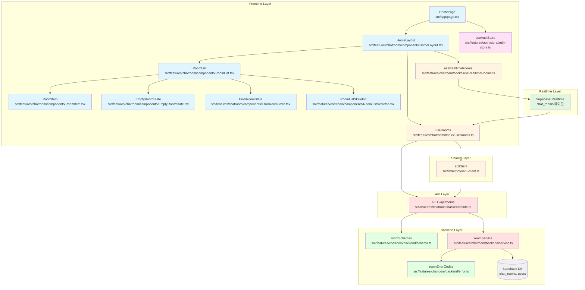

# 홈 페이지 구현 계획

**문서 버전:** 1.0
**작성일:** 2025-10-17
**관련 문서:**
- 유스케이스: `docs/usecases/004/spec.md` (채팅방 목록 조회 및 입장)
- 유스케이스: `docs/usecases/003/spec.md` (새 채팅방 만들기)
- 유저플로우: `docs/userflow.md` (유저플로우 3, 4)
- 데이터베이스: `docs/database.md` (chat_rooms, users 테이블)

---

## 1. 개요

홈 페이지는 인증된 사용자가 채팅방 목록을 조회하고 채팅방에 입장할 수 있는 메인 페이지입니다. 채팅방 목록은 Supabase Realtime을 통해 실시간으로 동기화되며, 새로운 채팅방 생성 기능으로 연결됩니다.

### 1.1 주요 기능

1. **인증 체크**: 미인증 사용자는 로그인 페이지로 자동 리디렉션
2. **채팅방 목록 조회**: 최근 생성순으로 정렬된 채팅방 목록 표시
3. **채팅방 입장**: 채팅방 클릭 시 해당 채팅방 페이지로 이동
4. **새 채팅방 만들기**: 채팅방 생성 페이지로 이동
5. **실시간 동기화**: Supabase Realtime으로 채팅방 목록 자동 업데이트
6. **네비게이션**: 마이페이지, 로그아웃 버튼 제공

### 1.2 주요 모듈 목록

| 모듈명 | 위치 | 설명 |
|--------|------|------|
| **HomePage** | `src/app/page.tsx` | 홈 페이지 최상위 컴포넌트 (기존 재작성) |
| **HomeLayout** | `src/features/chatroom/components/HomeLayout.tsx` | 홈 페이지 레이아웃 (헤더 + 메인) |
| **RoomList** | `src/features/chatroom/components/RoomList.tsx` | 채팅방 목록 컴포넌트 |
| **RoomItem** | `src/features/chatroom/components/RoomItem.tsx` | 개별 채팅방 아이템 |
| **EmptyRoomState** | `src/features/chatroom/components/EmptyRoomState.tsx` | 빈 목록 상태 컴포넌트 |
| **ErrorRoomState** | `src/features/chatroom/components/ErrorRoomState.tsx` | 에러 상태 컴포넌트 |
| **RoomListSkeleton** | `src/features/chatroom/components/RoomListSkeleton.tsx` | 로딩 스켈레톤 컴포넌트 |
| **useRooms** | `src/features/chatroom/hooks/useRooms.ts` | 채팅방 목록 조회 훅 |
| **useRealtimeRooms** | `src/features/chatroom/hooks/useRealtimeRooms.ts` | 실시간 동기화 훅 |
| **RoomRoute** | `src/features/chatroom/backend/route.ts` | Hono 라우터 (GET /api/rooms) |
| **roomService** | `src/features/chatroom/backend/service.ts` | 채팅방 조회 비즈니스 로직 |
| **roomSchemas** | `src/features/chatroom/backend/schema.ts` | 요청/응답 스키마 |
| **roomErrorCodes** | `src/features/chatroom/backend/error.ts` | 에러 코드 정의 |

---

## 2. 아키텍처 다이어그램



---

## 3. 구현 계획

### 3.1 프론트엔드 레이어

#### 3.1.1 페이지 컴포넌트 (`src/app/page.tsx`)

**목적:** 홈 페이지 최상위 컴포넌트, 인증 체크 및 리디렉션

**구현 내용:**
```typescript
"use client";

import { useEffect } from "react";
import { useRouter } from "next/navigation";
import { useAuthStore } from "@/features/auth/store/auth-store";
import { HomeLayout } from "@/features/chatroom/components/HomeLayout";

export default function HomePage() {
  const router = useRouter();
  const { isAuthenticated } = useAuthStore();

  // 인증 체크 - 미인증 시 로그인 페이지로 리디렉션
  useEffect(() => {
    if (!isAuthenticated) {
      router.replace("/login");
    }
  }, [isAuthenticated, router]);

  // 인증되지 않은 경우 로딩 표시 (깜빡임 방지)
  if (!isAuthenticated) {
    return null;
  }

  return <HomeLayout />;
}
```

**QA 시트:**
- [ ] 미인증 사용자가 접근 시 `/login`으로 리디렉션되는가?
- [ ] 인증된 사용자는 HomeLayout이 정상 렌더링되는가?
- [ ] 리디렉션 중 깜빡임이 없는가?

---

#### 3.1.2 홈 레이아웃 컴포넌트 (`src/features/chatroom/components/HomeLayout.tsx`)

**목적:** 홈 페이지 전체 레이아웃 (헤더 + 채팅방 목록)

**구현 내용:**
- 헤더: 앱 타이틀, "새 채팅방 만들기" 버튼, "마이페이지" 버튼, "로그아웃" 버튼
- 메인: RoomList 컴포넌트
- 반응형 디자인 (모바일/태블릿/데스크톱)

```typescript
"use client";

import { useRouter } from "next/navigation";
import { Plus, User, LogOut } from "lucide-react";
import { useAuthStore } from "@/features/auth/store/auth-store";
import { RoomList } from "./RoomList";
import { Button } from "@/components/ui/button";
import { useToast } from "@/components/ui/use-toast";

export function HomeLayout() {
  const router = useRouter();
  const { user, clearAuth } = useAuthStore();
  const { toast } = useToast();

  const handleCreateRoom = () => {
    router.push("/create-chatroom");
  };

  const handleMyPage = () => {
    router.push("/mypage");
  };

  const handleLogout = () => {
    clearAuth();
    toast({
      title: "로그아웃 완료",
      description: "성공적으로 로그아웃되었습니다.",
    });
    router.replace("/login");
  };

  return (
    <div className="flex min-h-screen flex-col">
      {/* 헤더 */}
      <header className="sticky top-0 z-10 border-b bg-white shadow-sm">
        <div className="container mx-auto flex items-center justify-between px-4 py-3">
          <div className="flex items-center gap-3">
            <h1 className="text-xl font-bold text-slate-900">채팅 서비스</h1>
            {user && (
              <span className="text-sm text-slate-500">{user.nickname}님</span>
            )}
          </div>

          <div className="flex items-center gap-2">
            <Button
              variant="default"
              size="sm"
              onClick={handleCreateRoom}
              className="gap-2"
            >
              <Plus className="h-4 w-4" />
              <span className="hidden sm:inline">새 채팅방 만들기</span>
              <span className="sm:hidden">만들기</span>
            </Button>

            <Button
              variant="outline"
              size="sm"
              onClick={handleMyPage}
            >
              <User className="h-4 w-4" />
            </Button>

            <Button
              variant="ghost"
              size="sm"
              onClick={handleLogout}
            >
              <LogOut className="h-4 w-4" />
            </Button>
          </div>
        </div>
      </header>

      {/* 메인 컨텐츠 */}
      <main className="flex-1 bg-slate-50">
        <div className="container mx-auto px-4 py-6">
          <RoomList />
        </div>
      </main>
    </div>
  );
}
```

**QA 시트:**
- [ ] 헤더가 화면 상단에 고정되는가?
- [ ] 사용자 닉네임이 표시되는가?
- [ ] "새 채팅방 만들기" 버튼 클릭 시 `/create-chatroom`으로 이동하는가?
- [ ] "마이페이지" 버튼 클릭 시 `/mypage`로 이동하는가?
- [ ] "로그아웃" 버튼 클릭 시 인증 상태가 초기화되고 로그인 페이지로 이동하는가?
- [ ] 반응형 디자인이 모바일/태블릿/데스크톱에서 정상 동작하는가?
- [ ] 모바일에서 "새 채팅방 만들기" 텍스트가 "만들기"로 축약되는가?

---

#### 3.1.3 채팅방 목록 컴포넌트 (`src/features/chatroom/components/RoomList.tsx`)

**목적:** 채팅방 목록 조회 및 실시간 동기화

**구현 내용:**
```typescript
"use client";

import { useRooms } from "@/features/chatroom/hooks/useRooms";
import { useRealtimeRooms } from "@/features/chatroom/hooks/useRealtimeRooms";
import { RoomItem } from "./RoomItem";
import { EmptyRoomState } from "./EmptyRoomState";
import { ErrorRoomState } from "./ErrorRoomState";
import { RoomListSkeleton } from "./RoomListSkeleton";

export function RoomList() {
  const { data: rooms, isLoading, isError, error, refetch } = useRooms();

  // 실시간 동기화 활성화
  useRealtimeRooms();

  // 로딩 상태
  if (isLoading) {
    return <RoomListSkeleton />;
  }

  // 에러 상태
  if (isError) {
    return <ErrorRoomState error={error} onRetry={refetch} />;
  }

  // 빈 목록
  if (!rooms || rooms.length === 0) {
    return <EmptyRoomState />;
  }

  // 채팅방 목록
  return (
    <div className="space-y-3">
      <h2 className="text-lg font-semibold text-slate-900">
        채팅방 목록 ({rooms.length})
      </h2>
      <div className="grid gap-3 md:grid-cols-2 lg:grid-cols-3">
        {rooms.map((room) => (
          <RoomItem key={room.id} room={room} />
        ))}
      </div>
    </div>
  );
}
```

**QA 시트:**
- [ ] 로딩 중 스켈레톤 UI가 표시되는가?
- [ ] 에러 발생 시 ErrorRoomState가 표시되는가?
- [ ] 채팅방이 없을 때 EmptyRoomState가 표시되는가?
- [ ] 채팅방 목록이 그리드로 정렬되는가?
- [ ] 실시간 동기화가 활성화되는가?
- [ ] 채팅방 개수가 표시되는가?

---

#### 3.1.4 채팅방 아이템 컴포넌트 (`src/features/chatroom/components/RoomItem.tsx`)

**목적:** 개별 채팅방 정보 표시 및 입장 기능

**구현 내용:**
```typescript
"use client";

import { useRouter } from "next/navigation";
import { MessageSquare, User, Clock } from "lucide-react";
import { formatDistanceToNow } from "date-fns";
import { ko } from "date-fns/locale";
import { Card, CardContent, CardHeader, CardTitle } from "@/components/ui/card";

type RoomItemProps = {
  room: {
    id: string;
    name: string;
    creatorNickname: string;
    createdAt: string;
  };
};

export function RoomItem({ room }: RoomItemProps) {
  const router = useRouter();

  const handleClick = () => {
    router.push(`/room/${room.id}`);
  };

  const timeAgo = formatDistanceToNow(new Date(room.createdAt), {
    addSuffix: true,
    locale: ko,
  });

  return (
    <Card
      className="cursor-pointer transition-all hover:shadow-md hover:border-slate-400"
      onClick={handleClick}
    >
      <CardHeader className="pb-3">
        <CardTitle className="flex items-center gap-2 text-base">
          <MessageSquare className="h-4 w-4 text-slate-500" />
          <span className="truncate">{room.name}</span>
        </CardTitle>
      </CardHeader>
      <CardContent className="space-y-2 text-sm text-slate-600">
        <div className="flex items-center gap-2">
          <User className="h-3.5 w-3.5" />
          <span className="truncate">{room.creatorNickname}</span>
        </div>
        <div className="flex items-center gap-2">
          <Clock className="h-3.5 w-3.5" />
          <span>{timeAgo}</span>
        </div>
      </CardContent>
    </Card>
  );
}
```

**QA 시트:**
- [ ] 채팅방 이름이 표시되는가?
- [ ] 개설자 닉네임이 표시되는가?
- [ ] 생성 시간이 상대 시간으로 표시되는가? (예: "3시간 전")
- [ ] 호버 시 그림자 효과가 나타나는가?
- [ ] 클릭 시 `/room/{roomId}` 페이지로 이동하는가?
- [ ] 긴 텍스트가 truncate되는가?

---

#### 3.1.5 빈 상태 컴포넌트 (`src/features/chatroom/components/EmptyRoomState.tsx`)

**목적:** 채팅방이 없을 때 표시

**구현 내용:**
```typescript
"use client";

import { useRouter } from "next/navigation";
import { MessageSquarePlus } from "lucide-react";
import { Button } from "@/components/ui/button";

export function EmptyRoomState() {
  const router = useRouter();

  const handleCreateRoom = () => {
    router.push("/create-chatroom");
  };

  return (
    <div className="flex flex-col items-center justify-center rounded-lg border-2 border-dashed border-slate-300 bg-slate-50 p-12 text-center">
      <MessageSquarePlus className="h-16 w-16 text-slate-400 mb-4" />
      <h3 className="text-lg font-semibold text-slate-900 mb-2">
        아직 생성된 채팅방이 없습니다
      </h3>
      <p className="text-sm text-slate-600 mb-6">
        첫 번째 채팅방을 만들어 대화를 시작해보세요!
      </p>
      <Button onClick={handleCreateRoom} className="gap-2">
        <MessageSquarePlus className="h-4 w-4" />
        새 채팅방 만들기
      </Button>
    </div>
  );
}
```

**QA 시트:**
- [ ] 중앙 정렬이 잘 되는가?
- [ ] 아이콘과 메시지가 표시되는가?
- [ ] "새 채팅방 만들기" 버튼 클릭 시 `/create-chatroom`으로 이동하는가?
- [ ] 반응형 디자인이 적용되는가?

---

#### 3.1.6 에러 상태 컴포넌트 (`src/features/chatroom/components/ErrorRoomState.tsx`)

**목적:** 에러 발생 시 표시 및 재시도 기능

**구현 내용:**
```typescript
"use client";

import { AlertCircle } from "lucide-react";
import { Button } from "@/components/ui/button";

type ErrorRoomStateProps = {
  error: Error | null;
  onRetry: () => void;
};

export function ErrorRoomState({ error, onRetry }: ErrorRoomStateProps) {
  return (
    <div className="flex flex-col items-center justify-center rounded-lg border border-red-200 bg-red-50 p-12 text-center">
      <AlertCircle className="h-16 w-16 text-red-500 mb-4" />
      <h3 className="text-lg font-semibold text-red-900 mb-2">
        채팅방 목록을 불러올 수 없습니다
      </h3>
      <p className="text-sm text-red-700 mb-6">
        {error?.message || "일시적인 오류가 발생했습니다. 다시 시도해주세요."}
      </p>
      <Button onClick={onRetry} variant="outline">
        다시 시도
      </Button>
    </div>
  );
}
```

**QA 시트:**
- [ ] 에러 메시지가 표시되는가?
- [ ] "다시 시도" 버튼 클릭 시 refetch가 호출되는가?
- [ ] 에러 상태 UI가 명확하게 구분되는가?

---

#### 3.1.7 로딩 스켈레톤 컴포넌트 (`src/features/chatroom/components/RoomListSkeleton.tsx`)

**목적:** 로딩 중 스켈레톤 UI 표시

**구현 내용:**
```typescript
import { Skeleton } from "@/components/ui/skeleton";
import { Card, CardContent, CardHeader } from "@/components/ui/card";

export function RoomListSkeleton() {
  return (
    <div className="space-y-3">
      <Skeleton className="h-7 w-40" />
      <div className="grid gap-3 md:grid-cols-2 lg:grid-cols-3">
        {Array.from({ length: 6 }).map((_, i) => (
          <Card key={i}>
            <CardHeader className="pb-3">
              <Skeleton className="h-5 w-3/4" />
            </CardHeader>
            <CardContent className="space-y-2">
              <Skeleton className="h-4 w-1/2" />
              <Skeleton className="h-4 w-1/3" />
            </CardContent>
          </Card>
        ))}
      </div>
    </div>
  );
}
```

**QA 시트:**
- [ ] 6개의 스켈레톤 카드가 표시되는가?
- [ ] 그리드 레이아웃이 실제 목록과 동일한가?
- [ ] 애니메이션이 부드럽게 동작하는가?

---

#### 3.1.8 채팅방 조회 훅 (`src/features/chatroom/hooks/useRooms.ts`)

**목적:** 채팅방 목록 API 호출 및 React Query 통합

**구현 내용:**
```typescript
import { useQuery } from "@tanstack/react-query";
import { apiClient } from "@/lib/remote/api-client";

type Room = {
  id: string;
  name: string;
  creatorId: string;
  creatorNickname: string;
  createdAt: string;
};

type RoomsResponse = {
  data: Room[];
};

export const useRooms = () => {
  return useQuery<Room[], Error>({
    queryKey: ["rooms"],
    queryFn: async () => {
      const response = await apiClient.get<RoomsResponse>("/api/rooms");
      return response.data.data;
    },
    staleTime: 30 * 1000, // 30초
    refetchOnWindowFocus: true,
    refetchInterval: false,
  });
};
```

**테스트 케이스:**
- [ ] API 호출이 `/api/rooms`로 전송되는가?
- [ ] 성공 시 채팅방 목록이 반환되는가?
- [ ] 실패 시 에러가 올바르게 처리되는가?
- [ ] staleTime이 30초로 설정되어 있는가?
- [ ] 윈도우 포커스 시 refetch가 동작하는가?

---

#### 3.1.9 실시간 동기화 훅 (`src/features/chatroom/hooks/useRealtimeRooms.ts`)

**목적:** Supabase Realtime으로 채팅방 목록 실시간 업데이트

**구현 내용:**
```typescript
import { useEffect } from "react";
import { useQueryClient } from "@tanstack/react-query";
import { getSupabaseBrowserClient } from "@/lib/supabase/browser-client";

export const useRealtimeRooms = () => {
  const queryClient = useQueryClient();
  const supabase = getSupabaseBrowserClient();

  useEffect(() => {
    const channel = supabase
      .channel("chat_rooms_changes")
      .on(
        "postgres_changes",
        {
          event: "*",
          schema: "public",
          table: "chat_rooms",
        },
        (payload) => {
          console.log("Realtime update:", payload);

          // 채팅방 목록 쿼리 무효화 (자동 refetch)
          queryClient.invalidateQueries({ queryKey: ["rooms"] });
        }
      )
      .subscribe();

    return () => {
      supabase.removeChannel(channel);
    };
  }, [queryClient, supabase]);
};
```

**테스트 케이스:**
- [ ] Realtime 채널이 정상적으로 구독되는가?
- [ ] INSERT 이벤트 발생 시 채팅방 목록이 업데이트되는가?
- [ ] UPDATE 이벤트 발생 시 채팅방 목록이 업데이트되는가?
- [ ] DELETE 이벤트 발생 시 채팅방 목록이 업데이트되는가?
- [ ] 컴포넌트 언마운트 시 채널이 정상적으로 해제되는가?

---

### 3.2 백엔드 레이어

#### 3.2.1 Hono 라우터 (`src/features/chatroom/backend/route.ts`)

**목적:** 채팅방 목록 조회 API 엔드포인트

**구현 내용:**
```typescript
import type { Hono } from "hono";
import {
  respond,
  type ErrorResult,
} from "@/backend/http/response";
import {
  getLogger,
  getSupabase,
  type AppEnv,
} from "@/backend/hono/context";
import { getRooms } from "./service";
import { roomErrorCodes } from "./error";
import type { RoomServiceError } from "./schema";

export const registerRoomRoutes = (app: Hono<AppEnv>) => {
  // 채팅방 목록 조회
  app.get("/rooms", async (c) => {
    const supabase = getSupabase(c);
    const logger = getLogger(c);

    const result = await getRooms(supabase);

    if (!result.ok) {
      const errorResult = result as ErrorResult<RoomServiceError, unknown>;

      logger.error("Failed to fetch rooms", {
        code: errorResult.error.code,
        message: errorResult.error.message,
      });

      return respond(c, result);
    }

    logger.info("Rooms fetched successfully", {
      count: result.data.length,
    });

    return respond(c, result);
  });
};
```

**테스트 케이스:**
- [ ] GET `/api/rooms` 요청이 정상 처리되는가?
- [ ] 서비스 성공 시 200 상태 코드 반환
- [ ] 서비스 실패 시 500 상태 코드 반환
- [ ] 모든 요청이 로깅되는가?

---

#### 3.2.2 채팅방 서비스 (`src/features/chatroom/backend/service.ts`)

**목적:** 채팅방 목록 조회 비즈니스 로직

**구현 내용:**
```typescript
import type { SupabaseClient } from "@supabase/supabase-js";
import {
  failure,
  success,
  type HandlerResult,
} from "@/backend/http/response";
import type { RoomsResponse, RoomServiceError } from "./schema";
import { roomErrorCodes } from "./error";

const CHAT_ROOMS_TABLE = "chat_rooms";
const USERS_TABLE = "users";

export const getRooms = async (
  client: SupabaseClient
): Promise<HandlerResult<RoomsResponse, RoomServiceError, unknown>> => {
  // 채팅방 목록 조회 (개설자 정보 JOIN)
  const { data: rooms, error } = await client
    .from(CHAT_ROOMS_TABLE)
    .select(
      `
      id,
      name,
      creator_id,
      created_at,
      users!creator_id (
        nickname
      )
      `
    )
    .eq("is_deleted", false)
    .order("created_at", { ascending: false });

  if (error) {
    return failure(
      500,
      roomErrorCodes.roomsFetchError,
      error.message
    );
  }

  // 응답 데이터 변환
  const transformedRooms = (rooms || []).map((room) => ({
    id: room.id,
    name: room.name,
    creatorId: room.creator_id,
    creatorNickname: room.users?.nickname || "알 수 없음",
    createdAt: room.created_at,
  }));

  return success(transformedRooms, 200);
};
```

**테스트 케이스:**
- [ ] 채팅방 목록이 정상 조회되는가?
- [ ] is_deleted = false인 채팅방만 조회되는가?
- [ ] created_at 기준 내림차순 정렬되는가?
- [ ] 개설자 닉네임이 JOIN으로 조회되는가?
- [ ] 데이터베이스 오류 시 500 에러 반환
- [ ] 빈 배열도 성공으로 처리되는가?

---

#### 3.2.3 요청/응답 스키마 (`src/features/chatroom/backend/schema.ts`)

**목적:** 채팅방 API 스키마 정의

**구현 내용:**
```typescript
import { z } from "zod";

// 채팅방 목록 응답 스키마
export const RoomSchema = z.object({
  id: z.string().uuid(),
  name: z.string(),
  creatorId: z.string().uuid(),
  creatorNickname: z.string(),
  createdAt: z.string().datetime(),
});

export const RoomsResponseSchema = z.array(RoomSchema);

export type Room = z.infer<typeof RoomSchema>;
export type RoomsResponse = z.infer<typeof RoomsResponseSchema>;

// 서비스 에러 타입
export type RoomServiceError = "ROOMS_FETCH_ERROR";
```

**테스트 케이스:**
- [ ] 모든 필수 필드 검증
- [ ] UUID 형식 검증
- [ ] 날짜 형식 검증

---

#### 3.2.4 에러 코드 정의 (`src/features/chatroom/backend/error.ts`)

**목적:** 채팅방 관련 에러 코드

**구현 내용:**
```typescript
export const roomErrorCodes = {
  roomsFetchError: "ROOMS_FETCH_ERROR",
  roomNotFound: "ROOM_NOT_FOUND",
  roomDeleted: "ROOM_DELETED",
} as const;

type RoomErrorValue = (typeof roomErrorCodes)[keyof typeof roomErrorCodes];

export type RoomServiceError = RoomErrorValue;
```

---

### 3.3 Hono 앱 등록

**위치:** `src/backend/hono/app.ts`

**구현 내용:**
```typescript
import { registerAuthRoutes } from "@/features/auth/backend/route";
import { registerRoomRoutes } from "@/features/chatroom/backend/route";

export const createHonoApp = () => {
  const app = new Hono<AppEnv>();

  // ... 기존 미들웨어 ...

  // 라우터 등록
  registerExampleRoutes(app);
  registerAuthRoutes(app);
  registerRoomRoutes(app); // 추가

  return app;
};
```

---

### 3.4 shadcn-ui 컴포넌트 설치

홈 페이지 구현을 위해 다음 shadcn-ui 컴포넌트를 설치해야 합니다:

```bash
npx shadcn@latest add card
npx shadcn@latest add skeleton
npx shadcn@latest add toast
```

이미 설치된 컴포넌트: button, input, label, form

---

### 3.5 npm 패키지 설치

날짜 포맷팅을 위해 date-fns를 설치해야 합니다:

```bash
npm install date-fns
```

이미 설치된 패키지: @tanstack/react-query, zustand, lucide-react

---

## 4. 구현 순서

### Phase 1: 백엔드 구현
1. **에러 코드 정의** (`src/features/chatroom/backend/error.ts`)
2. **요청/응답 스키마** (`src/features/chatroom/backend/schema.ts`)
3. **채팅방 서비스** (`src/features/chatroom/backend/service.ts`)
4. **Hono 라우터** (`src/features/chatroom/backend/route.ts`)
5. **Hono 앱 등록** (`src/backend/hono/app.ts`)

### Phase 2: 프론트엔드 기본 구현
6. **shadcn-ui 컴포넌트 설치**
7. **npm 패키지 설치** (date-fns)
8. **채팅방 조회 훅** (`src/features/chatroom/hooks/useRooms.ts`)
9. **로딩 스켈레톤** (`src/features/chatroom/components/RoomListSkeleton.tsx`)
10. **빈 상태 컴포넌트** (`src/features/chatroom/components/EmptyRoomState.tsx`)
11. **에러 상태 컴포넌트** (`src/features/chatroom/components/ErrorRoomState.tsx`)
12. **채팅방 아이템** (`src/features/chatroom/components/RoomItem.tsx`)
13. **채팅방 목록** (`src/features/chatroom/components/RoomList.tsx`)

### Phase 3: 실시간 기능
14. **실시간 동기화 훅** (`src/features/chatroom/hooks/useRealtimeRooms.ts`)
15. **RoomList에 실시간 훅 통합**

### Phase 4: 레이아웃 및 페이지
16. **홈 레이아웃** (`src/features/chatroom/components/HomeLayout.tsx`)
17. **페이지 컴포넌트** (`src/app/page.tsx` 재작성)

### Phase 5: 테스트 및 검증
18. **각 Edge Case 시나리오 테스트**
19. **UI/UX 요구사항 검증**
20. **실시간 동기화 검증**

---

## 5. Edge Cases 처리 매핑

| Edge Case | 처리 위치 | 구현 방법 |
|-----------|-----------|-----------|
| EC1: 미인증 사용자 접근 | 클라이언트 (page.tsx) | useEffect로 인증 체크 → `/login` 리디렉션 |
| EC2: 채팅방 목록 비어있음 | 클라이언트 (RoomList) | EmptyRoomState 컴포넌트 표시 |
| EC3: 유효하지 않은 채팅방 ID | 클라이언트 (RoomItem) | 채팅방 페이지에서 처리 (홈에서는 목록만 표시) |
| EC4: 삭제된 채팅방 접근 | 서버 (service) | is_deleted = false 필터링 |
| EC5: 네트워크 오류 | 클라이언트 (RoomList) | ErrorRoomState + 재시도 버튼 |
| EC6: 세션 만료 | 클라이언트 (page.tsx) | authStore 확인 → `/login` 리디렉션 |

---

## 6. API 응답 형식

### GET /api/rooms

#### 성공 응답 (200 OK)
```json
{
  "ok": true,
  "data": [
    {
      "id": "uuid-1",
      "name": "자유 채팅방",
      "creatorId": "uuid-user-1",
      "creatorNickname": "개설자닉네임",
      "createdAt": "2025-10-17T10:00:00Z"
    }
  ],
  "status": 200
}
```

#### 에러 응답 (500 Internal Server Error)
```json
{
  "ok": false,
  "error": {
    "code": "ROOMS_FETCH_ERROR",
    "message": "데이터베이스 조회 중 오류가 발생했습니다"
  },
  "status": 500
}
```

---

## 7. 데이터베이스 쿼리

### 채팅방 목록 조회 (개설자 정보 포함)

```sql
SELECT
  r.id,
  r.name,
  r.creator_id,
  u.nickname AS creator_nickname,
  r.created_at
FROM chat_rooms r
INNER JOIN users u ON r.creator_id = u.id
WHERE r.is_deleted = false
ORDER BY r.created_at DESC;
```

---

## 8. Supabase Realtime 설정

### 테이블 Realtime 활성화

Supabase 대시보드에서 `chat_rooms` 테이블의 Realtime을 활성화해야 합니다:

1. Supabase Dashboard → Database → Replication 메뉴
2. `chat_rooms` 테이블 선택
3. Realtime 활성화

또는 SQL로 활성화:

```sql
ALTER TABLE chat_rooms REPLICA IDENTITY FULL;
```

---

## 9. 보안 고려사항

1. **인증 필수**: 페이지 로드 시 authStore 확인
2. **서버 측 검증**: 향후 인증 미들웨어 추가 고려
3. **XSS 방지**: 채팅방 이름, 닉네임 React 자동 이스케이프
4. **SQL Injection 방지**: Supabase 클라이언트가 자동 처리
5. **Realtime 권한**: Supabase RLS는 비활성화 (프로젝트 규칙)

---

## 10. 성능 최적화

1. **React Query 캐싱**: staleTime 30초, 윈도우 포커스 시 refetch
2. **Realtime 최적화**: 단일 채널로 모든 이벤트 구독
3. **인덱스 활용**: chat_rooms.created_at DESC 인덱스
4. **스켈레톤 UI**: 로딩 중 UX 개선
5. **낙관적 업데이트**: Realtime으로 즉각 반영

---

## 11. 테스트 체크리스트

### 정상 플로우
- [ ] 로그인한 사용자가 홈 페이지에 접근
- [ ] 채팅방 목록이 최신순으로 표시됨
- [ ] 채팅방 클릭 시 해당 채팅방 페이지로 이동
- [ ] "새 채팅방 만들기" 버튼 클릭 시 생성 페이지로 이동
- [ ] "마이페이지" 버튼 클릭 시 마이페이지로 이동
- [ ] "로그아웃" 버튼 클릭 시 로그인 페이지로 이동

### Edge Cases
- [ ] EC1: 미인증 사용자 접근 → 로그인 페이지로 리디렉션
- [ ] EC2: 채팅방 목록 비어있음 → EmptyRoomState 표시
- [ ] EC3: 유효하지 않은 채팅방 ID → (채팅방 페이지에서 처리)
- [ ] EC4: 삭제된 채팅방 → 목록에 표시되지 않음
- [ ] EC5: 네트워크 오류 → ErrorRoomState + 재시도 버튼
- [ ] EC6: 세션 만료 → 로그인 페이지로 리디렉션

### 실시간 기능
- [ ] 새 채팅방 생성 시 목록에 즉시 추가됨
- [ ] 채팅방 삭제 시 목록에서 즉시 제거됨
- [ ] 여러 브라우저에서 동시에 업데이트됨

### UI/UX
- [ ] 헤더가 화면 상단에 고정됨
- [ ] 사용자 닉네임이 표시됨
- [ ] 로딩 중 스켈레톤 UI 표시
- [ ] 에러 시 에러 메시지 + 재시도 버튼
- [ ] 빈 목록 시 안내 메시지 + 생성 버튼
- [ ] 채팅방 아이템 호버 시 그림자 효과
- [ ] 생성 시간 상대 표시 (예: "3시간 전")
- [ ] 반응형 디자인 (모바일/태블릿/데스크톱)
- [ ] 모바일에서 버튼 텍스트 축약

---

## 12. 향후 개선 사항

1. **검색 기능**: 채팅방 이름/개설자로 검색
2. **필터링**: 내가 만든 채팅방, 최근 방문한 채팅방
3. **정렬 옵션**: 이름순, 참여자 수순
4. **즐겨찾기**: 자주 가는 채팅방 북마크
5. **페이지네이션**: 채팅방 100개 이상 시
6. **가상 스크롤**: 대량 데이터 렌더링 최적화
7. **참여자 수 표시**: 실시간 참여자 수
8. **최근 메시지 미리보기**: 마지막 메시지 표시
9. **알림**: 새 채팅방 생성 시 토스트
10. **다크 모드**: 테마 전환 기능

---

## 13. 의존성 및 충돌 확인

### 기존 코드베이스와의 호환성
- ✅ `src/features/auth/store/auth-store.ts` 존재 (로그인 구현 완료)
- ✅ `src/backend/hono/app.ts`에 라우터 등록 패턴 확립됨
- ✅ `src/backend/http/response.ts` 공통 응답 헬퍼 존재
- ✅ `src/features/example` 참고 구조 존재
- ✅ `src/lib/remote/api-client.ts` API 클라이언트 존재
- ✅ `src/lib/supabase/browser-client.ts` Supabase 브라우저 클라이언트 존재

### 신규 생성 디렉토리
- `src/features/chatroom/` (전체 신규)
  - `components/` (7개 컴포넌트)
  - `hooks/` (2개 훅)
  - `backend/` (4개 파일)

### 재작성 파일
- `src/app/page.tsx` (기존 SuperNext 예제 → 홈 페이지로 재작성)

### 충돌 가능성
- ❌ 없음: 완전히 새로운 feature이므로 기존 코드와 충돌 없음
- ⚠️ 주의: `src/app/page.tsx` 재작성 시 기존 SuperNext 예제 화면 제거됨

---

## 14. 참고사항

- 기존 `auth` feature의 패턴을 따라 일관성을 유지합니다.
- Hono 백엔드 패턴(`registerExampleRoutes`)을 따라 라우터를 등록합니다.
- 모든 에러 처리는 `success`/`failure`/`respond` 패턴을 따릅니다.
- 클라이언트 측 HTTP 요청은 `@/lib/remote/api-client`를 통해 수행합니다.
- 실시간 동기화는 Supabase Realtime의 postgres_changes를 사용합니다.
- 인증 상태는 Zustand의 authStore를 사용합니다.
- 모든 컴포넌트는 Client Component (`"use client"`)로 작성합니다.

---

## 15. 구현 시 주의사항

### 15.1 Supabase JOIN 쿼리
- Supabase의 PostgreSQL JOIN 문법은 `!` 연산자를 사용합니다.
- 예: `users!creator_id (nickname)` → creator_id로 users 테이블 JOIN

### 15.2 Realtime 이벤트
- `postgres_changes` 이벤트는 INSERT, UPDATE, DELETE를 모두 캡처합니다.
- `event: "*"` 로 모든 이벤트를 구독하거나, 개별 이벤트를 지정할 수 있습니다.

### 15.3 React Query 캐싱
- `queryKey: ["rooms"]`로 캐시를 관리합니다.
- `invalidateQueries`로 캐시를 무효화하면 자동으로 refetch됩니다.

### 15.4 날짜 포맷팅
- `date-fns`의 `formatDistanceToNow`로 상대 시간 표시 (예: "3시간 전")
- `ko` locale을 import하여 한국어로 표시합니다.

### 15.5 에러 처리
- 네트워크 오류는 React Query의 `isError` 상태로 감지합니다.
- 서버 오류는 HTTP 응답 상태 코드로 구분합니다.
- 사용자에게 명확한 에러 메시지와 재시도 옵션을 제공합니다.

---

## 16. 디렉토리 구조

```
src/
├── app/
│   └── page.tsx (재작성)
├── features/
│   ├── auth/
│   │   └── store/
│   │       └── auth-store.ts (기존)
│   └── chatroom/ (신규)
│       ├── components/
│       │   ├── HomeLayout.tsx
│       │   ├── RoomList.tsx
│       │   ├── RoomItem.tsx
│       │   ├── EmptyRoomState.tsx
│       │   ├── ErrorRoomState.tsx
│       │   └── RoomListSkeleton.tsx
│       ├── hooks/
│       │   ├── useRooms.ts
│       │   └── useRealtimeRooms.ts
│       └── backend/
│           ├── route.ts
│           ├── service.ts
│           ├── schema.ts
│           └── error.ts
└── backend/
    └── hono/
        └── app.ts (확장)
```

---

**문서 작성 완료**
