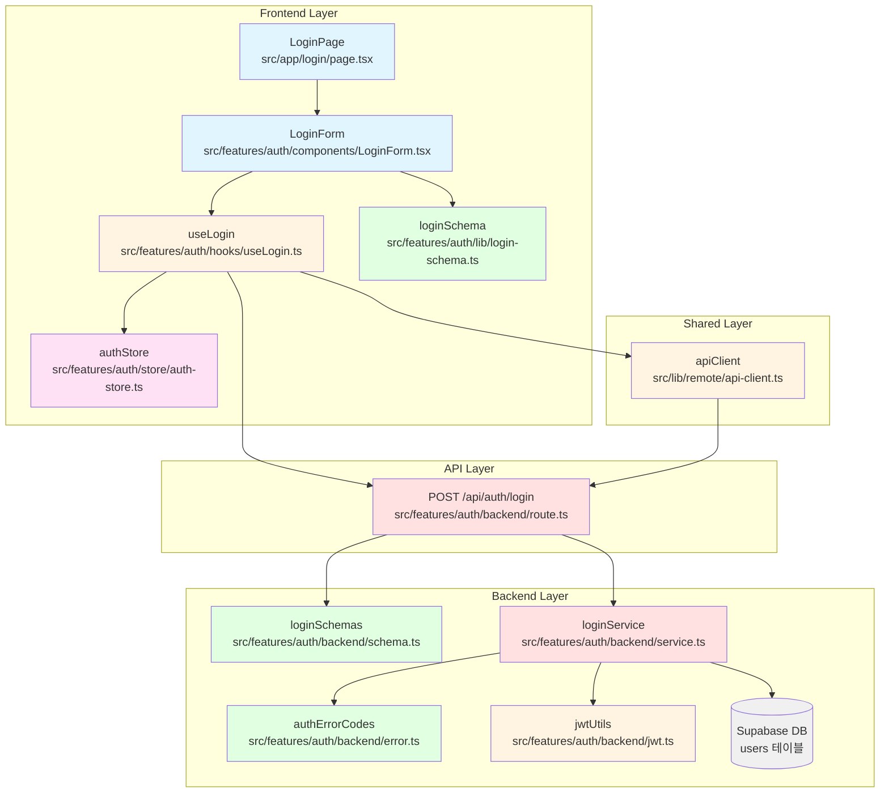

# 유스케이스 002: 사용자 로그인 - 구현 계획

**문서 버전:** 1.0
**작성일:** 2025-10-17
**관련 문서:**
- 유스케이스: `docs/usecases/002/spec.md`
- 유저플로우: `docs/userflow.md` (유저플로우 2)
- 데이터베이스: `docs/database.md` (users 테이블)

---

## 1. 개요

사용자 로그인 기능을 커스텀 구현합니다. 이메일과 비밀번호를 통한 인증을 수행하고, 성공 시 JWT 토큰을 발급하여 세션을 관리합니다. 기존 `auth` feature의 회원가입 구현과 동일한 패턴을 따라 일관성을 유지합니다.

### 1.1 주요 모듈 목록

| 모듈명 | 위치 | 설명 |
|--------|------|------|
| **LoginPage** | `src/app/login/page.tsx` | 로그인 페이지 컴포넌트 |
| **LoginForm** | `src/features/auth/components/LoginForm.tsx` | 로그인 폼 컴포넌트 |
| **loginSchema** | `src/features/auth/lib/login-schema.ts` | 클라이언트 측 폼 스키마 |
| **useLogin** | `src/features/auth/hooks/useLogin.ts` | 로그인 API 호출 훅 |
| **authStore** | `src/features/auth/store/auth-store.ts` | 인증 상태 관리 스토어 (Zustand) |
| **LoginRoute** | `src/features/auth/backend/route.ts` | Hono 라우터 (POST /api/auth/login) - 확장 |
| **loginService** | `src/features/auth/backend/service.ts` | 로그인 비즈니스 로직 - 확장 |
| **loginSchemas** | `src/features/auth/backend/schema.ts` | 서버 측 요청/응답 스키마 - 확장 |
| **authErrorCodes** | `src/features/auth/backend/error.ts` | 로그인 관련 에러 코드 - 확장 |
| **jwtUtils** | `src/features/auth/backend/jwt.ts` | JWT 토큰 생성/검증 유틸리티 (신규) |

---

## 2. 아키텍처 다이어그램



---

## 3. 구현 계획

### 3.1 프론트엔드 레이어

#### 3.1.1 페이지 컴포넌트 (`src/app/login/page.tsx`)

**목적:** 로그인 페이지의 최상위 컴포넌트

**구현 내용:**
```typescript
"use client";

import { LoginForm } from "@/features/auth/components/LoginForm";

export default function LoginPage() {
  return (
    <div className="mx-auto flex min-h-screen w-full max-w-4xl flex-col items-center justify-center gap-10 px-6 py-16">
      <header className="flex flex-col items-center gap-3 text-center">
        <h1 className="text-3xl font-semibold">로그인</h1>
        <p className="text-slate-500">
          이메일과 비밀번호를 입력하여 로그인하세요.
        </p>
      </header>
      <div className="grid w-full gap-8 md:grid-cols-2">
        <LoginForm />
        <figure className="overflow-hidden rounded-xl border border-slate-200">
          
        </figure>
      </div>
    </div>
  );
}
```

**QA 시트:**
- [ ] 페이지가 화면 중앙에 정렬되는가?
- [ ] 반응형 디자인이 모바일/태블릿/데스크톱에서 정상 동작하는가?
- [ ] 이미 로그인한 사용자가 접근 시 홈(`/`)으로 리디렉션되는가?

---

#### 3.1.2 로그인 폼 컴포넌트 (`src/features/auth/components/LoginForm.tsx`)

**목적:** 로그인 폼 UI 및 유효성 검증 처리

**구현 내용:**
- react-hook-form + zod 사용
- 입력 필드:
  - 이메일 (필수, 이메일 형식)
  - 비밀번호 (필수, 8자 이상) + "보기/숨기기" 토글 아이콘
- 버튼: 로그인
- 링크:
  - 회원가입 페이지로 이동 (`/signup`)
  - 비밀번호 찾기 페이지로 이동 (`/forgot-password`) - 추후 구현 예정
- shadcn-ui 컴포넌트 사용 (Input, Label, Button, Form, toast)
- 에러 메시지는 필드 하단 또는 폼 상단에 빨간색으로 표시
- 로딩 상태: 버튼 비활성화 + 스피너 표시
- 성공 시: "로그인 성공!" 토스트 메시지 + 홈 페이지(`/`)로 리디렉션
- 로그인 성공 시 authStore에 사용자 정보와 토큰 저장

**주요 기능:**
1. **비밀번호 가시성 토글**: Eye/EyeOff 아이콘으로 비밀번호 표시/숨기기
2. **자동 리디렉션**: 로그인 성공 시 홈 페이지(`/`)로 자동 이동
3. **에러 처리**: 401 Unauthorized → "이메일 또는 비밀번호가 일치하지 않습니다"

**QA 시트:**
- [ ] 모든 필드가 필수로 표시되고 검증되는가?
- [ ] 이메일 형식이 올바르지 않으면 "올바른 이메일 형식을 입력해주세요" 표시되는가?
- [ ] 비밀번호가 8자 미만이면 "비밀번호는 8자 이상이어야 합니다" 표시되는가?
- [ ] 비밀번호 "보기/숨기기" 토글이 정상 동작하는가?
- [ ] 제출 중에는 버튼이 비활성화되고 "로그인 중..." 텍스트가 표시되는가?
- [ ] 인증 실패 시 "이메일 또는 비밀번호가 일치하지 않습니다" 메시지가 표시되는가?
- [ ] 서버 오류 시 "일시적인 오류가 발생했습니다" 메시지가 표시되는가?
- [ ] 네트워크 오류 시 "네트워크 연결을 확인해주세요" 메시지가 표시되는가?
- [ ] 로그인 성공 시 "로그인 성공!" 토스트가 표시되고 `/`로 이동하는가?
- [ ] "계정이 없으신가요? 회원가입" 링크가 표시되고 클릭 시 `/signup`으로 이동하는가?
- [ ] "비밀번호를 잊으셨나요?" 링크가 표시되는가?
- [ ] 키보드로 모든 필드에 접근 가능한가? (Tab 순서)
- [ ] Enter 키로 폼 제출이 가능한가?
- [ ] 포커스 시 입력 필드의 테두리 색상이 변경되는가?
- [ ] 오류가 있는 필드는 빨간색 테두리로 강조되는가?

---

#### 3.1.3 폼 스키마 (`src/features/auth/lib/login-schema.ts`)

**목적:** 클라이언트 측 폼 유효성 검증 스키마

**구현 내용:**
```typescript
import { z } from "zod";

export const loginFormSchema = z.object({
  email: z
    .string()
    .min(1, { message: "이메일을 입력해주세요" })
    .email({ message: "올바른 이메일 형식을 입력해주세요" }),
  password: z
    .string()
    .min(8, { message: "비밀번호는 8자 이상이어야 합니다" }),
});

export type LoginFormData = z.infer<typeof loginFormSchema>;
```

**테스트 케이스:**
- [ ] 이메일이 빈 문자열이면 검증 실패
- [ ] 이메일이 잘못된 형식이면 검증 실패 (`test@`, `test.com`, `@test.com`)
- [ ] 비밀번호가 8자 미만이면 검증 실패
- [ ] 모든 필드가 올바르면 검증 성공

---

#### 3.1.4 로그인 훅 (`src/features/auth/hooks/useLogin.ts`)

**목적:** 로그인 API 호출 및 React Query 통합

**구현 내용:**
```typescript
import { useMutation } from "@tanstack/react-query";
import { useRouter } from "next/navigation";
import { apiClient } from "@/lib/remote/api-client";
import { useAuthStore } from "@/features/auth/store/auth-store";
import type { LoginFormData } from "@/features/auth/lib/login-schema";

type LoginRequest = {
  email: string;
  password: string;
};

type LoginResponse = {
  user: {
    id: string;
    email: string;
    nickname: string;
    createdAt: string;
  };
  token: string;
};

type LoginError = {
  error: {
    code: string;
    message: string;
    details?: unknown;
  };
};

export const useLogin = () => {
  const router = useRouter();
  const { setAuth } = useAuthStore();

  return useMutation<LoginResponse, LoginError, LoginRequest>({
    mutationFn: async (data) => {
      const response = await apiClient.post<{ data: LoginResponse }>(
        "/api/auth/login",
        data
      );
      return response.data.data;
    },
    onSuccess: (data) => {
      // 1. 인증 상태 저장
      setAuth(data.user, data.token);

      // 2. 홈 페이지로 리디렉션
      router.push("/");
    },
  });
};
```

**테스트 케이스:**
- [ ] API 호출이 올바른 엔드포인트로 전송되는가?
- [ ] 성공 시 응답 데이터가 반환되는가?
- [ ] 성공 시 authStore에 사용자 정보와 토큰이 저장되는가?
- [ ] 성공 시 홈 페이지로 리디렉션되는가?
- [ ] 실패 시 에러가 올바르게 처리되는가?
- [ ] isLoading, isError, isSuccess 상태가 정확한가?

---

#### 3.1.5 인증 상태 스토어 (`src/features/auth/store/auth-store.ts`)

**목적:** Zustand를 사용한 전역 인증 상태 관리

**구현 내용:**
```typescript
import { create } from "zustand";
import { persist, createJSONStorage } from "zustand/middleware";

type User = {
  id: string;
  email: string;
  nickname: string;
  createdAt: string;
};

type AuthState = {
  user: User | null;
  token: string | null;
  isAuthenticated: boolean;
  setAuth: (user: User, token: string) => void;
  clearAuth: () => void;
};

export const useAuthStore = create<AuthState>()(
  persist(
    (set) => ({
      user: null,
      token: null,
      isAuthenticated: false,
      setAuth: (user, token) => {
        set({ user, token, isAuthenticated: true });
        // 쿠키에도 토큰 저장 (선택적)
        document.cookie = `auth_token=${token}; path=/; max-age=${60 * 60 * 24 * 7}; SameSite=Lax`;
      },
      clearAuth: () => {
        set({ user: null, token: null, isAuthenticated: false });
        // 쿠키 삭제
        document.cookie = "auth_token=; path=/; max-age=0";
      },
    }),
    {
      name: "auth-storage",
      storage: createJSONStorage(() => localStorage),
    }
  )
);
```

**테스트 케이스:**
- [ ] setAuth 호출 시 user, token, isAuthenticated가 올바르게 설정되는가?
- [ ] setAuth 호출 시 쿠키에 토큰이 저장되는가?
- [ ] clearAuth 호출 시 모든 상태가 초기화되는가?
- [ ] clearAuth 호출 시 쿠키가 삭제되는가?
- [ ] localStorage에 상태가 영속화되는가?
- [ ] 페이지 새로고침 후에도 인증 상태가 유지되는가?

---

### 3.2 백엔드 레이어

#### 3.2.1 JWT 유틸리티 (`src/features/auth/backend/jwt.ts`)

**목적:** JWT 토큰 생성 및 검증

**구현 내용:**
```typescript
import { SignJWT, jwtVerify } from "jose";

const JWT_SECRET = process.env.JWT_SECRET || "your-secret-key-change-in-production";
const JWT_EXPIRES_IN = "7d"; // 7일

type JWTPayload = {
  userId: string;
  email: string;
  nickname: string;
};

export const generateToken = async (payload: JWTPayload): Promise<string> => {
  const secret = new TextEncoder().encode(JWT_SECRET);

  const token = await new SignJWT({ ...payload })
    .setProtectedHeader({ alg: "HS256" })
    .setIssuedAt()
    .setExpirationTime(JWT_EXPIRES_IN)
    .sign(secret);

  return token;
};

export const verifyToken = async (token: string): Promise<JWTPayload | null> => {
  try {
    const secret = new TextEncoder().encode(JWT_SECRET);
    const { payload } = await jwtVerify(token, secret);

    return payload as unknown as JWTPayload;
  } catch {
    return null;
  }
};
```

**환경 변수:**
- `JWT_SECRET`: JWT 서명에 사용할 비밀 키 (필수, 프로덕션에서는 안전한 값으로 설정)

**테스트 케이스:**
- [ ] generateToken이 유효한 JWT를 생성하는가?
- [ ] verifyToken이 유효한 토큰을 검증하는가?
- [ ] verifyToken이 만료된 토큰을 거부하는가?
- [ ] verifyToken이 잘못된 서명을 가진 토큰을 거부하는가?

**주의사항:**
- jose 라이브러리 설치 필요: `npm install jose`

---

#### 3.2.2 요청/응답 스키마 확장 (`src/features/auth/backend/schema.ts`)

**목적:** 로그인 요청/응답 스키마 추가

**추가 내용:**
```typescript
// 기존 SignupRequestSchema, SignupResponse 유지

// 로그인 스키마 추가
export const LoginRequestSchema = z.object({
  email: z
    .string()
    .min(1, { message: "이메일은 필수입니다" })
    .email({ message: "올바른 이메일 형식이 아닙니다" }),
  password: z
    .string()
    .min(8, { message: "비밀번호는 8자 이상이어야 합니다" }),
});

export type LoginRequest = z.infer<typeof LoginRequestSchema>;

export const LoginResponseSchema = z.object({
  user: z.object({
    id: z.string(),
    email: z.string(),
    nickname: z.string(),
    createdAt: z.string(),
  }),
  token: z.string(),
});

export type LoginResponse = z.infer<typeof LoginResponseSchema>;

// 로그인 서비스 에러 타입
export type LoginServiceError =
  | "AUTH_FAILED"
  | "LOGIN_FETCH_ERROR"
  | "PASSWORD_COMPARE_ERROR"
  | "TOKEN_GENERATION_ERROR";

// SignupServiceError는 기존 유지
export type SignupServiceError =
  | "NICKNAME_DUPLICATE"
  | "EMAIL_DUPLICATE"
  | "SIGNUP_FETCH_ERROR"
  | "PASSWORD_HASH_ERROR";
```

**테스트 케이스:**
- [ ] 모든 필수 필드 검증
- [ ] 이메일 형식 검증
- [ ] 비밀번호 길이 검증

---

#### 3.2.3 에러 코드 확장 (`src/features/auth/backend/error.ts`)

**목적:** 로그인 관련 에러 코드 추가

**수정 내용:**
```typescript
export const authErrorCodes = {
  // 회원가입 관련 (기존)
  nicknameDuplicate: "NICKNAME_DUPLICATE",
  emailDuplicate: "EMAIL_DUPLICATE",
  signupFetchError: "SIGNUP_FETCH_ERROR",
  passwordHashError: "PASSWORD_HASH_ERROR",

  // 로그인 관련 (추가)
  authFailed: "AUTH_FAILED",
  loginFetchError: "LOGIN_FETCH_ERROR",
  passwordCompareError: "PASSWORD_COMPARE_ERROR",
  tokenGenerationError: "TOKEN_GENERATION_ERROR",
} as const;

type AuthErrorValue = (typeof authErrorCodes)[keyof typeof authErrorCodes];

export type AuthServiceError = AuthErrorValue;
```

---

#### 3.2.4 로그인 서비스 (`src/features/auth/backend/service.ts`)

**목적:** 로그인 비즈니스 로직 추가

**추가 내용:**
```typescript
import { compare } from "bcryptjs";
import type { SupabaseClient } from "@supabase/supabase-js";
import {
  failure,
  success,
  type HandlerResult,
} from "@/backend/http/response";
import type {
  LoginRequest,
  LoginResponse,
  LoginServiceError,
} from "./schema";
import { authErrorCodes } from "./error";
import { generateToken } from "./jwt";

const USERS_TABLE = "users";

export const loginUser = async (
  client: SupabaseClient,
  data: LoginRequest,
): Promise<
  HandlerResult<LoginResponse, LoginServiceError, unknown>
> => {
  // 1. 이메일로 사용자 조회
  const { data: user, error: fetchError } = await client
    .from(USERS_TABLE)
    .select("id, email, nickname, password_hash, created_at")
    .eq("email", data.email)
    .maybeSingle();

  if (fetchError) {
    return failure(
      500,
      authErrorCodes.loginFetchError as LoginServiceError,
      fetchError.message,
    );
  }

  // 2. 사용자 없음 - 보안상 통합 메시지
  if (!user) {
    return failure(
      401,
      authErrorCodes.authFailed as LoginServiceError,
      "이메일 또는 비밀번호가 일치하지 않습니다",
    );
  }

  // 3. 비밀번호 검증
  let isPasswordValid = false;
  try {
    isPasswordValid = await compare(data.password, user.password_hash);
  } catch {
    return failure(
      500,
      authErrorCodes.passwordCompareError as LoginServiceError,
      "비밀번호 검증 중 오류가 발생했습니다",
    );
  }

  // 4. 비밀번호 불일치 - 보안상 통합 메시지
  if (!isPasswordValid) {
    return failure(
      401,
      authErrorCodes.authFailed as LoginServiceError,
      "이메일 또는 비밀번호가 일치하지 않습니다",
    );
  }

  // 5. JWT 토큰 생성
  let token: string;
  try {
    token = await generateToken({
      userId: user.id,
      email: user.email,
      nickname: user.nickname,
    });
  } catch {
    return failure(
      500,
      authErrorCodes.tokenGenerationError as LoginServiceError,
      "토큰 생성 중 오류가 발생했습니다",
    );
  }

  // 6. 성공 응답
  return success(
    {
      user: {
        id: user.id,
        email: user.email,
        nickname: user.nickname,
        createdAt: user.created_at,
      },
      token,
    },
    200,
  );
};

// 기존 signupUser 함수는 유지
```

**테스트 케이스:**
- [ ] 존재하지 않는 이메일이면 401 에러 반환
- [ ] 비밀번호가 틀리면 401 에러 반환
- [ ] 비밀번호가 안전하게 비교되는가?
- [ ] JWT 토큰이 생성되는가?
- [ ] 성공 시 200 상태 코드와 사용자 정보, 토큰 반환
- [ ] 데이터베이스 오류 시 500 에러 반환
- [ ] 비밀번호 해시 비교 오류 시 500 에러 반환
- [ ] 토큰 생성 오류 시 500 에러 반환

**주의사항:**
- bcryptjs의 compare 함수 사용
- 보안을 위해 이메일 없음과 비밀번호 틀림을 구분하지 않고 통합 메시지 사용

---

#### 3.2.5 Hono 라우터 확장 (`src/features/auth/backend/route.ts`)

**목적:** 로그인 API 엔드포인트 추가

**수정 내용:**
```typescript
import type { Hono } from "hono";
import {
  failure,
  respond,
  type ErrorResult,
} from "@/backend/http/response";
import {
  getLogger,
  getSupabase,
  type AppEnv,
} from "@/backend/hono/context";
import {
  SignupRequestSchema,
  type SignupServiceError,
  LoginRequestSchema,
  type LoginServiceError,
} from "./schema";
import { signupUser, loginUser } from "./service";
import { authErrorCodes } from "./error";

export const registerAuthRoutes = (app: Hono<AppEnv>) => {
  // 회원가입 엔드포인트 (기존 유지)
  app.post("/auth/signup", async (c) => {
    const body = await c.req.json();
    const parsedBody = SignupRequestSchema.safeParse(body);

    if (!parsedBody.success) {
      return respond(
        c,
        failure(
          400,
          "INVALID_SIGNUP_DATA",
          "입력 데이터가 올바르지 않습니다.",
          parsedBody.error.format(),
        ),
      );
    }

    const supabase = getSupabase(c);
    const logger = getLogger(c);

    const result = await signupUser(supabase, parsedBody.data);

    if (!result.ok) {
      const errorResult = result as ErrorResult<SignupServiceError, unknown>;

      if (
        errorResult.error.code === authErrorCodes.signupFetchError ||
        errorResult.error.code === authErrorCodes.passwordHashError
      ) {
        logger.error("Signup failed", errorResult.error.message);
      }

      return respond(c, result);
    }

    return respond(c, result);
  });

  // 로그인 엔드포인트 (추가)
  app.post("/auth/login", async (c) => {
    const body = await c.req.json();
    const parsedBody = LoginRequestSchema.safeParse(body);

    if (!parsedBody.success) {
      return respond(
        c,
        failure(
          400,
          "INVALID_LOGIN_DATA",
          "입력 데이터가 올바르지 않습니다.",
          parsedBody.error.format(),
        ),
      );
    }

    const supabase = getSupabase(c);
    const logger = getLogger(c);

    const result = await loginUser(supabase, parsedBody.data);

    if (!result.ok) {
      const errorResult = result as ErrorResult<LoginServiceError, unknown>;

      // 인증 실패는 일반 정보 로그, 서버 오류는 에러 로그
      if (errorResult.error.code === authErrorCodes.authFailed) {
        logger.info("Login failed - invalid credentials", {
          email: parsedBody.data.email,
        });
      } else if (
        errorResult.error.code === authErrorCodes.loginFetchError ||
        errorResult.error.code === authErrorCodes.passwordCompareError ||
        errorResult.error.code === authErrorCodes.tokenGenerationError
      ) {
        logger.error("Login failed", errorResult.error.message);
      }

      return respond(c, result);
    }

    logger.info("Login successful", {
      userId: result.data.user.id,
      email: result.data.user.email,
    });

    return respond(c, result);
  });
};
```

**테스트 케이스:**
- [ ] 유효하지 않은 요청 본문이면 400 에러 반환
- [ ] 서비스 성공 시 200 상태 코드 반환
- [ ] 서비스 실패 시 적절한 에러 코드 반환 (401, 500)
- [ ] 인증 실패는 정보 로그, 서버 오류는 에러 로그로 기록되는가?
- [ ] 로그인 성공 시 성공 로그가 기록되는가?

---

### 3.3 shadcn-ui 컴포넌트 설치

로그인 폼 구현을 위해 다음 shadcn-ui 컴포넌트를 설치해야 합니다 (일부는 signup에서 이미 설치됨):

```bash
npx shadcn@latest add input
npx shadcn@latest add button
npx shadcn@latest add label
npx shadcn@latest add form
npx shadcn@latest add toast
```

---

### 3.4 npm 패키지 설치

JWT 토큰 생성을 위해 jose를 설치해야 합니다 (bcryptjs는 이미 설치됨):

```bash
npm install jose
npm install zustand
```

---

### 3.5 환경 변수 설정

`.env.local` 파일에 다음 환경 변수를 추가합니다:

```env
JWT_SECRET=your-super-secret-key-change-in-production-min-32-characters
```

**보안 주의사항:**
- JWT_SECRET은 최소 32자 이상의 무작위 문자열로 설정
- 프로덕션 환경에서는 절대 노출되지 않도록 관리
- `.env.local`은 `.gitignore`에 포함되어야 함

---

## 4. 구현 순서

### Phase 1: 백엔드 구현
1. **JWT 유틸리티** (`src/features/auth/backend/jwt.ts`)
2. **에러 코드 확장** (`src/features/auth/backend/error.ts`)
3. **요청/응답 스키마 확장** (`src/features/auth/backend/schema.ts`)
4. **로그인 서비스 추가** (`src/features/auth/backend/service.ts`)
5. **Hono 라우터 확장** (`src/features/auth/backend/route.ts`)

### Phase 2: 프론트엔드 구현
6. **인증 상태 스토어** (`src/features/auth/store/auth-store.ts`)
7. **폼 스키마** (`src/features/auth/lib/login-schema.ts`)
8. **로그인 훅** (`src/features/auth/hooks/useLogin.ts`)
9. **로그인 폼 컴포넌트** (`src/features/auth/components/LoginForm.tsx`)
10. **페이지 컴포넌트** (`src/app/login/page.tsx`)

### Phase 3: 테스트 및 검증
11. **각 Edge Case 시나리오 테스트**
12. **UI/UX 요구사항 검증**
13. **보안 요구사항 검증**

---

## 5. Edge Cases 처리 매핑

| Edge Case | 처리 위치 | 구현 방법 |
|-----------|-----------|-----------|
| EC-001: 필수 입력 필드 누락 | 클라이언트 (zod) | react-hook-form 에러 표시 |
| EC-002: 이메일 형식 오류 | 클라이언트 (zod) | react-hook-form 에러 표시 |
| EC-003: 존재하지 않는 이메일 | 서버 (service) | 401 응답, "이메일 또는 비밀번호가 일치하지 않습니다" |
| EC-004: 비밀번호 불일치 | 서버 (service) | 401 응답, "이메일 또는 비밀번호가 일치하지 않습니다" |
| EC-005: 서버 오류 | 서버 (service) | 500 응답, "일시적인 오류가 발생했습니다" |
| EC-006: 네트워크 오류 | 클라이언트 (hook) | React Query 에러 처리, "네트워크 연결을 확인해주세요" |
| EC-007: 이미 로그인된 사용자 | 클라이언트 (page) | authStore 확인 후 홈으로 리디렉션 |

---

## 6. 보안 고려사항

1. **비밀번호 비교**: bcryptjs의 compare 함수 사용
2. **통합 에러 메시지**: 이메일 없음 vs 비밀번호 틀림 구분하지 않음
3. **JWT 서명**: HS256 알고리즘 사용
4. **JWT 만료**: 7일 후 자동 만료
5. **쿠키 보안**: SameSite=Lax, HttpOnly 설정 (선택적)
6. **입력 검증**: 클라이언트 + 서버 이중 검증
7. **SQL Injection 방지**: Supabase 클라이언트가 자동 처리
8. **XSS 방지**: React의 자동 이스케이핑
9. **환경 변수 보호**: JWT_SECRET을 환경 변수로 관리

---

## 7. 성능 최적화

1. **인덱스 활용**: `users.email` 인덱스 (이미 생성됨)
2. **사용자 조회**: `maybeSingle()` 사용으로 불필요한 데이터 조회 방지
3. **비밀번호 비교**: bcryptjs의 최적화된 compare 사용
4. **JWT 생성**: jose 라이브러리의 효율적인 서명
5. **React Query**: 자동 에러 재시도 및 캐싱
6. **Zustand**: 경량 상태 관리로 성능 최적화

---

## 8. 테스트 체크리스트

### 정상 플로우
- [ ] 올바른 이메일과 비밀번호로 로그인 성공
- [ ] 로그인 성공 시 JWT 토큰 생성됨
- [ ] 로그인 성공 시 authStore에 사용자 정보 저장됨
- [ ] 로그인 성공 시 쿠키에 토큰 저장됨
- [ ] 로그인 성공 시 홈 페이지로 리디렉션됨
- [ ] 성공 토스트 메시지 표시됨

### Edge Cases
- [ ] EC-001: 이메일 필드 누락 시 에러 메시지 표시
- [ ] EC-001: 비밀번호 필드 누락 시 에러 메시지 표시
- [ ] EC-002: 잘못된 이메일 형식 시 에러 메시지 표시
- [ ] EC-003: 존재하지 않는 이메일 시 "이메일 또는 비밀번호가 일치하지 않습니다" 표시
- [ ] EC-004: 비밀번호 불일치 시 "이메일 또는 비밀번호가 일치하지 않습니다" 표시
- [ ] EC-005: 서버 오류 시 500 에러 + "일시적인 오류가 발생했습니다" 표시
- [ ] EC-006: 네트워크 오류 시 "네트워크 연결을 확인해주세요" 표시
- [ ] EC-007: 이미 로그인된 사용자가 /login 접근 시 홈으로 리디렉션

### UI/UX
- [ ] 폼이 화면 중앙에 정렬됨
- [ ] 모든 필드가 명확한 레이블을 가짐
- [ ] 비밀번호 필드에 "보기/숨기기" 토글 아이콘 표시
- [ ] 비밀번호 토글이 정상 동작함
- [ ] 오류 필드는 빨간색 테두리로 강조
- [ ] 오류 메시지는 필드 하단 또는 폼 상단에 빨간색 표시
- [ ] 로딩 중 버튼 비활성화 + 스피너 표시
- [ ] 성공 시 토스트 메시지 표시
- [ ] "계정이 없으신가요? 회원가입" 링크 표시
- [ ] "비밀번호를 잊으셨나요?" 링크 표시
- [ ] 키보드 네비게이션 가능 (Tab, Enter)
- [ ] 반응형 디자인 동작 (모바일/태블릿/데스크톱)

### 보안
- [ ] 비밀번호가 평문으로 노출되지 않음
- [ ] 인증 실패 시 구체적인 실패 사유가 노출되지 않음
- [ ] JWT 토큰이 안전하게 서명됨
- [ ] JWT 토큰이 7일 후 만료됨
- [ ] 쿠키가 SameSite 속성으로 설정됨
- [ ] 환경 변수가 안전하게 관리됨

---

## 9. API 응답 형식

### POST /api/auth/login

#### 요청
```json
{
  "email": "user@example.com",
  "password": "password123"
}
```

#### 성공 응답 (200 OK)
```json
{
  "ok": true,
  "data": {
    "user": {
      "id": "uuid",
      "email": "user@example.com",
      "nickname": "사용자닉네임",
      "createdAt": "2025-10-17T00:00:00Z"
    },
    "token": "jwt.token.here"
  },
  "status": 200
}
```

#### 에러 응답 (401 Unauthorized)
```json
{
  "ok": false,
  "error": {
    "code": "AUTH_FAILED",
    "message": "이메일 또는 비밀번호가 일치하지 않습니다"
  },
  "status": 401
}
```

#### 에러 응답 (400 Bad Request)
```json
{
  "ok": false,
  "error": {
    "code": "INVALID_LOGIN_DATA",
    "message": "입력 데이터가 올바르지 않습니다.",
    "details": {
      "_errors": [],
      "email": {
        "_errors": ["올바른 이메일 형식이 아닙니다"]
      }
    }
  },
  "status": 400
}
```

#### 에러 응답 (500 Internal Server Error)
```json
{
  "ok": false,
  "error": {
    "code": "LOGIN_FETCH_ERROR",
    "message": "데이터베이스 조회 중 오류가 발생했습니다"
  },
  "status": 500
}
```

---

## 10. 향후 개선 사항

1. **토큰 갱신**: Refresh Token 도입으로 장기 세션 관리
2. **소셜 로그인**: Google, GitHub 등 OAuth 연동
3. **2단계 인증**: OTP를 통한 보안 강화
4. **로그인 기록**: 사용자의 로그인 이력 추적
5. **디바이스 관리**: 로그인된 디바이스 목록 관리 및 원격 로그아웃
6. **비밀번호 찾기**: 이메일을 통한 비밀번호 재설정
7. **계정 잠금**: 연속 로그인 실패 시 계정 일시 잠금
8. **Rate Limiting**: 무차별 대입 공격 방지

---

## 11. 의존성 및 충돌 확인

### 기존 코드베이스와의 호환성
- ✅ `src/features/auth` 디렉토리 존재 (회원가입 구현 완료)
- ✅ `src/features/auth/backend/error.ts` 존재 (확장 필요)
- ✅ `src/features/auth/backend/schema.ts` 존재 (확장 필요)
- ✅ `src/features/auth/backend/service.ts` 존재 (확장 필요)
- ✅ `src/features/auth/backend/route.ts` 존재 (확장 필요)
- ✅ `src/backend/hono/app.ts`에 라우터 등록 패턴 확립됨
- ✅ `src/backend/http/response.ts` 공통 응답 헬퍼 존재

### 신규 생성 파일
- `src/app/login/page.tsx` (신규)
- `src/features/auth/components/LoginForm.tsx` (신규)
- `src/features/auth/lib/login-schema.ts` (신규)
- `src/features/auth/hooks/useLogin.ts` (신규)
- `src/features/auth/backend/jwt.ts` (신규)
- `src/features/auth/store/auth-store.ts` (신규)

### 확장 파일
- `src/features/auth/backend/error.ts` (로그인 에러 코드 추가)
- `src/features/auth/backend/schema.ts` (로그인 스키마 추가)
- `src/features/auth/backend/service.ts` (로그인 서비스 추가)
- `src/features/auth/backend/route.ts` (로그인 라우터 추가)

### 공유 모듈
- `src/features/auth/backend/error.ts` - signup과 login이 공유
- `src/features/auth/backend/schema.ts` - signup과 login이 공유
- `src/features/auth/backend/service.ts` - signup과 login이 공유
- `src/features/auth/backend/route.ts` - signup과 login이 공유

---

## 12. 참고사항

- 기존 `auth` feature의 회원가입 구현과 동일한 패턴을 따라 일관성을 유지합니다.
- Hono 백엔드 패턴(`registerAuthRoutes`)을 확장하여 로그인 엔드포인트를 추가합니다.
- 모든 에러 처리는 `success`/`failure`/`respond` 패턴을 따릅니다.
- 클라이언트 측 HTTP 요청은 `@/lib/remote/api-client`를 통해 수행합니다.
- JWT 토큰 생성은 jose 라이브러리를 사용하여 안전하게 처리합니다.
- 인증 상태는 Zustand를 사용하여 전역적으로 관리하며, localStorage에 영속화합니다.
- 보안을 위해 이메일 없음과 비밀번호 틀림을 구분하지 않고 통합 메시지를 사용합니다.
