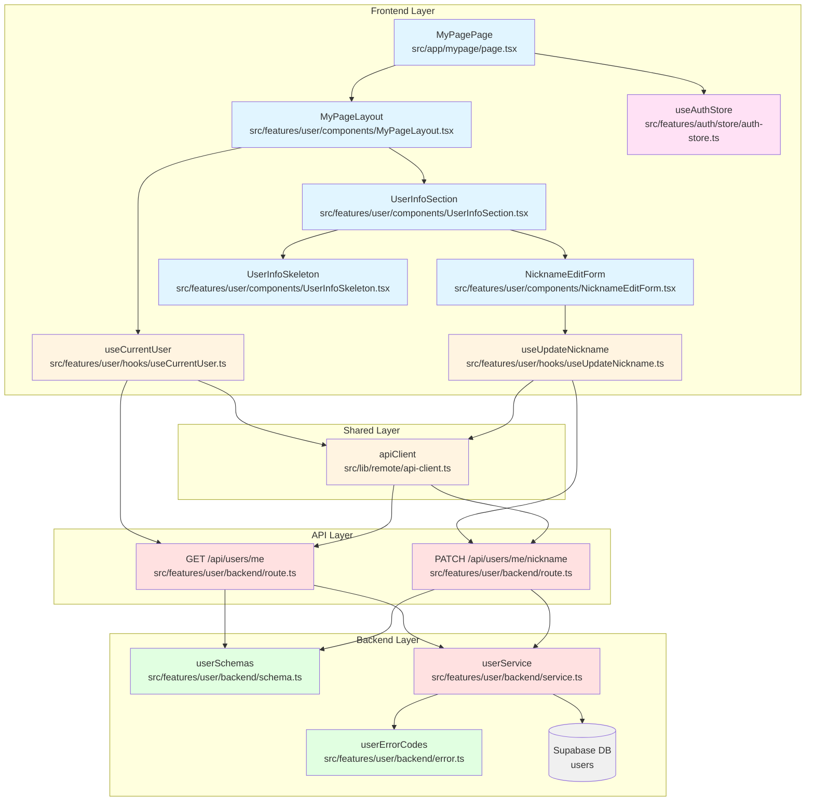

# 마이페이지 구현 계획

**문서 버전:** 1.0
**작성일:** 2025-10-18
**관련 문서:**
- 유스케이스: `docs/usecases/007/spec.md` (마이페이지 정보 확인 및 닉네임 수정)
- 유저플로우: `docs/userflow.md` (유저플로우 7)
- 데이터베이스: `docs/database.md` (users 테이블)
- 참고 구현: `docs/pages/home/plan.md` (홈 페이지 구현 계획)

---

## 1. 개요

마이페이지는 로그인한 사용자가 자신의 계정 정보를 확인하고 닉네임을 수정할 수 있는 페이지입니다. 사용자는 이메일, 닉네임, 가입일을 확인할 수 있으며, 닉네임만 수정 가능합니다.

### 1.1 주요 기능

1. **인증 체크**: 미인증 사용자는 로그인 페이지로 자동 리디렉션
2. **사용자 정보 조회**: 현재 로그인한 사용자의 정보 표시
   - 이메일 (읽기 전용)
   - 닉네임 (수정 가능)
   - 가입일 (읽기 전용, "YYYY년 MM월 DD일" 형식)
3. **닉네임 수정**:
   - 수정 모드 활성화/비활성화
   - 클라이언트 측 유효성 검증 (빈 값, 길이, 현재 닉네임과 동일 여부)
   - 서버 측 유효성 검증 (중복, trim, XSS 방지)
4. **실시간 피드백**: 성공/실패 메시지 표시
5. **전역 동기화**: 닉네임 변경 시 모든 화면에 즉시 반영 (authStore 업데이트)

### 1.2 주요 모듈 목록

| 모듈명 | 위치 | 설명 |
|--------|------|------|
| **MyPagePage** | `src/app/(authenticated)/mypage/page.tsx` | 마이페이지 최상위 컴포넌트 |
| **MyPageLayout** | `src/features/user/components/MyPageLayout.tsx` | 마이페이지 레이아웃 (헤더 + 정보 섹션) |
| **UserInfoSection** | `src/features/user/components/UserInfoSection.tsx` | 사용자 정보 표시 영역 |
| **NicknameEditForm** | `src/features/user/components/NicknameEditForm.tsx` | 닉네임 수정 폼 |
| **UserInfoSkeleton** | `src/features/user/components/UserInfoSkeleton.tsx` | 로딩 스켈레톤 |
| **useCurrentUser** | `src/features/user/hooks/useCurrentUser.ts` | 사용자 정보 조회 훅 |
| **useUpdateNickname** | `src/features/user/hooks/useUpdateNickname.ts` | 닉네임 업데이트 훅 |
| **UserRoute** | `src/features/user/backend/route.ts` | Hono 라우터 |
| **userService** | `src/features/user/backend/service.ts` | 사용자 정보 조회 및 업데이트 로직 |
| **userSchemas** | `src/features/user/backend/schema.ts` | 요청/응답 스키마 |
| **userErrorCodes** | `src/features/user/backend/error.ts` | 에러 코드 정의 |

---

## 2. 아키텍처 다이어그램



---

## 3. 구현 계획

### 3.1 프론트엔드 레이어

#### 3.1.1 페이지 컴포넌트 (`src/app/(authenticated)/mypage/page.tsx`)

**목적:** 마이페이지 최상위 컴포넌트, 인증 체크 및 리디렉션

**구현 내용:**
```typescript
"use client";

import { useEffect } from "react";
import { useRouter } from "next/navigation";
import { useAuthStore } from "@/features/auth/store/auth-store";
import { MyPageLayout } from "@/features/user/components/MyPageLayout";

export default function MyPagePage() {
  const router = useRouter();
  const { isAuthenticated } = useAuthStore();

  // 인증 체크 - 미인증 시 로그인 페이지로 리디렉션
  useEffect(() => {
    if (!isAuthenticated) {
      router.replace("/login");
    }
  }, [isAuthenticated, router]);

  // 인증되지 않은 경우 로딩 표시 (깜빡임 방지)
  if (!isAuthenticated) {
    return null;
  }

  return <MyPageLayout />;
}
```

**QA 시트:**
- [ ] 미인증 사용자가 접근 시 `/login`으로 리디렉션되는가?
- [ ] 인증된 사용자는 MyPageLayout이 정상 렌더링되는가?
- [ ] 리디렉션 중 깜빡임이 없는가?

---

#### 3.1.2 마이페이지 레이아웃 (`src/features/user/components/MyPageLayout.tsx`)

**목적:** 마이페이지 전체 레이아웃 (헤더 + 사용자 정보)

**구현 내용:**
```typescript
"use client";

import { useRouter } from "next/navigation";
import { ArrowLeft } from "lucide-react";
import { Button } from "@/components/ui/button";
import { UserInfoSection } from "./UserInfoSection";

export function MyPageLayout() {
  const router = useRouter();

  const handleGoBack = () => {
    router.back();
  };

  return (
    <div className="flex min-h-screen flex-col bg-slate-50">
      {/* 헤더 */}
      <header className="sticky top-0 z-10 border-b bg-white shadow-sm">
        <div className="container mx-auto flex items-center gap-3 px-4 py-3">
          <Button
            variant="ghost"
            size="sm"
            onClick={handleGoBack}
            className="gap-2"
          >
            <ArrowLeft className="h-4 w-4" />
            <span className="hidden sm:inline">뒤로</span>
          </Button>
          <h1 className="text-xl font-bold text-slate-900">마이페이지</h1>
        </div>
      </header>

      {/* 메인 컨텐츠 */}
      <main className="flex-1">
        <div className="container mx-auto max-w-2xl px-4 py-6">
          <UserInfoSection />
        </div>
      </main>
    </div>
  );
}
```

**QA 시트:**
- [ ] 헤더가 화면 상단에 고정되는가?
- [ ] "뒤로" 버튼 클릭 시 이전 페이지로 이동하는가?
- [ ] 반응형 디자인이 모바일/태블릿/데스크톱에서 정상 동작하는가?
- [ ] 최대 너비(max-w-2xl) 제한이 잘 적용되는가?

---

#### 3.1.3 사용자 정보 섹션 (`src/features/user/components/UserInfoSection.tsx`)

**목적:** 사용자 정보 표시 및 닉네임 수정 기능

**구현 내용:**
```typescript
"use client";

import { useState } from "react";
import { format } from "date-fns";
import { ko } from "date-fns/locale";
import { Mail, Calendar } from "lucide-react";
import { Card, CardContent, CardHeader, CardTitle } from "@/components/ui/card";
import { Label } from "@/components/ui/label";
import { Button } from "@/components/ui/button";
import { useCurrentUser } from "@/features/user/hooks/useCurrentUser";
import { UserInfoSkeleton } from "./UserInfoSkeleton";
import { NicknameEditForm } from "./NicknameEditForm";

export function UserInfoSection() {
  const { data: user, isLoading, isError, error } = useCurrentUser();
  const [isEditMode, setIsEditMode] = useState(false);

  // 로딩 상태
  if (isLoading) {
    return <UserInfoSkeleton />;
  }

  // 에러 상태
  if (isError) {
    return (
      <Card className="border-red-200 bg-red-50">
        <CardContent className="pt-6">
          <p className="text-sm text-red-700">
            {error?.message || "사용자 정보를 불러올 수 없습니다."}
          </p>
        </CardContent>
      </Card>
    );
  }

  if (!user) {
    return null;
  }

  // 가입일 포맷팅 (YYYY년 MM월 DD일)
  const formattedDate = format(new Date(user.createdAt), "yyyy년 MM월 dd일", {
    locale: ko,
  });

  return (
    <Card>
      <CardHeader>
        <CardTitle>내 정보</CardTitle>
      </CardHeader>
      <CardContent className="space-y-6">
        {/* 이메일 (읽기 전용) */}
        <div className="space-y-2">
          <Label className="flex items-center gap-2 text-sm font-medium text-slate-700">
            <Mail className="h-4 w-4" />
            이메일
          </Label>
          <div className="rounded-md border bg-slate-50 px-3 py-2 text-sm text-slate-600">
            {user.email}
          </div>
          <p className="text-xs text-slate-500">
            이메일은 변경할 수 없습니다.
          </p>
        </div>

        {/* 닉네임 (수정 가능) */}
        {isEditMode ? (
          <NicknameEditForm
            currentNickname={user.nickname}
            onCancel={() => setIsEditMode(false)}
            onSuccess={() => setIsEditMode(false)}
          />
        ) : (
          <div className="space-y-2">
            <Label className="text-sm font-medium text-slate-700">닉네임</Label>
            <div className="flex items-center gap-2">
              <div className="flex-1 rounded-md border bg-white px-3 py-2 text-sm">
                {user.nickname}
              </div>
              <Button
                variant="outline"
                size="sm"
                onClick={() => setIsEditMode(true)}
              >
                수정
              </Button>
            </div>
          </div>
        )}

        {/* 가입일 (읽기 전용) */}
        <div className="space-y-2">
          <Label className="flex items-center gap-2 text-sm font-medium text-slate-700">
            <Calendar className="h-4 w-4" />
            가입일
          </Label>
          <div className="rounded-md border bg-slate-50 px-3 py-2 text-sm text-slate-600">
            {formattedDate}
          </div>
        </div>
      </CardContent>
    </Card>
  );
}
```

**QA 시트:**
- [ ] 로딩 중 UserInfoSkeleton이 표시되는가?
- [ ] 에러 발생 시 에러 메시지가 표시되는가?
- [ ] 이메일이 읽기 전용으로 표시되는가?
- [ ] 이메일 하단에 "변경할 수 없습니다" 안내가 표시되는가?
- [ ] "수정" 버튼 클릭 시 NicknameEditForm이 표시되는가?
- [ ] 가입일이 "YYYY년 MM월 DD일" 형식으로 표시되는가?
- [ ] 각 필드에 아이콘이 표시되는가?

---

#### 3.1.4 닉네임 수정 폼 (`src/features/user/components/NicknameEditForm.tsx`)

**목적:** 닉네임 수정 입력 필드 및 검증

**구현 내용:**
```typescript
"use client";

import { useForm } from "react-hook-form";
import { zodResolver } from "@hookform/resolvers/zod";
import { z } from "zod";
import { Loader2 } from "lucide-react";
import { Button } from "@/components/ui/button";
import { Input } from "@/components/ui/input";
import { Label } from "@/components/ui/label";
import { useToast } from "@/components/ui/use-toast";
import { useUpdateNickname } from "@/features/user/hooks/useUpdateNickname";
import { useAuthStore } from "@/features/auth/store/auth-store";

// 닉네임 검증 스키마
const nicknameSchema = z.object({
  nickname: z
    .string()
    .min(1, { message: "닉네임을 입력해주세요" })
    .min(2, { message: "닉네임은 2자 이상이어야 합니다" })
    .max(20, { message: "닉네임은 20자 이하여야 합니다" })
    .trim(),
});

type NicknameFormData = z.infer<typeof nicknameSchema>;

type NicknameEditFormProps = {
  currentNickname: string;
  onCancel: () => void;
  onSuccess: () => void;
};

export function NicknameEditForm({
  currentNickname,
  onCancel,
  onSuccess,
}: NicknameEditFormProps) {
  const { toast } = useToast();
  const { updateUser } = useAuthStore();
  const { mutate: updateNickname, isPending } = useUpdateNickname();

  const {
    register,
    handleSubmit,
    formState: { errors },
    setError,
  } = useForm<NicknameFormData>({
    resolver: zodResolver(nicknameSchema),
    defaultValues: {
      nickname: currentNickname,
    },
  });

  const onSubmit = (data: NicknameFormData) => {
    const trimmedNickname = data.nickname.trim();

    // 현재 닉네임과 동일한지 확인
    if (trimmedNickname === currentNickname) {
      setError("nickname", {
        type: "manual",
        message: "현재 닉네임과 동일합니다",
      });
      return;
    }

    updateNickname(
      { nickname: trimmedNickname },
      {
        onSuccess: (response) => {
          // authStore 업데이트 (전역 동기화)
          updateUser({ nickname: response.nickname });

          toast({
            title: "닉네임 변경 완료",
            description: "닉네임이 성공적으로 변경되었습니다.",
          });
          onSuccess();
        },
        onError: (error) => {
          const message = error.message || "닉네임 수정에 실패했습니다.";

          // 중복 에러인 경우 폼 에러로 표시
          if (message.includes("중복") || message.includes("이미 사용")) {
            setError("nickname", {
              type: "manual",
              message: "이미 사용 중인 닉네임입니다",
            });
          } else {
            // 기타 에러는 토스트로 표시
            toast({
              variant: "destructive",
              title: "오류 발생",
              description: message,
            });
          }
        },
      }
    );
  };

  const handleCancel = () => {
    onCancel();
  };

  return (
    <form onSubmit={handleSubmit(onSubmit)} className="space-y-2">
      <Label htmlFor="nickname" className="text-sm font-medium text-slate-700">
        닉네임
      </Label>
      <div className="flex items-start gap-2">
        <div className="flex-1 space-y-1">
          <Input
            id="nickname"
            {...register("nickname")}
            placeholder="새 닉네임 입력"
            disabled={isPending}
            className={errors.nickname ? "border-red-500" : ""}
            autoFocus
          />
          {errors.nickname && (
            <p className="text-xs text-red-600">{errors.nickname.message}</p>
          )}
        </div>
        <div className="flex gap-2">
          <Button type="submit" size="sm" disabled={isPending}>
            {isPending ? (
              <>
                <Loader2 className="mr-2 h-4 w-4 animate-spin" />
                저장 중
              </>
            ) : (
              "저장"
            )}
          </Button>
          <Button
            type="button"
            variant="outline"
            size="sm"
            onClick={handleCancel}
            disabled={isPending}
          >
            취소
          </Button>
        </div>
      </div>
    </form>
  );
}
```

**QA 시트:**
- [ ] 현재 닉네임이 입력 필드에 미리 채워지는가?
- [ ] 포커스가 자동으로 입력 필드로 이동하는가?
- [ ] 빈 값 입력 시 "닉네임을 입력해주세요" 에러가 표시되는가?
- [ ] 2자 미만 입력 시 길이 에러가 표시되는가?
- [ ] 20자 초과 입력 시 길이 에러가 표시되는가?
- [ ] 현재 닉네임과 동일한 값 입력 시 "현재 닉네임과 동일합니다" 에러가 표시되는가?
- [ ] 중복 닉네임 입력 시 "이미 사용 중인 닉네임입니다" 에러가 표시되는가?
- [ ] 저장 중 버튼에 로딩 인디케이터가 표시되는가?
- [ ] 저장 중 입력 필드와 버튼이 비활성화되는가?
- [ ] 성공 시 토스트 메시지가 표시되는가?
- [ ] 성공 시 authStore의 닉네임이 업데이트되는가?
- [ ] "취소" 버튼 클릭 시 수정 모드가 종료되는가?

---

#### 3.1.5 로딩 스켈레톤 (`src/features/user/components/UserInfoSkeleton.tsx`)

**목적:** 사용자 정보 로딩 중 스켈레톤 UI

**구현 내용:**
```typescript
import { Skeleton } from "@/components/ui/skeleton";
import { Card, CardContent, CardHeader } from "@/components/ui/card";

export function UserInfoSkeleton() {
  return (
    <Card>
      <CardHeader>
        <Skeleton className="h-6 w-24" />
      </CardHeader>
      <CardContent className="space-y-6">
        {/* 이메일 */}
        <div className="space-y-2">
          <Skeleton className="h-4 w-16" />
          <Skeleton className="h-10 w-full" />
          <Skeleton className="h-3 w-40" />
        </div>

        {/* 닉네임 */}
        <div className="space-y-2">
          <Skeleton className="h-4 w-16" />
          <div className="flex items-center gap-2">
            <Skeleton className="h-10 flex-1" />
            <Skeleton className="h-10 w-16" />
          </div>
        </div>

        {/* 가입일 */}
        <div className="space-y-2">
          <Skeleton className="h-4 w-16" />
          <Skeleton className="h-10 w-full" />
        </div>
      </CardContent>
    </Card>
  );
}
```

**QA 시트:**
- [ ] 실제 UI와 레이아웃이 유사한가?
- [ ] 애니메이션이 부드럽게 동작하는가?

---

#### 3.1.6 사용자 정보 조회 훅 (`src/features/user/hooks/useCurrentUser.ts`)

**목적:** 현재 로그인한 사용자 정보 조회

**구현 내용:**
```typescript
import { useQuery } from "@tanstack/react-query";
import { apiClient } from "@/lib/remote/api-client";

type User = {
  id: string;
  email: string;
  nickname: string;
  createdAt: string;
};

type UserResponse = {
  data: User;
};

export const useCurrentUser = () => {
  return useQuery<User, Error>({
    queryKey: ["user", "me"],
    queryFn: async () => {
      const response = await apiClient.get<UserResponse>("/api/users/me");
      return response.data.data;
    },
    staleTime: 5 * 60 * 1000, // 5분
    refetchOnWindowFocus: false,
    retry: 1,
  });
};
```

**테스트 케이스:**
- [ ] API 호출이 `/api/users/me`로 전송되는가?
- [ ] 성공 시 사용자 정보가 반환되는가?
- [ ] 실패 시 에러가 올바르게 처리되는가?
- [ ] staleTime이 5분으로 설정되어 있는가?
- [ ] 윈도우 포커스 시 refetch가 비활성화되어 있는가?

---

#### 3.1.7 닉네임 업데이트 훅 (`src/features/user/hooks/useUpdateNickname.ts`)

**목적:** 닉네임 업데이트 API 호출

**구현 내용:**
```typescript
import { useMutation, useQueryClient } from "@tanstack/react-query";
import { apiClient, extractApiErrorMessage } from "@/lib/remote/api-client";

type UpdateNicknameRequest = {
  nickname: string;
};

type UpdateNicknameResponse = {
  data: {
    nickname: string;
  };
};

export const useUpdateNickname = () => {
  const queryClient = useQueryClient();

  return useMutation<
    UpdateNicknameResponse["data"],
    Error,
    UpdateNicknameRequest
  >({
    mutationFn: async (data) => {
      const response = await apiClient.patch<UpdateNicknameResponse>(
        "/api/users/me/nickname",
        data
      );
      return response.data.data;
    },
    onSuccess: () => {
      // 사용자 정보 쿼리 무효화 (자동 refetch)
      queryClient.invalidateQueries({ queryKey: ["user", "me"] });
    },
    onError: (error) => {
      // 에러 메시지 추출
      const message = extractApiErrorMessage(
        error,
        "닉네임 수정에 실패했습니다."
      );
      throw new Error(message);
    },
  });
};
```

**테스트 케이스:**
- [ ] API 호출이 `/api/users/me/nickname`로 전송되는가?
- [ ] PATCH 메서드가 사용되는가?
- [ ] 요청 본문에 `nickname` 필드가 포함되는가?
- [ ] 성공 시 `["user", "me"]` 쿼리가 무효화되는가?
- [ ] 실패 시 에러 메시지가 올바르게 추출되는가?

---

### 3.2 백엔드 레이어

#### 3.2.1 Hono 라우터 (`src/features/user/backend/route.ts`)

**목적:** 사용자 정보 조회 및 닉네임 업데이트 API 엔드포인트

**구현 내용:**
```typescript
import type { Hono } from "hono";
import {
  respond,
  failure,
  type ErrorResult,
} from "@/backend/http/response";
import {
  getLogger,
  getSupabase,
  getCurrentUser as getAuthUser,
  type AppEnv,
} from "@/backend/hono/context";
import { getCurrentUser, updateNickname } from "./service";
import { userErrorCodes } from "./error";
import {
  UpdateNicknameRequestSchema,
  type UserServiceError,
} from "./schema";

export const registerUserRoutes = (app: Hono<AppEnv>) => {
  // 현재 사용자 정보 조회
  app.get("/api/users/me", async (c) => {
    const supabase = getSupabase(c);
    const logger = getLogger(c);
    const authUser = getAuthUser(c);

    // 인증 체크
    if (!authUser) {
      logger.warn("Unauthorized access to /api/users/me");
      return respond(
        c,
        failure(401, "UNAUTHORIZED", "인증이 필요합니다.")
      );
    }

    const result = await getCurrentUser(supabase, authUser.userId);

    if (!result.ok) {
      const errorResult = result as ErrorResult<UserServiceError, unknown>;

      logger.error("Failed to fetch current user", {
        userId: authUser.userId,
        code: errorResult.error.code,
        message: errorResult.error.message,
      });

      return respond(c, result);
    }

    logger.info("Current user fetched successfully", {
      userId: result.data.id,
    });

    return respond(c, result);
  });

  // 닉네임 업데이트
  app.patch("/api/users/me/nickname", async (c) => {
    const body = await c.req.json();
    const parsedBody = UpdateNicknameRequestSchema.safeParse(body);

    if (!parsedBody.success) {
      return respond(
        c,
        failure(
          400,
          "INVALID_NICKNAME_DATA",
          "입력 데이터가 올바르지 않습니다.",
          parsedBody.error.format()
        )
      );
    }

    const supabase = getSupabase(c);
    const logger = getLogger(c);
    const authUser = getAuthUser(c);

    // 인증 체크
    if (!authUser) {
      logger.warn("Unauthorized access to /api/users/me/nickname");
      return respond(
        c,
        failure(401, "UNAUTHORIZED", "인증이 필요합니다.")
      );
    }

    const result = await updateNickname(
      supabase,
      authUser.userId,
      parsedBody.data.nickname
    );

    if (!result.ok) {
      const errorResult = result as ErrorResult<UserServiceError, unknown>;

      logger.error("Failed to update nickname", {
        userId: authUser.userId,
        code: errorResult.error.code,
        message: errorResult.error.message,
      });

      return respond(c, result);
    }

    logger.info("Nickname updated successfully", {
      userId: authUser.userId,
      newNickname: result.data.nickname,
    });

    return respond(c, result);
  });
};
```

**테스트 케이스:**
- [ ] GET `/api/users/me` 요청이 정상 처리되는가?
- [ ] PATCH `/api/users/me/nickname` 요청이 정상 처리되는가?
- [ ] 미인증 사용자 접근 시 401 에러 반환
- [ ] 잘못된 요청 본문 시 400 에러 반환
- [ ] 서비스 성공 시 200 상태 코드 반환
- [ ] 서비스 실패 시 적절한 상태 코드 반환
- [ ] 모든 요청이 로깅되는가?

---

#### 3.2.2 사용자 서비스 (`src/features/user/backend/service.ts`)

**목적:** 사용자 정보 조회 및 닉네임 업데이트 비즈니스 로직

**구현 내용:**
```typescript
import type { SupabaseClient } from "@supabase/supabase-js";
import {
  failure,
  success,
  type HandlerResult,
} from "@/backend/http/response";
import type {
  GetUserResponse,
  UpdateNicknameResponse,
  UserServiceError,
} from "./schema";
import { userErrorCodes } from "./error";

const USERS_TABLE = "users";

/**
 * 현재 사용자 정보 조회
 */
export const getCurrentUser = async (
  client: SupabaseClient,
  userId: string
): Promise<HandlerResult<GetUserResponse, UserServiceError, unknown>> => {
  const { data: user, error } = await client
    .from(USERS_TABLE)
    .select("id, email, nickname, created_at")
    .eq("id", userId)
    .maybeSingle();

  if (error) {
    return failure(
      500,
      userErrorCodes.userFetchError,
      error.message
    );
  }

  if (!user) {
    return failure(
      404,
      userErrorCodes.userNotFound,
      "사용자를 찾을 수 없습니다"
    );
  }

  return success(
    {
      id: user.id,
      email: user.email,
      nickname: user.nickname,
      createdAt: user.created_at,
    },
    200
  );
};

/**
 * 닉네임 업데이트
 */
export const updateNickname = async (
  client: SupabaseClient,
  userId: string,
  newNickname: string
): Promise<HandlerResult<UpdateNicknameResponse, UserServiceError, unknown>> => {
  // 입력 위생 처리
  const trimmedNickname = newNickname.trim();

  // 1. 현재 사용자 정보 조회 (현재 닉네임 확인)
  const { data: currentUser, error: fetchError } = await client
    .from(USERS_TABLE)
    .select("nickname")
    .eq("id", userId)
    .maybeSingle();

  if (fetchError) {
    return failure(
      500,
      userErrorCodes.userFetchError,
      fetchError.message
    );
  }

  if (!currentUser) {
    return failure(
      404,
      userErrorCodes.userNotFound,
      "사용자를 찾을 수 없습니다"
    );
  }

  // 2. 현재 닉네임과 동일한지 확인
  if (currentUser.nickname === trimmedNickname) {
    return failure(
      400,
      userErrorCodes.nicknameSame,
      "현재 닉네임과 동일합니다"
    );
  }

  // 3. 닉네임 중복 확인 (대소문자 구분 없이)
  const { data: duplicateUser, error: duplicateError } = await client
    .from(USERS_TABLE)
    .select("id")
    .ilike("nickname", trimmedNickname)
    .neq("id", userId)
    .maybeSingle();

  if (duplicateError) {
    return failure(
      500,
      userErrorCodes.userFetchError,
      duplicateError.message
    );
  }

  if (duplicateUser) {
    return failure(
      409,
      userErrorCodes.nicknameDuplicate,
      "이미 사용 중인 닉네임입니다"
    );
  }

  // 4. 닉네임 업데이트
  const { error: updateError } = await client
    .from(USERS_TABLE)
    .update({ nickname: trimmedNickname })
    .eq("id", userId);

  if (updateError) {
    return failure(
      500,
      userErrorCodes.nicknameUpdateError,
      updateError.message
    );
  }

  return success(
    { nickname: trimmedNickname },
    200
  );
};
```

**테스트 케이스:**
- [ ] 사용자 정보가 정상 조회되는가?
- [ ] 존재하지 않는 사용자 조회 시 404 에러 반환
- [ ] 닉네임이 정상 업데이트되는가?
- [ ] 현재 닉네임과 동일한 닉네임 입력 시 400 에러 반환
- [ ] 중복 닉네임 입력 시 409 에러 반환
- [ ] 대소문자 구분 없이 중복 검증되는가?
- [ ] trim 처리가 적용되는가?
- [ ] 데이터베이스 오류 시 500 에러 반환

---

#### 3.2.3 요청/응답 스키마 (`src/features/user/backend/schema.ts`)

**목적:** 사용자 API 스키마 정의

**구현 내용:**
```typescript
import { z } from "zod";

// 사용자 정보 조회 응답 스키마
export const GetUserResponseSchema = z.object({
  id: z.string().uuid(),
  email: z.string().email(),
  nickname: z.string(),
  createdAt: z.string().datetime(),
});

export type GetUserResponse = z.infer<typeof GetUserResponseSchema>;

// 닉네임 업데이트 요청 스키마
export const UpdateNicknameRequestSchema = z.object({
  nickname: z
    .string()
    .min(1, { message: "닉네임은 필수입니다" })
    .min(2, { message: "닉네임은 2자 이상이어야 합니다" })
    .max(20, { message: "닉네임은 20자 이하여야 합니다" })
    .trim(),
});

export type UpdateNicknameRequest = z.infer<typeof UpdateNicknameRequestSchema>;

// 닉네임 업데이트 응답 스키마
export const UpdateNicknameResponseSchema = z.object({
  nickname: z.string(),
});

export type UpdateNicknameResponse = z.infer<typeof UpdateNicknameResponseSchema>;

// 서비스 에러 타입
export type UserServiceError =
  | "USER_NOT_FOUND"
  | "USER_FETCH_ERROR"
  | "NICKNAME_DUPLICATE"
  | "NICKNAME_SAME"
  | "NICKNAME_UPDATE_ERROR";
```

**테스트 케이스:**
- [ ] 모든 필수 필드 검증
- [ ] UUID 형식 검증
- [ ] 이메일 형식 검증
- [ ] 날짜 형식 검증
- [ ] 닉네임 길이 검증 (2-20자)

---

#### 3.2.4 에러 코드 정의 (`src/features/user/backend/error.ts`)

**목적:** 사용자 관련 에러 코드

**구현 내용:**
```typescript
export const userErrorCodes = {
  userNotFound: "USER_NOT_FOUND",
  userFetchError: "USER_FETCH_ERROR",
  nicknameDuplicate: "NICKNAME_DUPLICATE",
  nicknameSame: "NICKNAME_SAME",
  nicknameUpdateError: "NICKNAME_UPDATE_ERROR",
} as const;

type UserErrorValue = (typeof userErrorCodes)[keyof typeof userErrorCodes];

export type UserServiceError = UserErrorValue;
```

---

### 3.3 Hono 앱 등록

**위치:** `src/backend/hono/app.ts`

**구현 내용:**
```typescript
import { registerAuthRoutes } from "@/features/auth/backend/route";
import { registerRoomRoutes } from "@/features/chatroom/backend/route";
import { registerUserRoutes } from "@/features/user/backend/route"; // 추가

export const createHonoApp = () => {
  const app = new Hono<AppEnv>();

  // ... 기존 미들웨어 ...

  // 라우터 등록
  registerExampleRoutes(app);
  registerAuthRoutes(app);
  registerRoomRoutes(app);
  registerUserRoutes(app); // 추가

  return app;
};
```

---

### 3.4 shadcn-ui 컴포넌트 설치

마이페이지 구현에 필요한 shadcn-ui 컴포넌트:

```bash
# 이미 설치된 컴포넌트 (확인 필요)
# - card
# - button
# - input
# - label
# - form
# - skeleton
# - toast
```

모든 필수 컴포넌트가 이미 설치되어 있으므로 추가 설치 불필요.

---

### 3.5 npm 패키지 설치

날짜 포맷팅을 위해 date-fns가 필요합니다:

```bash
# 이미 설치되어 있음 (확인 필요)
npm install date-fns
npm install @hookform/resolvers
```

---

## 4. 구현 순서

### Phase 1: 백엔드 구현
1. **에러 코드 정의** (`src/features/user/backend/error.ts`)
2. **요청/응답 스키마** (`src/features/user/backend/schema.ts`)
3. **사용자 서비스** (`src/features/user/backend/service.ts`)
4. **Hono 라우터** (`src/features/user/backend/route.ts`)
5. **Hono 앱 등록** (`src/backend/hono/app.ts`)

### Phase 2: 프론트엔드 기본 구현
6. **npm 패키지 확인** (@hookform/resolvers)
7. **사용자 정보 조회 훅** (`src/features/user/hooks/useCurrentUser.ts`)
8. **닉네임 업데이트 훅** (`src/features/user/hooks/useUpdateNickname.ts`)
9. **로딩 스켈레톤** (`src/features/user/components/UserInfoSkeleton.tsx`)

### Phase 3: 닉네임 수정 기능
10. **닉네임 수정 폼** (`src/features/user/components/NicknameEditForm.tsx`)
11. **사용자 정보 섹션** (`src/features/user/components/UserInfoSection.tsx`)

### Phase 4: 레이아웃 및 페이지
12. **마이페이지 레이아웃** (`src/features/user/components/MyPageLayout.tsx`)
13. **페이지 컴포넌트** (`src/app/(authenticated)/mypage/page.tsx`)

### Phase 5: 테스트 및 검증
14. **각 Edge Case 시나리오 테스트**
15. **UI/UX 요구사항 검증**
16. **전역 동기화 검증** (authStore 업데이트)

---

## 5. Edge Cases 처리 매핑

| Edge Case | 처리 위치 | 구현 방법 |
|-----------|-----------|-----------|
| EC1: 인증 실패 | 클라이언트 (page.tsx) + 서버 (route.ts) | useEffect로 인증 체크 → `/login` 리디렉션, 서버에서 401 반환 |
| EC2: 닉네임 공백 | 클라이언트 (NicknameEditForm) | Zod 검증 + 인라인 에러 메시지 |
| EC3: 닉네임 중복 | 서버 (service.ts) | ilike 쿼리로 중복 검증 → 409 응답 |
| EC4: 현재 닉네임과 동일 | 클라이언트 (NicknameEditForm) + 서버 (service.ts) | 클라이언트에서 선검증, 서버에서 재검증 → 400 응답 |
| EC5: 데이터베이스 조회 실패 | 서버 (service.ts) | 에러 감지 → 500 응답 + 로깅 |
| EC6: 닉네임 업데이트 실패 | 서버 (service.ts) | 에러 감지 → 500 응답 + 로깅 |

---

## 6. API 응답 형식

### GET /api/users/me

#### 성공 응답 (200 OK)
```json
{
  "ok": true,
  "data": {
    "id": "uuid-1",
    "email": "user@example.com",
    "nickname": "현재닉네임",
    "createdAt": "2025-01-15T10:30:00Z"
  },
  "status": 200
}
```

#### 에러 응답 (401 Unauthorized)
```json
{
  "ok": false,
  "error": {
    "code": "UNAUTHORIZED",
    "message": "인증이 필요합니다"
  },
  "status": 401
}
```

#### 에러 응답 (404 Not Found)
```json
{
  "ok": false,
  "error": {
    "code": "USER_NOT_FOUND",
    "message": "사용자를 찾을 수 없습니다"
  },
  "status": 404
}
```

### PATCH /api/users/me/nickname

#### 성공 응답 (200 OK)
```json
{
  "ok": true,
  "data": {
    "nickname": "새로운닉네임"
  },
  "status": 200
}
```

#### 에러 응답 (400 Bad Request - 현재 닉네임과 동일)
```json
{
  "ok": false,
  "error": {
    "code": "NICKNAME_SAME",
    "message": "현재 닉네임과 동일합니다"
  },
  "status": 400
}
```

#### 에러 응답 (409 Conflict - 중복)
```json
{
  "ok": false,
  "error": {
    "code": "NICKNAME_DUPLICATE",
    "message": "이미 사용 중인 닉네임입니다"
  },
  "status": 409
}
```

---

## 7. 데이터베이스 쿼리

### 사용자 정보 조회
```sql
SELECT id, email, nickname, created_at
FROM users
WHERE id = '...' AND is_deleted = false;
```

### 닉네임 중복 확인 (대소문자 구분 없이)
```sql
SELECT id
FROM users
WHERE LOWER(nickname) = LOWER('확인할_닉네임')
  AND id != '현재_사용자_ID';
```

### 닉네임 업데이트
```sql
UPDATE users
SET nickname = '새_닉네임', updated_at = now()
WHERE id = '...';
```

---

## 8. 보안 고려사항

1. **인증 필수**:
   - 클라이언트: useAuthStore로 인증 상태 확인
   - 서버: withAuth 미들웨어로 JWT 토큰 검증
2. **XSS 방지**:
   - trim 처리로 공백 제거
   - React 자동 이스케이프
3. **SQL Injection 방지**:
   - Supabase 클라이언트가 자동 처리
4. **중복 검증**:
   - 대소문자 구분 없이 ilike 사용
5. **에러 메시지 일관성**:
   - 보안상 민감한 정보 노출 방지

---

## 9. 성능 최적화

1. **React Query 캐싱**:
   - staleTime 5분으로 불필요한 API 호출 방지
   - invalidateQueries로 닉네임 변경 시 캐시 무효화
2. **낙관적 업데이트 (선택적)**:
   - 현재는 미적용, 향후 고려
3. **인덱스 활용**:
   - users.nickname 인덱스로 중복 검증 최적화
4. **전역 동기화**:
   - authStore 업데이트로 모든 화면에 즉시 반영

---

## 10. 테스트 체크리스트

### 정상 플로우
- [ ] 로그인한 사용자가 마이페이지에 접근
- [ ] 사용자 정보가 정상적으로 표시됨
- [ ] "수정" 버튼 클릭 시 닉네임 수정 폼이 활성화됨
- [ ] 새 닉네임 입력 후 "저장" 클릭 시 닉네임이 변경됨
- [ ] 성공 메시지가 토스트로 표시됨
- [ ] authStore의 닉네임이 즉시 업데이트됨
- [ ] 홈 페이지에서도 변경된 닉네임이 표시됨

### Edge Cases
- [ ] EC1: 미인증 사용자 접근 → 로그인 페이지로 리디렉션
- [ ] EC2: 빈 닉네임 입력 → 클라이언트 측 에러 메시지
- [ ] EC3: 중복 닉네임 입력 → 서버 응답 에러 메시지
- [ ] EC4: 현재 닉네임과 동일 → 클라이언트 측 에러 메시지
- [ ] EC5: 데이터베이스 조회 실패 → 에러 상태 표시
- [ ] EC6: 닉네임 업데이트 실패 → 에러 메시지 + 입력 값 유지

### 유효성 검증
- [ ] 2자 미만 닉네임 → 길이 에러
- [ ] 20자 초과 닉네임 → 길이 에러
- [ ] 앞뒤 공백 → 자동 trim 처리

### UI/UX
- [ ] 헤더가 화면 상단에 고정됨
- [ ] "뒤로" 버튼 클릭 시 이전 페이지로 이동
- [ ] 로딩 중 스켈레톤 UI 표시
- [ ] 저장 중 버튼 로딩 인디케이터
- [ ] 이메일 필드가 읽기 전용으로 표시됨
- [ ] 가입일이 한국어 형식으로 표시됨
- [ ] 반응형 디자인 (모바일/태블릿/데스크톱)
- [ ] 입력 필드에 자동 포커스

---

## 11. 향후 개선 사항

1. **프로필 이미지**: 사용자 아바타 업로드 기능
2. **비밀번호 변경**: 비밀번호 변경 폼 추가
3. **소개글**: 사용자 소개 필드 추가
4. **닉네임 변경 이력**: 변경 횟수 제한 및 이력 조회
5. **이메일 변경**: 이메일 변경 기능 (인증 필요)
6. **계정 삭제**: 회원 탈퇴 기능
7. **활동 통계**: 작성한 메시지 수, 참여한 채팅방 수 등
8. **알림 설정**: 푸시 알림 설정
9. **테마 설정**: 다크 모드 전환
10. **언어 설정**: 다국어 지원

---

## 12. 의존성 및 충돌 확인

### 기존 코드베이스와의 호환성
- ✅ `src/features/auth/store/auth-store.ts` 존재 (로그인 구현 완료)
  - `updateUser` 메서드로 닉네임 전역 동기화
- ✅ `src/backend/hono/app.ts`에 라우터 등록 패턴 확립됨
- ✅ `src/backend/http/response.ts` 공통 응답 헬퍼 존재
- ✅ `src/backend/middleware/auth.ts` 인증 미들웨어 존재
- ✅ `src/lib/remote/api-client.ts` API 클라이언트 존재
- ✅ `docs/database.md`의 users 테이블 스키마 준수

### 신규 생성 디렉토리
- `src/features/user/` (전체 신규)
  - `components/` (4개 컴포넌트)
  - `hooks/` (2개 훅)
  - `backend/` (4개 파일)
- `src/app/(authenticated)/mypage/` (신규)

### 충돌 가능성
- ❌ 없음: 완전히 새로운 feature이므로 기존 코드와 충돌 없음
- ✅ auth feature의 패턴을 따라 일관성 유지

---

## 13. 참고사항

- 기존 `auth` feature의 패턴을 따라 일관성을 유지합니다.
- Hono 백엔드 패턴(`registerAuthRoutes`)을 따라 라우터를 등록합니다.
- 모든 에러 처리는 `success`/`failure`/`respond` 패턴을 따릅니다.
- 클라이언트 측 HTTP 요청은 `@/lib/remote/api-client`를 통해 수행합니다.
- 인증 상태는 Zustand의 authStore를 사용합니다.
- 모든 컴포넌트는 Client Component (`"use client"`)로 작성합니다.
- 닉네임 변경 시 authStore의 `updateUser`를 호출하여 전역 동기화합니다.

---

## 14. 구현 시 주의사항

### 14.1 authStore 동기화
- 닉네임 변경 성공 시 반드시 `updateUser({ nickname })`를 호출하여 전역 상태를 업데이트합니다.
- 이를 통해 홈 페이지, 채팅방, 메시지 등 모든 화면에서 변경된 닉네임이 즉시 반영됩니다.

### 14.2 대소문자 구분 없는 중복 검증
- Supabase의 `ilike` 연산자를 사용하여 대소문자 구분 없이 중복을 검증합니다.
- 예: `"NickName"`과 `"nickname"`을 동일하게 취급

### 14.3 trim 처리
- 클라이언트와 서버 양쪽에서 trim 처리를 수행합니다.
- Zod 스키마에 `.trim()` 체이닝

### 14.4 에러 처리
- 중복 에러는 폼 필드 하단에 인라인으로 표시합니다.
- 기타 서버 에러는 토스트 메시지로 표시합니다.
- 네트워크 오류는 `extractApiErrorMessage`로 메시지를 추출합니다.

### 14.5 날짜 포맷팅
- `date-fns`의 `format` 함수로 가입일을 "YYYY년 MM월 DD일" 형식으로 표시합니다.
- `ko` locale을 import하여 한국어로 표시합니다.

### 14.6 React Hook Form
- `@hookform/resolvers/zod`를 사용하여 Zod 스키마를 통합합니다.
- `setError`로 서버 측 중복 에러를 폼 에러로 표시합니다.

---

## 15. 디렉토리 구조

```
src/
├── app/
│   └── (authenticated)/
│       └── mypage/
│           └── page.tsx (신규)
├── features/
│   ├── auth/
│   │   └── store/
│   │       └── auth-store.ts (기존, updateUser 메서드 활용)
│   └── user/ (신규)
│       ├── components/
│       │   ├── MyPageLayout.tsx
│       │   ├── UserInfoSection.tsx
│       │   ├── NicknameEditForm.tsx
│       │   └── UserInfoSkeleton.tsx
│       ├── hooks/
│       │   ├── useCurrentUser.ts
│       │   └── useUpdateNickname.ts
│       └── backend/
│           ├── route.ts
│           ├── service.ts
│           ├── schema.ts
│           └── error.ts
└── backend/
    └── hono/
        └── app.ts (확장)
```

---

## 16. authStore 연동

### 16.1 updateUser 메서드 사용

닉네임 변경 성공 시:
```typescript
updateUser({ nickname: response.nickname });
```

### 16.2 전역 동기화 흐름

```
[NicknameEditForm]
    ↓ useUpdateNickname 호출
[API] PATCH /api/users/me/nickname
    ↓ 성공 응답
[Hook] onSuccess 콜백
    ↓ updateUser 호출
[authStore] user.nickname 업데이트
    ↓ 자동 반영
[모든 화면] 변경된 닉네임 표시
```

---

**문서 작성 완료**
