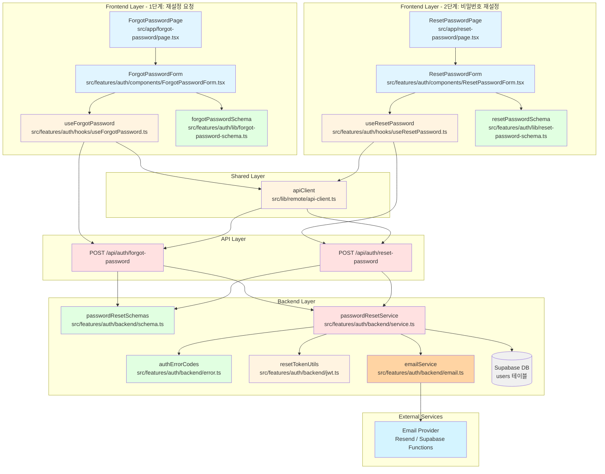

# 비밀번호 재설정 기능 - 구현 계획

**문서 버전:** 1.0
**작성일:** 2025-10-19
**관련 문서:**
- PRD: `docs/prd.md` (비밀번호 찾기 페이지)
- Login plan: `docs/pages/login/plan.md`
- Signup plan: `docs/pages/signup/plan.md`
- 데이터베이스: `docs/database.md` (users 테이블)

---

## 1. 개요

비밀번호 재설정 기능은 이메일을 통한 2단계 프로세스로 구현됩니다. 사용자가 비밀번호를 잊었을 때 이메일 주소를 입력하면 재설정 링크가 전송되고, 해당 링크를 통해 새 비밀번호를 설정할 수 있습니다. JWT 기반 토큰을 사용하여 재설정 요청을 인증하며, 토큰은 1시간 동안 유효합니다.

### 1.1 주요 모듈 목록

| 모듈명 | 위치 | 설명 |
|--------|------|------|
| **ForgotPasswordPage** | `src/app/forgot-password/page.tsx` | 비밀번호 재설정 요청 페이지 |
| **ResetPasswordPage** | `src/app/reset-password/page.tsx` | 새 비밀번호 설정 페이지 |
| **ForgotPasswordForm** | `src/features/auth/components/ForgotPasswordForm.tsx` | 이메일 입력 폼 컴포넌트 |
| **ResetPasswordForm** | `src/features/auth/components/ResetPasswordForm.tsx` | 새 비밀번호 입력 폼 컴포넌트 |
| **forgotPasswordSchema** | `src/features/auth/lib/forgot-password-schema.ts` | 이메일 입력 폼 스키마 |
| **resetPasswordSchema** | `src/features/auth/lib/reset-password-schema.ts` | 비밀번호 재설정 폼 스키마 |
| **useForgotPassword** | `src/features/auth/hooks/useForgotPassword.ts` | 재설정 요청 API 호출 훅 |
| **useResetPassword** | `src/features/auth/hooks/useResetPassword.ts` | 비밀번호 업데이트 API 호출 훅 |
| **PasswordResetRoute** | `src/features/auth/backend/route.ts` | Hono 라우터 확장 |
| **passwordResetService** | `src/features/auth/backend/service.ts` | 비밀번호 재설정 로직 확장 |
| **passwordResetSchemas** | `src/features/auth/backend/schema.ts` | 요청/응답 스키마 확장 |
| **authErrorCodes** | `src/features/auth/backend/error.ts` | 에러 코드 확장 |
| **resetTokenUtils** | `src/features/auth/backend/jwt.ts` | 재설정 토큰 생성/검증 확장 |
| **emailService** | `src/features/auth/backend/email.ts` | 이메일 전송 서비스 (신규) |

---

## 2. 아키텍처 다이어그램



---

## 3. 구현 계획

### 3.1 프론트엔드 레이어

#### 3.1.1 비밀번호 재설정 요청 페이지 (`src/app/forgot-password/page.tsx`)

**목적:** 비밀번호 재설정 요청 페이지의 최상위 컴포넌트

**구현 내용:**
```typescript
"use client";

import { ForgotPasswordForm } from "@/features/auth/components/ForgotPasswordForm";

export default function ForgotPasswordPage() {
  return (
    <div className="mx-auto flex min-h-screen w-full max-w-4xl flex-col items-center justify-center gap-10 px-6 py-16">
      <header className="flex flex-col items-center gap-3 text-center">
        <h1 className="text-3xl font-semibold">비밀번호 찾기</h1>
        <p className="text-slate-500">
          가입하신 이메일 주소를 입력하시면 비밀번호 재설정 링크를 보내드립니다.
        </p>
      </header>
      <div className="grid w-full gap-8 md:grid-cols-2">
        <ForgotPasswordForm />
        <figure className="overflow-hidden rounded-xl border border-slate-200">
          
        </figure>
      </div>
    </div>
  );
}
```

**QA 시트:**
- [ ] 페이지가 화면 중앙에 정렬되는가?
- [ ] 반응형 디자인이 모바일/태블릿/데스크톱에서 정상 동작하는가?
- [ ] 설명 문구가 명확하게 표시되는가?

---

#### 3.1.2 새 비밀번호 설정 페이지 (`src/app/reset-password/page.tsx`)

**목적:** 새 비밀번호 설정 페이지의 최상위 컴포넌트

**구현 내용:**
```typescript
"use client";

import { Suspense } from "react";
import { ResetPasswordForm } from "@/features/auth/components/ResetPasswordForm";

function ResetPasswordContent() {
  return (
    <div className="mx-auto flex min-h-screen w-full max-w-4xl flex-col items-center justify-center gap-10 px-6 py-16">
      <header className="flex flex-col items-center gap-3 text-center">
        <h1 className="text-3xl font-semibold">비밀번호 재설정</h1>
        <p className="text-slate-500">
          새로운 비밀번호를 입력해주세요.
        </p>
      </header>
      <div className="grid w-full gap-8 md:grid-cols-2">
        <ResetPasswordForm />
        <figure className="overflow-hidden rounded-xl border border-slate-200">
          
        </figure>
      </div>
    </div>
  );
}

export default function ResetPasswordPage() {
  return (
    <Suspense fallback={<div>로딩 중...</div>}>
      <ResetPasswordContent />
    </Suspense>
  );
}
```

**QA 시트:**
- [ ] 페이지가 화면 중앙에 정렬되는가?
- [ ] 반응형 디자인이 모바일/태블릿/데스크톱에서 정상 동작하는가?
- [ ] Suspense 경계가 올바르게 동작하는가? (searchParams 사용으로 인한 동적 렌더링)

---

#### 3.1.3 비밀번호 재설정 요청 폼 (`src/features/auth/components/ForgotPasswordForm.tsx`)

**목적:** 이메일 입력 폼 UI 및 유효성 검증 처리

**구현 내용:**
- react-hook-form + zod 사용
- 입력 필드:
  - 이메일 (필수, 이메일 형식)
- 버튼: 재설정 링크 전송
- 링크:
  - 로그인 페이지로 이동 (`/login`)
  - 회원가입 페이지로 이동 (`/signup`)
- shadcn-ui 컴포넌트 사용 (Input, Label, Button, Form, toast)
- 에러 메시지는 필드 하단 또는 폼 상단에 빨간색으로 표시
- 로딩 상태: 버튼 비활성화 + 스피너 표시
- 성공 시: "이메일로 재설정 링크를 전송했습니다" 토스트 메시지 표시

**주요 기능:**
1. **이메일 검증**: 이메일 형식 확인
2. **성공 메시지**: 보안을 위해 이메일 존재 여부와 관계없이 동일한 성공 메시지 표시
3. **안내 메시지**: "이메일이 도착하지 않았다면 스팸 메일함을 확인하세요" 등 추가 안내

**QA 시트:**
- [ ] 이메일 필드가 필수로 표시되고 검증되는가?
- [ ] 이메일 형식이 올바르지 않으면 "올바른 이메일 형식을 입력해주세요" 표시되는가?
- [ ] 제출 중에는 버튼이 비활성화되고 "전송 중..." 텍스트가 표시되는가?
- [ ] 성공 시 "이메일로 재설정 링크를 전송했습니다" 토스트가 표시되는가?
- [ ] 서버 오류 시 "일시적인 오류가 발생했습니다" 메시지가 표시되는가?
- [ ] "로그인으로 돌아가기" 링크가 표시되고 클릭 시 `/login`으로 이동하는가?
- [ ] 키보드로 모든 필드에 접근 가능한가? (Tab 순서)
- [ ] Enter 키로 폼 제출이 가능한가?
- [ ] 포커스 시 입력 필드의 테두리 색상이 변경되는가?
- [ ] 오류가 있는 필드는 빨간색 테두리로 강조되는가?

---

#### 3.1.4 새 비밀번호 설정 폼 (`src/features/auth/components/ResetPasswordForm.tsx`)

**목적:** 새 비밀번호 입력 폼 UI 및 유효성 검증 처리

**구현 내용:**
- react-hook-form + zod 사용
- URL 쿼리 파라미터에서 토큰 추출 (useSearchParams)
- 입력 필드:
  - 새 비밀번호 (필수, 8자 이상) + "보기/숨기기" 토글 아이콘
  - 비밀번호 확인 (필수, 비밀번호 일치 확인)
- 버튼: 비밀번호 변경
- shadcn-ui 컴포넌트 사용 (Input, Label, Button, Form, toast)
- 에러 메시지는 필드 하단 또는 폼 상단에 빨간색으로 표시
- 로딩 상태: 버튼 비활성화 + 스피너 표시
- 성공 시: "비밀번호가 변경되었습니다" 토스트 메시지 + 로그인 페이지로 리디렉션

**주요 기능:**
1. **토큰 검증**: 컴포넌트 마운트 시 토큰 유효성 확인
2. **토큰 없음/만료**: 에러 메시지 표시 및 비밀번호 찾기 페이지로 리디렉션 유도
3. **비밀번호 가시성 토글**: Eye/EyeOff 아이콘으로 비밀번호 표시/숨기기
4. **자동 리디렉션**: 비밀번호 변경 성공 시 로그인 페이지로 자동 이동

**QA 시트:**
- [ ] URL에 토큰이 없으면 에러 메시지가 표시되는가?
- [ ] 토큰이 만료되었으면 "링크가 만료되었습니다" 메시지가 표시되는가?
- [ ] 새 비밀번호 필드가 필수로 표시되고 검증되는가?
- [ ] 비밀번호가 8자 미만이면 "비밀번호는 8자 이상이어야 합니다" 표시되는가?
- [ ] 비밀번호와 비밀번호 확인이 일치하지 않으면 "비밀번호가 일치하지 않습니다" 표시되는가?
- [ ] 비밀번호 "보기/숨기기" 토글이 정상 동작하는가?
- [ ] 제출 중에는 버튼이 비활성화되고 "변경 중..." 텍스트가 표시되는가?
- [ ] 성공 시 "비밀번호가 변경되었습니다" 토스트가 표시되고 `/login`으로 이동하는가?
- [ ] 서버 오류 시 "일시적인 오류가 발생했습니다" 메시지가 표시되는가?
- [ ] 키보드로 모든 필드에 접근 가능한가? (Tab 순서)
- [ ] Enter 키로 폼 제출이 가능한가?

---

#### 3.1.5 이메일 입력 폼 스키마 (`src/features/auth/lib/forgot-password-schema.ts`)

**목적:** 클라이언트 측 이메일 입력 폼 유효성 검증 스키마

**구현 내용:**
```typescript
import { z } from "zod";

export const forgotPasswordFormSchema = z.object({
  email: z
    .string()
    .min(1, { message: "이메일을 입력해주세요" })
    .email({ message: "올바른 이메일 형식을 입력해주세요" }),
});

export type ForgotPasswordFormData = z.infer<typeof forgotPasswordFormSchema>;
```

**테스트 케이스:**
- [ ] 이메일이 빈 문자열이면 검증 실패
- [ ] 이메일이 잘못된 형식이면 검증 실패 (`test@`, `test.com`, `@test.com`)
- [ ] 올바른 이메일 형식이면 검증 성공

---

#### 3.1.6 새 비밀번호 설정 폼 스키마 (`src/features/auth/lib/reset-password-schema.ts`)

**목적:** 클라이언트 측 비밀번호 재설정 폼 유효성 검증 스키마

**구현 내용:**
```typescript
import { z } from "zod";

export const resetPasswordFormSchema = z
  .object({
    password: z
      .string()
      .min(8, { message: "비밀번호는 8자 이상이어야 합니다" }),
    passwordConfirm: z
      .string()
      .min(1, { message: "비밀번호 확인을 입력해주세요" }),
  })
  .refine((data) => data.password === data.passwordConfirm, {
    message: "비밀번호가 일치하지 않습니다",
    path: ["passwordConfirm"],
  });

export type ResetPasswordFormData = z.infer<typeof resetPasswordFormSchema>;
```

**테스트 케이스:**
- [ ] 비밀번호가 8자 미만이면 검증 실패
- [ ] 비밀번호 확인이 빈 문자열이면 검증 실패
- [ ] 비밀번호와 비밀번호 확인이 다르면 검증 실패
- [ ] 모든 필드가 올바르면 검증 성공

---

#### 3.1.7 재설정 요청 훅 (`src/features/auth/hooks/useForgotPassword.ts`)

**목적:** 비밀번호 재설정 요청 API 호출 및 React Query 통합

**구현 내용:**
```typescript
import { useMutation } from "@tanstack/react-query";
import { apiClient } from "@/lib/remote/api-client";
import type { ForgotPasswordFormData } from "@/features/auth/lib/forgot-password-schema";

type ForgotPasswordRequest = {
  email: string;
};

type ForgotPasswordResponse = {
  message: string;
};

type ForgotPasswordError = {
  error: {
    code: string;
    message: string;
    details?: unknown;
  };
};

export const useForgotPassword = () => {
  return useMutation<ForgotPasswordResponse, ForgotPasswordError, ForgotPasswordRequest>({
    mutationFn: async (data) => {
      const response = await apiClient.post<{ data: ForgotPasswordResponse }>(
        "/api/auth/forgot-password",
        data
      );
      return response.data.data;
    },
  });
};
```

**테스트 케이스:**
- [ ] API 호출이 올바른 엔드포인트로 전송되는가?
- [ ] 성공 시 응답 데이터가 반환되는가?
- [ ] 실패 시 에러가 올바르게 처리되는가?
- [ ] isLoading, isError, isSuccess 상태가 정확한가?

---

#### 3.1.8 비밀번호 업데이트 훅 (`src/features/auth/hooks/useResetPassword.ts`)

**목적:** 비밀번호 업데이트 API 호출 및 React Query 통합

**구현 내용:**
```typescript
import { useMutation } from "@tanstack/react-query";
import { useRouter } from "next/navigation";
import { apiClient } from "@/lib/remote/api-client";
import type { ResetPasswordFormData } from "@/features/auth/lib/reset-password-schema";

type ResetPasswordRequest = {
  token: string;
  password: string;
  passwordConfirm: string;
};

type ResetPasswordResponse = {
  message: string;
};

type ResetPasswordError = {
  error: {
    code: string;
    message: string;
    details?: unknown;
  };
};

export const useResetPassword = () => {
  const router = useRouter();

  return useMutation<ResetPasswordResponse, ResetPasswordError, ResetPasswordRequest>({
    mutationFn: async (data) => {
      const response = await apiClient.post<{ data: ResetPasswordResponse }>(
        "/api/auth/reset-password",
        data
      );
      return response.data.data;
    },
    onSuccess: () => {
      // 로그인 페이지로 리디렉션
      router.push("/login");
    },
  });
};
```

**테스트 케이스:**
- [ ] API 호출이 올바른 엔드포인트로 전송되는가?
- [ ] 성공 시 응답 데이터가 반환되는가?
- [ ] 성공 시 로그인 페이지로 리디렉션되는가?
- [ ] 실패 시 에러가 올바르게 처리되는가?
- [ ] isLoading, isError, isSuccess 상태가 정확한가?

---

### 3.2 백엔드 레이어

#### 3.2.1 재설정 토큰 유틸리티 확장 (`src/features/auth/backend/jwt.ts`)

**목적:** 비밀번호 재설정 전용 JWT 토큰 생성 및 검증

**추가 내용:**
```typescript
// 기존 generateToken, verifyToken 유지

const RESET_TOKEN_EXPIRES_IN = "1h"; // 1시간

export type ResetTokenPayload = {
  userId: string;
  email: string;
  type: "password-reset";
};

export const generateResetToken = async (
  userId: string,
  email: string,
): Promise<string> => {
  const secret = new TextEncoder().encode(JWT_SECRET);

  const token = await new SignJWT({
    userId,
    email,
    type: "password-reset",
  })
    .setProtectedHeader({ alg: "HS256" })
    .setIssuedAt()
    .setExpirationTime(RESET_TOKEN_EXPIRES_IN)
    .sign(secret);

  return token;
};

export const verifyResetToken = async (
  token: string,
): Promise<ResetTokenPayload | null> => {
  try {
    const secret = new TextEncoder().encode(JWT_SECRET);
    const { payload } = await jwtVerify(token, secret);

    // 타입 확인
    if (payload.type !== "password-reset") {
      return null;
    }

    return payload as unknown as ResetTokenPayload;
  } catch {
    return null;
  }
};
```

**테스트 케이스:**
- [ ] generateResetToken이 유효한 JWT를 생성하는가?
- [ ] verifyResetToken이 유효한 토큰을 검증하는가?
- [ ] verifyResetToken이 만료된 토큰을 거부하는가?
- [ ] verifyResetToken이 잘못된 타입의 토큰을 거부하는가?
- [ ] verifyResetToken이 잘못된 서명을 가진 토큰을 거부하는가?

---

#### 3.2.2 이메일 전송 서비스 (`src/features/auth/backend/email.ts`)

**목적:** 비밀번호 재설정 링크 이메일 전송

**구현 내용:**
```typescript
const EMAIL_FROM = process.env.EMAIL_FROM || "noreply@example.com";
const APP_URL = process.env.NEXT_PUBLIC_APP_URL || "http://localhost:3000";

export type SendResetEmailParams = {
  to: string;
  resetToken: string;
};

export const sendPasswordResetEmail = async (
  params: SendResetEmailParams,
): Promise<{ success: boolean; error?: string }> => {
  const resetUrl = `${APP_URL}/reset-password?token=${params.resetToken}`;

  const emailHtml = `
    <div style="font-family: Arial, sans-serif; max-width: 600px; margin: 0 auto;">
      <h2>비밀번호 재설정 요청</h2>
      <p>안녕하세요,</p>
      <p>비밀번호 재설정을 요청하셨습니다. 아래 버튼을 클릭하여 새로운 비밀번호를 설정하세요.</p>
      <div style="margin: 30px 0;">
        <a href="${resetUrl}"
           style="background-color: #0070f3; color: white; padding: 12px 24px; text-decoration: none; border-radius: 5px; display: inline-block;">
          비밀번호 재설정
        </a>
      </div>
      <p>또는 아래 링크를 복사하여 브라우저에 붙여넣으세요:</p>
      <p style="color: #666; word-break: break-all;">${resetUrl}</p>
      <p style="color: #999; font-size: 14px; margin-top: 30px;">
        이 링크는 1시간 동안 유효합니다.<br/>
        비밀번호 재설정을 요청하지 않으셨다면 이 이메일을 무시하세요.
      </p>
    </div>
  `;

  const emailText = `
비밀번호 재설정 요청

안녕하세요,

비밀번호 재설정을 요청하셨습니다. 아래 링크를 클릭하여 새로운 비밀번호를 설정하세요.

${resetUrl}

이 링크는 1시간 동안 유효합니다.
비밀번호 재설정을 요청하지 않으셨다면 이 이메일을 무시하세요.
  `;

  // Resend API 사용 (환경변수로 설정)
  const RESEND_API_KEY = process.env.RESEND_API_KEY;

  if (!RESEND_API_KEY) {
    // 개발 환경: 콘솔에 로그만 출력
    console.log("[DEV] Password Reset Email:");
    console.log("To:", params.to);
    console.log("Reset URL:", resetUrl);
    return { success: true };
  }

  try {
    const response = await fetch("https://api.resend.com/emails", {
      method: "POST",
      headers: {
        "Content-Type": "application/json",
        Authorization: `Bearer ${RESEND_API_KEY}`,
      },
      body: JSON.stringify({
        from: EMAIL_FROM,
        to: params.to,
        subject: "비밀번호 재설정 요청",
        html: emailHtml,
        text: emailText,
      }),
    });

    if (!response.ok) {
      const errorData = await response.json();
      return {
        success: false,
        error: errorData.message || "이메일 전송 실패",
      };
    }

    return { success: true };
  } catch (error) {
    return {
      success: false,
      error: error instanceof Error ? error.message : "이메일 전송 중 오류 발생",
    };
  }
};
```

**환경 변수:**
- `RESEND_API_KEY`: Resend API 키 (선택적, 없으면 개발 모드로 콘솔 출력)
- `EMAIL_FROM`: 발신자 이메일 주소
- `NEXT_PUBLIC_APP_URL`: 앱 URL (리셋 링크 생성용)

**테스트 케이스:**
- [ ] 개발 환경에서 이메일 내용이 콘솔에 출력되는가?
- [ ] 프로덕션 환경에서 Resend API가 호출되는가?
- [ ] 이메일 전송 성공 시 success: true 반환되는가?
- [ ] 이메일 전송 실패 시 에러 메시지가 반환되는가?
- [ ] 재설정 링크가 올바른 형식으로 생성되는가?

---

#### 3.2.3 요청/응답 스키마 확장 (`src/features/auth/backend/schema.ts`)

**목적:** 비밀번호 재설정 요청/응답 스키마 추가

**추가 내용:**
```typescript
// 기존 SignupRequestSchema, LoginRequestSchema 유지

// 비밀번호 재설정 요청 스키마
export const ForgotPasswordRequestSchema = z.object({
  email: z
    .string()
    .min(1, { message: "이메일은 필수입니다" })
    .email({ message: "올바른 이메일 형식이 아닙니다" }),
});

export type ForgotPasswordRequest = z.infer<typeof ForgotPasswordRequestSchema>;

export const ForgotPasswordResponseSchema = z.object({
  message: z.string(),
});

export type ForgotPasswordResponse = z.infer<typeof ForgotPasswordResponseSchema>;

// 비밀번호 재설정 스키마
export const ResetPasswordRequestSchema = z
  .object({
    token: z.string().min(1, { message: "토큰은 필수입니다" }),
    password: z
      .string()
      .min(8, { message: "비밀번호는 8자 이상이어야 합니다" }),
    passwordConfirm: z
      .string()
      .min(1, { message: "비밀번호 확인은 필수입니다" }),
  })
  .refine((data) => data.password === data.passwordConfirm, {
    message: "비밀번호가 일치하지 않습니다",
    path: ["passwordConfirm"],
  });

export type ResetPasswordRequest = z.infer<typeof ResetPasswordRequestSchema>;

export const ResetPasswordResponseSchema = z.object({
  message: z.string(),
});

export type ResetPasswordResponse = z.infer<typeof ResetPasswordResponseSchema>;

// 비밀번호 재설정 서비스 에러 타입
export type PasswordResetServiceError =
  | "USER_NOT_FOUND"
  | "EMAIL_SEND_ERROR"
  | "INVALID_TOKEN"
  | "EXPIRED_TOKEN"
  | "PASSWORD_HASH_ERROR"
  | "PASSWORD_UPDATE_ERROR";
```

**테스트 케이스:**
- [ ] 모든 필수 필드 검증
- [ ] 이메일 형식 검증
- [ ] 비밀번호 길이 검증
- [ ] 비밀번호 일치 검증
- [ ] 토큰 필수 검증

---

#### 3.2.4 에러 코드 확장 (`src/features/auth/backend/error.ts`)

**목적:** 비밀번호 재설정 관련 에러 코드 추가

**수정 내용:**
```typescript
export const authErrorCodes = {
  // 회원가입 관련 (기존)
  nicknameDuplicate: "NICKNAME_DUPLICATE",
  emailDuplicate: "EMAIL_DUPLICATE",
  signupFetchError: "SIGNUP_FETCH_ERROR",
  passwordHashError: "PASSWORD_HASH_ERROR",

  // 로그인 관련 (기존)
  authFailed: "AUTH_FAILED",
  loginFetchError: "LOGIN_FETCH_ERROR",
  passwordCompareError: "PASSWORD_COMPARE_ERROR",
  tokenGenerationError: "TOKEN_GENERATION_ERROR",

  // 비밀번호 재설정 관련 (추가)
  userNotFound: "USER_NOT_FOUND",
  emailSendError: "EMAIL_SEND_ERROR",
  invalidToken: "INVALID_TOKEN",
  expiredToken: "EXPIRED_TOKEN",
  passwordUpdateError: "PASSWORD_UPDATE_ERROR",
} as const;

type AuthErrorValue = (typeof authErrorCodes)[keyof typeof authErrorCodes];

export type AuthServiceError = AuthErrorValue;
```

---

#### 3.2.5 비밀번호 재설정 서비스 (`src/features/auth/backend/service.ts`)

**목적:** 비밀번호 재설정 비즈니스 로직 추가

**추가 내용:**
```typescript
import { hash } from "bcryptjs";
import type { SupabaseClient } from "@supabase/supabase-js";
import {
  failure,
  success,
  type HandlerResult,
} from "@/backend/http/response";
import type {
  ForgotPasswordRequest,
  ForgotPasswordResponse,
  ResetPasswordRequest,
  ResetPasswordResponse,
  PasswordResetServiceError,
} from "./schema";
import { authErrorCodes } from "./error";
import { generateResetToken, verifyResetToken } from "./jwt";
import { sendPasswordResetEmail } from "./email";

const USERS_TABLE = "users";
const BCRYPT_ROUNDS = 10;

// 비밀번호 재설정 요청 (1단계: 이메일 전송)
export const requestPasswordReset = async (
  client: SupabaseClient,
  data: ForgotPasswordRequest,
): Promise<
  HandlerResult<ForgotPasswordResponse, PasswordResetServiceError, unknown>
> => {
  // 1. 이메일로 사용자 조회
  const { data: user, error: fetchError } = await client
    .from(USERS_TABLE)
    .select("id, email")
    .eq("email", data.email)
    .maybeSingle();

  if (fetchError) {
    return failure(
      500,
      authErrorCodes.loginFetchError as PasswordResetServiceError,
      fetchError.message,
    );
  }

  // 2. 사용자가 없어도 보안상 동일한 응답 반환
  // (이메일 존재 여부를 노출하지 않음)
  if (!user) {
    return success(
      {
        message:
          "이메일로 비밀번호 재설정 링크를 전송했습니다. 이메일을 확인해주세요.",
      },
      200,
    );
  }

  // 3. 재설정 토큰 생성
  let resetToken: string;
  try {
    resetToken = await generateResetToken(user.id, user.email);
  } catch {
    return failure(
      500,
      authErrorCodes.tokenGenerationError as PasswordResetServiceError,
      "토큰 생성 중 오류가 발생했습니다",
    );
  }

  // 4. 이메일 전송
  const emailResult = await sendPasswordResetEmail({
    to: user.email,
    resetToken,
  });

  if (!emailResult.success) {
    return failure(
      500,
      authErrorCodes.emailSendError as PasswordResetServiceError,
      emailResult.error || "이메일 전송 중 오류가 발생했습니다",
    );
  }

  // 5. 성공 응답
  return success(
    {
      message:
        "이메일로 비밀번호 재설정 링크를 전송했습니다. 이메일을 확인해주세요.",
    },
    200,
  );
};

// 비밀번호 재설정 실행 (2단계: 새 비밀번호 설정)
export const resetPassword = async (
  client: SupabaseClient,
  data: ResetPasswordRequest,
): Promise<
  HandlerResult<ResetPasswordResponse, PasswordResetServiceError, unknown>
> => {
  // 1. 토큰 검증
  const payload = await verifyResetToken(data.token);

  if (!payload) {
    return failure(
      401,
      authErrorCodes.invalidToken as PasswordResetServiceError,
      "유효하지 않거나 만료된 토큰입니다",
    );
  }

  // 2. 사용자 조회 (토큰의 userId로)
  const { data: user, error: fetchError } = await client
    .from(USERS_TABLE)
    .select("id, email")
    .eq("id", payload.userId)
    .maybeSingle();

  if (fetchError) {
    return failure(
      500,
      authErrorCodes.loginFetchError as PasswordResetServiceError,
      fetchError.message,
    );
  }

  if (!user) {
    return failure(
      404,
      authErrorCodes.userNotFound as PasswordResetServiceError,
      "사용자를 찾을 수 없습니다",
    );
  }

  // 3. 비밀번호 해싱
  let passwordHash: string;
  try {
    passwordHash = await hash(data.password, BCRYPT_ROUNDS);
  } catch {
    return failure(
      500,
      authErrorCodes.passwordHashError as PasswordResetServiceError,
      "비밀번호 암호화 중 오류가 발생했습니다",
    );
  }

  // 4. 비밀번호 업데이트
  const { error: updateError } = await client
    .from(USERS_TABLE)
    .update({ password_hash: passwordHash })
    .eq("id", user.id);

  if (updateError) {
    return failure(
      500,
      authErrorCodes.passwordUpdateError as PasswordResetServiceError,
      updateError.message,
    );
  }

  // 5. 성공 응답
  return success(
    {
      message: "비밀번호가 성공적으로 변경되었습니다",
    },
    200,
  );
};

// 기존 signupUser, loginUser 함수는 유지
```

**테스트 케이스:**
- [ ] requestPasswordReset: 존재하지 않는 이메일이어도 성공 응답 반환
- [ ] requestPasswordReset: 유효한 이메일이면 재설정 토큰 생성됨
- [ ] requestPasswordReset: 이메일 전송 성공 시 200 응답 반환
- [ ] requestPasswordReset: 이메일 전송 실패 시 500 에러 반환
- [ ] resetPassword: 유효하지 않은 토큰이면 401 에러 반환
- [ ] resetPassword: 만료된 토큰이면 401 에러 반환
- [ ] resetPassword: 비밀번호가 안전하게 해싱되는가?
- [ ] resetPassword: 비밀번호가 데이터베이스에 업데이트되는가?
- [ ] resetPassword: 성공 시 200 상태 코드와 성공 메시지 반환
- [ ] resetPassword: 데이터베이스 오류 시 500 에러 반환

**보안 주의사항:**
- 사용자가 존재하지 않아도 동일한 성공 메시지를 반환하여 이메일 존재 여부를 노출하지 않음
- 토큰은 1시간 후 자동 만료
- 비밀번호는 bcryptjs로 안전하게 해싱

---

#### 3.2.6 Hono 라우터 확장 (`src/features/auth/backend/route.ts`)

**목적:** 비밀번호 재설정 API 엔드포인트 추가

**수정 내용:**
```typescript
import type { Hono } from "hono";
import {
  failure,
  respond,
  type ErrorResult,
} from "@/backend/http/response";
import {
  getLogger,
  getSupabase,
  type AppEnv,
} from "@/backend/hono/context";
import {
  SignupRequestSchema,
  type SignupServiceError,
  LoginRequestSchema,
  type LoginServiceError,
  ForgotPasswordRequestSchema,
  type PasswordResetServiceError,
  ResetPasswordRequestSchema,
} from "./schema";
import {
  signupUser,
  loginUser,
  requestPasswordReset,
  resetPassword,
} from "./service";
import { authErrorCodes } from "./error";

export const registerAuthRoutes = (app: Hono<AppEnv>) => {
  // 회원가입 엔드포인트 (기존 유지)
  app.post("/auth/signup", async (c) => {
    // ... 기존 코드 유지 ...
  });

  // 로그인 엔드포인트 (기존 유지)
  app.post("/auth/login", async (c) => {
    // ... 기존 코드 유지 ...
  });

  // 비밀번호 재설정 요청 엔드포인트 (추가)
  app.post("/auth/forgot-password", async (c) => {
    const body = await c.req.json();
    const parsedBody = ForgotPasswordRequestSchema.safeParse(body);

    if (!parsedBody.success) {
      return respond(
        c,
        failure(
          400,
          "INVALID_FORGOT_PASSWORD_DATA",
          "입력 데이터가 올바르지 않습니다.",
          parsedBody.error.format(),
        ),
      );
    }

    const supabase = getSupabase(c);
    const logger = getLogger(c);

    const result = await requestPasswordReset(supabase, parsedBody.data);

    if (!result.ok) {
      const errorResult = result as ErrorResult<
        PasswordResetServiceError,
        unknown
      >;

      // 에러 로깅
      if (
        errorResult.error.code === authErrorCodes.emailSendError ||
        errorResult.error.code === authErrorCodes.tokenGenerationError ||
        errorResult.error.code === authErrorCodes.loginFetchError
      ) {
        logger.error(
          "Password reset request failed",
          errorResult.error.message,
        );
      }

      return respond(c, result);
    }

    logger.info("Password reset email sent", {
      email: parsedBody.data.email,
    });

    return respond(c, result);
  });

  // 비밀번호 재설정 실행 엔드포인트 (추가)
  app.post("/auth/reset-password", async (c) => {
    const body = await c.req.json();
    const parsedBody = ResetPasswordRequestSchema.safeParse(body);

    if (!parsedBody.success) {
      return respond(
        c,
        failure(
          400,
          "INVALID_RESET_PASSWORD_DATA",
          "입력 데이터가 올바르지 않습니다.",
          parsedBody.error.format(),
        ),
      );
    }

    const supabase = getSupabase(c);
    const logger = getLogger(c);

    const result = await resetPassword(supabase, parsedBody.data);

    if (!result.ok) {
      const errorResult = result as ErrorResult<
        PasswordResetServiceError,
        unknown
      >;

      // 에러 로깅
      if (errorResult.error.code === authErrorCodes.invalidToken) {
        logger.info("Invalid or expired reset token", {
          token: parsedBody.data.token.substring(0, 20) + "...",
        });
      } else if (
        errorResult.error.code === authErrorCodes.passwordHashError ||
        errorResult.error.code === authErrorCodes.passwordUpdateError ||
        errorResult.error.code === authErrorCodes.loginFetchError
      ) {
        logger.error("Password reset failed", errorResult.error.message);
      }

      return respond(c, result);
    }

    logger.info("Password reset successful");

    return respond(c, result);
  });
};
```

**테스트 케이스:**
- [ ] 유효하지 않은 요청 본문이면 400 에러 반환
- [ ] 서비스 성공 시 200 상태 코드 반환
- [ ] 서비스 실패 시 적절한 에러 코드 반환 (401, 404, 500)
- [ ] 재설정 요청 성공 시 성공 로그가 기록되는가?
- [ ] 재설정 실행 성공 시 성공 로그가 기록되는가?
- [ ] 에러 발생 시 적절한 로그가 기록되는가?

---

### 3.3 shadcn-ui 컴포넌트 설치

비밀번호 재설정 폼 구현을 위해 다음 shadcn-ui 컴포넌트가 필요합니다 (일부는 이미 설치됨):

```bash
npx shadcn@latest add input
npx shadcn@latest add button
npx shadcn@latest add label
npx shadcn@latest add form
npx shadcn@latest add toast
```

---

### 3.4 환경 변수 설정

`.env.local` 파일에 다음 환경 변수를 추가합니다:

```env
# JWT 비밀 키 (기존)
JWT_SECRET=your-super-secret-key-change-in-production-min-32-characters

# 이메일 전송 설정
RESEND_API_KEY=re_xxx # Resend API 키 (선택적, 없으면 개발 모드)
EMAIL_FROM=noreply@yourdomain.com # 발신자 이메일
NEXT_PUBLIC_APP_URL=http://localhost:3000 # 앱 URL (프로덕션에서는 실제 도메인)
```

**보안 주의사항:**
- `RESEND_API_KEY`는 프로덕션 환경에서만 설정
- 개발 환경에서는 콘솔에 이메일 내용이 출력됨
- `.env.local`은 `.gitignore`에 포함되어야 함

---

## 4. 구현 순서

### Phase 1: 백엔드 구현
1. **이메일 전송 서비스** (`src/features/auth/backend/email.ts`)
2. **재설정 토큰 유틸리티 확장** (`src/features/auth/backend/jwt.ts`)
3. **에러 코드 확장** (`src/features/auth/backend/error.ts`)
4. **요청/응답 스키마 확장** (`src/features/auth/backend/schema.ts`)
5. **비밀번호 재설정 서비스 추가** (`src/features/auth/backend/service.ts`)
6. **Hono 라우터 확장** (`src/features/auth/backend/route.ts`)

### Phase 2: 프론트엔드 구현 - 1단계 (재설정 요청)
7. **이메일 입력 폼 스키마** (`src/features/auth/lib/forgot-password-schema.ts`)
8. **재설정 요청 훅** (`src/features/auth/hooks/useForgotPassword.ts`)
9. **재설정 요청 폼 컴포넌트** (`src/features/auth/components/ForgotPasswordForm.tsx`)
10. **재설정 요청 페이지 컴포넌트** (`src/app/forgot-password/page.tsx`)

### Phase 3: 프론트엔드 구현 - 2단계 (비밀번호 재설정)
11. **비밀번호 재설정 폼 스키마** (`src/features/auth/lib/reset-password-schema.ts`)
12. **비밀번호 업데이트 훅** (`src/features/auth/hooks/useResetPassword.ts`)
13. **비밀번호 재설정 폼 컴포넌트** (`src/features/auth/components/ResetPasswordForm.tsx`)
14. **비밀번호 재설정 페이지 컴포넌트** (`src/app/reset-password/page.tsx`)

### Phase 4: 테스트 및 검증
15. **각 Edge Case 시나리오 테스트**
16. **UI/UX 요구사항 검증**
17. **보안 요구사항 검증**
18. **이메일 전송 테스트** (개발/프로덕션 환경)

---

## 5. Edge Cases 처리 매핑

| Edge Case | 처리 위치 | 구현 방법 |
|-----------|-----------|-----------|
| EC-001: 이메일 필드 누락 | 클라이언트 (zod) | react-hook-form 에러 표시 |
| EC-002: 이메일 형식 오류 | 클라이언트 (zod) | react-hook-form 에러 표시 |
| EC-003: 존재하지 않는 이메일 | 서버 (service) | 보안상 동일한 성공 메시지 반환 |
| EC-004: 이메일 전송 실패 | 서버 (email service) | 500 응답, "일시적인 오류가 발생했습니다" |
| EC-005: 토큰 없음 | 클라이언트 (form) | "유효하지 않은 링크입니다" 표시 |
| EC-006: 토큰 만료 | 서버 (jwt) | 401 응답, "링크가 만료되었습니다" |
| EC-007: 토큰 위조 | 서버 (jwt) | 401 응답, "유효하지 않은 링크입니다" |
| EC-008: 비밀번호 정책 위반 | 클라이언트 (zod) | react-hook-form 에러 표시 |
| EC-009: 비밀번호 불일치 | 클라이언트 (zod) | react-hook-form 에러 표시 |
| EC-010: 서버 오류 | 서버 (service) | 500 응답, "일시적인 오류가 발생했습니다" |
| EC-011: 네트워크 오류 | 클라이언트 (hook) | React Query 에러 처리 |

---

## 6. 보안 고려사항

1. **토큰 만료**: 재설정 토큰은 1시간 후 자동 만료
2. **토큰 타입 검증**: JWT payload에 type: "password-reset" 포함하여 다른 토큰과 구분
3. **이메일 존재 여부 숨김**: 사용자가 존재하지 않아도 동일한 성공 메시지 반환
4. **비밀번호 해싱**: bcryptjs 사용 (cost factor 10)
5. **입력 검증**: 클라이언트 + 서버 이중 검증
6. **SQL Injection 방지**: Supabase 클라이언트가 자동 처리
7. **XSS 방지**: React의 자동 이스케이핑
8. **환경 변수 보호**: JWT_SECRET, RESEND_API_KEY를 환경 변수로 관리
9. **재설정 링크 일회용**: 동일 토큰으로 여러 번 재설정 가능 (1시간 내)
   - 향후 개선: 토큰 사용 후 무효화 로직 추가 가능

---

## 7. 성능 최적화

1. **인덱스 활용**: `users.email` 인덱스 (이미 생성됨)
2. **사용자 조회**: `maybeSingle()` 사용으로 불필요한 데이터 조회 방지
3. **비밀번호 해싱**: bcryptjs의 최적화된 해싱 (cost factor 10)
4. **JWT 생성/검증**: jose 라이브러리의 효율적인 서명
5. **React Query**: 자동 에러 재시도 및 캐싱
6. **이메일 전송**: 비동기 처리로 사용자 대기 시간 최소화

---

## 8. 테스트 체크리스트

### 정상 플로우
- [ ] 유효한 이메일로 재설정 요청 성공
- [ ] 재설정 링크가 이메일로 전송됨 (개발 환경: 콘솔 출력)
- [ ] 이메일의 재설정 링크 클릭 시 재설정 페이지로 이동
- [ ] 새 비밀번호 입력 및 변경 성공
- [ ] 비밀번호 변경 후 로그인 페이지로 리디렉션됨
- [ ] 변경된 비밀번호로 로그인 성공

### Edge Cases
- [ ] EC-001: 이메일 필드 누락 시 에러 메시지 표시
- [ ] EC-002: 잘못된 이메일 형식 시 에러 메시지 표시
- [ ] EC-003: 존재하지 않는 이메일이어도 성공 메시지 표시
- [ ] EC-004: 이메일 전송 실패 시 500 에러 + 에러 메시지
- [ ] EC-005: URL에 토큰이 없으면 에러 메시지 표시
- [ ] EC-006: 토큰이 만료되었으면 "링크가 만료되었습니다" 표시
- [ ] EC-007: 토큰이 위조되었으면 "유효하지 않은 링크입니다" 표시
- [ ] EC-008: 비밀번호 8자 미만 시 에러 메시지 표시
- [ ] EC-009: 비밀번호 불일치 시 에러 메시지 표시
- [ ] EC-010: 서버 오류 시 500 에러 + "일시적인 오류가 발생했습니다"
- [ ] EC-011: 네트워크 오류 시 적절한 메시지 표시

### UI/UX
- [ ] 재설정 요청 페이지가 화면 중앙에 정렬됨
- [ ] 재설정 페이지가 화면 중앙에 정렬됨
- [ ] 모든 필드가 명확한 레이블을 가짐
- [ ] 비밀번호 필드에 "보기/숨기기" 토글 아이콘 표시
- [ ] 비밀번호 토글이 정상 동작함
- [ ] 오류 필드는 빨간색 테두리로 강조
- [ ] 오류 메시지는 필드 하단 또는 폼 상단에 빨간색 표시
- [ ] 로딩 중 버튼 비활성화 + 스피너 표시
- [ ] 성공 시 토스트 메시지 표시
- [ ] "로그인으로 돌아가기" 링크 표시
- [ ] 키보드 네비게이션 가능 (Tab, Enter)
- [ ] 반응형 디자인 동작 (모바일/태블릿/데스크톱)

### 보안
- [ ] 비밀번호가 평문으로 노출되지 않음
- [ ] 토큰이 1시간 후 만료됨
- [ ] 위조된 토큰이 거부됨
- [ ] 이메일 존재 여부가 노출되지 않음
- [ ] 환경 변수가 안전하게 관리됨

### 이메일
- [ ] 개발 환경에서 이메일 내용이 콘솔에 출력됨
- [ ] 프로덕션 환경에서 실제 이메일이 전송됨
- [ ] 이메일에 재설정 링크가 포함됨
- [ ] 이메일에 만료 시간 안내가 포함됨
- [ ] 이메일 HTML/텍스트 버전이 모두 제공됨

---

## 9. API 응답 형식

### POST /api/auth/forgot-password

#### 요청
```json
{
  "email": "user@example.com"
}
```

#### 성공 응답 (200 OK)
```json
{
  "ok": true,
  "data": {
    "message": "이메일로 비밀번호 재설정 링크를 전송했습니다. 이메일을 확인해주세요."
  },
  "status": 200
}
```

#### 에러 응답 (400 Bad Request)
```json
{
  "ok": false,
  "error": {
    "code": "INVALID_FORGOT_PASSWORD_DATA",
    "message": "입력 데이터가 올바르지 않습니다.",
    "details": {
      "_errors": [],
      "email": {
        "_errors": ["올바른 이메일 형식이 아닙니다"]
      }
    }
  },
  "status": 400
}
```

#### 에러 응답 (500 Internal Server Error)
```json
{
  "ok": false,
  "error": {
    "code": "EMAIL_SEND_ERROR",
    "message": "이메일 전송 중 오류가 발생했습니다"
  },
  "status": 500
}
```

---

### POST /api/auth/reset-password

#### 요청
```json
{
  "token": "jwt.token.here",
  "password": "newpassword123",
  "passwordConfirm": "newpassword123"
}
```

#### 성공 응답 (200 OK)
```json
{
  "ok": true,
  "data": {
    "message": "비밀번호가 성공적으로 변경되었습니다"
  },
  "status": 200
}
```

#### 에러 응답 (401 Unauthorized)
```json
{
  "ok": false,
  "error": {
    "code": "INVALID_TOKEN",
    "message": "유효하지 않거나 만료된 토큰입니다"
  },
  "status": 401
}
```

#### 에러 응답 (400 Bad Request)
```json
{
  "ok": false,
  "error": {
    "code": "INVALID_RESET_PASSWORD_DATA",
    "message": "입력 데이터가 올바르지 않습니다.",
    "details": {
      "_errors": [],
      "passwordConfirm": {
        "_errors": ["비밀번호가 일치하지 않습니다"]
      }
    }
  },
  "status": 400
}
```

#### 에러 응답 (500 Internal Server Error)
```json
{
  "ok": false,
  "error": {
    "code": "PASSWORD_UPDATE_ERROR",
    "message": "비밀번호 업데이트 중 오류가 발생했습니다"
  },
  "status": 500
}
```

---

## 10. 향후 개선 사항

1. **토큰 일회용 처리**: 재설정 토큰 사용 후 무효화 (별도 테이블 관리)
2. **재설정 이력 추적**: 비밀번호 변경 이력 로깅
3. **Rate Limiting**: 무차별 대입 공격 방지 (재설정 요청 횟수 제한)
4. **SMS 인증**: 이메일 외 SMS를 통한 재설정 지원
5. **보안 질문**: 추가 인증 수단으로 보안 질문 활용
6. **비밀번호 재사용 방지**: 이전 비밀번호와 동일한 비밀번호 설정 방지
7. **이메일 템플릿 개선**: 더 세련된 HTML 템플릿 및 브랜딩
8. **다국어 지원**: 이메일 및 UI 다국어 지원

---

## 11. 의존성 및 충돌 확인

### 기존 코드베이스와의 호환성
- ✅ `src/features/auth` 디렉토리 존재 (회원가입, 로그인 구현 완료)
- ✅ `src/features/auth/backend/error.ts` 존재 (확장 필요)
- ✅ `src/features/auth/backend/schema.ts` 존재 (확장 필요)
- ✅ `src/features/auth/backend/service.ts` 존재 (확장 필요)
- ✅ `src/features/auth/backend/route.ts` 존재 (확장 필요)
- ✅ `src/features/auth/backend/jwt.ts` 존재 (확장 필요)
- ✅ `src/backend/hono/app.ts`에 라우터 등록 패턴 확립됨
- ✅ `src/backend/http/response.ts` 공통 응답 헬퍼 존재

### 신규 생성 파일
- `src/app/forgot-password/page.tsx` (신규)
- `src/app/reset-password/page.tsx` (신규)
- `src/features/auth/components/ForgotPasswordForm.tsx` (신규)
- `src/features/auth/components/ResetPasswordForm.tsx` (신규)
- `src/features/auth/lib/forgot-password-schema.ts` (신규)
- `src/features/auth/lib/reset-password-schema.ts` (신규)
- `src/features/auth/hooks/useForgotPassword.ts` (신규)
- `src/features/auth/hooks/useResetPassword.ts` (신규)
- `src/features/auth/backend/email.ts` (신규)

### 확장 파일
- `src/features/auth/backend/error.ts` (비밀번호 재설정 에러 코드 추가)
- `src/features/auth/backend/schema.ts` (비밀번호 재설정 스키마 추가)
- `src/features/auth/backend/service.ts` (비밀번호 재설정 서비스 추가)
- `src/features/auth/backend/route.ts` (비밀번호 재설정 라우터 추가)
- `src/features/auth/backend/jwt.ts` (재설정 토큰 생성/검증 추가)

### 공유 모듈
- `src/features/auth/backend/error.ts` - signup, login, password-reset이 공유
- `src/features/auth/backend/schema.ts` - signup, login, password-reset이 공유
- `src/features/auth/backend/service.ts` - signup, login, password-reset이 공유
- `src/features/auth/backend/route.ts` - signup, login, password-reset이 공유
- `src/features/auth/backend/jwt.ts` - login, password-reset이 공유

---

## 12. 데이터베이스 마이그레이션

현재 구현에서는 별도의 데이터베이스 마이그레이션이 필요하지 않습니다. 기존 `users` 테이블의 `password_hash` 컬럼을 업데이트하는 방식으로 동작합니다.

**향후 개선 시 고려사항:**
토큰 일회용 처리를 구현할 경우 `password_reset_tokens` 테이블 생성이 필요합니다:

```sql
-- 선택적: 토큰 일회용 처리를 위한 테이블
-- supabase/migrations/0004_create_password_reset_tokens.sql

CREATE TABLE IF NOT EXISTS public.password_reset_tokens (
    id uuid PRIMARY KEY DEFAULT gen_random_uuid(),
    user_id uuid NOT NULL,
    token_hash text NOT NULL,
    used boolean NOT NULL DEFAULT false,
    expires_at timestamptz NOT NULL,
    created_at timestamptz NOT NULL DEFAULT now(),

    -- Foreign key constraints
    CONSTRAINT fk_password_reset_tokens_user FOREIGN KEY (user_id)
        REFERENCES public.users(id) ON DELETE CASCADE
);

COMMENT ON TABLE public.password_reset_tokens IS '비밀번호 재설정 토큰 추적 (일회용 처리)';

-- Indexes
CREATE INDEX IF NOT EXISTS idx_password_reset_tokens_user_id ON public.password_reset_tokens(user_id);
CREATE INDEX IF NOT EXISTS idx_password_reset_tokens_token_hash ON public.password_reset_tokens(token_hash);
CREATE INDEX IF NOT EXISTS idx_password_reset_tokens_expires_at ON public.password_reset_tokens(expires_at);

-- Disable RLS
ALTER TABLE IF EXISTS public.password_reset_tokens DISABLE ROW LEVEL SECURITY;
```

현재 구현에서는 위 마이그레이션을 적용하지 않습니다. 향후 보안 강화가 필요할 때 적용 가능합니다.

---

## 13. 참고사항

- 기존 `auth` feature의 회원가입 및 로그인 구현과 동일한 패턴을 따라 일관성을 유지합니다.
- Hono 백엔드 패턴(`registerAuthRoutes`)을 확장하여 비밀번호 재설정 엔드포인트를 추가합니다.
- 모든 에러 처리는 `success`/`failure`/`respond` 패턴을 따릅니다.
- 클라이언트 측 HTTP 요청은 `@/lib/remote/api-client`를 통해 수행합니다.
- JWT 토큰 생성은 jose 라이브러리를 사용하여 안전하게 처리합니다.
- 이메일 전송은 Resend API를 사용하며, 개발 환경에서는 콘솔에 출력합니다.
- 보안을 위해 이메일 존재 여부를 노출하지 않고 동일한 성공 메시지를 반환합니다.
- 재설정 토큰은 1시간 후 자동 만료되며, type 필드로 다른 JWT와 구분됩니다.
