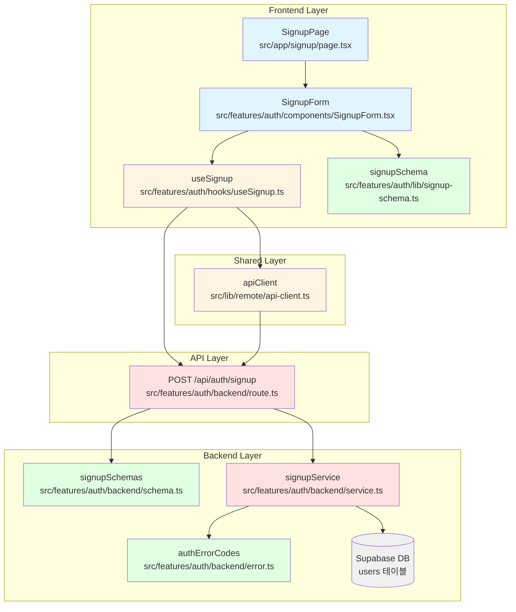

# 유스케이스 001: 신규 사용자 회원가입 - 구현 계획

**문서 버전:** 1.0
**작성일:** 2025-10-17
**관련 문서:**
- 유스케이스: `docs/usecases/001/spec.md`
- 유저플로우: `docs/userflow.md` (유저플로우 1)
- 데이터베이스: `docs/database.md` (users 테이블)

---

## 1. 개요

신규 사용자 회원가입 기능을 커스텀 구현합니다. 기존 `/signup` 페이지는 Supabase Auth를 사용하고 있으나, 유스케이스 요구사항에 따라 닉네임 필드를 포함한 커스텀 인증 시스템으로 재구현합니다.

### 1.1 주요 모듈 목록

| 모듈명 | 위치 | 설명 |
|--------|------|------|
| **SignupPage** | `src/app/signup/page.tsx` | 회원가입 페이지 컴포넌트 (기존 재작성) |
| **SignupForm** | `src/features/auth/components/SignupForm.tsx` | 회원가입 폼 컴포넌트 |
| **signupSchema** | `src/features/auth/lib/signup-schema.ts` | 클라이언트 측 폼 스키마 |
| **useSignup** | `src/features/auth/hooks/useSignup.ts` | 회원가입 API 호출 훅 |
| **SignupRoute** | `src/features/auth/backend/route.ts` | Hono 라우터 (POST /api/auth/signup) |
| **signupService** | `src/features/auth/backend/service.ts` | 회원가입 비즈니스 로직 |
| **signupSchemas** | `src/features/auth/backend/schema.ts` | 서버 측 요청/응답 스키마 |
| **authErrorCodes** | `src/features/auth/backend/error.ts` | 회원가입 관련 에러 코드 |

---

## 2. 아키텍처 다이어그램



---

## 3. 구현 계획

### 3.1 프론트엔드 레이어

#### 3.1.1 페이지 컴포넌트 (`src/app/signup/page.tsx`)

**목적:** 회원가입 페이지의 최상위 컴포넌트

**구현 내용:**
```typescript
"use client";

import { SignupForm } from "@/features/auth/components/SignupForm";

export default function SignupPage() {
  return (
    <div className="mx-auto flex min-h-screen w-full max-w-4xl flex-col items-center justify-center gap-10 px-6 py-16">
      <header className="flex flex-col items-center gap-3 text-center">
        <h1 className="text-3xl font-semibold">회원가입</h1>
        <p className="text-slate-500">
          닉네임, 이메일, 비밀번호를 입력하여 계정을 생성하세요.
        </p>
      </header>
      <div className="grid w-full gap-8 md:grid-cols-2">
        <SignupForm />
        <figure className="overflow-hidden rounded-xl border border-slate-200">
          
        </figure>
      </div>
    </div>
  );
}
```

**QA 시트:**
- [ ] 페이지가 화면 중앙에 정렬되는가?
- [ ] 반응형 디자인이 모바일/태블릿/데스크톱에서 정상 동작하는가?
- [ ] 이미 로그인한 사용자가 접근 시 홈으로 리디렉션되는가? (선택적, useCurrentUser 활용)

---

#### 3.1.2 회원가입 폼 컴포넌트 (`src/features/auth/components/SignupForm.tsx`)

**목적:** 회원가입 폼 UI 및 유효성 검증 처리

**구현 내용:**
- react-hook-form + zod 사용
- 입력 필드: 닉네임, 이메일, 비밀번호, 비밀번호 확인
- shadcn-ui 컴포넌트 사용 (Input, Label, Button, Form, toast)
- 에러 메시지는 필드 하단에 빨간색으로 표시
- 로딩 상태: 버튼 비활성화 + 스피너 표시
- 성공 시: 토스트 메시지 + 로그인 페이지로 리디렉션

**QA 시트:**
- [ ] 모든 필드가 필수로 표시되고 검증되는가?
- [ ] 이메일 형식이 올바르지 않으면 "올바른 이메일 형식이 아닙니다" 표시되는가?
- [ ] 비밀번호가 8자 미만이면 "비밀번호는 8자 이상이어야 합니다" 표시되는가?
- [ ] 비밀번호와 비밀번호 확인이 일치하지 않으면 "비밀번호가 일치하지 않습니다" 표시되는가?
- [ ] 제출 중에는 버튼이 비활성화되고 "처리 중..." 텍스트가 표시되는가?
- [ ] 서버 에러 시 적절한 메시지가 표시되는가? (닉네임 중복, 이메일 중복 등)
- [ ] 회원가입 성공 시 "회원가입이 완료되었습니다" 토스트가 표시되고 `/login`으로 이동하는가?
- [ ] "이미 계정이 있으신가요? 로그인" 링크가 표시되고 클릭 시 로그인 페이지로 이동하는가?
- [ ] 키보드로 모든 필드에 접근 가능한가? (Tab 순서)
- [ ] Enter 키로 폼 제출이 가능한가?
- [ ] 포커스 시 입력 필드의 테두리 색상이 변경되는가?
- [ ] 오류가 있는 필드는 빨간색 테두리로 강조되는가?

---

#### 3.1.3 폼 스키마 (`src/features/auth/lib/signup-schema.ts`)

**목적:** 클라이언트 측 폼 유효성 검증 스키마

**구현 내용:**
```typescript
import { z } from "zod";

export const signupFormSchema = z
  .object({
    nickname: z
      .string()
      .min(1, { message: "닉네임을 입력해주세요" })
      .trim(),
    email: z
      .string()
      .min(1, { message: "이메일을 입력해주세요" })
      .email({ message: "올바른 이메일 형식이 아닙니다" }),
    password: z
      .string()
      .min(8, { message: "비밀번호는 8자 이상이어야 합니다" }),
    passwordConfirm: z
      .string()
      .min(1, { message: "비밀번호 확인을 입력해주세요" }),
  })
  .refine((data) => data.password === data.passwordConfirm, {
    message: "비밀번호가 일치하지 않습니다",
    path: ["passwordConfirm"],
  });

export type SignupFormData = z.infer<typeof signupFormSchema>;
```

**테스트 케이스:**
- [ ] 닉네임이 빈 문자열이면 검증 실패
- [ ] 이메일이 빈 문자열이면 검증 실패
- [ ] 이메일이 잘못된 형식이면 검증 실패 (`test@`, `test.com`, `@test.com`)
- [ ] 비밀번호가 8자 미만이면 검증 실패
- [ ] 비밀번호와 비밀번호 확인이 다르면 검증 실패
- [ ] 모든 필드가 올바르면 검증 성공

---

#### 3.1.4 회원가입 훅 (`src/features/auth/hooks/useSignup.ts`)

**목적:** 회원가입 API 호출 및 React Query 통합

**구현 내용:**
```typescript
import { useMutation } from "@tanstack/react-query";
import { apiClient } from "@/lib/remote/api-client";
import type { SignupFormData } from "@/features/auth/lib/signup-schema";

type SignupRequest = {
  nickname: string;
  email: string;
  password: string;
  passwordConfirm: string;
};

type SignupResponse = {
  message: string;
};

type SignupError = {
  error: {
    code: string;
    message: string;
    details?: unknown;
  };
};

export const useSignup = () => {
  return useMutation<SignupResponse, SignupError, SignupRequest>({
    mutationFn: async (data) => {
      const response = await apiClient.post<SignupResponse>(
        "/api/auth/signup",
        data
      );
      return response.data;
    },
  });
};
```

**테스트 케이스:**
- [ ] API 호출이 올바른 엔드포인트로 전송되는가?
- [ ] 성공 시 응답 데이터가 반환되는가?
- [ ] 실패 시 에러가 올바르게 처리되는가?
- [ ] isLoading, isError, isSuccess 상태가 정확한가?

---

### 3.2 백엔드 레이어

#### 3.2.1 Hono 라우터 (`src/features/auth/backend/route.ts`)

**목적:** 회원가입 API 엔드포인트 정의

**구현 내용:**
```typescript
import type { Hono } from "hono";
import {
  failure,
  respond,
  type ErrorResult,
} from "@/backend/http/response";
import {
  getLogger,
  getSupabase,
  type AppEnv,
} from "@/backend/hono/context";
import {
  SignupRequestSchema,
  type SignupServiceError,
} from "./schema";
import { signupUser } from "./service";
import { authErrorCodes } from "./error";

export const registerAuthRoutes = (app: Hono<AppEnv>) => {
  app.post("/auth/signup", async (c) => {
    const body = await c.req.json();
    const parsedBody = SignupRequestSchema.safeParse(body);

    if (!parsedBody.success) {
      return respond(
        c,
        failure(
          400,
          "INVALID_SIGNUP_DATA",
          "입력 데이터가 올바르지 않습니다.",
          parsedBody.error.format(),
        ),
      );
    }

    const supabase = getSupabase(c);
    const logger = getLogger(c);

    const result = await signupUser(supabase, parsedBody.data);

    if (!result.ok) {
      const errorResult = result as ErrorResult<SignupServiceError, unknown>;

      // 에러 로깅
      if (
        errorResult.error.code === authErrorCodes.signupFetchError ||
        errorResult.error.code === authErrorCodes.passwordHashError
      ) {
        logger.error("Signup failed", errorResult.error.message);
      }

      return respond(c, result);
    }

    return respond(c, result);
  });
};
```

**테스트 케이스:**
- [ ] 유효하지 않은 요청 본문이면 400 에러 반환
- [ ] 서비스 성공 시 201 상태 코드 반환
- [ ] 서비스 실패 시 적절한 에러 코드 반환 (409, 500)
- [ ] 모든 에러가 로깅되는가?

---

#### 3.2.2 회원가입 서비스 (`src/features/auth/backend/service.ts`)

**목적:** 회원가입 비즈니스 로직 처리

**구현 내용:**
```typescript
import type { SupabaseClient } from "@supabase/supabase-js";
import {
  failure,
  success,
  type HandlerResult,
} from "@/backend/http/response";
import type {
  SignupRequest,
  SignupResponse,
  SignupServiceError,
} from "./schema";
import { authErrorCodes } from "./error";
import { hash } from "bcryptjs"; // 또는 적절한 해싱 라이브러리

const USERS_TABLE = "users";
const BCRYPT_ROUNDS = 10;

export const signupUser = async (
  client: SupabaseClient,
  data: SignupRequest,
): Promise<HandlerResult<SignupResponse, SignupServiceError, unknown>> => {
  // 1. 닉네임 중복 확인
  const { data: nicknameExists, error: nicknameError } = await client
    .from(USERS_TABLE)
    .select("id")
    .eq("nickname", data.nickname)
    .maybeSingle();

  if (nicknameError) {
    return failure(500, authErrorCodes.signupFetchError, nicknameError.message);
  }

  if (nicknameExists) {
    return failure(
      409,
      authErrorCodes.nicknameDuplicate,
      "이미 사용 중인 닉네임입니다"
    );
  }

  // 2. 이메일 중복 확인
  const { data: emailExists, error: emailError } = await client
    .from(USERS_TABLE)
    .select("id")
    .eq("email", data.email)
    .maybeSingle();

  if (emailError) {
    return failure(500, authErrorCodes.signupFetchError, emailError.message);
  }

  if (emailExists) {
    return failure(
      409,
      authErrorCodes.emailDuplicate,
      "이미 가입된 이메일입니다"
    );
  }

  // 3. 비밀번호 해싱
  let passwordHash: string;
  try {
    passwordHash = await hash(data.password, BCRYPT_ROUNDS);
  } catch (error) {
    return failure(
      500,
      authErrorCodes.passwordHashError,
      "비밀번호 암호화 중 오류가 발생했습니다"
    );
  }

  // 4. 사용자 생성
  const { error: insertError } = await client.from(USERS_TABLE).insert({
    nickname: data.nickname,
    email: data.email,
    password_hash: passwordHash,
  });

  if (insertError) {
    return failure(500, authErrorCodes.signupFetchError, insertError.message);
  }

  // 5. 성공 응답
  return success(
    { message: "회원가입이 완료되었습니다" },
    201
  );
};
```

**테스트 케이스:**
- [ ] 닉네임이 중복이면 409 에러 반환
- [ ] 이메일이 중복이면 409 에러 반환
- [ ] 비밀번호가 안전하게 해싱되는가?
- [ ] 사용자 정보가 데이터베이스에 저장되는가?
- [ ] 성공 시 201 상태 코드와 성공 메시지 반환
- [ ] 데이터베이스 오류 시 500 에러 반환

**주의사항:**
- bcryptjs 라이브러리 설치 필요: `npm install bcryptjs @types/bcryptjs`
- 비밀번호 해싱 cost factor는 10으로 설정 (성능과 보안 균형)

---

#### 3.2.3 요청/응답 스키마 (`src/features/auth/backend/schema.ts`)

**목적:** 서버 측 요청/응답 검증 스키마

**구현 내용:**
```typescript
import { z } from "zod";

export const SignupRequestSchema = z
  .object({
    nickname: z.string().min(1, { message: "닉네임은 필수입니다" }).trim(),
    email: z
      .string()
      .min(1, { message: "이메일은 필수입니다" })
      .email({ message: "올바른 이메일 형식이 아닙니다" }),
    password: z
      .string()
      .min(8, { message: "비밀번호는 8자 이상이어야 합니다" }),
    passwordConfirm: z.string().min(1, { message: "비밀번호 확인은 필수입니다" }),
  })
  .refine((data) => data.password === data.passwordConfirm, {
    message: "비밀번호가 일치하지 않습니다",
    path: ["passwordConfirm"],
  });

export type SignupRequest = z.infer<typeof SignupRequestSchema>;

export const SignupResponseSchema = z.object({
  message: z.string(),
});

export type SignupResponse = z.infer<typeof SignupResponseSchema>;

// 서비스 에러 타입
export type SignupServiceError =
  | "NICKNAME_DUPLICATE"
  | "EMAIL_DUPLICATE"
  | "SIGNUP_FETCH_ERROR"
  | "PASSWORD_HASH_ERROR";
```

**테스트 케이스:**
- [ ] 모든 필수 필드 검증
- [ ] 이메일 형식 검증
- [ ] 비밀번호 길이 검증
- [ ] 비밀번호 일치 검증

---

#### 3.2.4 에러 코드 정의 (`src/features/auth/backend/error.ts`)

**목적:** 회원가입 관련 에러 코드 정의

**구현 내용:**
```typescript
export const authErrorCodes = {
  nicknameDuplicate: "NICKNAME_DUPLICATE",
  emailDuplicate: "EMAIL_DUPLICATE",
  signupFetchError: "SIGNUP_FETCH_ERROR",
  passwordHashError: "PASSWORD_HASH_ERROR",
  invalidCredentials: "INVALID_CREDENTIALS",
  loginFetchError: "LOGIN_FETCH_ERROR",
} as const;

type AuthErrorValue = (typeof authErrorCodes)[keyof typeof authErrorCodes];

export type AuthServiceError = AuthErrorValue;
```

---

### 3.3 Hono 앱 등록

**위치:** `src/backend/hono/app.ts`

**구현 내용:**
```typescript
import { registerAuthRoutes } from "@/features/auth/backend/route";

export const createHonoApp = () => {
  const app = new Hono<AppEnv>();

  // ... 기존 미들웨어 ...

  // 라우터 등록
  registerExampleRoutes(app);
  registerAuthRoutes(app); // 추가

  return app;
};
```

---

### 3.4 shadcn-ui 컴포넌트 설치

회원가입 폼 구현을 위해 다음 shadcn-ui 컴포넌트를 설치해야 합니다:

```bash
npx shadcn@latest add input
npx shadcn@latest add button
npx shadcn@latest add label
npx shadcn@latest add form
npx shadcn@latest add toast
```

---

### 3.5 npm 패키지 설치

비밀번호 해싱을 위해 bcryptjs를 설치해야 합니다:

```bash
npm install bcryptjs
npm install --save-dev @types/bcryptjs
```

---

## 4. 구현 순서

### Phase 1: 백엔드 구현
1. **에러 코드 정의** (`src/features/auth/backend/error.ts`)
2. **요청/응답 스키마** (`src/features/auth/backend/schema.ts`)
3. **회원가입 서비스** (`src/features/auth/backend/service.ts`)
4. **Hono 라우터** (`src/features/auth/backend/route.ts`)
5. **Hono 앱 등록** (`src/backend/hono/app.ts`)

### Phase 2: 프론트엔드 구현
6. **shadcn-ui 컴포넌트 설치**
7. **폼 스키마** (`src/features/auth/lib/signup-schema.ts`)
8. **회원가입 훅** (`src/features/auth/hooks/useSignup.ts`)
9. **회원가입 폼 컴포넌트** (`src/features/auth/components/SignupForm.tsx`)
10. **페이지 컴포넌트 재작성** (`src/app/signup/page.tsx`)

### Phase 3: 테스트 및 검증
11. **각 Edge Case 시나리오 테스트**
12. **UI/UX 요구사항 검증**
13. **성능 요구사항 검증**

---

## 5. Edge Cases 처리 매핑

| Edge Case | 처리 위치 | 구현 방법 |
|-----------|-----------|-----------|
| EC-1: 필수 입력 필드 누락 | 클라이언트 (zod) | react-hook-form 에러 표시 |
| EC-2: 이메일 형식 오류 | 클라이언트 (zod) | react-hook-form 에러 표시 |
| EC-3: 비밀번호 정책 위반 | 클라이언트 (zod) | react-hook-form 에러 표시 |
| EC-4: 비밀번호 불일치 | 클라이언트 (zod) | react-hook-form 에러 표시 |
| EC-5: 닉네임 중복 | 서버 (service) | 409 응답, 토스트 메시지 |
| EC-6: 이메일 중복 | 서버 (service) | 409 응답, 토스트 메시지 |
| EC-7: 서버 오류 | 서버 (service) | 500 응답, 토스트 메시지 |
| EC-8: 네트워크 오류 | 클라이언트 (hook) | React Query 에러 처리 |

---

## 6. 보안 고려사항

1. **비밀번호 해싱**: bcryptjs 사용, cost factor 10
2. **SQL Injection 방지**: Supabase 클라이언트가 자동 처리
3. **XSS 방지**: React의 자동 이스케이핑
4. **CSRF 방지**: SameSite 쿠키 설정 (인증 구현 시)
5. **입력 검증**: 클라이언트 + 서버 이중 검증
6. **에러 메시지**: 민감한 정보 노출 방지

---

## 7. 성능 최적화

1. **인덱스 활용**: `users.nickname`, `users.email` 인덱스 (이미 생성됨)
2. **중복 확인 쿼리**: `maybeSingle()` 사용으로 불필요한 데이터 조회 방지
3. **비밀번호 해싱**: bcrypt cost factor 10으로 성능 균형
4. **React Query**: 자동 에러 재시도 및 캐싱

---

## 8. 테스트 체크리스트

### 정상 플로우
- [ ] 모든 필드를 올바르게 입력하면 회원가입 성공
- [ ] 회원가입 성공 시 데이터베이스에 사용자 저장됨
- [ ] 비밀번호가 해싱되어 저장됨
- [ ] 성공 메시지 표시 후 로그인 페이지로 이동

### Edge Cases
- [ ] EC-1: 필수 필드 누락 시 에러 메시지 표시
- [ ] EC-2: 잘못된 이메일 형식 시 에러 메시지 표시
- [ ] EC-3: 비밀번호 8자 미만 시 에러 메시지 표시
- [ ] EC-4: 비밀번호 불일치 시 에러 메시지 표시
- [ ] EC-5: 닉네임 중복 시 409 에러 + 에러 메시지
- [ ] EC-6: 이메일 중복 시 409 에러 + 에러 메시지
- [ ] EC-7: 서버 오류 시 500 에러 + 에러 메시지
- [ ] EC-8: 네트워크 오류 시 적절한 메시지 표시

### UI/UX
- [ ] 폼이 화면 중앙에 정렬됨
- [ ] 모든 필드가 명확한 레이블을 가짐
- [ ] 오류 필드는 빨간색 테두리로 강조
- [ ] 오류 메시지는 필드 하단에 빨간색 표시
- [ ] 로딩 중 버튼 비활성화 + 스피너 표시
- [ ] 성공 시 토스트 메시지 표시
- [ ] 키보드 네비게이션 가능 (Tab, Enter)
- [ ] 반응형 디자인 동작 (모바일/태블릿/데스크톱)

---

## 9. 향후 개선 사항

1. **이메일 인증**: 회원가입 후 이메일 인증 링크 전송
2. **닉네임 실시간 중복 확인**: debounce를 사용한 입력 중 중복 확인
3. **비밀번호 강도 표시**: 비밀번호 입력 시 강도 게이지 표시
4. **소셜 로그인**: Google, GitHub 등 OAuth 연동
5. **비밀번호 정책 강화**: 특수문자, 숫자 포함 등

---

## 10. 의존성 및 충돌 확인

### 기존 코드베이스와의 호환성
- ✅ `src/features/auth` 디렉토리 존재 (types.ts, hooks, context, server)
- ✅ `src/backend/hono/app.ts`에 라우터 등록 패턴 확립됨
- ✅ `src/backend/http/response.ts` 공통 응답 헬퍼 존재
- ✅ `src/features/example` 참고 구조 존재

### 신규 생성 파일
- `src/features/auth/components/SignupForm.tsx` (신규)
- `src/features/auth/lib/signup-schema.ts` (신규)
- `src/features/auth/hooks/useSignup.ts` (신규)
- `src/features/auth/backend/route.ts` (신규)
- `src/features/auth/backend/service.ts` (신규)
- `src/features/auth/backend/schema.ts` (신규)
- `src/features/auth/backend/error.ts` (신규)

### 재작성 파일
- `src/app/signup/page.tsx` (기존 Supabase Auth → 커스텀 구현)

---

## 11. 참고사항

- 기존 `/signup` 페이지는 Supabase Auth를 사용하고 있으므로, 커스텀 구현으로 완전히 재작성합니다.
- 유스케이스 문서의 요구사항(닉네임 필드 포함)을 충족하기 위해 커스텀 인증을 구현합니다.
- Hono 백엔드 패턴(`registerExampleRoutes`)을 따라 일관된 구조를 유지합니다.
- 모든 에러 처리는 `success`/`failure`/`respond` 패턴을 따릅니다.
- 클라이언트 측 HTTP 요청은 `@/lib/remote/api-client`를 통해 수행합니다.
