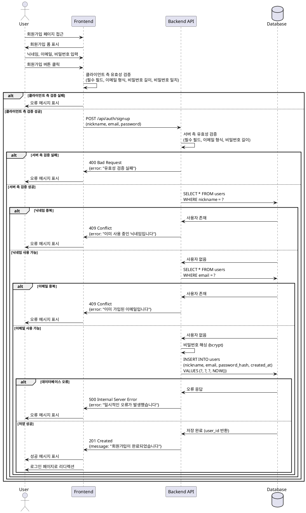

# 유스케이스 001: 신규 사용자 회원가입

## 개요

신규 사용자가 실시간 채팅 서비스를 이용하기 위해 계정을 생성하는 기능입니다. 사용자는 닉네임, 이메일, 비밀번호를 입력하여 회원가입을 완료하고, 로그인 페이지로 이동하여 서비스를 이용할 수 있습니다.

## Primary Actor

- 신규 사용자 (미가입 상태의 방문자)

## Precondition

- 사용자가 회원가입 페이지(`/auth/signup`)에 접근할 수 있어야 합니다.
- 사용자가 아직 가입하지 않은 상태여야 합니다.

## Trigger

- 사용자가 로그인 페이지에서 '회원가입' 링크를 클릭하여 회원가입 페이지로 이동합니다.
- 회원가입 페이지에서 필요한 정보를 입력하고 '회원가입' 버튼을 클릭합니다.

## Main Scenario

1. 사용자가 회원가입 페이지에 접근합니다.
2. 시스템은 회원가입 폼(닉네임, 이메일, 비밀번호, 비밀번호 확인 입력 필드)을 표시합니다.
3. 사용자가 닉네임을 입력합니다.
4. 사용자가 이메일 주소를 입력합니다.
5. 사용자가 비밀번호를 입력합니다 (8자 이상).
6. 사용자가 비밀번호 확인을 위해 동일한 비밀번호를 다시 입력합니다.
7. 사용자가 '회원가입' 버튼을 클릭합니다.
8. 시스템은 클라이언트 측에서 입력 데이터의 형식과 유효성을 검증합니다:
   - 모든 필수 필드가 입력되었는지 확인
   - 이메일 형식이 올바른지 확인
   - 비밀번호가 8자 이상인지 확인
   - 비밀번호와 비밀번호 확인이 일치하는지 확인
9. 시스템은 서버로 회원가입 요청을 전송합니다.
10. 서버는 입력된 데이터의 유효성을 재검증합니다.
11. 서버는 데이터베이스에서 닉네임 중복 여부를 확인합니다.
12. 서버는 데이터베이스에서 이메일 중복 여부를 확인합니다.
13. 서버는 비밀번호를 안전하게 해싱(hashing) 처리합니다.
14. 서버는 사용자 정보(닉네임, 이메일, 해싱된 비밀번호, 가입일시)를 데이터베이스에 저장합니다.
15. 서버는 성공 응답을 클라이언트에 반환합니다.
16. 시스템은 회원가입 완료 피드백 메시지를 사용자에게 표시합니다.
17. 시스템은 사용자를 로그인 페이지(`/auth/login`)로 리디렉션합니다.

## Edge Cases

### EC-1: 필수 입력 필드 누락

**조건:** 사용자가 하나 이상의 필수 필드를 입력하지 않고 회원가입 버튼을 클릭한 경우

**처리:**
- 시스템은 비어있는 필드를 시각적으로 강조 표시합니다.
- 각 필드에 대해 "이 필드는 필수입니다" 오류 메시지를 표시합니다.
- 사용자는 회원가입 페이지에 머무르며, 이미 입력한 값은 유지됩니다 (비밀번호 제외).

### EC-2: 이메일 형식 오류

**조건:** 사용자가 올바르지 않은 이메일 형식을 입력한 경우 (예: `test@`, `test.com`, `@test.com`)

**처리:**
- 시스템은 이메일 입력 필드를 강조 표시합니다.
- "올바른 이메일 형식이 아닙니다" 오류 메시지를 표시합니다.
- 사용자는 회원가입 페이지에 머무르며, 이메일을 제외한 입력 값은 유지됩니다 (비밀번호 제외).

### EC-3: 비밀번호 정책 위반

**조건:** 사용자가 8자 미만의 비밀번호를 입력한 경우

**처리:**
- 시스템은 비밀번호 입력 필드를 강조 표시합니다.
- "비밀번호는 8자 이상이어야 합니다" 오류 메시지를 표시합니다.
- 사용자는 회원가입 페이지에 머무르며, 비밀번호를 제외한 입력 값은 유지됩니다.

### EC-4: 비밀번호 불일치

**조건:** 사용자가 비밀번호와 비밀번호 확인 필드에 서로 다른 값을 입력한 경우

**처리:**
- 시스템은 비밀번호 확인 입력 필드를 강조 표시합니다.
- "비밀번호가 일치하지 않습니다" 오류 메시지를 표시합니다.
- 사용자는 회원가입 페이지에 머무르며, 비밀번호 필드를 제외한 입력 값은 유지됩니다.

### EC-5: 닉네임 중복

**조건:** 사용자가 입력한 닉네임이 이미 다른 사용자가 사용 중인 경우

**처리:**
- 서버는 409 Conflict 상태 코드와 함께 오류 응답을 반환합니다.
- 시스템은 닉네임 입력 필드를 강조 표시합니다.
- "이미 사용 중인 닉네임입니다" 오류 메시지를 표시합니다.
- 사용자는 회원가입 페이지에 머무르며, 비밀번호를 제외한 입력 값은 유지됩니다.

### EC-6: 이메일 중복

**조건:** 사용자가 입력한 이메일이 이미 가입된 이메일인 경우

**처리:**
- 서버는 409 Conflict 상태 코드와 함께 오류 응답을 반환합니다.
- 시스템은 이메일 입력 필드를 강조 표시합니다.
- "이미 가입된 이메일입니다" 오류 메시지를 표시합니다.
- 사용자는 회원가입 페이지에 머무르며, 비밀번호를 제외한 입력 값은 유지됩니다.

### EC-7: 서버 오류

**조건:** 서버에서 예상치 못한 오류가 발생한 경우 (데이터베이스 연결 실패, 내부 서버 오류 등)

**처리:**
- 서버는 500 Internal Server Error 상태 코드와 함께 오류 응답을 반환합니다.
- 시스템은 "일시적인 오류가 발생했습니다. 잠시 후 다시 시도해주세요" 메시지를 표시합니다.
- 사용자는 회원가입 페이지에 머무르며, 비밀번호를 제외한 입력 값은 유지됩니다.

### EC-8: 네트워크 오류

**조건:** 클라이언트와 서버 간 네트워크 연결이 끊긴 경우

**처리:**
- 시스템은 "네트워크 연결을 확인해주세요" 메시지를 표시합니다.
- 사용자는 회원가입 페이지에 머무르며, 비밀번호를 제외한 입력 값은 유지됩니다.

## Business Rules

### BR-1: 닉네임 규칙

- 닉네임은 필수 입력 항목입니다.
- 닉네임은 시스템 전체에서 고유해야 합니다 (중복 불가).
- 닉네임은 최소 1자 이상이어야 합니다.
- 닉네임의 최대 길이는 별도 제한이 없으나, UI/UX 고려하여 적절한 길이로 제한할 수 있습니다.

### BR-2: 이메일 규칙

- 이메일은 필수 입력 항목입니다.
- 이메일은 시스템 전체에서 고유해야 합니다 (중복 불가).
- 이메일은 표준 이메일 형식을 따라야 합니다 (RFC 5322 준수).
- 이메일은 사용자 식별 및 로그인의 주요 수단으로 사용됩니다.

### BR-3: 비밀번호 규칙

- 비밀번호는 필수 입력 항목입니다.
- 비밀번호는 최소 8자 이상이어야 합니다.
- 비밀번호는 데이터베이스에 저장하기 전에 반드시 해싱(hashing) 처리되어야 합니다.
- 비밀번호는 평문으로 저장되거나 전송되어서는 안 됩니다.
- 비밀번호 확인 필드와 일치해야 합니다.

### BR-4: 데이터 보안

- 모든 사용자 입력 데이터는 클라이언트와 서버 양쪽에서 검증되어야 합니다.
- 비밀번호는 bcrypt, argon2, 또는 이에 준하는 안전한 해싱 알고리즘을 사용하여 암호화되어야 합니다.
- 개인정보(이메일, 닉네임)는 HTTPS를 통해 암호화되어 전송되어야 합니다.

### BR-5: 회원가입 완료 처리

- 회원가입이 성공적으로 완료되면 사용자는 자동으로 로그인되지 않습니다.
- 사용자는 로그인 페이지로 리디렉션되며, 직접 로그인해야 합니다.
- 회원가입 완료 시 사용자에게 성공 피드백이 명확하게 표시되어야 합니다.

### BR-6: 가입일시 기록

- 모든 사용자의 가입일시는 서버의 현재 시간 기준으로 자동 기록됩니다.
- 가입일시는 UTC 기준으로 저장되어야 합니다.
- 가입일시는 사용자가 수정할 수 없습니다.

## Validation Rules

### VR-1: 클라이언트 측 검증

**목적:** 서버 요청 전에 기본적인 입력 오류를 빠르게 감지하여 UX를 개선합니다.

**규칙:**
- 닉네임: 비어있지 않아야 함
- 이메일: 비어있지 않아야 하며, 기본 이메일 형식 패턴 일치 (`/^[^\s@]+@[^\s@]+\.[^\s@]+$/`)
- 비밀번호: 비어있지 않아야 하며, 8자 이상
- 비밀번호 확인: 비어있지 않아야 하며, 비밀번호와 정확히 일치

**시점:** 사용자가 '회원가입' 버튼을 클릭한 직후, 서버 요청 전

### VR-2: 서버 측 검증

**목적:** 클라이언트 측 검증을 우회한 요청이나 악의적인 요청으로부터 시스템을 보호합니다.

**규칙:**
- 닉네임:
  - 필수 값
  - 데이터베이스에서 중복 확인
  - SQL Injection, XSS 공격 방어를 위한 입력 sanitization
- 이메일:
  - 필수 값
  - RFC 5322 표준 이메일 형식 검증
  - 데이터베이스에서 중복 확인
  - SQL Injection, XSS 공격 방어를 위한 입력 sanitization
- 비밀번호:
  - 필수 값
  - 최소 8자 이상
- 비밀번호 확인:
  - 필수 값
  - 비밀번호와 일치

**시점:** API 요청을 받은 직후, 비즈니스 로직 실행 전

### VR-3: 데이터베이스 제약 조건

**목적:** 데이터 무결성을 보장합니다.

**규칙:**
- `users` 테이블의 `email` 컬럼은 UNIQUE 제약 조건 적용
- `users` 테이블의 `nickname` 컬럼은 UNIQUE 제약 조건 적용
- `email`, `nickname`, `password_hash` 컬럼은 NOT NULL 제약 조건 적용
- `created_at` 컬럼은 DEFAULT 값으로 현재 시간 자동 설정

## UI/UX 요구사항

### UI-1: 회원가입 폼 레이아웃

- 회원가입 폼은 화면 중앙에 배치되어야 합니다.
- 폼 상단에 "회원가입" 제목이 명확하게 표시되어야 합니다.
- 입력 필드는 다음 순서로 세로로 배치됩니다:
  1. 닉네임
  2. 이메일
  3. 비밀번호
  4. 비밀번호 확인
- 각 입력 필드는 명확한 레이블을 가져야 합니다.
- 비밀번호 필드는 입력 내용이 마스킹 처리되어야 합니다 (●●●●).

### UI-2: 입력 필드 가이드

- 이메일 필드에는 placeholder로 "example@email.com" 같은 예시를 표시합니다.
- 비밀번호 필드 하단에 "비밀번호는 8자 이상이어야 합니다" 안내 문구를 표시합니다.
- 각 입력 필드는 포커스 시 시각적 피드백(테두리 색상 변경 등)을 제공해야 합니다.

### UI-3: 오류 메시지 표시

- 오류 메시지는 해당 입력 필드 바로 아래에 빨간색으로 표시됩니다.
- 오류가 있는 입력 필드는 빨간색 테두리로 강조됩니다.
- 여러 필드에 오류가 있을 경우, 모든 오류 메시지가 동시에 표시됩니다.
- 오류 메시지는 명확하고 구체적이어야 하며, 사용자가 무엇을 수정해야 하는지 알 수 있어야 합니다.

### UI-4: 성공 피드백

- 회원가입 성공 시 화면 상단 또는 중앙에 "회원가입이 완료되었습니다" 메시지를 2-3초간 표시합니다.
- 성공 메시지는 녹색 배경에 흰색 텍스트로 표시되어 명확하게 구분됩니다.
- 성공 메시지 표시 후 자동으로 로그인 페이지로 이동합니다.

### UI-5: 로딩 상태

- '회원가입' 버튼 클릭 후 서버 응답을 기다리는 동안:
  - 버튼에 로딩 스피너를 표시합니다.
  - 버튼 텍스트를 "처리 중..."으로 변경합니다.
  - 버튼을 비활성화하여 중복 제출을 방지합니다.
  - 모든 입력 필드를 비활성화합니다.

### UI-6: 접근성

- 모든 입력 필드는 키보드로 접근 가능해야 합니다 (Tab 키 순서).
- Enter 키를 눌러 폼을 제출할 수 있어야 합니다.
- 스크린 리더를 위한 적절한 ARIA 레이블을 제공해야 합니다.
- 오류 메시지는 스크린 리더에서 읽을 수 있어야 합니다.

### UI-7: 반응형 디자인

- 모바일, 태블릿, 데스크톱 화면 크기에서 모두 사용 가능해야 합니다.
- 작은 화면에서는 폼이 화면 너비의 대부분을 차지하며 적절한 여백을 유지해야 합니다.
- 입력 필드와 버튼은 터치 기기에서 쉽게 탭할 수 있는 크기여야 합니다 (최소 44x44px).

### UI-8: 네비게이션

- 폼 하단에 "이미 계정이 있으신가요? 로그인" 링크를 제공합니다.
- 링크 클릭 시 로그인 페이지로 이동합니다.

## 성능 요구사항

### PF-1: 응답 시간

- 클라이언트 측 유효성 검증은 즉시 (50ms 이내) 수행되어야 합니다.
- 서버 측 회원가입 API 응답 시간은 정상 조건에서 1초 이내여야 합니다.
- 네트워크 지연을 고려하여 전체 회원가입 프로세스는 3초 이내에 완료되어야 합니다.

### PF-2: 중복 확인 최적화

- 닉네임과 이메일 중복 확인은 데이터베이스 인덱스를 활용하여 빠르게 조회되어야 합니다.
- 중복 확인 쿼리는 100ms 이내에 완료되어야 합니다.

### PF-3: 비밀번호 해싱

- 비밀번호 해싱은 충분히 안전하면서도 과도한 지연을 발생시키지 않아야 합니다.
- bcrypt의 경우 cost factor 10~12를 권장합니다 (약 100~300ms 소요).

### PF-4: 동시 사용자 처리

- 시스템은 동시에 최소 100명의 사용자가 회원가입을 시도할 수 있어야 합니다.
- 데이터베이스 연결 풀을 적절히 설정하여 동시 요청을 처리합니다.

### PF-5: 오류 복구

- 일시적인 데이터베이스 오류 발생 시 최소 1회 재시도를 수행합니다.
- 재시도는 exponential backoff 패턴을 사용합니다.

## Sequence Diagram

## Postconditions

### 성공 시

- 새로운 사용자 계정이 데이터베이스의 `users` 테이블에 생성됩니다.
- 사용자의 비밀번호는 안전하게 해싱되어 저장됩니다.
- 사용자의 가입일시가 자동으로 기록됩니다.
- 사용자는 로그인 페이지로 리디렉션되어 즉시 로그인할 수 있습니다.
- 생성된 닉네임과 이메일은 시스템 전체에서 고유하게 유지됩니다.

### 실패 시

- 데이터베이스에 어떠한 변경도 발생하지 않습니다.
- 사용자는 회원가입 페이지에 머무릅니다.
- 비밀번호를 제외한 입력 값은 유지되어 사용자가 다시 입력할 필요가 없습니다.
- 명확한 오류 메시지가 표시되어 사용자가 문제를 해결할 수 있습니다.

## 관련 유스케이스

- 유스케이스 002: 사용자 로그인
- 유스케이스 003: 비밀번호 찾기
- 유스케이스 007: 마이페이지 정보 확인 및 닉네임 수정

## 참고사항

- 이 유스케이스는 `docs/userflow.md`의 "유저플로우 1: 신규 사용자 회원가입"을 기반으로 작성되었습니다.
- 실제 구현 시 Supabase Auth를 사용할 경우, 일부 인증 로직이 Supabase에 위임될 수 있습니다.
- GDPR 및 개인정보보호법 준수를 위해 사용자 데이터 처리 방침을 명확히 안내해야 합니다.
