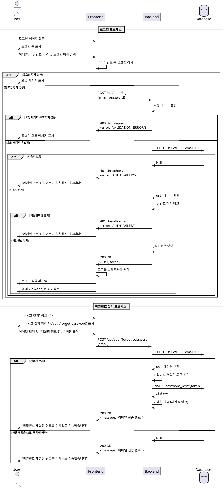

# 유스케이스 002: 사용자 로그인

## 1. 개요

사용자가 이메일과 비밀번호를 사용하여 시스템에 인증하고, 인증된 세션을 통해 채팅 서비스에 접근할 수 있도록 한다.

## 2. Primary Actor

- **사용자 (User)**: 이미 회원가입을 완료한 사용자로, 로그인을 통해 시스템에 접근하고자 하는 사람

## 3. Preconditions (사전 조건)

- 사용자가 이미 시스템에 회원가입을 완료한 상태여야 한다.
- 사용자가 등록된 이메일 주소와 비밀번호를 알고 있어야 한다.
- 로그인 페이지(`/auth/login`)에 접근 가능해야 한다.
- 사용자가 현재 로그인되지 않은 상태여야 한다.

## 4. Trigger (트리거)

- 사용자가 로그인 페이지에 접근하여 로그인 버튼을 클릭한다.
- 또는 인증이 필요한 페이지 접근 시 자동으로 로그인 페이지로 리디렉션된다.

## 5. Main Scenario (기본 시나리오)

### 5.1 사용자 로그인 프로세스 (현재 구현 범위)

1. **[User]** 사용자가 로그인 페이지(`/auth/login`)에 접근한다.
2. **[FE]** 시스템이 로그인 폼(이메일, 비밀번호 입력 필드)을 표시한다.
3. **[User]** 사용자가 이메일과 비밀번호를 입력한다.
4. **[User]** 사용자가 '로그인' 버튼을 클릭한다.
5. **[FE]** 클라이언트가 입력 데이터의 기본 유효성(필드 공백 여부)을 검사한다.
6. **[FE → BE]** 클라이언트가 로그인 요청(POST `/api/auth/login`)을 서버로 전송한다.
   - Request Body: `{ email: string, password: string }`
7. **[BE]** 서버가 요청 데이터의 유효성을 검사한다.
   - 필수 필드(이메일, 비밀번호) 존재 여부 확인
   - 이메일 형식 유효성 확인
8. **[BE → Database]** 입력된 이메일로 users 테이블에서 사용자 계정을 조회한다.
   - 쿼리: `SELECT * FROM users WHERE email = ?`
9. **[BE]** 조회된 사용자의 password_hash와 입력된 비밀번호를 bcrypt 등으로 비교 검증한다.
10. **[BE]** 인증 성공 시, 사용자 세션 또는 JWT 토큰을 생성한다.
11. **[BE → FE]** 인증 정보(토큰/세션)와 사용자 기본 정보를 응답한다.
    - Response: `{ success: true, user: { id, email, nickname }, token: string }`
12. **[FE]** 클라이언트가 인증 정보를 브라우저에 저장한다. (Cookie, LocalStorage 등)
13. **[FE]** 로그인 성공 피드백을 사용자에게 표시한다.
14. **[FE]** 사용자를 홈 페이지(`/app`)로 리디렉션한다.

## 6. Edge Cases (예외 및 대안 시나리오)

### 6.1 필수 입력 필드 누락

- **Condition**: 이메일 또는 비밀번호 필드가 비어있음
- **Handling**:
  - 클라이언트에서 즉시 유효성 검사 실패 피드백 표시
  - "이메일을 입력해주세요" 또는 "비밀번호를 입력해주세요" 메시지 표시
  - 서버 요청을 보내지 않음

### 6.2 이메일 형식 오류

- **Condition**: 입력된 이메일이 올바른 형식이 아님
- **Handling**:
  - 클라이언트에서 이메일 형식 검증 실패
  - "올바른 이메일 형식을 입력해주세요" 메시지 표시
  - 서버 요청을 보내지 않음

### 6.3 존재하지 않는 이메일

- **Condition**: 입력된 이메일로 등록된 사용자가 없음
- **Handling**:
  - 서버에서 사용자 조회 실패
  - 보안상 구체적인 오류를 노출하지 않음
  - "이메일 또는 비밀번호가 일치하지 않습니다" 통합 메시지 반환
  - HTTP Status: 401 Unauthorized

### 6.4 비밀번호 불일치

- **Condition**: 입력된 비밀번호가 데이터베이스의 해시된 비밀번호와 일치하지 않음
- **Handling**:
  - 서버에서 비밀번호 검증 실패
  - 보안상 구체적인 오류를 노출하지 않음
  - "이메일 또는 비밀번호가 일치하지 않습니다" 통합 메시지 반환
  - HTTP Status: 401 Unauthorized
  - 실패 횟수 카운팅 (향후 계정 잠금 정책 적용 가능)

### 6.5 서버 오류

- **Condition**: 데이터베이스 연결 실패, 예상치 못한 서버 오류 등
- **Handling**:
  - 서버에서 500 Internal Server Error 반환
  - "일시적인 오류가 발생했습니다. 잠시 후 다시 시도해주세요" 메시지 표시
  - 오류 로그 기록

### 6.6 네트워크 오류

- **Condition**: 클라이언트-서버 간 통신 실패
- **Handling**:
  - 클라이언트에서 네트워크 오류 감지
  - "네트워크 연결을 확인해주세요" 메시지 표시
  - 재시도 옵션 제공

### 6.7 이미 로그인된 사용자

- **Condition**: 사용자가 이미 로그인된 상태에서 로그인 페이지에 접근
- **Handling**:
  - 클라이언트에서 인증 상태 확인
  - 홈 페이지(`/app`)로 자동 리디렉션

### 6.8 비밀번호 찾기 - 존재하지 않는 이메일

- **Condition**: 비밀번호 재설정 요청 시 입력된 이메일이 시스템에 없음
- **Handling**:
  - 보안상 이메일 존재 여부를 노출하지 않음
  - "입력하신 이메일로 비밀번호 재설정 링크를 전송했습니다" 메시지 표시 (실제로는 전송 안 함)
  - 또는 "해당 이메일이 등록되어 있지 않습니다" 메시지 표시 (정책에 따라 선택)

## 7. Postconditions (사후 조건)

### 성공 시:
- 사용자가 인증된 세션을 보유하게 된다.
- 브라우저에 인증 정보(토큰/세션)가 저장된다.
- 사용자가 홈 페이지(`/app`)에 접근하여 채팅방 목록을 볼 수 있다.
- 인증이 필요한 모든 기능에 접근할 수 있다.
- 로그인 로그가 시스템에 기록된다.

### 실패 시:
- 사용자가 로그인 페이지에 남아있다.
- 입력된 비밀번호는 보안상 초기화된다.
- 이메일 필드는 유지되어 재시도가 용이하다.
- 실패 사유에 대한 피드백이 화면에 표시된다.

## 8. Business Rules (비즈니스 규칙)

### BR-001: 보안 정책
- 로그인 실패 시 구체적인 실패 사유(이메일 없음 vs 비밀번호 틀림)를 노출하지 않는다.
- 통합된 오류 메시지를 사용하여 보안을 강화한다.

### BR-002: 세션 관리
- 로그인 성공 시 생성된 세션/토큰은 만료 시간을 가진다.
- 세션 만료 후 재로그인이 필요하다.
- 동시 세션 정책: 하나의 계정으로 여러 디바이스에서 로그인 가능 (또는 제한 정책 적용 가능)

### BR-003: 비밀번호 정책
- 비밀번호는 항상 해시된 형태로 저장 및 비교된다.
- 평문 비밀번호는 네트워크를 통해 전송되지만, HTTPS를 통해 암호화된다.

### BR-004: 접근 제어
- 인증되지 않은 사용자는 `/app` 경로의 모든 페이지에 접근할 수 없다.
- 인증 실패 시 자동으로 로그인 페이지로 리디렉션된다.

### BR-005: 비밀번호 재설정
- 비밀번호 재설정 토큰은 일회성이며, 사용 후 즉시 무효화된다.
- 비밀번호 재설정 토큰은 제한된 시간(예: 1시간) 동안만 유효하다.

## 9. Validation Rules (검증 규칙)

### VR-001: 이메일 검증
- 필수 입력 필드
- 이메일 형식 검증: RFC 5322 표준 준수
- 예시: `user@example.com`

### VR-002: 비밀번호 검증
- 필수 입력 필드
- 최소 길이: 8자 (회원가입 시 설정된 정책과 동일)
- 최대 길이: 제한 없음 (단, 합리적인 상한선 설정 권장, 예: 128자)

### VR-003: 요청 제한
- Rate Limiting: 동일 IP에서 5분 내 10회 이상 로그인 실패 시 일시적 차단 (선택적 구현)
- 보안 강화를 위한 CAPTCHA 적용 가능 (과도한 실패 시)

## 10. UI/UX 요구사항

### UI-001: 로그인 폼 레이아웃
- 깔끔하고 직관적인 로그인 폼 제공
- 필드: 이메일, 비밀번호
- 버튼: 로그인
- 링크: 회원가입, 비밀번호 찾기

### UI-002: 입력 필드 상태
- 기본 상태: 테두리 회색
- 포커스 상태: 테두리 강조 색상
- 오류 상태: 테두리 빨간색, 오류 메시지 표시
- 성공 상태: 테두리 녹색 (선택적)

### UI-003: 비밀번호 가시성
- 비밀번호 필드는 기본적으로 마스킹(••••)된다.
- "비밀번호 보기/숨기기" 토글 아이콘 제공

### UI-004: 피드백 메시지
- 오류 메시지는 폼 상단 또는 각 필드 하단에 명확하게 표시
- 색상: 오류(빨강), 성공(녹색), 정보(파랑)
- 아이콘과 함께 표시하여 가독성 향상

### UI-005: 로딩 상태
- 로그인 버튼 클릭 시 로딩 스피너 표시
- 버튼 비활성화로 중복 제출 방지
- "로그인 중..." 텍스트 표시

### UI-006: 접근성
- 모든 입력 필드에 적절한 label 제공
- 키보드 네비게이션 지원 (Tab, Enter)
- 스크린 리더 호환성

### UI-007: 반응형 디자인
- 모바일, 태블릿, 데스크톱 모든 화면 크기 지원
- 모바일에서는 전체 화면 폼 제공

### UI-008: 비밀번호 찾기 페이지
- 간결한 이메일 입력 폼
- 명확한 안내 문구: "가입하신 이메일 주소를 입력하시면 비밀번호 재설정 링크를 보내드립니다."
- 이메일 전송 완료 후 확인 메시지 표시

## 11. 성능 요구사항

### PERF-001: 응답 시간
- 로그인 요청 처리 시간: 평균 500ms 이하
- 최대 응답 시간: 2초 이하
- 데이터베이스 쿼리 최적화 필요

### PERF-002: 동시 접속
- 동시에 1,000명의 사용자가 로그인 시도 가능
- 서버 부하 분산 고려

### PERF-003: 캐싱
- 정적 리소스(CSS, JS, 이미지) 브라우저 캐싱
- CDN 활용 권장

### PERF-004: 보안 연산 최적화
- 비밀번호 해싱 알고리즘 최적화 (bcrypt, scrypt 등)
- 과도한 CPU 사용 방지

## 12. 기술적 상세사항

### API 엔드포인트

#### POST `/api/auth/login`
**Request:**
```json
{
  "email": "user@example.com",
  "password": "securePassword123"
}
```

**Success Response (200 OK):**
```json
{
  "success": true,
  "data": {
    "user": {
      "id": "uuid",
      "email": "user@example.com",
      "nickname": "사용자닉네임",
      "createdAt": "2025-10-17T00:00:00Z"
    },
    "token": "jwt.token.here"
  }
}
```

**Error Response (401 Unauthorized):**
```json
{
  "success": false,
  "error": {
    "code": "AUTH_FAILED",
    "message": "이메일 또는 비밀번호가 일치하지 않습니다."
  }
}
```

**Error Response (400 Bad Request):**
```json
{
  "success": false,
  "error": {
    "code": "VALIDATION_ERROR",
    "message": "입력 데이터가 유효하지 않습니다.",
    "details": [
      {
        "field": "email",
        "message": "올바른 이메일 형식을 입력해주세요."
      }
    ]
  }
}
```

#### POST `/api/auth/forgot-password`
**Request:**
```json
{
  "email": "user@example.com"
}
```

**Success Response (200 OK):**
```json
{
  "success": true,
  "message": "입력하신 이메일로 비밀번호 재설정 링크를 전송했습니다."
}
```

### 데이터베이스 스키마

#### users 테이블 (현재 구현됨)
- `id` (uuid, PK): 사용자 고유 식별자
- `email` (text, UNIQUE): 사용자 이메일
- `password_hash` (text): 해시된 비밀번호
- `nickname` (text, UNIQUE): 사용자 닉네임
- `created_at` (timestamptz): 가입일시
- `updated_at` (timestamptz): 정보 수정일시

**참고**: 현재 데이터베이스 스키마(`docs/database.md`)와 마이그레이션 파일(`supabase/migrations/0002_create_core_tables.sql`)에 정의된 구조를 따릅니다.

### 보안 고려사항

1. **HTTPS 필수**: 모든 인증 관련 통신은 HTTPS를 통해 암호화
2. **비밀번호 해싱**: bcrypt, scrypt, Argon2 등 검증된 해싱 알고리즘 사용
3. **CSRF 보호**: CSRF 토큰을 사용한 요청 검증
4. **XSS 방지**: 입력 데이터 sanitization
5. **Rate Limiting**: 무차별 대입 공격(Brute Force) 방지
6. **세션 보안**: Secure, HttpOnly, SameSite 쿠키 속성 설정

## 13. Sequence Diagram



## 14. 관련 유스케이스

- **UC-001**: 신규 사용자 회원가입
- **UC-003**: 새 채팅방 만들기
- **UC-004**: 채팅방 목록 확인 및 입장
- **UC-007**: 마이페이지 정보 확인 및 닉네임 수정
- **UC-008**: 로그아웃

## 15. 참고사항

### 추가 구현 고려사항
1. **소셜 로그인**: Google, GitHub 등 OAuth 기반 로그인 추가 가능
2. **2단계 인증(2FA)**: 보안 강화를 위한 OTP 추가 가능
3. **로그인 기록**: 사용자의 로그인 이력 추적 및 모니터링
4. **계정 잠금**: 연속 로그인 실패 시 계정 일시 잠금
5. **디바이스 관리**: 로그인된 디바이스 목록 관리 및 원격 로그아웃

### 외부 서비스 연동
- **이메일 서비스**: SendGrid, AWS SES, Mailgun 등을 통한 비밀번호 재설정 이메일 발송
- **인증 서비스**: Supabase Auth를 활용한 인증 시스템 구현 가능
