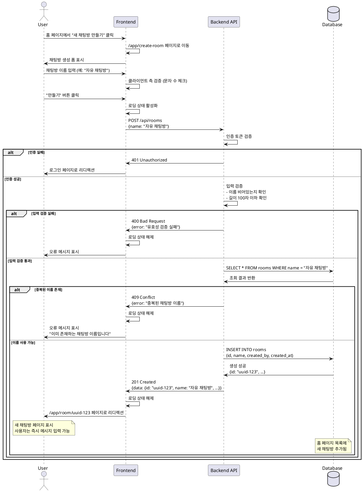

# 유스케이스 003: 새 채팅방 만들기

## 개요 (Overview)
인증된 사용자가 실시간 채팅 서비스에서 새로운 채팅방을 생성하는 기능입니다. 사용자는 고유한 채팅방 이름을 입력하여 자신만의 채팅 공간을 만들 수 있으며, 생성된 채팅방은 즉시 전체 사용자에게 공개되어 누구나 참여할 수 있습니다.

## Primary Actor
- 인증된 사용자 (Authenticated User)

## Precondition (사전 조건)
- 사용자는 로그인된 상태여야 합니다.
- 사용자는 홈 페이지(채팅방 목록 페이지)에 접근할 수 있어야 합니다.

## Trigger (트리거)
사용자가 홈 페이지에서 "새 채팅방 만들기" 버튼을 클릭합니다.

## Main Scenario (기본 시나리오)

### 1. 채팅방 생성 모드 진입
- 사용자가 홈 페이지의 "새 채팅방 만들기" 버튼을 클릭합니다.
- 시스템은 채팅방 생성 페이지(`/app/create-room`)로 이동합니다.
- 채팅방 이름 입력 폼이 표시됩니다.

### 2. 채팅방 이름 입력
- 사용자가 채팅방 이름 입력 필드에 원하는 이름을 입력합니다.
- 사용자가 "만들기" 버튼을 클릭합니다.

### 3. 유효성 검증
시스템은 다음 항목을 순차적으로 검증합니다:
- 채팅방 이름이 비어있지 않은지 확인
- 채팅방 이름이 최대 길이(100자)를 초과하지 않는지 확인
- 동일한 이름의 채팅방이 데이터베이스에 존재하지 않는지 확인 (중복 불허)

### 4. 채팅방 생성 및 저장
- 시스템은 새 채팅방 레코드를 생성합니다.
  - 채팅방 이름
  - 개설자 ID (현재 로그인한 사용자)
  - 생성 시간 (타임스탬프)
  - 고유 ID (자동 생성)
- 데이터베이스에 채팅방 정보를 영구 저장합니다.

### 5. 채팅방 입장
- 시스템은 사용자를 새로 생성된 채팅방 페이지(`/app/room/[newRoomId]`)로 리디렉션합니다.
- 채팅방 화면이 표시되며, 사용자는 즉시 메시지를 작성할 수 있습니다.

### 6. 홈 목록 업데이트
- 생성된 채팅방이 홈 페이지의 채팅방 목록에 즉시 추가됩니다.
- 다른 사용자들도 홈 페이지에서 새 채팅방을 볼 수 있습니다.

## Edge Cases (예외 및 대안 시나리오)

### EC-1: 채팅방 이름이 비어있는 경우
**조건:** 사용자가 채팅방 이름을 입력하지 않고 "만들기" 버튼을 클릭
**처리:**
- 시스템은 채팅방을 생성하지 않습니다.
- "채팅방 이름을 입력해주세요" 오류 메시지를 표시합니다.
- 사용자는 채팅방 생성 페이지에 머물며 다시 입력할 수 있습니다.

### EC-2: 채팅방 이름이 최대 길이 초과
**조건:** 사용자가 100자를 초과하는 채팅방 이름을 입력
**처리:**
- 시스템은 채팅방을 생성하지 않습니다.
- "채팅방 이름은 최대 100자까지 입력할 수 있습니다" 오류 메시지를 표시합니다.
- 입력된 값은 유지되어 사용자가 수정할 수 있습니다.

### EC-3: 중복된 채팅방 이름
**조건:** 사용자가 입력한 채팅방 이름이 이미 존재하는 경우
**처리:**
- 시스템은 데이터베이스에서 동일한 이름의 채팅방을 발견합니다.
- 채팅방을 생성하지 않습니다.
- "이미 존재하는 채팅방 이름입니다. 다른 이름을 입력해주세요" 오류 메시지를 표시합니다.
- 입력된 값은 유지되어 사용자가 수정할 수 있습니다.

### EC-4: 미인증 사용자 접근
**조건:** 로그인하지 않은 사용자가 채팅방 생성 페이지에 접근 시도
**처리:**
- 시스템은 사용자의 인증 상태를 확인합니다.
- 미인증 상태를 감지합니다.
- 사용자를 로그인 페이지(`/auth/login`)로 리디렉션합니다.

### EC-5: 네트워크 오류 또는 서버 오류
**조건:** 채팅방 생성 요청 중 네트워크 장애 또는 서버 오류 발생
**처리:**
- 시스템은 오류를 감지하고 로그에 기록합니다.
- "채팅방 생성 중 오류가 발생했습니다. 잠시 후 다시 시도해주세요" 메시지를 표시합니다.
- 사용자는 채팅방 생성 페이지에 머물며 재시도할 수 있습니다.
- 입력된 값은 유지됩니다.

### EC-6: 데이터베이스 연결 실패
**조건:** 중복 확인 또는 저장 중 데이터베이스 연결 실패
**처리:**
- 시스템은 데이터베이스 오류를 감지합니다.
- 채팅방을 생성하지 않습니다.
- "일시적인 오류가 발생했습니다. 잠시 후 다시 시도해주세요" 메시지를 표시합니다.

## Postcondition (사후 조건)

### 성공 시:
- 새로운 채팅방이 데이터베이스에 영구 저장됩니다.
- 사용자는 새로 생성된 채팅방 페이지에 위치합니다.
- 홈 페이지의 채팅방 목록에 새 채팅방이 추가됩니다.
- 모든 사용자가 새 채팅방을 볼 수 있고 입장할 수 있습니다.

### 실패 시:
- 데이터베이스에 변경사항이 없습니다.
- 사용자는 채팅방 생성 페이지에 머물며 오류 메시지를 확인합니다.
- 입력 값은 유지되어 사용자가 수정할 수 있습니다.

## Business Rules (비즈니스 규칙)

### BR-1: 채팅방 이름 고유성
- 시스템 내 모든 채팅방 이름은 고유해야 합니다.
- 대소문자를 구분하여 중복 여부를 판단합니다.
- 공백만으로 이루어진 이름은 허용하지 않습니다.

### BR-2: 채팅방 개설자 권한
- 채팅방을 생성한 사용자는 자동으로 개설자로 기록됩니다.
- 현재 버전에서는 개설자만의 특별한 권한은 없으나, 향후 확장을 위해 개설자 정보를 저장합니다.

### BR-3: 채팅방 접근성
- 생성된 모든 채팅방은 기본적으로 공개(Public)입니다.
- 모든 인증된 사용자가 채팅방 목록에서 확인하고 입장할 수 있습니다.
- 비공개 채팅방 기능은 현재 버전에서 제공하지 않습니다.

### BR-4: 채팅방 생성 제한
- 현재 버전에서는 사용자당 채팅방 생성 개수 제한이 없습니다.
- 향후 스팸 방지를 위해 제한이 추가될 수 있습니다.

### BR-5: 채팅방 지속성
- 생성된 채팅방은 영구적으로 유지됩니다.
- 현재 버전에서는 채팅방 삭제 기능이 제공되지 않습니다.

## Validation Rules (검증 규칙)

### VR-1: 채팅방 이름 필수 입력
- **규칙:** 채팅방 이름은 필수 입력 항목입니다.
- **검증:** 공백 문자열 또는 null 값 불허
- **오류 메시지:** "채팅방 이름을 입력해주세요"

### VR-2: 채팅방 이름 길이 제한
- **규칙:** 채팅방 이름은 1자 이상 100자 이하여야 합니다.
- **검증:** 문자열 길이 확인 (trim 후)
- **오류 메시지:** "채팅방 이름은 최대 100자까지 입력할 수 있습니다"

### VR-3: 채팅방 이름 중복 불허
- **규칙:** 동일한 이름의 채팅방이 존재할 수 없습니다.
- **검증:** 데이터베이스 조회를 통한 중복 확인 (대소문자 구분)
- **오류 메시지:** "이미 존재하는 채팅방 이름입니다. 다른 이름을 입력해주세요"

### VR-4: 채팅방 이름 허용 문자
- **규칙:** 모든 유니코드 문자 허용 (한글, 영문, 숫자, 특수문자, 이모지 등)
- **검증:** 특별한 제한 없음
- **비고:** XSS 방지를 위한 HTML 이스케이프 처리는 백엔드에서 수행

### VR-5: 사용자 인증 상태
- **규칙:** 채팅방 생성은 인증된 사용자만 가능합니다.
- **검증:** 세션 또는 토큰 기반 인증 확인
- **처리:** 미인증 시 로그인 페이지로 리디렉션

## UI/UX 요구사항

### UI-1: 채팅방 생성 버튼
- **위치:** 홈 페이지 상단 또는 눈에 잘 띄는 위치
- **표시:** "새 채팅방 만들기" 또는 "+ 채팅방 만들기"
- **스타일:** Primary 버튼으로 강조

### UI-2: 채팅방 생성 폼
- **페이지:** `/app/create-room`
- **구성 요소:**
  - 페이지 제목: "새 채팅방 만들기"
  - 채팅방 이름 입력 필드 (텍스트 인풋)
  - "만들기" 버튼 (Primary)
  - "취소" 버튼 (Secondary) - 홈으로 돌아가기
- **레이아웃:** 중앙 정렬, 모바일 반응형

### UI-3: 입력 필드 상태 표시
- **기본 상태:** 플레이스홀더 "채팅방 이름을 입력하세요"
- **포커스 상태:** 포커스 표시 (border 색상 변경)
- **오류 상태:** 빨간색 테두리 + 오류 메시지 표시
- **문자 수 표시:** 입력 필드 하단에 "0/100" 형식으로 현재 입력 문자 수 표시

### UI-4: 오류 메시지 표시
- **위치:** 입력 필드 바로 아래
- **스타일:** 빨간색 텍스트, 작은 폰트
- **애니메이션:** Fade-in 효과
- **지속 시간:** 사용자가 입력을 수정하거나 폼을 재제출할 때까지 유지

### UI-5: 로딩 상태
- **제출 중:** "만들기" 버튼 비활성화 + 로딩 스피너 표시
- **메시지:** "채팅방을 생성하는 중..."
- **입력 필드:** 제출 중에는 입력 비활성화

### UI-6: 성공 피드백
- **방식:** 즉시 새 채팅방 페이지로 리디렉션
- **선택적:** Toast 메시지 "채팅방이 생성되었습니다" (짧게 표시)

### UI-7: 접근성 (Accessibility)
- 모든 입력 필드에 적절한 label 제공
- 오류 메시지는 스크린 리더에서 읽을 수 있도록 aria-live 속성 사용
- 키보드 네비게이션 지원 (Tab, Enter)
- 포커스 표시 명확히

## 성능 요구사항

### PF-1: 중복 확인 응답 시간
- **목표:** 200ms 이내
- **방법:** 데이터베이스 인덱스 최적화 (채팅방 이름 컬럼)

### PF-2: 채팅방 생성 완료 시간
- **목표:** 사용자가 "만들기" 버튼 클릭 후 1초 이내에 새 채팅방 페이지 표시
- **포함:** 유효성 검증 + DB 저장 + 페이지 리디렉션

### PF-3: 동시 생성 처리
- **요구사항:** 여러 사용자가 동시에 채팅방을 생성해도 정상 동작
- **방법:** 데이터베이스 트랜잭션 및 유니크 제약조건 활용

### PF-4: 클라이언트 측 검증
- **목표:** 즉각적인 피드백 (입력 중 실시간 검증)
- **검증 항목:** 문자 수 제한 (100자)
- **비고:** 중복 확인은 서버에서만 수행

## API 요구사항

### API-1: 채팅방 생성 API
**엔드포인트:** `POST /api/rooms`

**요청 본문:**
```json
{
  "name": "string (1-100자)"
}
```

**응답 (성공 - 201 Created):**
```json
{
  "success": true,
  "data": {
    "id": "string (UUID)",
    "name": "string",
    "createdBy": "string (사용자 ID)",
    "createdAt": "string (ISO 8601 timestamp)"
  }
}
```

**응답 (실패 - 400 Bad Request):**
```json
{
  "success": false,
  "error": {
    "code": "VALIDATION_ERROR",
    "message": "채팅방 이름을 입력해주세요"
  }
}
```

**응답 (실패 - 409 Conflict):**
```json
{
  "success": false,
  "error": {
    "code": "DUPLICATE_ROOM_NAME",
    "message": "이미 존재하는 채팅방 이름입니다. 다른 이름을 입력해주세요"
  }
}
```

**응답 (실패 - 401 Unauthorized):**
```json
{
  "success": false,
  "error": {
    "code": "UNAUTHORIZED",
    "message": "로그인이 필요합니다"
  }
}
```

### API-2: 채팅방 이름 중복 확인 API (선택적)
**엔드포인트:** `GET /api/rooms/check-name?name={roomName}`

**응답 (사용 가능):**
```json
{
  "success": true,
  "data": {
    "available": true
  }
}
```

**응답 (중복):**
```json
{
  "success": true,
  "data": {
    "available": false,
    "message": "이미 존재하는 채팅방 이름입니다"
  }
}
```

## 데이터베이스 요구사항

### DB-1: rooms 테이블 구조
- `id` (UUID, Primary Key)
- `name` (VARCHAR(100), NOT NULL, UNIQUE)
- `created_by` (UUID, Foreign Key to users.id, NOT NULL)
- `created_at` (TIMESTAMP, NOT NULL, DEFAULT NOW())
- `updated_at` (TIMESTAMP, NOT NULL, DEFAULT NOW())

### DB-2: 인덱스
- `name` 컬럼에 UNIQUE 인덱스 (중복 방지 및 빠른 조회)
- `created_by` 컬럼에 인덱스 (개설자별 채팅방 조회 최적화)
- `created_at` 컬럼에 인덱스 (최신순 정렬 최적화)

### DB-3: 제약조건
- `name` UNIQUE 제약조건 (중복 불허)
- `created_by` Foreign Key 제약조건 (사용자 존재 확인)
- `name` NOT NULL 제약조건 (필수 입력)

## 보안 요구사항

### SEC-1: 인증 확인
- 모든 채팅방 생성 요청은 유효한 인증 토큰/세션이 있어야 합니다.
- 인증되지 않은 요청은 401 Unauthorized로 거부합니다.

### SEC-2: 입력 검증 및 새니타이징
- 클라이언트와 서버 양쪽에서 입력 검증을 수행합니다.
- XSS 방지를 위해 HTML 특수문자를 이스케이프 처리합니다.
- SQL Injection 방지를 위해 Prepared Statement 또는 ORM을 사용합니다.

### SEC-3: Rate Limiting
- 동일 사용자의 과도한 채팅방 생성 요청을 제한합니다.
- 예: 1분에 최대 5개 채팅방 생성 제한

### SEC-4: CSRF 보호
- POST 요청에 CSRF 토큰을 포함하여 검증합니다.

## 외부 연동 서비스

현재 이 기능에서는 외부 서비스 연동이 필요하지 않습니다.

## 의존성

### DEP-1: 사용자 인증 시스템
- 로그인한 사용자 정보를 조회해야 합니다.
- 인증 토큰/세션 검증이 필요합니다.

### DEP-2: 데이터베이스 (Supabase)
- 채팅방 정보를 저장하고 조회합니다.
- 트랜잭션 지원이 필요합니다.

### DEP-3: 라우팅 시스템
- 채팅방 생성 후 새 채팅방 페이지로 리디렉션해야 합니다.

## 향후 확장 고려사항

### FE-1: 채팅방 설명 추가
- 채팅방 이름 외에 설명(Description) 필드 추가 가능

### FE-2: 채팅방 카테고리/태그
- 채팅방을 주제별로 분류할 수 있는 카테고리 기능

### FE-3: 비공개 채팅방
- 초대된 사용자만 참여할 수 있는 비공개 채팅방 기능

### FE-4: 채팅방 썸네일/아이콘
- 채팅방을 시각적으로 구분할 수 있는 이미지 업로드 기능

### FE-5: 채팅방 삭제 기능
- 개설자가 채팅방을 삭제할 수 있는 기능

### FE-6: 채팅방 최대 인원 제한
- 참여 가능한 최대 인원을 설정하는 기능

## Sequence Diagram



## 테스트 시나리오

### TS-1: 정상 채팅방 생성
- **조건:** 인증된 사용자, 유효한 채팅방 이름 (예: "일상 이야기")
- **기대 결과:** 채팅방 생성 성공, 새 채팅방 페이지로 이동, 홈 목록에 표시

### TS-2: 빈 이름 입력
- **조건:** 채팅방 이름을 입력하지 않고 제출
- **기대 결과:** 오류 메시지 표시, 채팅방 생성 안 됨

### TS-3: 100자 초과 이름 입력
- **조건:** 101자 이상의 채팅방 이름 입력
- **기대 결과:** 오류 메시지 표시, 채팅방 생성 안 됨

### TS-4: 중복 이름 입력
- **조건:** 이미 존재하는 채팅방 이름 입력 (예: 기존에 "자유 채팅" 존재)
- **기대 결과:** 중복 오류 메시지 표시, 채팅방 생성 안 됨

### TS-5: 미인증 사용자 접근
- **조건:** 로그아웃 상태에서 채팅방 생성 페이지 접근
- **기대 결과:** 로그인 페이지로 리디렉션

### TS-6: 한글, 이모지 포함 이름
- **조건:** "🎉 환영합니다! 😊" 같은 특수문자 포함 이름
- **기대 결과:** 정상 생성, XSS 방지 처리 확인

### TS-7: 동시 생성 요청
- **조건:** 여러 사용자가 동시에 다른 이름의 채팅방 생성
- **기대 결과:** 모두 정상 생성

### TS-8: 동시 중복 이름 생성 요청
- **조건:** 두 사용자가 동시에 같은 이름의 채팅방 생성 시도
- **기대 결과:** 한 명만 성공, 다른 한 명은 중복 오류

## 참조 문서
- PRD: `/docs/prd.md`
- 유저플로우: `/docs/userflow.md` - 유저플로우 3
- 데이터베이스 스키마: `/supabase/migrations/`

---
**문서 버전:** 1.0
**작성일:** 2025-10-17
**최종 수정일:** 2025-10-17
