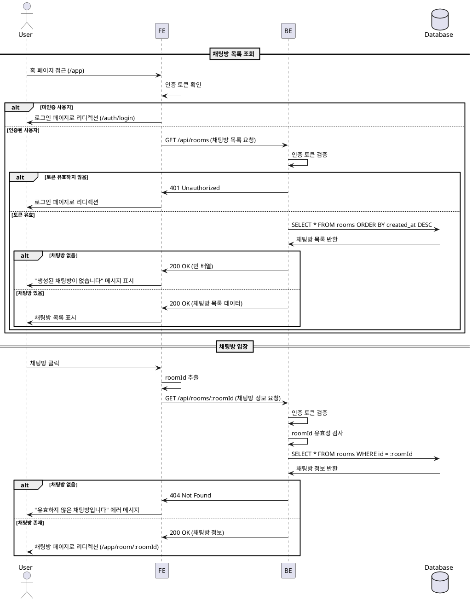

# 유스케이스 004: 채팅방 목록 조회 및 입장

## Primary Actor
- 인증된 사용자 (Authenticated User)

## Precondition
- 사용자가 로그인되어 있어야 함
- 유효한 인증 세션/토큰을 보유하고 있어야 함

## Trigger
- 사용자가 홈 페이지(`/app`)에 접근
- 사용자가 채팅방 목록에서 특정 채팅방을 클릭

## Main Scenario

### 시나리오 1: 채팅방 목록 조회
1. 사용자가 홈 페이지에 접근한다.
2. 시스템은 사용자의 인증 상태를 확인한다.
3. 시스템은 데이터베이스에서 모든 채팅방 목록을 조회한다.
4. 시스템은 각 채팅방의 정보(채팅방 이름, 개설자 닉네임)를 포함한 목록을 화면에 표시한다.
5. 사용자는 채팅방 목록을 확인한다.

### 시나리오 2: 채팅방 입장
1. 사용자가 채팅방 목록에서 특정 채팅방을 클릭한다.
2. 시스템은 해당 채팅방의 ID(`roomId`)가 유효한지 확인한다.
3. 시스템은 채팅방이 데이터베이스에 존재하는지 조회한다.
4. 시스템은 사용자를 해당 채팅방 페이지(`/app/room/[roomId]`)로 리디렉션한다.
5. 사용자는 채팅방에 입장하여 메시지를 확인하고 소통할 수 있다.

## Edge Cases

### EC1: 미인증 사용자 접근
- **조건**: 사용자가 로그인하지 않은 상태로 홈 페이지에 접근
- **처리**: 시스템은 사용자를 로그인 페이지(`/auth/login`)로 리디렉션
- **결과**: 사용자는 로그인 페이지에서 인증을 완료해야 홈 페이지에 접근 가능

### EC2: 채팅방 목록이 비어있음
- **조건**: 데이터베이스에 생성된 채팅방이 없음
- **처리**: 시스템은 빈 목록 상태를 표시
- **결과**: "아직 생성된 채팅방이 없습니다." 메시지 표시, '새 채팅방 만들기' 버튼으로 유도

### EC3: 유효하지 않은 채팅방 ID
- **조건**: 사용자가 존재하지 않는 채팅방 ID로 접근 시도
- **처리**: 시스템은 채팅방이 존재하지 않음을 확인
- **결과**: 홈 페이지에 머무르며 "유효하지 않은 채팅방입니다." 에러 메시지 표시

### EC4: 삭제된 채팅방 접근
- **조건**: 사용자가 이미 삭제된 채팅방에 접근 시도
- **처리**: 시스템은 채팅방의 삭제 상태를 확인
- **결과**: 홈 페이지로 리디렉션하며 "해당 채팅방은 삭제되었습니다." 메시지 표시

### EC5: 네트워크 오류
- **조건**: 채팅방 목록 조회 중 네트워크 오류 발생
- **처리**: 시스템은 재시도 로직을 수행하거나 에러 상태 표시
- **결과**: "채팅방 목록을 불러올 수 없습니다. 다시 시도해주세요." 메시지와 재시도 버튼 표시

### EC6: 세션 만료
- **조건**: 홈 페이지 접근 중 사용자의 세션이 만료됨
- **처리**: 시스템은 인증 실패를 감지
- **결과**: 로그인 페이지로 리디렉션하며 "세션이 만료되었습니다. 다시 로그인해주세요." 메시지 표시

## Business Rules

### BR1: 인증 필수
- 채팅방 목록 조회 및 입장은 인증된 사용자만 가능
- 미인증 사용자는 자동으로 로그인 페이지로 이동

### BR2: 채팅방 표시 순서
- 채팅방 목록은 최근 생성된 순서대로 표시 (내림차순)
- 향후 확장: 최근 활동 기준, 즐겨찾기 우선 등 정렬 옵션 고려

### BR3: 채팅방 정보 표시
- 각 채팅방은 다음 정보를 포함하여 표시:
  - 채팅방 이름
  - 개설자 닉네임
  - (향후 확장) 현재 참여자 수, 최근 메시지 시간 등

### BR4: 실시간 업데이트
- 새로운 채팅방이 생성되면 모든 사용자의 목록에 즉시 반영
- 채팅방이 삭제되면 모든 사용자의 목록에서 즉시 제거

### BR5: 접근 권한
- 현재 버전에서는 모든 인증된 사용자가 모든 채팅방에 접근 가능
- 향후 확장: 비공개 채팅방, 초대 전용 채팅방 등 권한 관리 고려

## Sequence Diagram



## API 요구사항

### API 1: 채팅방 목록 조회
- **Endpoint**: `GET /api/rooms`
- **인증**: Required (Bearer Token)
- **Request**: 없음
- **Response** (200 OK):
  ```json
  {
    "success": true,
    "data": [
      {
        "id": "room-uuid-1",
        "name": "채팅방 이름",
        "creatorNickname": "개설자닉네임",
        "createdAt": "2025-10-17T10:00:00Z"
      }
    ]
  }
  ```
- **Error Responses**:
  - `401 Unauthorized`: 인증 실패
  - `500 Internal Server Error`: 서버 오류

### API 2: 채팅방 정보 조회
- **Endpoint**: `GET /api/rooms/:roomId`
- **인증**: Required (Bearer Token)
- **Request Parameters**:
  - `roomId` (path): 채팅방 고유 ID
- **Response** (200 OK):
  ```json
  {
    "success": true,
    "data": {
      "id": "room-uuid-1",
      "name": "채팅방 이름",
      "creatorNickname": "개설자닉네임",
      "createdAt": "2025-10-17T10:00:00Z"
    }
  }
  ```
- **Error Responses**:
  - `401 Unauthorized`: 인증 실패
  - `404 Not Found`: 채팅방이 존재하지 않음
  - `500 Internal Server Error`: 서버 오류

## UI/UX 요구사항

### 채팅방 목록 페이지
1. **레이아웃**
   - 상단: 앱 타이틀, '새 채팅방 만들기' 버튼, '마이페이지' 버튼, '로그아웃' 버튼
   - 메인: 채팅방 목록 (스크롤 가능한 리스트)
   - 각 채팅방 아이템: 채팅방 이름, 개설자 닉네임

2. **인터랙션**
   - 채팅방 아이템 클릭 시 해당 채팅방으로 이동
   - 호버 시 배경색 변경으로 클릭 가능함을 표시
   - 로딩 중 스켈레톤 UI 표시

3. **빈 상태 (Empty State)**
   - 채팅방이 없을 경우 중앙에 안내 메시지 표시
   - "아직 생성된 채팅방이 없습니다."
   - '새 채팅방 만들기' 버튼을 강조하여 유도

4. **에러 상태**
   - 네트워크 오류 시 에러 메시지와 재시도 버튼 표시
   - 유효하지 않은 채팅방 접근 시 토스트 메시지로 피드백

5. **반응형 디자인**
   - 모바일, 태블릿, 데스크톱 환경 모두 지원
   - 작은 화면에서는 버튼 크기와 간격 조정

## 성능 요구사항

### 응답 시간
- 채팅방 목록 조회: 1초 이내
- 채팅방 입장: 500ms 이내

### 실시간 업데이트
- 새 채팅방 생성 시 모든 클라이언트에 3초 이내 반영
- WebSocket 또는 Server-Sent Events를 통한 실시간 동기화

### 확장성
- 초기 버전: 100개 채팅방까지 전체 목록 표시
- 향후 확장: 페이지네이션 또는 무한 스크롤 구현 고려

### 캐싱
- 채팅방 목록을 클라이언트 측에 캐싱하여 반복 요청 최소화
- 실시간 업데이트로 캐시 무효화 및 갱신

## 데이터베이스 요구사항

### 필요한 테이블
- `rooms`: 채팅방 정보 저장
  - `id` (UUID, PK): 채팅방 고유 ID
  - `name` (VARCHAR(100), NOT NULL): 채팅방 이름
  - `creator_id` (UUID, FK): 개설자 ID (users 테이블 참조)
  - `created_at` (TIMESTAMP, NOT NULL): 생성 시간
  - `updated_at` (TIMESTAMP, NOT NULL): 수정 시간
  - `deleted_at` (TIMESTAMP, NULL): 삭제 시간 (soft delete)

### 인덱스
- `rooms.created_at` (DESC): 최신 채팅방 순 정렬을 위한 인덱스
- `rooms.creator_id`: 개설자별 채팅방 조회를 위한 인덱스

### 쿼리
```sql
-- 전체 채팅방 목록 조회 (삭제되지 않은 방만)
SELECT
  r.id,
  r.name,
  u.nickname AS creator_nickname,
  r.created_at
FROM rooms r
JOIN users u ON r.creator_id = u.id
WHERE r.deleted_at IS NULL
ORDER BY r.created_at DESC;

-- 특정 채팅방 정보 조회
SELECT
  r.id,
  r.name,
  u.nickname AS creator_nickname,
  r.created_at
FROM rooms r
JOIN users u ON r.creator_id = u.id
WHERE r.id = :roomId
  AND r.deleted_at IS NULL;
```

## 보안 요구사항

### 인증 및 인가
- 모든 API 요청에 유효한 인증 토큰 필요
- 토큰 검증 실패 시 401 Unauthorized 응답
- 만료된 토큰은 자동으로 로그인 페이지로 리디렉션

### 데이터 보호
- SQL Injection 방지: 파라미터화된 쿼리 사용
- XSS 방지: 채팅방 이름, 닉네임 출력 시 이스케이프 처리

### Rate Limiting
- 채팅방 목록 조회: 사용자당 분당 60회 제한
- 과도한 요청 시 429 Too Many Requests 응답

## 향후 확장 고려사항

### 기능 확장
- 채팅방 검색 기능
- 채팅방 정렬 옵션 (이름순, 최근 활동순 등)
- 즐겨찾기 기능
- 비공개/공개 채팅방 구분
- 채팅방 카테고리/태그
- 현재 참여자 수 표시
- 최근 메시지 미리보기

### 성능 최적화
- 페이지네이션 또는 가상 스크롤
- 채팅방 썸네일 이미지
- 오프라인 지원 (Service Worker)
- 낙관적 UI 업데이트

### 사용자 경험 개선
- 채팅방 초대 링크 생성
- 채팅방 공유 기능
- 알림 설정 (새 메시지, 멘션 등)
- 다크 모드 지원
