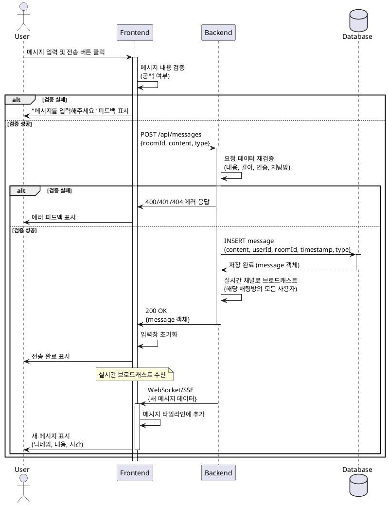

# 유스케이스: 실시간 메시지 전송

## Primary Actor
- 인증된 사용자 (채팅방에 입장한 사용자)

## Precondition
- 사용자가 로그인되어 있어야 함
- 사용자가 유효한 채팅방에 입장해 있어야 함
- 채팅방 페이지(`/room/[roomId]`)에 접근한 상태여야 함

## Trigger
- 사용자가 메시지 입력창에 텍스트 또는 이모티콘을 입력하고 전송 버튼을 클릭하거나 Enter 키를 누름

## Main Scenario

### 1. 메시지 입력
- 사용자가 채팅방 하단의 메시지 입력창에 텍스트를 입력함
- 또는 이모티콘 선택기를 통해 이모티콘을 선택함

### 2. 메시지 전송 요청
- 사용자가 전송 버튼 클릭 또는 Enter 키를 누름
- FE는 메시지 내용을 검증함 (공백 여부 확인)
- 검증 통과 시 BE에 메시지 생성 요청을 보냄

### 3. 메시지 저장
- BE는 메시지 데이터 유효성을 재검증함
  - 메시지 내용이 비어있지 않은지 확인
  - 메시지 최대 길이 제한(예: 1000자) 확인
  - 사용자 인증 상태 확인
  - 채팅방 존재 여부 확인
- 검증 통과 시 다음 정보와 함께 DB에 메시지를 저장함
  - 메시지 내용 (텍스트/이모티콘)
  - 작성자 ID
  - 채팅방 ID
  - 생성 시간 (타임스탬프)
  - 메시지 타입 (텍스트/이모티콘)

### 4. 실시간 브로드캐스트
- BE는 저장된 메시지 정보를 해당 채팅방의 모든 연결된 사용자에게 실시간으로 전송함 (broadcast)
- 실시간 통신 채널(WebSocket/Server-Sent Events)을 통해 메시지 데이터 전달

### 5. 메시지 표시
- 모든 사용자의 FE는 실시간으로 전송된 메시지를 수신함
- 수신한 메시지를 채팅 타임라인에 즉시 추가하여 표시함
  - 작성자 닉네임
  - 메시지 내용
  - 전송 시간
  - 메시지 액션 버튼 (좋아요, 답장, 삭제)
- 메시지 전송자의 입력창은 초기화됨

## Alternative Flows

### A1. 텍스트 메시지 전송
- Main Scenario와 동일
- 메시지 타입이 'text'로 저장됨
- 텍스트 내용이 그대로 표시됨

### A2. 이모티콘 메시지 전송
- 사용자가 이모티콘 선택기를 열어 이모티콘 선택
- 선택한 이모티콘이 입력창에 추가됨
- 메시지 타입이 'emoji'로 저장됨
- 이모티콘이 시각적으로 렌더링되어 표시됨

### A3. 텍스트와 이모티콘 혼합 메시지
- 사용자가 텍스트와 이모티콘을 함께 입력
- 메시지 타입이 'mixed'로 저장됨
- 텍스트와 이모티콘이 함께 렌더링되어 표시됨

## Edge Cases

### E1. 빈 메시지 전송 시도
- **상황**: 사용자가 공백만 입력하거나 빈 내용을 전송하려 함
- **처리**:
  - FE에서 전송 버튼 비활성화
  - 전송 시도 시 "메시지를 입력해주세요" 피드백 표시
  - 메시지 전송되지 않음

### E2. 최대 길이 초과
- **상황**: 메시지가 최대 허용 길이를 초과함
- **처리**:
  - FE에서 입력 글자 수 제한 (1000자)
  - BE에서 재검증 실패 시 400 에러 응답
  - "메시지는 최대 1000자까지 입력 가능합니다" 피드백 표시

### E3. 네트워크 오류
- **상황**: 메시지 전송 중 네트워크 오류 발생
- **처리**:
  - 전송 실패 피드백 표시
  - 입력한 메시지 내용 유지
  - 재전송 옵션 제공

### E4. 인증 만료
- **상황**: 메시지 전송 시점에 사용자 인증이 만료됨
- **처리**:
  - 401 에러 응답
  - "로그인이 만료되었습니다" 피드백 표시
  - 로그인 페이지로 리다이렉트

### E5. 채팅방 삭제됨
- **상황**: 메시지 전송 시점에 채팅방이 삭제되어 존재하지 않음
- **처리**:
  - 404 에러 응답
  - "채팅방을 찾을 수 없습니다" 피드백 표시
  - 홈 페이지로 리다이렉트

### E6. 실시간 연결 끊김
- **상황**: 사용자의 실시간 통신 연결이 끊어짐
- **처리**:
  - 자동 재연결 시도
  - 연결 상태 표시 (연결 끊김/재연결 중)
  - 재연결 성공 시 누락된 메시지 동기화

## Business Rules

### BR1. 메시지 영구 저장
- 모든 전송된 메시지는 데이터베이스에 영구적으로 저장됨
- 메시지 삭제 시 물리적 삭제가 아닌 논리적 삭제(soft delete) 처리

### BR2. 실시간 동기화
- 채팅방의 모든 사용자는 동일한 메시지 타임라인을 실시간으로 공유함
- 새 메시지는 즉시 모든 사용자에게 전달됨 (지연 시간 최소화)

### BR3. 메시지 순서 보장
- 메시지는 타임스탬프 순서대로 정렬되어 표시됨
- 동일 시간대 메시지는 ID 순서로 정렬

### BR4. 메시지 타입 분류
- 텍스트 메시지: 일반 텍스트 내용
- 이모티콘 메시지: 이모티콘만 포함
- 혼합 메시지: 텍스트와 이모티콘 혼합

### BR5. 작성자 정보 연동
- 메시지에 표시되는 닉네임은 항상 작성자의 현재 닉네임을 참조함
- 작성자가 닉네임을 변경하면 기존 메시지의 닉네임도 자동 업데이트됨

### BR6. 메시지 삭제 권한
- 메시지 삭제는 작성자 본인만 가능함
- 삭제된 메시지는 타임라인에서 제거되고, 답글에서는 "삭제된 메시지입니다" 표시

## Validation Rules

### VR1. 메시지 내용 검증
- **필수 입력**: 메시지 내용이 비어있으면 안 됨 (공백만 있는 경우 포함)
- **최대 길이**: 1000자 이하
- **허용 문자**: 모든 유니코드 문자 (특수문자, 이모지 포함)

### VR2. 인증 검증
- 요청자의 유효한 인증 토큰/세션 필요
- 만료되거나 유효하지 않은 인증 시 401 에러

### VR3. 채팅방 검증
- 요청된 채팅방이 데이터베이스에 존재해야 함
- 존재하지 않는 채팅방에 메시지 전송 시 404 에러

### VR4. 메시지 타입 검증
- 메시지 타입은 'text', 'emoji', 'mixed' 중 하나여야 함
- 잘못된 타입 전송 시 400 에러

## UI/UX Requirements

### UX1. 메시지 입력창
- 채팅방 하단에 고정 위치
- 최소 2줄, 최대 4줄의 자동 확장 텍스트 영역
- 1000자 글자 수 카운터 표시 (900자 이상부터 표시)
- Enter 키로 전송, Shift+Enter로 줄바꿈

### UX2. 이모티콘 선택기
- 입력창 옆 이모티콘 버튼 클릭 시 팝업으로 표시
- 자주 사용하는 이모티콘 우선 표시
- 카테고리별 이모티콘 분류

### UX3. 전송 버튼
- 메시지 내용이 있을 때만 활성화
- 전송 중에는 로딩 상태 표시
- 전송 완료 후 즉시 활성화 (연속 전송 가능)

### UX4. 메시지 타임라인
- 최신 메시지가 하단에 추가됨
- 새 메시지 수신 시 부드러운 스크롤 애니메이션
- 사용자가 스크롤 중일 때는 자동 스크롤 비활성화
- "새 메시지" 알림 버튼으로 최신 메시지로 이동 가능

### UX5. 전송 상태 표시
- 전송 중: 메시지 옆에 로딩 인디케이터
- 전송 완료: 체크 표시
- 전송 실패: 경고 아이콘 및 재전송 버튼

## Real-time Communication Requirements

### RT1. 실시간 통신 방식
- WebSocket 또는 Server-Sent Events(SSE) 사용
- 연결 유지 및 자동 재연결 메커니즘
- Heartbeat/Ping-Pong으로 연결 상태 모니터링

### RT2. 브로드캐스트 메커니즘
- 채팅방별 실시간 채널 관리
- 메시지는 해당 채팅방의 모든 연결된 클라이언트에게 전송
- Pub/Sub 패턴 구현 (Supabase Realtime 활용 가능)

### RT3. 메시지 전송 흐름
1. 사용자가 메시지 전송
2. HTTP POST 요청으로 BE에 메시지 저장
3. BE가 DB에 저장 성공 후 실시간 채널로 브로드캐스트
4. 모든 연결된 클라이언트가 메시지 수신
5. FE에서 UI 업데이트

### RT4. 연결 관리
- 채팅방 입장 시 실시간 채널 구독
- 채팅방 퇴장 시 구독 해제
- 네트워크 끊김 시 자동 재연결 (최대 3회 시도)
- 재연결 실패 시 사용자에게 알림 및 페이지 새로고침 제안

### RT5. 메시지 동기화
- 실시간 연결 끊김 중 발생한 메시지는 재연결 시 동기화
- 마지막 수신 메시지 ID 기반으로 누락된 메시지 조회
- 대량 메시지 동기화 시 성능 최적화 (페이지네이션)

## Performance Requirements

### PF1. 응답 시간
- 메시지 전송 요청 처리: 200ms 이하
- 실시간 브로드캐스트 지연: 500ms 이하
- 메시지 UI 렌더링: 100ms 이하

### PF2. 동시 처리
- 채팅방당 최소 100명 동시 접속 지원
- 초당 최소 50개 메시지 처리 가능
- 대량 메시지 전송 시에도 안정적인 성능 유지

### PF3. 리소스 최적화
- 메시지 목록 가상 스크롤 적용 (대량 메시지 렌더링 최적화)
- 이미지/이모티콘 레이지 로딩
- 메시지 페이지네이션 (초기 로드 50개, 스크롤 시 추가 로드)

### PF4. 네트워크 최적화
- 메시지 데이터 최소화 (필요한 필드만 전송)
- 실시간 메시지 배치 전송 (100ms 단위 그룹핑)
- 압축 전송 (gzip/brotli)

## Sequence Diagram

## Post-conditions
- 메시지가 데이터베이스에 영구적으로 저장됨
- 해당 채팅방의 모든 사용자가 새 메시지를 실시간으로 확인할 수 있음
- 메시지 전송자의 입력창이 초기화되어 다음 메시지 입력 가능 상태가 됨
- 메시지 타임라인이 최신 상태로 유지됨

## Related Use Cases
- [메시지 상호작용 (좋아요, 답장, 삭제)](./message-interaction.md)
- [채팅방 입장](./join-chatroom.md)
- [채팅방 생성](./create-chatroom.md)
