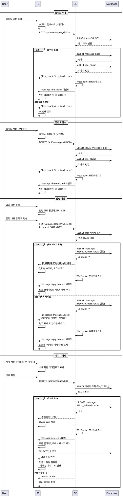

# 유스케이스 006: 메시지 상호작용 (좋아요, 답장, 삭제)

## 1. 유스케이스 개요

채팅방에서 사용자가 메시지에 대해 좋아요를 추가/취소하거나, 특정 메시지에 답장하거나, 자신이 작성한 메시지를 삭제할 수 있는 기능입니다. 모든 상호작용은 실시간으로 채팅방의 모든 참여자에게 반영되어야 합니다.

### 주요 기능
1. **좋아요**: 메시지에 좋아요 추가/취소
2. **답장**: 특정 메시지를 인용하여 답장 작성
3. **삭제**: 자신이 작성한 메시지 삭제 (논리적 삭제)

## 2. Primary Actor

- 인증된 사용자 (채팅방 참여자)

## 3. Preconditions

- 사용자가 로그인되어 있어야 함
- 사용자가 채팅방에 입장한 상태여야 함
- 상호작용할 메시지가 채팅방에 존재해야 함
- 삭제 기능의 경우, 해당 메시지의 작성자여야 함

## 4. Trigger

### 좋아요
- 사용자가 메시지의 좋아요 버튼을 클릭

### 답장
- 사용자가 메시지의 답장 버튼을 클릭하고 답장 내용을 작성하여 전송

### 삭제
- 사용자가 자신의 메시지에서 삭제 버튼을 클릭

## 5. Main Scenario

### 5.1 좋아요 추가/취소

1. 사용자가 채팅방의 특정 메시지에 마우스를 호버하거나 터치하여 상호작용 메뉴를 활성화
2. 사용자가 '좋아요' 버튼을 클릭
3. 시스템은 해당 사용자가 이미 좋아요를 눌렀는지 확인
   - 좋아요를 누르지 않았다면: 좋아요 추가
   - 이미 좋아요를 눌렀다면: 좋아요 취소
4. 시스템은 변경사항을 데이터베이스에 기록
5. 시스템은 실시간 통신 채널을 통해 모든 참여자에게 좋아요 상태 변경을 브로드캐스트
6. 모든 참여자의 화면에서 해당 메시지의 좋아요 카운트가 즉시 업데이트됨
7. 좋아요를 누른 사용자의 화면에서 좋아요 버튼이 활성화 상태로 시각적으로 표시됨

### 5.2 답장 작성 및 전송

1. 사용자가 채팅방의 특정 메시지에서 상호작용 메뉴를 활성화
2. 사용자가 '답장' 버튼을 클릭
3. 메시지 입력창 상단에 답장 대상 메시지의 프리뷰가 표시됨 (작성자 닉네임 + 메시지 내용 일부)
4. 사용자가 답장 내용을 입력하고 전송 버튼을 클릭하거나 Enter 키를 누름
5. 시스템은 답장 메시지의 유효성을 검사 (공백 여부, 최대 길이 등)
6. 시스템은 답장 메시지를 데이터베이스에 저장
   - 메시지 내용
   - 작성자 정보
   - 원본 메시지 ID (reply_to_message_id)
   - 타임스탬프
7. 시스템은 실시간 통신 채널을 통해 모든 참여자에게 새 답장 메시지를 브로드캐스트
8. 모든 참여자의 타임라인에 답장 메시지가 나타남 (원본 메시지 인용 포함)
9. 작성자의 입력창이 초기화되고 답장 프리뷰가 제거됨

### 5.3 메시지 삭제

1. 사용자가 자신이 작성한 메시지에서 상호작용 메뉴를 활성화
2. 사용자가 '삭제' 버튼을 클릭 (다른 사용자의 메시지에는 삭제 버튼이 표시되지 않음)
3. 시스템은 삭제 확인 다이얼로그를 표시
4. 사용자가 삭제를 확인
5. 시스템은 메시지 작성자와 현재 사용자의 일치 여부를 재확인
6. 시스템은 데이터베이스에서 해당 메시지를 '삭제됨' 상태로 변경 (is_deleted = true)
   - 물리적 삭제가 아닌 논리적 삭제 수행
   - 메시지 ID와 관계 데이터는 유지
7. 시스템은 실시간 통신 채널을 통해 모든 참여자에게 메시지 삭제 이벤트를 브로드캐스트
8. 모든 참여자의 타임라인에서 해당 메시지가 즉시 제거됨
9. 해당 메시지에 대한 기존 답글이 있는 경우:
   - 답글 내부의 원본 메시지 인용 영역이 "삭제된 메시지입니다." 텍스트로 대체됨
   - 답글 자체는 계속 표시됨

## 6. Edge Cases

### 6.1 좋아요 관련

**EC-001: 네트워크 지연 중 중복 클릭**
- 상황: 사용자가 좋아요 버튼을 빠르게 여러 번 클릭
- 처리: 클라이언트에서 요청 중 상태를 관리하여 중복 요청 방지. 첫 번째 요청이 완료될 때까지 버튼 비활성화

**EC-002: 동시 좋아요/취소 충돌**
- 상황: 여러 사용자가 동시에 같은 메시지에 좋아요를 추가/취소
- 처리: 데이터베이스 트랜잭션 레벨에서 처리. 각 사용자별 좋아요 상태는 독립적으로 관리

**EC-003: 삭제된 메시지에 좋아요 시도**
- 상황: 메시지가 삭제되는 순간 다른 사용자가 좋아요 시도
- 처리: 서버에서 메시지 존재 여부 확인 후 실패 응답. 클라이언트는 메시지가 삭제되었음을 알림

### 6.2 답장 관련

**EC-004: 삭제된 메시지에 답장 시도**
- 상황: 사용자가 답장을 작성하는 동안 원본 메시지가 삭제됨
- 처리: 서버에서 원본 메시지의 is_deleted 상태 확인. 삭제된 경우 답장 저장을 허용하되, 클라이언트에 원본이 삭제되었음을 알림

**EC-005: 답장 내용 유효성 검사 실패**
- 상황: 빈 내용, 공백만 있는 내용, 최대 길이 초과
- 처리: 클라이언트에서 1차 검증, 서버에서 2차 검증 후 구체적인 오류 메시지 반환

**EC-006: 답장 대상 메시지가 이미 답글인 경우**
- 상황: 답글에 대한 답글 작성
- 처리: 허용. 답글 체인이 형성됨. UI에서는 깊이를 제한하여 가독성 유지

### 6.3 삭제 관련

**EC-007: 다중 답글이 있는 메시지 삭제**
- 상황: 많은 답글을 가진 메시지 삭제
- 처리: 메시지 삭제 후 모든 답글의 원본 인용 부분을 "삭제된 메시지입니다."로 일괄 업데이트

**EC-008: 권한 없는 사용자가 삭제 시도**
- 상황: 다른 사용자의 메시지를 API 직접 호출로 삭제 시도
- 처리: 서버에서 작성자 검증. 불일치 시 403 Forbidden 응답

**EC-009: 이미 삭제된 메시지 재삭제 시도**
- 상황: 삭제 버튼을 빠르게 여러 번 클릭하거나 이미 삭제된 메시지에 대한 삭제 요청
- 처리: 서버에서 is_deleted 상태 확인. 이미 삭제된 경우 성공 응답 반환 (멱등성 보장)

**EC-010: 삭제 확인 다이얼로그 취소**
- 상황: 사용자가 삭제 확인 다이얼로그에서 취소 선택
- 처리: 삭제 작업을 수행하지 않고 다이얼로그만 닫음

### 6.4 실시간 통신 관련

**EC-011: WebSocket 연결 끊김 중 상호작용**
- 상황: 사용자의 WebSocket 연결이 일시적으로 끊긴 상태에서 상호작용 시도
- 처리: HTTP API를 통해 상호작용 수행. 재연결 시 누락된 이벤트를 동기화

**EC-012: 오래된 메시지에 상호작용**
- 상황: 페이지네이션을 통해 로드된 과거 메시지에 상호작용
- 처리: 정상 처리. 메시지 ID 기반으로 상호작용을 수행하므로 시간과 무관

## 7. Business Rules

### BR-001: 좋아요 규칙
- 한 사용자는 하나의 메시지에 최대 1개의 좋아요만 가능
- 좋아요는 언제든지 취소 가능
- 삭제된 메시지의 좋아요 정보는 유지되지만 UI에 표시되지 않음
- 자신의 메시지에도 좋아요 가능

### BR-002: 답장 규칙
- 답장은 원본 메시지 ID를 참조로 저장
- 답글에 대한 답글 가능 (중첩 답장)
- 삭제된 메시지에도 답장 가능 (단, 원본이 삭제되었음을 표시)
- 답장 메시지도 일반 메시지와 동일하게 타임라인에 표시
- 답장 메시지 자체도 삭제, 좋아요, 답장 대상이 될 수 있음

### BR-003: 삭제 규칙
- 메시지는 작성자만 삭제 가능
- 삭제는 논리적 삭제 (is_deleted 플래그 사용)
- 삭제된 메시지는 타임라인에서 즉시 제거
- 삭제된 메시지에 대한 답글은 유지되며, 원본 인용 부분만 "삭제된 메시지입니다." 텍스트로 대체
- 삭제된 메시지의 관계 데이터(reply_to, likes)는 데이터베이스에 유지
- 삭제 작업은 되돌릴 수 없음

### BR-004: 실시간 반영 규칙
- 모든 상호작용은 해당 채팅방의 모든 참여자에게 실시간으로 브로드캐스트
- 상호작용 이벤트는 발생 순서대로 전달
- 오프라인 상태의 사용자는 재접속 시 최신 상태를 확인

### BR-005: 권한 규칙
- 좋아요: 모든 인증된 사용자 가능
- 답장: 모든 인증된 사용자 가능
- 삭제: 메시지 작성자만 가능

## 8. UI/UX 요구사항

### 8.1 상호작용 메뉴 표시
- 메시지에 마우스 호버 또는 터치 시 상호작용 버튼 표시
- 모바일: 메시지 길게 터치 시 컨텍스트 메뉴 표시
- 데스크톱: 메시지 우측에 작은 아이콘 버튼들 표시

### 8.2 좋아요 UI
- 좋아요 버튼: 하트 아이콘 사용
- 좋아요를 누른 상태: 채워진 하트 (filled), 강조 색상
- 좋아요를 누르지 않은 상태: 빈 하트 (outline), 중립 색상
- 좋아요 카운트: 아이콘 옆에 숫자로 표시 (0일 경우 숨김)
- 애니메이션: 좋아요 추가 시 하트가 커졌다 작아지는 애니메이션

### 8.3 답장 UI
- 답장 버튼: 답장/화살표 아이콘 사용
- 답장 작성 모드:
  - 입력창 상단에 답장 대상 메시지 프리뷰 표시
  - 프리뷰 형식: "작성자 닉네임에게 답장 | 메시지 내용 (최대 50자)" + 닫기(X) 버튼
  - 프리뷰 클릭 시 원본 메시지로 스크롤
- 답장 메시지 표시:
  - 메시지 상단에 원본 메시지 인용 영역 표시
  - 인용 영역: 작은 크기, 회색 배경, 왼쪽 세로 라인
  - 인용 내용: "원작성자 닉네임 | 원본 메시지 내용 (최대 100자)"
  - 인용 영역 클릭 시 원본 메시지로 스크롤 (존재하는 경우)
- 삭제된 메시지 인용: "삭제된 메시지입니다." 텍스트, 이탤릭체, 클릭 불가

### 8.4 삭제 UI
- 삭제 버튼: 휴지통 아이콘, 자신의 메시지에만 표시
- 삭제 확인 다이얼로그:
  - 제목: "메시지 삭제"
  - 내용: "이 메시지를 삭제하시겠습니까? 이 작업은 되돌릴 수 없습니다."
  - 버튼: "취소", "삭제" (삭제 버튼은 경고 색상)
- 삭제 진행 중: 로딩 인디케이터 표시

### 8.5 피드백 및 에러 처리
- 성공 시: 즉각적인 UI 업데이트 (별도 성공 메시지 없음)
- 실패 시: 토스트 메시지로 에러 내용 표시
- 네트워크 오류: "네트워크 연결을 확인해주세요." 메시지
- 권한 오류: "이 작업을 수행할 권한이 없습니다." 메시지
- 낙관적 업데이트(Optimistic Update) 적용:
  - 좋아요/취소: 즉시 UI 업데이트, 실패 시 롤백
  - 삭제: 즉시 메시지 제거, 실패 시 복구

### 8.6 접근성
- 모든 버튼에 aria-label 제공
- 키보드 네비게이션 지원
- 스크린 리더 호환 (상호작용 상태 변경 시 알림)

## 9. 실시간 통신 요구사항

### 9.1 WebSocket 이벤트 타입

**좋아요 이벤트**
```
message.like.added
message.like.removed
```

**답장 이벤트**
```
message.reply.created
```

**삭제 이벤트**
```
message.deleted
```

### 9.2 이벤트 페이로드 구조

**좋아요 추가**
```json
{
  "type": "message.like.added",
  "data": {
    "message_id": "uuid",
    "user_id": "uuid",
    "user_nickname": "닉네임",
    "like_count": 5,
    "timestamp": "ISO8601"
  }
}
```

**좋아요 제거**
```json
{
  "type": "message.like.removed",
  "data": {
    "message_id": "uuid",
    "user_id": "uuid",
    "like_count": 4,
    "timestamp": "ISO8601"
  }
}
```

**답장 생성**
```json
{
  "type": "message.reply.created",
  "data": {
    "message_id": "uuid",
    "reply_to_message_id": "uuid",
    "content": "답장 내용",
    "author_id": "uuid",
    "author_nickname": "닉네임",
    "timestamp": "ISO8601",
    "original_message": {
      "id": "uuid",
      "content": "원본 메시지 내용",
      "author_nickname": "원작성자",
      "is_deleted": false
    }
  }
}
```

**메시지 삭제**
```json
{
  "type": "message.deleted",
  "data": {
    "message_id": "uuid",
    "deleted_by_user_id": "uuid",
    "timestamp": "ISO8601"
  }
}
```

### 9.3 브로드캐스팅 범위
- 모든 상호작용 이벤트는 해당 채팅방(room)에만 브로드캐스트
- 채팅방 구독자(subscribers)에게만 전달
- 이벤트 발신자도 수신하여 서버 응답 확인

### 9.4 연결 안정성
- WebSocket 연결 끊김 시 자동 재연결 시도
- 재연결 성공 시 누락된 이벤트 동기화 (timestamp 기반)
- 연결 불안정 시 HTTP 폴백 사용

## 10. 성능 요구사항

### 10.1 응답 시간
- 좋아요 추가/취소: 100ms 이내 UI 반영
- 답장 전송: 500ms 이내 타임라인 표시
- 메시지 삭제: 200ms 이내 UI에서 제거
- 실시간 이벤트 전파: 300ms 이내 다른 사용자에게 도달

### 10.2 동시성
- 채팅방당 1000명의 동시 사용자 지원
- 초당 100건의 상호작용 이벤트 처리 가능

### 10.3 데이터베이스
- 좋아요 조회: 메시지 조회 시 함께 로드 (JOIN 또는 서브쿼리)
- 좋아요 카운트: 캐싱 또는 계산된 컬럼 사용
- 답장 관계: 인덱스를 통한 빠른 조회 (reply_to_message_id 인덱스)
- 삭제 메시지: is_deleted 플래그 인덱스

### 10.4 최적화
- 좋아요 정보: 메시지 목록 조회 시 일괄 로드 (N+1 쿼리 방지)
- 답장 프리뷰: 원본 메시지 일부만 포함하여 데이터 크기 최소화
- WebSocket 페이로드: 필요한 최소 정보만 전송
- 낙관적 업데이트로 체감 성능 향상

## 11. 데이터 모델 요구사항

### 11.1 좋아요 테이블
```
message_likes
- id (PK)
- message_id (FK -> messages.id, indexed)
- user_id (FK -> users.id)
- created_at
- UNIQUE(message_id, user_id) // 중복 방지
```

### 11.2 메시지 테이블 확장
```
messages
- id (PK)
- room_id (FK, indexed)
- author_id (FK)
- content
- reply_to_message_id (FK -> messages.id, nullable, indexed)
- is_deleted (boolean, default: false, indexed)
- created_at
- updated_at
```

### 11.3 쿼리 패턴
- 좋아요 카운트: `SELECT COUNT(*) FROM message_likes WHERE message_id = ?`
- 사용자의 좋아요 여부: `SELECT EXISTS(SELECT 1 FROM message_likes WHERE message_id = ? AND user_id = ?)`
- 답글 조회: `SELECT * FROM messages WHERE reply_to_message_id = ? AND is_deleted = false`

## 12. API 요구사항

### 12.1 좋아요 API

**좋아요 추가**
```
POST /api/messages/{messageId}/like
Response: { like_count: number, is_liked: true }
```

**좋아요 취소**
```
DELETE /api/messages/{messageId}/like
Response: { like_count: number, is_liked: false }
```

### 12.2 답장 API

**답장 전송**
```
POST /api/messages/{messageId}/reply
Body: { content: string }
Response: { message: MessageObject }
```

### 12.3 삭제 API

**메시지 삭제**
```
DELETE /api/messages/{messageId}
Response: { success: true }
```

### 12.4 에러 응답
- 400 Bad Request: 유효성 검사 실패
- 401 Unauthorized: 인증 실패
- 403 Forbidden: 권한 없음
- 404 Not Found: 메시지 없음
- 500 Internal Server Error: 서버 오류

## 13. Sequence Diagram



## 14. 테스트 시나리오

### 14.1 좋아요 테스트
- [ ] 메시지에 좋아요 추가 가능
- [ ] 좋아요 취소 가능
- [ ] 좋아요 카운트 정확히 표시
- [ ] 여러 사용자의 좋아요 독립적으로 관리
- [ ] 삭제된 메시지에 좋아요 시도 시 에러 처리
- [ ] WebSocket을 통한 실시간 좋아요 동기화

### 14.2 답장 테스트
- [ ] 메시지에 답장 작성 가능
- [ ] 답장 프리뷰 정확히 표시
- [ ] 답장 메시지가 원본 인용과 함께 표시
- [ ] 답글에 대한 답글 작성 가능
- [ ] 삭제된 메시지에 답장 시 경고 표시
- [ ] 답장 메시지의 원본 클릭 시 스크롤 이동

### 14.3 삭제 테스트
- [ ] 자신의 메시지만 삭제 가능
- [ ] 삭제 확인 다이얼로그 표시
- [ ] 삭제된 메시지가 타임라인에서 제거
- [ ] 삭제된 메시지의 답글이 "삭제된 메시지" 표시
- [ ] 다른 사용자의 메시지 삭제 시도 시 거부
- [ ] WebSocket을 통한 실시간 삭제 동기화

### 14.4 엣지 케이스 테스트
- [ ] 네트워크 지연 중 중복 클릭 처리
- [ ] WebSocket 연결 끊김 상태에서 상호작용
- [ ] 동시 상호작용 충돌 처리
- [ ] 낙관적 업데이트 실패 시 롤백

## 15. Postconditions

### 성공 시
- 좋아요: 데이터베이스에 좋아요 기록, 모든 클라이언트에 카운트 업데이트
- 답장: 새 메시지가 타임라인에 추가, 원본 메시지 인용 표시
- 삭제: 메시지가 논리적으로 삭제, 모든 클라이언트에서 제거, 답글의 원본 인용 변경

### 실패 시
- 에러 메시지 표시
- 낙관적 업데이트 롤백 (좋아요의 경우)
- 사용자의 입력 내용 유지 (답장의 경우)

## 16. 관련 유스케이스

- UC-005: 실시간 메시지 전송
- UC-004: 채팅방 목록 확인 및 입장
- UC-007: 마이페이지 정보 확인 및 닉네임 수정 (닉네임 변경 시 메시지 표시 갱신)

## 17. 비기능 요구사항

### 17.1 보안
- 모든 API는 인증 토큰 필요
- 삭제 권한은 서버에서 검증
- XSS 방지를 위한 메시지 내용 이스케이프

### 17.2 확장성
- 좋아요 정보 캐싱 고려
- 메시지별 좋아요 목록 페이지네이션 (필요 시)
- 답글 깊이 제한 (성능 및 UX 고려)

### 17.3 모니터링
- 상호작용 이벤트 로깅
- 실시간 전송 지연 시간 모니터링
- 삭제 빈도 추적 (어뷰징 방지)
