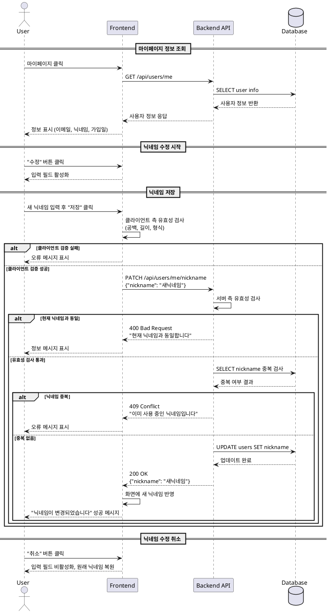

# 유스케이스 007: 마이페이지 정보 확인 및 닉네임 수정

## 개요

사용자가 자신의 가입 정보를 확인하고 닉네임을 수정할 수 있는 기능입니다. 사용자는 마이페이지에서 이메일, 현재 닉네임, 가입일을 조회하고, 필요 시 닉네임을 새로운 값으로 변경할 수 있습니다.

## Primary Actor

- 로그인한 사용자 (Authenticated User)

## Preconditions

- 사용자가 로그인되어 있어야 함
- 사용자의 세션 또는 토큰이 유효한 상태여야 함

## Trigger

- 사용자가 홈 페이지에서 '마이페이지' 버튼을 클릭함

## Main Scenario

### 1. 정보 조회 단계

1. 사용자가 홈 화면에서 '마이페이지' 버튼을 클릭한다.
2. 시스템은 사용자의 인증 상태를 확인한다.
3. 시스템은 데이터베이스에서 사용자의 현재 정보를 조회한다:
   - 이메일 주소
   - 현재 닉네임
   - 가입일
4. 시스템은 조회된 정보를 마이페이지 화면에 표시한다.
5. 사용자는 자신의 정보를 확인한다.

### 2. 닉네임 수정 단계

1. 사용자가 닉네임 옆의 '수정' 버튼을 클릭한다.
2. 시스템은 닉네임 입력 필드를 활성화한다.
3. 사용자가 새로운 닉네임을 입력한다.
4. 사용자가 '저장' 버튼을 클릭한다.
5. 시스템은 입력된 닉네임의 유효성을 검사한다:
   - 닉네임이 비어있지 않은지 확인
   - 현재 닉네임과 동일하지 않은지 확인
   - 다른 사용자와 중복되지 않는지 데이터베이스 조회
6. 시스템은 데이터베이스에서 사용자의 닉네임을 업데이트한다.
7. 시스템은 화면에 수정 완료 피드백을 표시한다.
8. 시스템은 업데이트된 닉네임을 마이페이지에 반영한다.
9. 시스템은 서비스 전체(채팅방 목록, 메시지 타임라인 등)에 변경된 닉네임을 적용한다.

## Alternative Flows

### A1. 닉네임 수정 취소

**트리거**: 사용자가 닉네임 입력 후 '취소' 버튼을 클릭

1. 시스템은 입력된 변경사항을 무시한다.
2. 시스템은 닉네임 입력 필드를 비활성화한다.
3. 시스템은 이전 닉네임을 유지하여 표시한다.
4. 유저플로우는 Main Scenario 1단계(정보 조회 상태)로 복귀한다.

### A2. 수정 없이 페이지 이탈

**트리거**: 사용자가 정보 확인 후 다른 페이지로 이동

1. 시스템은 변경사항을 저장하지 않는다.
2. 사용자가 요청한 페이지로 이동한다.

## Exception Flows

### E1. 인증 실패

**조건**: 사용자의 세션이 만료되었거나 유효하지 않음

1. 시스템은 인증 오류를 감지한다.
2. 시스템은 "로그인이 필요합니다" 메시지를 표시한다.
3. 시스템은 사용자를 로그인 페이지로 리디렉션한다.

### E2. 닉네임 공백

**조건**: 사용자가 빈 값으로 닉네임을 저장하려고 시도

1. 시스템은 닉네임이 비어있음을 감지한다.
2. 시스템은 "닉네임을 입력해주세요" 오류 메시지를 표시한다.
3. 시스템은 입력 필드에 포커스를 유지한다.
4. 저장되지 않으며, 유저플로우는 Main Scenario 3단계(닉네임 입력)로 복귀한다.

### E3. 닉네임 중복

**조건**: 입력한 닉네임이 다른 사용자에 의해 이미 사용 중

1. 시스템은 데이터베이스 조회를 통해 중복을 감지한다.
2. 시스템은 "이미 사용 중인 닉네임입니다" 오류 메시지를 표시한다.
3. 시스템은 입력된 닉네임을 필드에 유지한다.
4. 저장되지 않으며, 유저플로우는 Main Scenario 3단계(닉네임 입력)로 복귀한다.

### E4. 현재 닉네임과 동일

**조건**: 입력한 닉네임이 현재 닉네임과 동일함

1. 시스템은 닉네임 동일 여부를 확인한다.
2. 시스템은 "현재 닉네임과 동일합니다" 정보 메시지를 표시한다.
3. 시스템은 불필요한 업데이트를 방지하고 저장을 중단한다.
4. 유저플로우는 Main Scenario 3단계(닉네임 입력)로 복귀한다.

### E5. 데이터베이스 조회 실패

**조건**: 사용자 정보를 조회하는 중 데이터베이스 오류 발생

1. 시스템은 데이터베이스 오류를 감지한다.
2. 시스템은 "정보를 불러올 수 없습니다. 잠시 후 다시 시도해주세요" 오류 메시지를 표시한다.
3. 시스템은 재시도 옵션을 제공한다.

### E6. 닉네임 업데이트 실패

**조건**: 닉네임을 데이터베이스에 저장하는 중 오류 발생

1. 시스템은 데이터베이스 업데이트 오류를 감지한다.
2. 시스템은 "닉네임 수정에 실패했습니다. 다시 시도해주세요" 오류 메시지를 표시한다.
3. 시스템은 입력된 닉네임을 필드에 유지한다.
4. 유저플로우는 Main Scenario 3단계(닉네임 입력)로 복귀한다.

## Postconditions

### 성공 시

- 사용자의 닉네임이 데이터베이스에서 영구적으로 업데이트됨
- 변경된 닉네임이 서비스의 모든 부분에 즉시 반영됨:
  - 채팅방 목록의 개설자 닉네임
  - 과거에 전송한 메시지의 작성자 닉네임
  - 현재 이후 전송할 메시지의 작성자 닉네임
  - 마이페이지의 표시 닉네임
- 마이페이지에 업데이트된 닉네임이 표시됨
- 수정 완료 피드백이 사용자에게 제공됨

### 실패 시

- 데이터베이스의 사용자 정보는 변경되지 않음
- 이전 닉네임이 모든 곳에서 유지됨
- 적절한 오류 메시지가 사용자에게 표시됨

## Business Rules

### BR1. 닉네임 고유성

- 서비스 내 모든 사용자의 닉네임은 고유해야 함
- 대소문자 구분 없이 중복을 검사함
- 탈퇴한 사용자의 닉네임도 재사용 불가능함 (선택적 정책)

### BR2. 닉네임 변경 제한 (선택적)

- 닉네임 변경 횟수에 제한을 둘 수 있음 (예: 월 1회)
- 현재 명세에서는 무제한 변경 허용

### BR3. 전역 닉네임 동기화

- 닉네임이 변경되면 해당 사용자가 작성한 모든 콘텐츠(과거 메시지 포함)에 새 닉네임이 표시됨
- 실시간으로 연결된 모든 사용자에게 변경사항이 즉시 반영됨

### BR4. 이메일 및 가입일 수정 불가

- 이메일 주소는 회원가입 후 변경할 수 없음 (읽기 전용)
- 가입일은 시스템에서 자동 기록되며 변경할 수 없음 (읽기 전용)

### BR5. 인증 필수

- 마이페이지 접근 및 닉네임 수정은 로그인된 사용자만 가능함
- 비로그인 사용자는 로그인 페이지로 리디렉션됨

## Validation Rules

### VR1. 닉네임 형식

- **필수 입력**: 닉네임은 공백일 수 없음
- **최소 길이**: 2자 이상 (권장)
- **최대 길이**: 20자 이하 (권장)
- **허용 문자**: 영문 대소문자, 한글, 숫자, 일부 특수문자(_-) (정책에 따라 조정 가능)
- **금지 문자**: 연속된 공백, 특수문자만으로 구성된 닉네임 (선택적)

### VR2. 닉네임 중복 검사

- 입력된 닉네임을 trim 처리 후 검증
- 데이터베이스에서 대소문자 구분 없이 조회 (LOWER 또는 ILIKE 사용)
- 현재 사용자 자신의 닉네임과 동일한 경우 중복으로 간주하지 않음
- 중복 시 "이미 사용 중인 닉네임입니다" 메시지 표시

### VR3. 현재 닉네임 동일 검사

- 저장 전 입력값이 현재 닉네임과 동일한지 확인
- 동일한 경우 불필요한 데이터베이스 업데이트를 방지

### VR4. 입력 위생 처리 (Sanitization)

- 앞뒤 공백 자동 제거 (trim)
- XSS 방지를 위한 특수문자 이스케이프 처리

## UI/UX 요구사항

### 레이아웃

- 마이페이지는 명확하게 구분된 정보 섹션으로 구성:
  - 헤더: "마이페이지" 제목
  - 정보 표시 영역: 이메일, 닉네임, 가입일
  - 액션 버튼: 수정, 저장, 취소

### 정보 표시

- **이메일**: 읽기 전용 텍스트로 표시, 변경 불가 표시
- **닉네임**:
  - 기본 상태: 현재 닉네임 + "수정" 버튼
  - 수정 모드: 입력 필드 + "저장" 및 "취소" 버튼
- **가입일**: 읽기 전용, "YYYY년 MM월 DD일" 형식으로 표시

### 상호작용

- **"수정" 버튼**:
  - 클릭 시 닉네임 입력 필드 활성화
  - 현재 닉네임이 입력 필드에 미리 채워짐 (placeholder 또는 value)
  - 포커스가 자동으로 입력 필드로 이동
- **"저장" 버튼**:
  - 활성화 조건: 닉네임이 변경되었을 때만 활성화 (선택적)
  - 클릭 시 유효성 검사 후 업데이트 수행
  - 로딩 상태 표시 (스피너 또는 "저장 중..." 텍스트)
- **"취소" 버튼**:
  - 클릭 시 입력 필드를 비활성화하고 원래 닉네임으로 복원
  - 확인 다이얼로그 없이 즉시 취소

### 피드백

- **성공 메시지**: "닉네임이 성공적으로 변경되었습니다" (토스트 또는 인라인 메시지)
- **오류 메시지**:
  - 각 검증 실패 시 해당 오류 메시지를 입력 필드 하단에 표시
  - 색상: 빨간색 또는 경고 색상
  - 위치: 입력 필드 바로 아래 또는 인라인
- **로딩 상태**:
  - 정보 조회 중: 스켈레톤 UI 또는 로딩 스피너
  - 저장 중: 버튼에 로딩 인디케이터, 중복 클릭 방지

### 접근성

- 모든 입력 필드에 적절한 label 제공
- 오류 메시지는 스크린 리더가 읽을 수 있도록 aria-live 속성 사용
- 키보드 네비게이션 지원 (Tab, Enter, Esc)
- 포커스 상태 명확하게 표시

### 반응형 디자인

- 모바일, 태블릿, 데스크톱 모든 화면 크기에서 적절하게 표시
- 입력 필드와 버튼의 터치 영역 충분히 확보 (최소 44x44px)

## 성능 요구사항

### 응답 시간

- **정보 조회**: 1초 이내에 사용자 정보 표시
- **닉네임 중복 검사**: 500ms 이내에 검증 결과 반환
- **닉네임 업데이트**: 1초 이내에 업데이트 완료 및 피드백 표시

### 데이터베이스 쿼리

- 사용자 정보 조회: 인덱스를 활용한 단일 SELECT 쿼리
- 닉네임 중복 검사: 닉네임 컬럼에 인덱스 적용, ILIKE 또는 LOWER 함수 사용
- 닉네임 업데이트: 단일 UPDATE 쿼리

### 캐싱 전략 (선택적)

- 사용자 정보는 클라이언트 측에서 짧은 시간(1-5분) 캐싱 가능
- 닉네임 변경 시 캐시 무효화 및 즉시 갱신

### 동시성 처리

- 동일 사용자가 여러 탭/디바이스에서 동시에 닉네임 수정 시:
  - 마지막 업데이트가 적용됨
  - 낙관적 잠금(Optimistic Locking) 또는 버전 관리 (선택적)

## 관련 API 엔드포인트 (예상)

### GET /api/users/me

- **목적**: 현재 로그인한 사용자의 정보 조회
- **인증**: 필수 (JWT 토큰 또는 세션)
- **응답**:
  ```json
  {
    "id": "user-uuid",
    "email": "user@example.com",
    "nickname": "현재닉네임",
    "createdAt": "2025-01-15T10:30:00Z"
  }
  ```

### PATCH /api/users/me/nickname

- **목적**: 닉네임 업데이트
- **인증**: 필수
- **요청 본문**:
  ```json
  {
    "nickname": "새로운닉네임"
  }
  ```
- **응답 (성공)**:
  ```json
  {
    "success": true,
    "nickname": "새로운닉네임"
  }
  ```
- **응답 (실패 - 중복)**:
  ```json
  {
    "success": false,
    "error": "NICKNAME_ALREADY_EXISTS",
    "message": "이미 사용 중인 닉네임입니다"
  }
  ```

### GET /api/users/nickname/check?nickname={nickname}

- **목적**: 닉네임 중복 검사 (선택적, 실시간 검증용)
- **인증**: 필수
- **응답**:
  ```json
  {
    "available": true
  }
  ```

## Sequence Diagram



## 참고사항

- 본 유스케이스는 유저플로우 7번에 해당하는 기능입니다.
- 닉네임 변경은 서비스 전체에 즉시 반영되어야 하므로, 실시간 동기화 메커니즘을 고려해야 합니다.
- 미래 확장 가능성: 프로필 이미지 업로드, 소개글 추가, 비밀번호 변경 등의 기능 추가 고려
